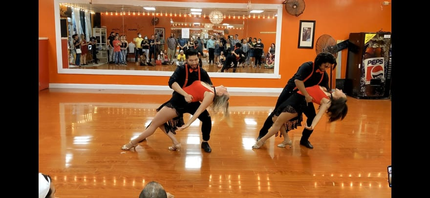
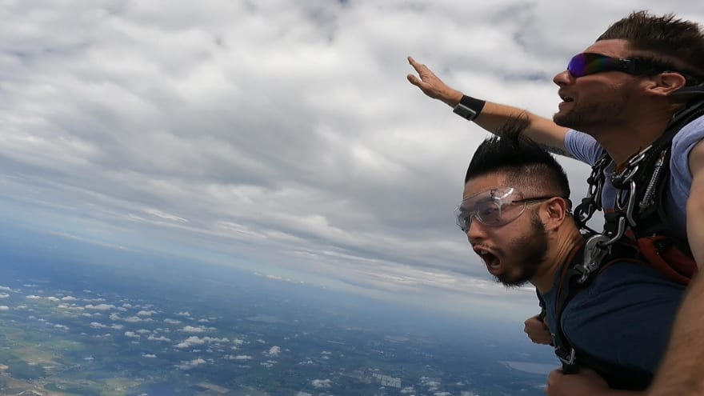
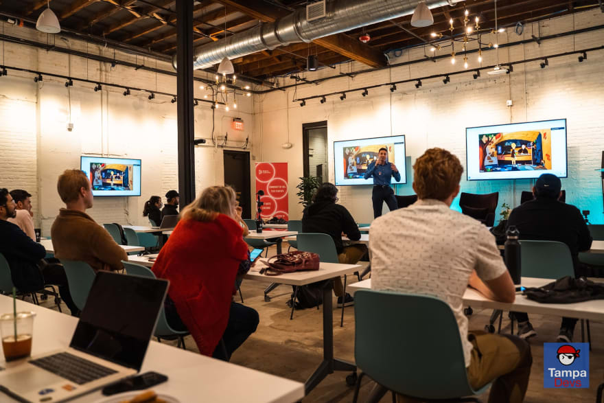
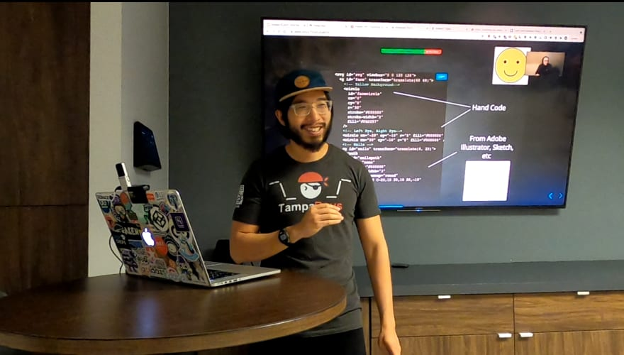
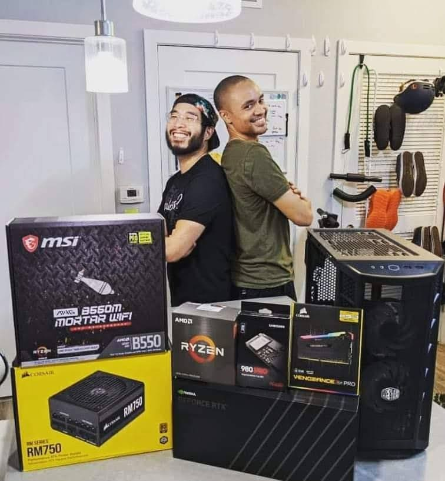

Every year I write a list of memorable things I did or accomplished the previous year. It's mostly as a memoir & self-reflection to see how far I've come and where I might go next. [Here's last years](https://www.vincentntang.com/2020-into-2021/)

I usually plan out my goals are before the year starts. It's in my habit to do this, but this year I decided against it.

Sometimes it's better to just go with the flow and see where life takes you

## I debut'd my first dance performance

October of previous year, I picked up dancing as a new hobby!
Around the time I started taking dance lessons, my school was looking for performers to perform at dance conferences and gigs. So I signed up, hoping to use that as inspiration to get good fast

Fast forward 6 months later, I performed my first dance performance!

*I swear I'm more clumsy than I look...* 

Getting there was hard. I remember the countless nights I spent practicing and listening to "Tumbao" from Prince Royce.

Most days we'd practice at the studio, rehearsing what we learned the previous day and the new 8 counts. We'd practice and practice until every move came out just right. 

Those nights where we didn't do rehearsal I'd still practice. Every beat, every note, every musical instrument I memorized to a "T". Every step counted on every note. 

I'd forget everything else going on. Ignore my neighbors staring at me in the hall practicing, and get lost in the music. I learned what it meant to "feel the beat", and to connect to a partner through social dance.

## I jumped out of an airplane

So jumping out of an airplane. It's not something you really think about until a friend says "Hey wanna go?" and you oblige yes because it's on your long awaited bucket list

*The sound of a warcry in the distance...* 

Going up was terrifying. You get strapped on to a hunk of metal, barely the width of a car. Then you go up 14k feet over the course of half an hour, the tensions rising as you get higher and higher

Then you hear your friend scream as she vanishes from sight. Your turn awaits... 

Disoriented is the first word I'd describe when my butt leaves the plane. Then fear, then "this is awesome!" before you get a giant wedgie from the parachute expanding. Next it became a rollercoaster through the clouds as my instructor granted me parachute controlling privilages.

Once you conquer the sky, accomplishing other things in life doesn't seem so bad...

Amongst other fun adventures, I also went on my first grand canyon hike and snowboarded off a 10k feet snowcaped mountain

## I started Tampa Devs

Covid is a weird time to try new things. It's also the time for reunions too. In this case, for OrlandoDevs, the tech community I started my coding career at.

I remember the nostalgia of memories I've long tucked away from seeing friends I hadn't seen in 2 years. I brought along two my of close dev friends and watched as two friend circles collided...

It was beautiful. Almost magical. It all became a question of "so how do you know Vincent?" and watching as the gaps of information were being filled. I got to reconnect and see how successful all my dev peers became, and that inspired one of my friends to prompt this question:

"dude why don't you start something like this in Tampa?"

So I did. Thus became Tampa Devs. 

*My friend Haritha doing his first big tech talk*

It was way harder than I imagined starting a dev group. Heck just deciding on a logo took almost a month. I got a lot of flak for starting this (as there were other groups in town), as well as a lot of support from friends and family. 

Some fun highlights and notable things:

- Our first sponsor donated $800 dollar at a high end restaurant for our first event
- One of our first time attendees also gave his first tech talk
- We won $4400 as a group competing in a global hackathon
- One member in our group got his first salaried job, TampaDevs may have helped here :)

There's more to this story, I wrote about why I started Tampa Devs [here](https://www.vincentntang.com/why-i-started-tampa-devs/), marketing lessons I learned from [running it](https://www.vincentntang.com/how-we-grew-tampa-devs/), and how hard is it to organize [events](https://www.vincentntang.com/ugly-side-of-event-management/)

Amongst other things, I also became more of a mentor to local developers in town. I wrote a blog post about how [dating relates to applying to jobs](https://www.vincentntang.com/applying-to-jobs-is-like-dating/), a conversation that stemmed through mentoring

## I became a Lead Dev

And learned that I'd rather just be an individual contributor (for now). I have massive respect for people who take on leadership roles having been in some myself. It's not easy to do, and it's stressful. I found myself in meetings all the time, having to set expectations and delegate more than I actually coded.

*Our first tech talk for Tampa Devs* 

This was for a project where I also shipped out code affecting [60MM +users](https://www.vincentntang.com/accessibility-lessons-learned-shipping-prod-app/).

Before I started this gig, my code was always behind closed doors. No one ever saw it, say maybe <1000 users for some really niche market. 

I wrote some leadership lessons that I learned from it:

- [Progressive Code Reviews](https://www.vincentntang.com/progressive-code-reviews/)
- [Describe the hat your wearing](https://www.vincentntang.com/describe-hat-wearing/)
- [Focus Periods](https://www.vincentntang.com/productivity-tip-use-focus-period-time-limit/)
- [Shipping things with boring tools](https://www.vincentntang.com/ship-things-by-picking-boring-tools/)
- [Write how to guides if your a busy person](https://www.vincentntang.com/write-how-to-guides/)
- [Lessons from junior to senior dev](https://www.vincentntang.com/lessons-learned-from-junior-to-senior-developer/)
- [Meetings are like emails](https://www.vincentntang.com/meetings-are-like-emails/)

and some coding lessons for obscure problems I had to solve as well:

- [Connecting two react apps](https://www.vincentntang.com/connecting-two-react-apps/)
- [Session timeout modals React](https://www.vincentntang.com/session-timeout-modals-react/)
- [Newbs Guide to Timezone Development](https://www.vincentntang.com/newbs-guide-to-dates-timezones-web-development/)
- [Conditional React Hooks](https://www.vincentntang.com/conditional-react-hooks/)
- [Redux / Local-Session / Caching](https://www.vincentntang.com/when-to-use-redux-local-session-storage-backend/)

I've made a substantial attempt this year to become a better writer. Writing comes in flows and I've been capitalizing on it whenever the feeling comes around
 
## I built a new PC rig

I built a new PC rig. Sourcing the parts was a huge pita since I couldn't find a video card

I ended up camping at Best Buy (my first time camping of all things...) and ended up securing a RTX3080TI. 

*The IT improvement guys* 

The rest became history after that. I assembled a list of parts on PC part picker, and went to town. Getting the RGB rig probably took the longest time to get set up

## Summary

More to come next year. I'm not writing my goals this year, and instead I am internalizing them. 

<!-- TODO - things I have in mind just for myself -->
<!-- TODO - Comedy Talks -->
<!-- TODO - Moving to a new country? -->
<!-- TODO - new job? -->
<!-- TODO - Financial portfolio setup -->
<!-- TODO - Strength training -->

Looking back I never accomplished everything I set out to do. And that's a good thing. I don't know what the future holds, and it's more exciting that way when I look back

One thing I know for sure, is this year I've become a lot more mature. Maybe it's because I shipped out production code affecting millions of users for the first time. Or maybe it's because I now have a cat that's dependent on me. Or debuting a performance I've dreamed I'd do. Or jumping out of a plane as a "sure why not" experience

Whatever it is, I feel like I've had alot of life experiences this year. With each experience comes more confidence to conquer the next. It's also the journey, not the destination that matters

I'm still on a journey