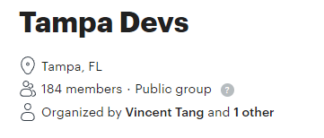 

Last month we started Tampa Devs, a community of where developers can learn and grow together in Tampa. I wrote about why I started it [here](https://www.vincentntang.com/why-i-started-tampa-devs/)

Growing a tech community is ...rather challenging.
In order to grow a successful community, we needed events that developers would enjoy going to. These can be broken down to two types:

- Networking
- Technical talks

Technical talks require sponsors and speakers, but getting those is hard if you don't have attendees. Attendees don't go to technical talks unless there's food and something interesting to go to.

Growing a dev community means you have to solve a chicken egg problem that's common to growing startups. So how do you do it?

There's a [growth-hacking](https://www.lennysnewsletter.com/p/how-the-biggest-consumer-apps-got) blog post that covers this really well! It describes how the first big consumer apps did this. Companies like Tinder, Uber, TikTok etc. We're basically taking a page from their playbook to do this

## 1: Go where your target users are offline

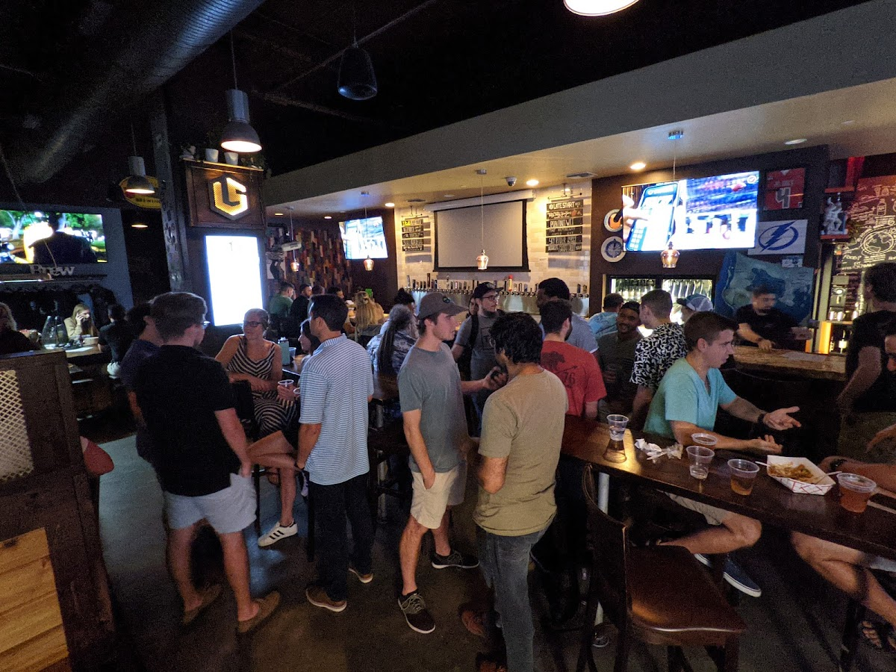

So where do developers go to _offline_? The answer is actually pretty complicated due to Covid. In general, most developers who are more social tend to aggregate in these circles:

- **20s and 30s networking groups** - Developers who like to meet other people tend to go here
- **Coffee Shops/Coworking spaces** - If they aren't working remote

With these two places in mind, that's where we decided to host our networking events. We wanted a place that would be fun for everyone regardless of the attendee turnout

I started Tampa Devs partially as a way to keep up with dev friends in the area. So instead of "hosting an event", we instead bandwagon'd off of other events. Basically this:

"Hey I'm going to this big foodtruck event nearby, you're all welcome to come and join me!"

Our first event became a get together with dev friends and anyone that wanted to join our circle. **It didn't become work at that point, it just became fun**

We advertised the event online on meetup and got ~5 new people that showed up

When I had the friends/attendees show up, we used guerilla marketing tactics to advertise to "offline" users. What we did was slap name-sticks on everyone and flash mobbed different coffeeshops / bars nearby. There was another 20s/30s young professionals group nearby too. We got ~8 people this way

## 2: Go where your target users are, online

Let's ignore meetup.com for now. That one is obvious, we get traction through users through interesting events.

What about other places online? Where do developers go?
Everyone uses social media to some degree. Twitter, Linkedin, Facebook, Instagram, TikTok, etc. In the development community, Twitter is the prominent face for well known developers.

When I did more research on this, I discovered the inverse. There aren't many active twitter developer users in my local area. I'm sure this might be different in Silicon Valley, New York, or Texas. 

For a population of 400,000 people, we're talking less than 1000 inactive users who created accounts. There is less than 50 active users at most in a local region like Tampa. Twitter is great as a way to reach people globally, just not locally.

Instead I asked myself where are users "actively" online? 

**The answer is job seekers**. Junior Developers who are seeking jobs for the first time are looking to grow and network. So how do you capture this demographic?

A bit of a background tangent, but I used to work in HR. I've interviewed a few hundred people in my lifetime. My first thought was running an ad campaign on a "Junior Developer" job and scraping email lists for this, but HR platforms have cracked down on this.

### The LinkedIn Online Playbook

Instead the answer was way simpler. Everyone who takes job hunting seriously has a LinkedIn. I've been through that phase, and let me tell you almost nobody ever connects with you if your new to development. 

So that's what we did. We took a page from the recruiter playbook. After all, recruiters know alot of developers. That's their job. So how do they do this?

The answer depends on how much money you want to throw at the problem. LinkedIn has some premium features like "InMail", but we're running off a non existent budget and volunteer efforts. So free it is then!

It's super simple. Just use the search bar:

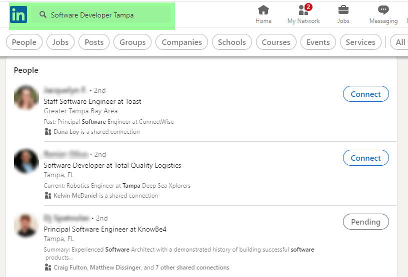 

**Here's a few queries that work effectively**

- "{skill_name} Developer {city_name}"
- "{local_company_name} Developer"
- "{national_company_name} {city_name} Developer"

{skill_name} includes things like: Frontend, Backend, Junior, Software, C#, React, Javascript, Fullstack. These are titles a person assigned to themselves, or job titles they've held

{city_name} is every prominent city within a 45 minute region of where we're holding events. We're called Tampa Devs, so StPete and Clearwater are two large cities that apply here.

{local_company_name} is found through a google maps search of "Software Companies". It's not 100% effective though, about half the companies you find are companies in India with a virtual mailbox here (so they can charge more for projects). You can also search "Top 10 software companies in {city_name}" too.

{national_company_name} is just any household company name you've heard of that employs developers anywhere in the country. PwC, Microsoft, Deloitte, Amazon, Google, etc are all good examples. Developers here may not have a local dev circle

**The second effective method of finding candidates is through company pages**

So you can use local/remote bootcamps in the area and check up the current list of alumnis for instance. Other ways are looking up a list of nonprofits in tech associated in the area, and seeing a list of followers. Those followers are actively engaged on LinkedIn generally

Once you have a list of people you find, you can just hit them up with a cold opener. Before I talk about cold openers, there's 4 laws on cold openers you have to [follow](https://cloutly.com/blog/cold-email-template/)

- Law #1 - you shall not spam.
- Law #2 - your list shall be clean.
- Law #3 - your ask shall be small.
- Law #4 - your value shall be great.

Spamming is hitting up someone a person more than once a month on an event invite. A clean list is through the effective search queries above. The ask will be for an invitation to look at an awesome event your holding. The value proposition is a proposed great time for your potential attendee.

It's also by the way a really effective fast way to growing your network too. Here's what an opener following the 4 laws look like:

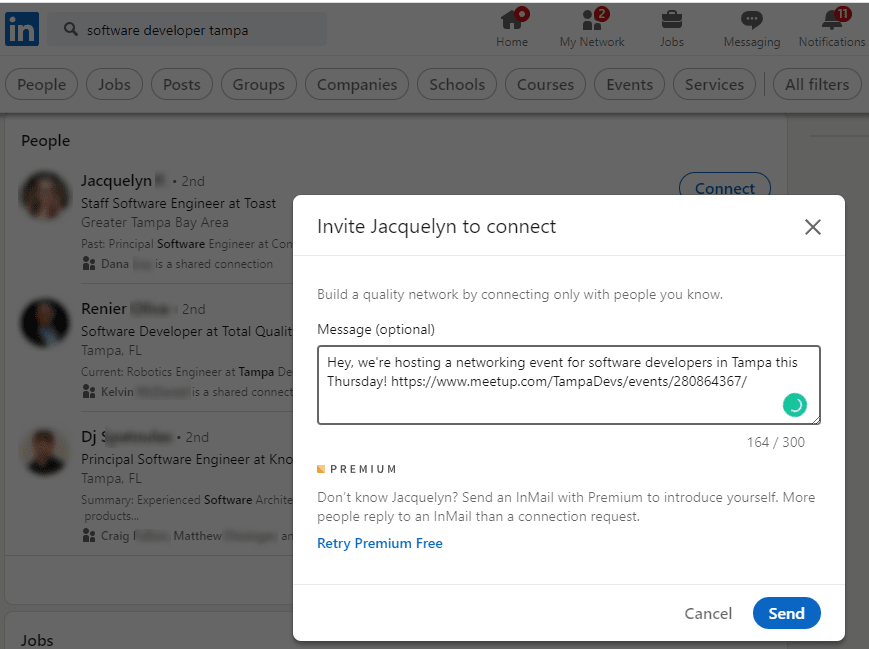 

I would say this strategy is about 10% effective, but it requires really low effort and it's really easy to hit up alot of users quickly. When someone opens the message, they can see the thumbnail image you  

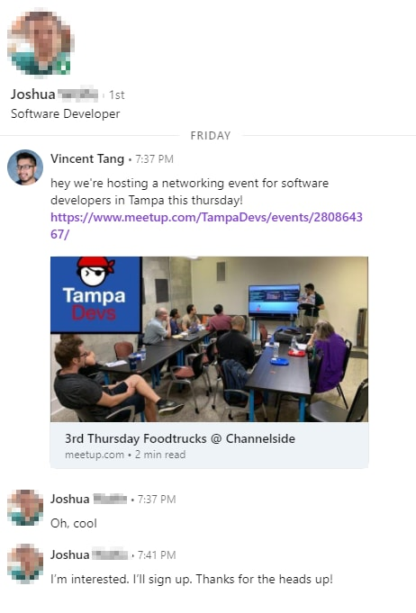

The trick to this strategy is to completely hit up people randomly at different companies. You don't want to exhaust all the developers in one pool for one event. You should instead hit up 1-4 developers from different companies at a time for events. We also send this invite 3-5 days before an event around Sunday/Monday as that tends to be an effective time window

We usually have 1-4 people attend events this way, with about 50% repeat visitors (although it's kinda early to say). We track attendance on an IPAD attached to a google form to, which we send to virtual attendees we co-partner with other dev groups too.

There is one more strategy to social media  that's also very effective too:

### Follow for Follow strategy

This strategy kind of dates back to the beginnings of MySpace/Facebook days. It's something called the "Like for a Like" strategy.

The thought process is social media uses algorithms to determine what's "hot" in the area. Alot of our attendees do find us through meetup, but that's because we buff up our attendee count through other strategies first.

With "Follow for Follow" strategies, Instagram is extremely effective. Twitter is the next one. Usually 1-3 attendees have found out about our events via instagram, since we're catering to junior developers in a younger demographic.

On instagram this is what you do:

- Create a profile and put interesting stories/post
- Create a bit.ly tracking link as the website

In the earlier conversation, we talked about finding {local_company_name} on linkedin. You also need to find nonprofits in tech as well. There's usually less than a dozen per city, so it's fairly easy to find. If you do a search on #tampa #dev on twitter/instagram + look up associated followers, you'll find this in 5 minutes

Example profile:

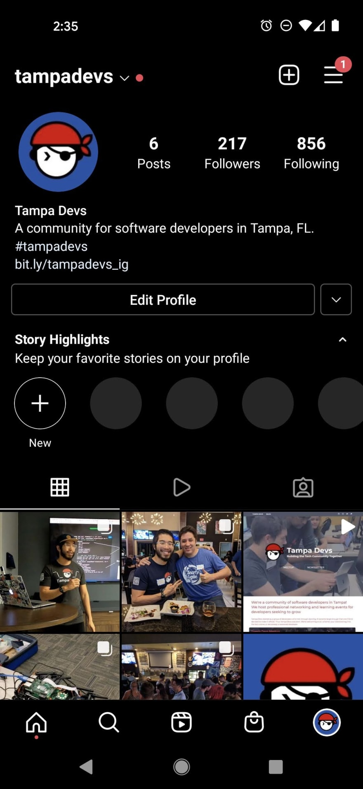

Now you need to find an established profile of users you can follow. Here's an exammple called TampaBay Startup Week:

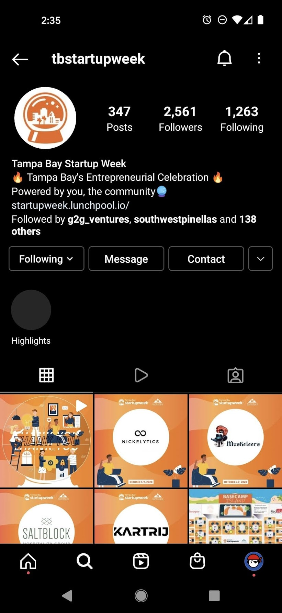

Look up "Followers" and just rapidly spam follow everyone here. Instagram as of 10/29/21 doesn't care you do this, but twitter does cap you to ~30? per day

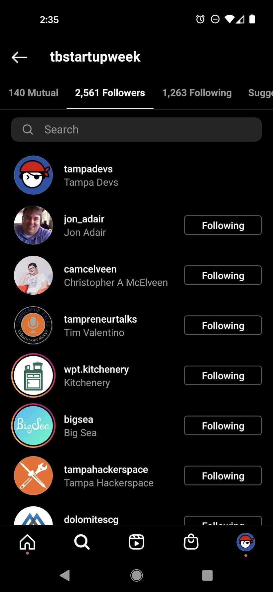

This will send a notification to the user that they've got a new follower. It doesn't have a huge conversion rate of users who click (for reference, we have 200 followers and only 8 visit clicks). The people who DO click generally have a high rate of visitation though, we've had at least 4 people attend events this way.

Here's some other tracking analytics we used, we also did QR codes on T-shirts too!

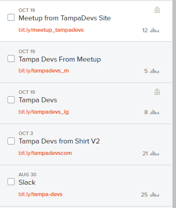
 
### Tagging Strategy

Tagging strategy is what you implement post mortem after an event is finished. It creates co-ownership into the community and buy in from different influencers / followers.

After an event is finished, go on social media and use the attendee list count from the IPAD sign in and tag everyone on the post. 

This is important as this helps create "Organic Impressions" for your group. **No one marketing strategy is effective, but many in bulk tends to get your name out quickly**. That's one of the laws of marketing

Here's an example of doing a tag addendum:

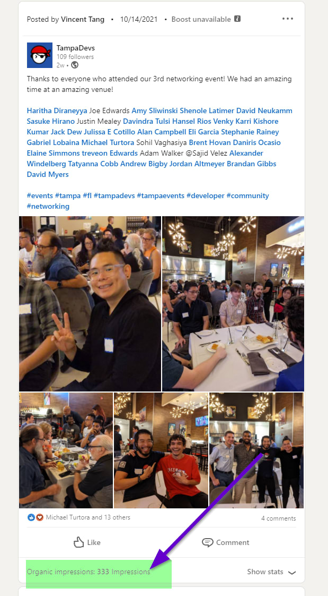

You basically want to create "FOMO" (fear of missing out) to people who were on the fence on attending, or people who couldn't make it.  

Then just cross-post it to other channels (twitter, facebook pages, etc). This helps build a follower count to establish legitimacy to your group, as sponsors/venues/speakers do want to see this before investing resources to your clause.

Moving on, here's the next item from Lenny's growth hacking strategy for startups

## 3. Invite your friends

Pretty self explanatory, I mentioned this on the first event we held. Tampa Devs originally started out as a group of ~8 friends, so we basically didn't care who attended because we were going to have fun anyways. Our circles became large enough that keeping up with each other became hard, so hosting events actually became less effort

Your friends are also your net-promoters to in a group, people who make all your events awesome. Derek Sivers writes a great article on [Your First follower](https://sive.rs/ff) and why it changes the dynamics of events

## 4. Create FOMO in order to drive word-of-mouth

This is actually how I got my first job. Back when I started in Orlando and got involved in [OrlandoDevs](https://orlandodevs), I needed a job.

But chicken egg problem again. How do you get a job with no experience? Don't you need a job to get experience?

I gave a talk that someone described as "3 talks in one" and one of my potential companies I applied heard about it. He hired me on the spot despite candidates with more experience in his pipeline.

This is how we did our first few events. We created FOMO through attending a hackathon event where our team won $4400. That really wasn't the goal though, it was more tailored toward the learning environment attendees got out of it. 

In marketing, there is something called a "critical threshold". This ties into the "first follower" argument and net promoters I discussed with earlier too.

When you hold an event, the first ~5-15 attendees that commit are the most important. Alot of people are on the fence (myself included) on whether to attend an event if its not worth going to. A good example of this is network events - if only 1 person shows up, he/she is not going to have a good time. 20 people? different story

## 5. Leverage influencers

Leveraging influencers is done a few different ways. I would say I'm an influencer myself, but to get buy in we reached out and collaborated with other established companies/groups (ReactJS Tampa and ReliaQuest). We've also partner with established advisors to help get the word of mouth out there too. 

It's one thing to start a group, it's another to have a record of sponsors/advisors/influencers backing it. It creates legitimacy in a group

## 6. Get Press

We haven't gotten to this point yet, this would be hitting up news writers at Tampa Bay times for instance, and other local news publiciations

## 7. Building a community pre-launch

This is what we did with our core circle of friends. But we also did this through other mediums such as establishing a slack community for preplanning events and keeping up with friends in tech

## In Summary

From the article proposed by Lenny, here's how to build a community quickly:

1. Go where your target users are, offline
2. Go where your target users are, online
3. Invite your friends
4. Create FOMO in order to drive word-of-mouth
5. Leverage influencers
6. Get press
7. Build a community pre-launch

Another really important thing to do is track metrics across all campaigns whenever possible. It's one thing to predict what works, it's another to actually see it in data. 
It's a work in progress, but we recently integrated Google Analytics 11 days ago (October 18th to October 30th).

Here's some more stats:

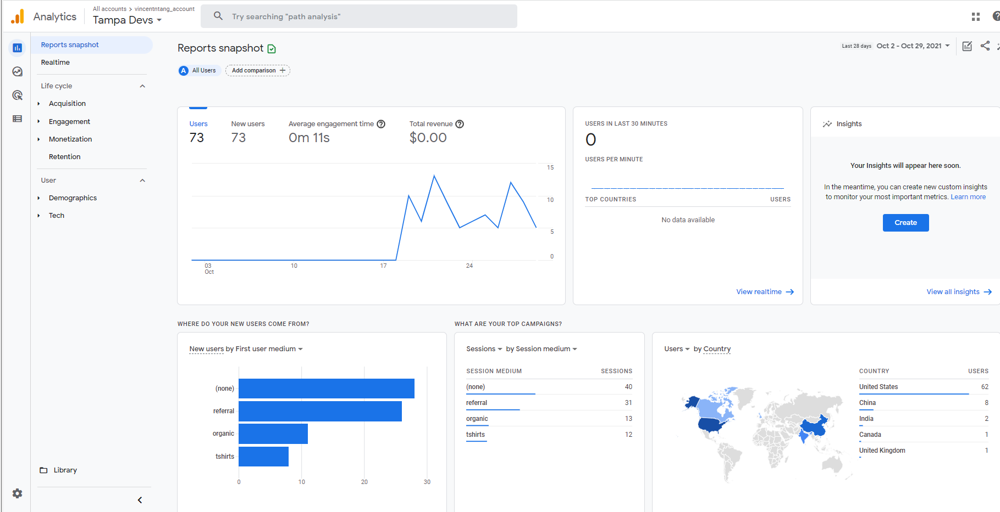

Breakdown:

- 31 visits came from referrals on bitly tracking links
- 13 organic lookups
- 12 from Tshirt QR scans, we ran a google tag analytics campaign here linked to bitly
- A few random bots from china and india (10 total)

Average engagement time is about 20 seconds for non-bot users, and our video intro is 35 seconds. These are good things to keep in mind too