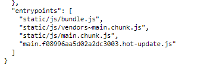

Having two React apps on a webpage is something you should never do. It creates additional code maintenance between both apps. It makes deploying new features more difficult since two CI/CD pipelines are needed. It also adds unnecessary amounts of complexity to the frontend

However, if you DO need to have two react apps for any reason, these are some cases where you might need it. Let me highlight an example:

Say we have two apps. App1 and App2. 

- App1 is a header, used to do analytics tracking. 
- App2 is a application that lives under multiple URL routes via react-router. 

App1 needs to be consumed by multiple legacy apps, so it needs a set of frontend API's for customizing how it's used

App2 lives standalone, but it needs to load App1 on the same page.

Joining App1 and App2 into one app is a viable solution, however it means everyone loading the app will get alot of extra, unnecessary code. It also means there's no clear seperation of business rules or logic.

So if you do need to interface two React apps together, here are different ways and their pros/cons:

## Rendering a React app using Asset-manifest.json

When you execute `npm run start` on an application, it generates a set of chunked files. React then uses those chunked files at runtime to load the application up. When you navigate to `localhost:3000`, that is what the runtime is executing against

You can actually see those chunked files for yourself. If you have your application loaded up on port `3000`, go here instead:

```js
http://localhost:3000/asset-manifest.json
``` 

These lists all the resources for compiling your React app.  At the very bottom of this JSON object, there will be 4 JS files that are called "Entry Points"


 

You'll find these 4 compiled files:

`["main.js": "/static/js/main.chunk.js",
"main.js.map": "/static/js/main.chunk.js.map",
"runtime-main.js": "/static/js/bundle.js",
"runtime-main.js.map": "/static/js/bundle.js.map"]`

The command `ReactDOM.render()` is what is handling those files at run time. 

By this same logic, you can use another React app (App2) to load in the chunked files from `asset-manifest.json` in (App1). 

Here's how you would do it through code in App2, put this component as a child to your main entry component


```js
import React, { useEffect, useState } from 'react'
import axios from 'axios'
import { Helmet } from 'react-helmet'

export const App2 = () => {
  const [headerFiles, setHeaderFiles] = useState([])

  useEffect(() => {
    let mounted = true

    const fetchAssets = async () => {
      try {
        const request = await axios.get(`${HEADER_URL}/asset-manifest.json`)

        const assets = request.data.entrypoints

        if (mounted) {
          setHeaderFiles(assets)
        }
      } catch (error) {
        console.error('Error fetching Consistent Header assets')
      }
    }

    fetchAssets()

    return () => { mounted = false }
  }, [setHeaderFiles])

  return (
    <>
      <Helmet>
        {headerFiles && headerFiles.map((file: string) => {
          const fileType = file.split('/')[1]
          return fileType === 'js'
            ? <script src={`${HEADER_URL}/${file}`} key={file} />
            : <link rel='stylesheet' type='text/css' href={`${HEADER_URL}/${file}`} key={file} />
        })}
      </Helmet>
      <div
        id='app1-root'
      />
    </>)
}
```

So what is going on here?

First, we tell App2 to make a request to the `localhost:3000/asset-manifest.json` file. We run this request one time and make sure to do this with a `mounted` variable. We store that in state in an array that looks like this:

```
["static/js/bundle.js", "static/js/vendors~main.chunk.js", "vendors~main.4c37d5ea0572bdd6d5d3.hot-update.js", "static/js/main.chunk.js", "main.4c37d5ea0572bdd6d5d3.hot-update.js"]
```

These hashes on the file aren't fixed and change whenever you update your codebase. 

So now that we have this array, we can then use [React Helmet](https://github.com/nfl/react-helmet). React Helmet is a 3rd party repo that essentially injects any metacontent you want into the HTML `header`. 

The script then executes this line of code in the return statement of the component:

```js
  return (
    <>
      <Helmet>
        {headerFiles && headerFiles.map((file: string) => {
          const fileType = file.split('/')[1]
          return fileType === 'js'
            ? <script src={`${HEADER_URL}/${file}`} key={file} />
            : <link rel='stylesheet' type='text/css' href={`${HEADER_URL}/${file}`} key={file} />
        })}
      </Helmet>
      <div
        id='app1-root'
      />
    </>)
```

what this does in App2 is it appends `<header>` information from that array into the corresponding area. These are the files needed to get the React app to load in run time

```js
<header>
  <link rel="stylesheet" type="text/css" href="http://localhost:3000/header/main.c6c7ca7cecbf30401e70.hot-update.js" data-react-helmet="true">
  <script src="http://localhost:3000/header/static/js/bundle.js" data-react-helmet="true"></script>
  <script src="http://localhost:3000/header/static/js/vendors~main.chunk.js" data-react-helmet="true"></script>
  <script src="http://localhost:3000/header/static/js/main.chunk.js" data-react-helmet="true"></script>
</header>
```

So App2 is now running everything it needs to. It's also suppling a `<div id="app1-root"/>` container for the App1 React to render against.

So in App1, you have code that grabs the App2 div container provided

In App1, we render the component now

```js
const renderElement = () => {
  const rootNode =  document.getElementById('app1-root')

  ReactDOM.render(
    <AppOneComponent/>
  ), rootNode
}
```

`AppOneComponent/>` is where you'll write out how what App1 will render. `RootNode` is the container supplied by App2.

You can also specify "feature-flags" as well. In app2, we can provide a div that looks like this:

```js
<div
  id="app1-root"
  enable-live-chat="true"
/>
```

We can use app1's code to grab out `enable-live-chat` using 
the same logic

```js
const renderElement = () => {
  const rootNode =  document.getElementById('app1-root')
  const enableLiveChat = rootNode?.getAttribute('enable-live-chat') === 'true'
  
  ReactDOM.render(
    <App enableLiveCha={enableLiveChat}/>
  ), rootNode
}
```

We can take this further. Anytime the the attributes in the `<div id="app1-root"/>` changes, we can rerender it using a [mutation observer API](https://developer.mozilla.org/en-US/docs/Web/API/MutationObserver). Another post for a different time

So TLDR in a nutshell, we have App1 and App2

- App1 looks for a specific id `<div>` element to be provided
- App2 grabs App1's `asset-manifest.json` file
- App2 uses it to append `<script>` and `<link>` tags in it's header
- App2 supplies the id `<div>` container for app1 to consume
- App2 has App1 loaded on the same page

Pros
- Makes it simple for App2 to customize and use App1 with feature flags at startup time
- Good for feature flagging

Cons
- Really complex to implement
- Lots of moving parts

**NOTE** One last thing to note if you do this, make sure the `package.json` name attributes are different between both apps! Otherwise you'll run into webpack files overwriting on top of webpack files

## Expose window methods

One way to communicate one app to another, is to use the windows object. This has it's own set of flaws, it needs to have definitions set across both apps.

In app1, you can specify a list of exposed methods like

```js
window.app1method1 = () => {
  console.log("hello world")!
}
```

In App2, you can check against to see if that window definition exists. If it does, execuute it

```js
if(window.app1method1){
  window.app1method1()
}
```

Likewise vice versa. This is useful for handling side effects across both apps.

This pattern is common when you are interfacing two frontend apps where you control both codebases. A legacy Angular app + a React app. 

Building things this way should be limited in scope as it doesn't scale that well

Pros
- Pretty simple to implement and for both apps to communicate to each other
- Good for one off methods

Cons
- Doesn't scale well
- Keeping track of definitions created across both apps is a pain
- Security issues
- Bad for feature flagging

## Exposed event listener

This goes into a pub/sub philosophy. A pub/sub is when you have a publisher that publishes events, and a subscriber that subscribes to them. This is only a 1 way communication street from publisher to subscriber. However you can have both apps do this to get 2-way communication.

A good method for doing this is the [window.postMessage](https://developer.mozilla.org/en-US/docs/Web/API/Window/postMessage) function. It allows for cross-origin communication between `Window` objects, which is great for talking to two React apps.

Here's an example of what App1 would look like as a subscriber:

```js
window.addEventListener("message", (event) => {
  // check origin

  if (event.data.messageName === "showModal1") {
    // call specific logic for showing modal 1
  }
});
```

App2 as a publisher would call 

```js
window.postMessage({messageName: "showModal1"})
```

App1 would listen and see the event, and do some corresponding action.

If you want App2 to listen to calls for App1, you must repeat this pattern again though

This pattern is good when interfacing a game engine to React, the game engine published events and React consumed it. E.g. a user goes and clicks an object in the game scene, a popup modal results on React side.

Pros
- For constant ongoing communication between both apps, this might be a good choice.
- All your definitions are on your listener, makes it easier to maintenace
- It's good if you don't control the source code for both apps

Cons
- You have to manage event listeners.
- You may ran into race conditions on whether or not the listener was enabled. It's harder to check from one app to another, checking a windows function on the other hand is way simler

## Other Options - IFrames

You can also Iframe one application into another. It's a viable solution, but you'll have significantly less control over the look and feel of the site. It also means increased memoroy usage and potential performance issues too

Iframe is best meant for small embedded type application though, that are generally more customizable.

Embedded maps are probably the best example, or 3D rendered assets for a 3d print ecommerce store for instance.

Pros
- Clear seperation of logic

Cons
- Less control over look and feel of site
- Performance issues if your serving this site to a lot of users
- No way of communicating one app to another
- More CI/CD pipelines for managing that embedded content

## Summary and Things to Consider

One last note to make is while you can expose the window object for communication, you really shouldn't. This is for niche cases where you have to have one app talk to another.

You don't want to store variables globally either. This creates competing sources of truth, and makes things hard to keep track of. It's also bad practice to bind things to a higher closure scope than necessary.

If you have two frontends for whatever reason, have states-of-truths for both app. Maybe both apps control modals and you need to set focus states on/off for accessibility. You should have some clear definitions as interfacing two React apps and have as few dependent variables as possible.

Lastly, if you have two frontend apps, you could also be deprecating one app (Angular) for another (React) and this is to maintain backward compatibility

If that's the case, you should write some documentation on what things you have to expose, and consider the security implications of it too

If one app has access to another app's method, so does everyone else. This means that exposed interface can also be abused too

Hopefully this helps whoever is reading this and good luck coding!