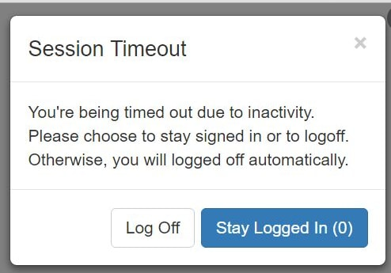
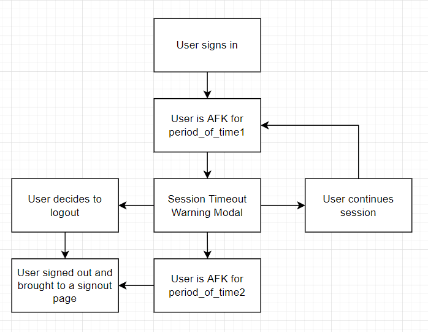

 
When a user is on inactive on a page too long, a common practice is to kick the user off their session. By logging them out usually.

This is especialy important if that person is on a website with sensitive information. For instance, bank accounts. If I went afk, I would hope my bank would sign me out after 5 minutes of not moving my mouse.

Otherwise someone might maliciously send a wire transfer and bam there goes all my money

Before we kick a user off, we generally give them a "warning" that this will happen. The user can do a number of different tasks. Here's what the general UX flow looks like:


 
1. If a user is signed in, we set the ability for a user to be kicked off.
2. If they AFK for an extended period of time, show a warning modal
3. They can decide to continue the session, end the session, or AFK (which also ends the session)

To build the modal we need to consider these common case scenarios. The actual implementation of it varies between apps, in this demo we're going to use the following:

1. A warning modal
2. A signout page

Here's how to implement this in React

## Timeout Logic

There's 2 core approaches to building the timing functionality in a timeout modal. One uses a `setTimeout` function that runs a check every minute and updates corresponding state. 

The other method is to manage `setTimeouts` and the corresponding event listeners to triggere the UX flow outlined above.

I will show you how to do the latter one. 

Here's the secret sauce for the timeout logic:

```js
import React, {useEffect, useState} from "react";
import {TimeoutWarningModal} from "./TimeoutWarningModal"
import { addEventListeners,  removeEventListeners } from './util/eventListenerUtil'
    
export const TimeoutLogic = () => { 
  const [isWarningModalOpen, setWarningModalOpen] = useState(false);
  useEffect(() => {
    const createTimeout1 = () => setTimeout(()=>{ 
      setWarningModalOpen(true);
    },5000)

    const createTimeout2 = () => setTimeout(() => {
      // Implement a sign out function here
      window.location.href = 'https://vincentntang.com'
    },10000)

    const listener = () => {
      if(!isWarningModalOpen){
        clearTimeout(timeout)
        timeout = createTimeout1();
      }
    } 

    // Initialization
    let timeout = isWarningModalOpen  ? createTimeout2() : createTimeout1()
    addEventListeners(listener);

    // Cleanup
    return () => {
      removeEventListeners(listener);
      clearTimeout(timeout);
    }
  },[isWarningModalOpen])
  return (
    <div>
      {isWarningModalOpen && (
        <TimeoutWarningModal 
          isOpen={isWarningModalOpen}
          onRequestClose={() => setWarningModalOpen(false)}
        />
        )
      }
    </div>
  ) 
}
```

What's going on here?

Everything gets interfaced with the warning modal. It's our state of truth regarding which timeouts are running 

We can break down the logic as thus:

- if the warning modal is not open, timeout1 is running
- if the warning modal is open, timeout2 is running

By this logic, we can use a `useEffect` that watches for changes against `isWarningModalOpen`

```js
useEffect(() => {
  // stuff here
},[isWarningModalOpen])
```

Now we add our set timeout functions for the first and second periods

```js
useEffect(() => {
  const createTimeout1 = () => setTimeout(()=>{ 
    setWarningModalOpen(true);
  },5000)

  const createTimeout2 = () => setTimeout(() => {
    // Implement a sign out function here
  },10000)
},[isWarningModalOpen])
```

Now that we have our definitions, how do we know when they should be called?

This is where we set an initialization in our `useEffect`

```js
useEffect(() => {
  const createTimeout1 = () => setTimeout(()=>{ 
    setWarningModalOpen(true);
  },5000)

  const createTimeout2 = () => setTimeout(() => {
    // Implement a sign out function here
  },10000)

  let timeout = isWarningModalOpen  ? createTimeout2() : createTimeout1()
 
  return () => {
     clearTimeout(timeout);
  }
},[isWarningModalOpen])
```

I've also added a cleanup method on the `return` value in the `useEffect`. Only one timeout should run at any given time and this prevents multiple timeouts from being executing

Next, how do we handle if a user types? or moves their mouse? In these cases, we'll have to go back to timer1 and restart it over again. 

So, we need to apply an event listener on the window object. Let's write a utility helper for this:

```js
const eventTypes = [
  'keypress',
  'mousemove',
  'mousedown',
  'scroll',
  'touchmove',
  'pointermove'
]
export const addEventListeners = (listener) => {
  eventTypes.forEach((type) => {
    window.addEventListener(type, listener, false)
  })
}
export const removeEventListeners = (listener) => {
  if (listener) {
    eventTypes.forEach((type) => {
      window.removeEventListener(type, listener, false)
    })
  }
}
```

What this does is if we call `addEventListeners` and pass a listener, it'll call a callback function. In this case the `listener`. This helper function creates event listeners for keypress, mousemove, mousedown, scroll, basically any user action. 

Now let's port this over to our initial example:

```js
  const [isWarningModalOpen, setWarningModalOpen] = useState(false);
  useEffect(() => {
    const createTimeout1 = () => setTimeout(()=>{ 
      setWarningModalOpen(true);
    },5000)

    const createTimeout2 = () => setTimeout(() => {
      // Implement a sign out function here
      window.location.href = 'https://vincentntang.com'
    },10000)

    const listener = () => {
      if(!isWarningModalOpen){
        clearTimeout(timeout)
        timeout = createTimeout1();
      }
    } 

    // Initialization
    let timeout = isWarningModalOpen  ? createTimeout2() : createTimeout1()
    addEventListeners(listener);

    // Cleanup
    return () => {
      removeEventListeners(listener);
      clearTimeout(timeout);
    }
  },[isWarningModalOpen])
  ) 
}
```

I've added an additional function on `cleanup` for removing the eventListeners since we don't want to have more than one for each type at any given moment. 

Next, we also added `addEventListeners(listener)` on the initialization in the `useEffect`. This calls a function that gets executed if anytime a user moves their mouse, types, etc.

In that function here, we define it as such:

```js
const listener = () => {
  if(!isWarningModalOpen){
    clearTimeout(timeout)
    timeout = createTimeout1();
  }
} 
```

What we're doing is resetting the first timer by first clearing any existing ones. So say you were afk for 4 seconds, moved your mouse again, you have to wait another 5 seconds before the session-warning modal pops up.

We also guarded this condition with a `if(!isWarningModalOpen)` because if that warning modal is open, we don't want things to reset.

This basically "disables" any user activity tracking and only resets if the user decides to "stay logged in" or continue their session. We don't want any keyboard, mousemovement activity to trigger the timeout reset

Instead, we want the user to tell us what to do. That is

- AFKing to the point of signout
- Choosing to continue
- Logging out

So now that we understand that, let's move over to the modal

## Timeout Modal

The timeout modal works like any other modal. In our same file, we have this `return` statement in our code

```js
return (
  <div>
    {isWarningModalOpen && (
      <TimeoutWarningModal 
        isOpen={isWarningModalOpen}
        onRequestClose={() => setWarningModalOpen(false)}
      />
      )
    }
  </div>
)
```

The modal only shows up if our state of truth `isWarningModalOpen` is set to true. We also have an `onRequestClose`, which is a prop that triggers when a user decides to "continue" their session.

The modal itself is very bare bones

```js
export const TimeoutWarningModal = ({isOpen, onRequestClose}) => {  
  const onLogOffCall = () => {
    // Implement your logout functionality here
    window.location.href = "https://vincentntang.com"
  }

  return (
    <div> 
      <Modal
        isOpen={isOpen}
      >
        <h2>Session Timeout</h2>
        <div>You're being timed out due to inactivity. Please choose to stay signed in or to logoff. Otherwise, you will be logged off automatically</div>
        <br/>
        <button onClick={onLogOffCall}>Log off</button>
        <button onClick={onRequestClose}>Stay Logged In</button>
      </Modal>
    </div>  
  );
}
```

We have to buttons. One is for logging off the user, the other just continues the session. If you AFK while seeing this modal, the `TimeoutLogic.js` component above executes the signout instead.

You can check out a demo of how this all works:

[DEMO](https://react-session-timeout-example.netlify.app/)

As well as the repo to play around with it yourself

[REPO](https://github.com/vincentntang/react-session-timeout-example)