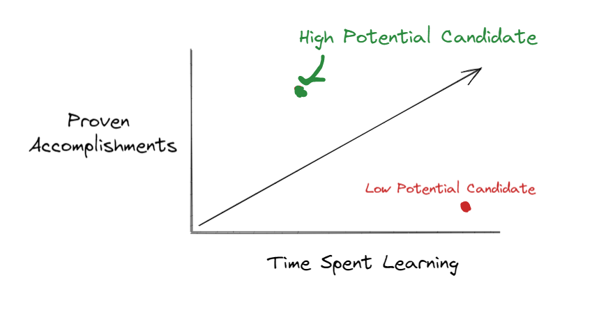

Keep swiping right and move along...

Dating apps like Tinder started gaining popularity in the early 2010's era. Before this, you had to meet a SO through friends of friends, or other website apps like eHarmony, okCupid, etc.

**If you've ever used a dating app as an average guy, you'll know that it's a lot of work**. Having to make openers to a bunch of people you never met. Upload pictures of yourself so you seem more attractive to others, but you don't have any good. Every so often, someone will match you back, and a conversation ensues. Now you have to learn how to properly text said person and schedule a date.

**Now if your a fairly average girl, you might get dozens of matches after setting up your profile.** It's a oh-my-god this is too much information at me at once. It becomes work deciding who to filter people out. You sometimes forget who you've been talking to because you might be talking to several people at once. 

## Dating analogy to jobs

Now let's talk about job seeking. Let me tell you a secret about it:

**Dating is like applying to jobs. Where every job seeker starts as an average dude. Every company starts as an average girl**

I've used to work in HR for several years. Anytime you post an application, you get flooded with applicants. Like up to several hundreds of applications in a week, depending on what it is

Sifting through these applications is alot of work. It gets to the point where you spend less than 5 seconds deciding yay or nay on a candidate. Much like a girl who decides whether or not to talk to a guy based on their first dating picture

**As a result, many companies have to filter out a lot of job-seekers in some way shape or form**.  

Job applicants many times 1 click apply to dozens of jobs that might match a title. Many job-seeking apps like you do this. This is basically the equivalent of a guy right swiping every girl he sees.

That guy might match with a girl though. In this case, a job seeker to a company. But that job seeker might say "hmm why did I even apply to this company? They don't pay that well". **Not all companies are worth applying to, even if you aren't an attractive job-seeker.**

An attractive guy generally won't match with an unattractive girl. He can be picky, he has options. This is true for job-seekers who have in demand skills.

Now if your an unattractive guy, or an entry-level job seeker in this case - things look kinda bleak. I've been here before. I didn't have any software development experience and had to apply for my first dev job. The rationale for many companies is why hire a junior dev when you can hire a senior one? 

I got hundreds of rejections before someone took a chance to hire me. Eventually I got hired after one interview because a company liked me. It's kind like dating a girl who just really likes you after one date. **If your an unattractive job-seeker, you have to make yourself attractive**

## Making yourself an attractive job-seeker

How do you make yourself attractive to a company if you have no job experience? We hear this joke all the time. "I can't get a job because I don't have experience, but I need a job to get experience!"

How do you fare as an average guy in a dating app trying to get the most amount of matches? **You become an interesting person to talk to.** You aren't a "Hey hows your morning" guy, your a "Hey I know lots of interesting places and people, wanna come to the next event I'm hosting?". Ergo, **you flip the script** to your advantage. 

And how do you do this as a first-time job seeker? **You show potential**. Potential varies between every company

For instance, my first company hired me because I understood their customer since I worked in their industry before.
I showed I could learn at a fast rate by competing and winning in hackathons. I wrote blog articles about problems I solved in coding. 
I volunteered with efforts for FreeCodeCamp, Mozilla, and more. Though I didn't have a job I still gave technical talks at my local meetup and seasoned developers stayed
I networked with other devs who mentored me through software development too. 

That's how you do it. **You show potential by having a proven record of succeess in a short time frame**. We can also represent this in a diagram

You want to be a high potential candidate. By doing so, you no longer become a risky-junior hire in their eyes, and they can pay you less than a senior yet get the same job done. Don't worry you get can a higher paying job later. You've also shown you like web development and aren't in it for just money.

Also for job posts, **ignore the years of experience they ask on the job as well.** This is like asking how much dating experience a person has to vet if they are worthy of dating. It doesn't matter. What matters is what you bring to the table. 

If you want a general rule of thumb, here's what to go by

- Jobs requiring 2 years of experience will hire a fresh high potential candidate
- Jobs requiring 5 years of experience will hire people with 1-2 years
- Jobs requiring 10 years of experience will hire people with 3+ years

I have a friend who I competed with in his first hackathon, 1.5 years ago. He didn't even know software development, but he was a kickass designer. We won several hackathons since then

I referred him to my company with high confidence and he now makes 6 figures. This role required 3-5 years of experience.

**Sometimes you also have to play your cards right, some companies need to hire urgently and will pick someone with less experience but lots of potential.**

## Additional Notes

- Create a good dating portfolio with pictures is similar to creating a good digital footprint for a prospective employer. Resumes, blog posts, side projects, etc are some examples
- This post assumes dating apps are guys seeking girls and vice versa, which is not always the case. I've ommitted this to simplify the analogy
- It still takes some luck to get a role, but you greatly increase the odds by making yourself attractive and marketing yourself
- The more attractive a company/job is, the more experience/attractive you need to be as a job-seeker to get hired there
- The less attractive a company/job is, the less requirements to get your foot in the door