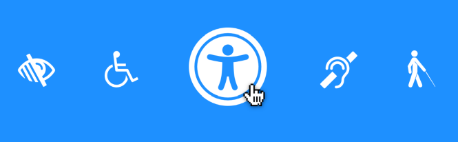

I work for one of the largest accessibility apps in the USA. I'm not at liberty to mention which one though. Earlier this year I played a pivotal role in shipping the initial launch of this product, and a federal innovation award

Before starting this gig, I didn't know anything about shipping large applications. I worked at a small web agency before this. My app affected maybe a couple hundred users at best. 

Since we impact so many users, especially ones with physical impairment, accessibility became a top priority. Here are lessons I learned as a frontend engineer working with screenreaders & accessibility experts:

## CSS Focus

A screenreader works like this in a nutshell:

1. User presses [tab] on the page
2. CSS focus is set to an element
3. The screenreader reads the content aloud

**Everything lives and dies by CSS focus. It's how a screenreader knows what to read on a page.** 

Knowing what to focus becomes a whole seperate set of standards. You can't just have `
` elements, **most elemenets need to be `<Button/>` for the purposes of `tab-indexing`.**

**Everything important needs an `aria` role** so the browser knows what to tell the screenreader what those are. Semantic HTML becomes more pivotal.

For instance, if a user sees a modal, this modal needs to have a `<Footer/>` element. There needs to be a `<main/>`. Semantics become more pivotal as well

Sometimes there's just too much content for the screenreader  to read. We had issues creating `anchor` internal links on the page that read off as `visited` for instance.

**Other issues related to CSS Focus tied to `focus-trapping`.** If a user navigates via keyboard and opened a modal for instance, that modal needed to have a `focus` set on it.

In the event a notification or [timed-out-session modal](https://www.vincentntang.com/session-timeout-modals-react/) appeared above that, we needed to reset focus to the top modal.

And then reset the focus to the item below once the top notification was gone.

**Apps that normally took weeks to ship out ended up taking months.**

## Accessibility tools

There are a number of accessibility tools you can use to automate the process. Some tools like `a11y` have built in linters that only work to a partial degree to catch common aria or WAIG related issues

The best chrome extension for auditing an app is probably [deque](https://www.deque.com/axe/). It's not perfect by any means though, it didn't catch many of our CSS focus related issues.

## Everything must be rendered

Say you have an `in-page` navigation on an app. Let's say you create we have the following:

1. User sees table-of-contents site map
2. User clicks an element on table-of-contents

One common pattern in writing a SPA or React application is to conditionally render stuff as necessary. If the user went to step 2, step1 would no longer be rendered.

This presents a problem. **The user who is using a screenreader needs to know exactly how to navigate back on the page**. 

This means instead of conditionally rendering JSX, you have to use `display:none` or `visibility:hidden` more frequently. `aria-expanded` also had to labelled on the table-of-contents item labelled on step 1 too

Likewise, when you deal with in-page printing (hitting CTRL+P), we also had CSS styles that had to re-enable these back in.

## Keyboard accessibility

With screenreaders, keyboard navigation is everything. A user does not use a mouse. A user needs to be able to get the most relevant information they  need in the shortest time frame.

We ended up having to write custom `useHooks` for if a user escaped on a modal for instance, and how that would then manage focus after. 

## CSS Accessibility Frameworks

On top of managing legacy CSS that we had no control over, we also used government CSS libraries that were in beta. Adding in a request for change here to improve ended up being a risk dependency that never panned out. 

Sometimes those libraries had many issues. We ended up rolling a lot of custom components regardless while still adhering to stylistic rules on other applications

## Forms and error states

Forms can have different triggers for inline validation, but a screenreader should not ever read those messages. **Instead, when a user submits a form, a user needs to scrolled to the top of the screen to see an inpage alert.**

This is because we need an alert to focus on and the user can know what to fix. We added anchor links to the top of the page that then navigates to corresponding form elements with errors

## Modals and Drawers

Modals and drawers needed something called a `focus-trap`. These modals were usually triggered by user activity, but we also built a [session-timeout-modal](https://www.vincentntang.com/session-timeout-modals-react/) that also was triggered if a user went AFK.

Whenever this session-timeout modal kicked, it'd have to override any focus traps on any current modals. So this way a screenreader 
would know the topmost content was the session-timeout. Everything for a screen reader depends on CSS focus