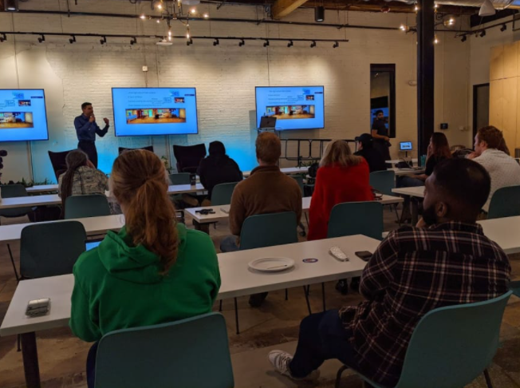
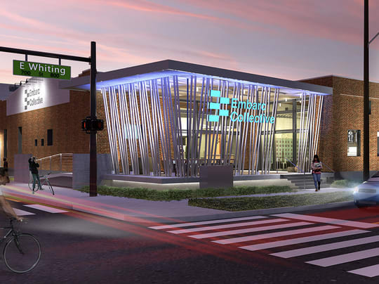
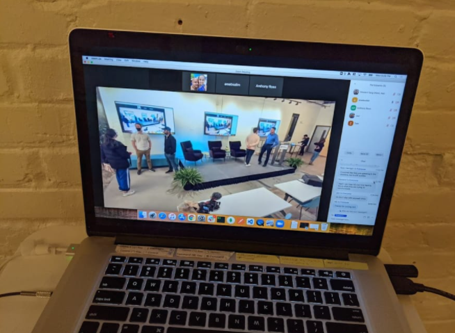
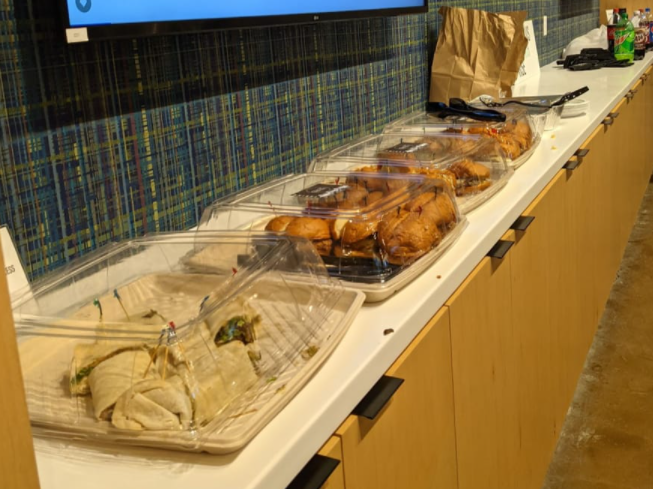
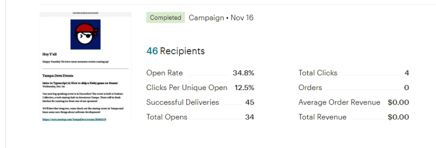
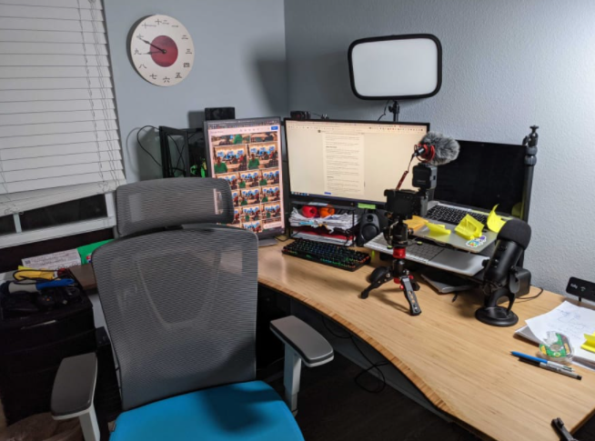
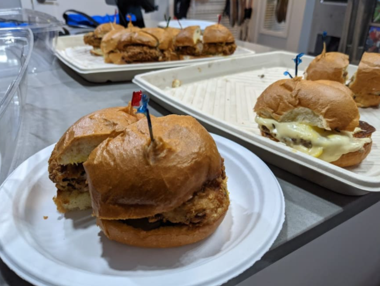

3 months ago I started [Tampa Devs](https://tampadevs.com). It's grown to 200+ members. Since it's inception, we've hosted 7 different networking and speaking engagement events.

Here's what I learned since then:

**Hosting events is hard**

I don't have a ton of experience as an event organizer. My first impression of hosting events for work is this:

1. Finding people that will talk at the event
2. Finding a venue to host the event
3. Running the event
4. Finding sponsors
5. Advertising the event
6. Post production

I figured hey I'll shoot a message to everyone involved and things will magically work after that. It didn't work that way.

Let me break down how much each of those actually became for our 2nd speaking event



## Finding people that will talk at the event

It sounds simple, but we had first time speakers that have never given a talk before. **Before you even get a speaker, you have to convince them to give a talk**

Most people will say "hey I'm interested", but really won't fully commit until a few weeks later. During the planning phase, I had to reach out to probably 5-6 speakers for our December 1st event. 

This is what generally transpired:

```
them: "Hey I'm interested in giving a talk Vincent! I want to do XYZ"
me: "okay, sounds good!"
them: "Actually can we postpone it to next month? 
them: "I had alot of stuff come up"
```

or the other response is "I'm not really sure how I feel about giving a talk", or "I don't think I'm ready"

**What I've learned in working as a project manager is setting hard deadlines forces people to commit "yes" or "no" to this.**

Just because someone says _they're interested_, doesn't mean they are commited. Instead, I had to have them prove they were willing to give a talk by submitting a talk proposal and outline of what they'd say

From there, I had to manage and follow up with each person, and set deadlines of when we needed these talks by. Usually this was done about 2 months before the event. **It takes about a few weeks - 1 month for someone to fully commit**

My friends Haritha and Zabi volunteered to do the first talk. They didn't have any experience speaking publically in front of a tech crowd. **In preparation for this, I had to onboard them on tips and tricks I learned as a speaker**

Normally this comes in deciding a proper title and figuring out how long the presentation should be, among other things.

Once that was set, a few days before the event I followed up to make sure things were in working order.



## Finding a venue to host the event

This became way more work than I imagined. I mentioned a few of the strategies I used for growing [Tampa Devs here](https://www.vincentntang.com/how-we-grew-tampa-devs/). Some of those strategies involved cold marketing people on linkedin.

Venues were the same way. I searched for the top companies in Tampa using searches like "Tampa software developer companies" on google / linkedin. From there, we had a list of companies that we hit up.

**What I didn't realize was how low the response rate would be.** I would say for every 20 messages I shot out, I only got 1 message back. Granted I copy pasted messages and shot it fairly quickly so it didn't became a huge time effort

When someone _did_ respond, I would ask if they were interested in hosting. Sometimes it turned into "hey I'm not the right person to talk to, talk to X person instead". When I reached out to them, I didn't hear anything. Even after several follow ups

**Eventually we managed to get a sponsor. But not through direct means.**

At our last event, I just happened to wear a "Tampa Devs" shirt in my apartment complex getting mail. One of my neighbors asked me about it, I told him I was searching for a venue.

Next thing you know I had a contact to Embarc Collective for our 2nd speaking engagement.

**Getting venues, or even hosts, requires you to either "know someone" or having to do active outbound outreach.** That means making a lot of phone calls, zoom meetings, getting email lists to know who to target.

Once we got our venue, it wasn't as simple as "just showing up" on the day of the event. That becomes a risk, so we came a few weeks before to check it out.

**From there, learning about the A/V (audio video) setup, where everyone will set, how people will sign in, were things we figured out.** 

There's also the marketing collaboration side too. Embarc Collective wanted their logo on our website for SEO backlinks, so then this became additional coding we needed to write to support this. 

Another thing we needed to have an "intro slide" to mention and shoutout our sponsors. This became a collaborative google slide-effort as well a few days leading up to the event.

There's also the logistics regarding "how" we should brand Embarc on our meetup page. I had called it a startup incubator when it was a tech startup hub, it's a really big difference. Before we could be put on their internal mailing list to startups, content had to be adjusted

Once everything was in working order, I shot a message a few days before the event to ask if we could show up early to setup A/V.

This is when things got really messy.


 
## Running the event

I'll talk about sponsors and advertising later. 

On the day of the event, we came a few hours early. One thing to note about Embarc Collective is how _cool_ of a venue it is.

Here's some fun tidbits:

- Laptops could be connected to 10! different TVs in 4 different spots in the room
- There's a builtin video feed on a column in the building
- Microphone that connects to surround sound speakers across the entire roo
- Lunch panel zone, movable desks and chairs
- A raised speaking platform with comfortable chairs that you could host a Jimmy Fallon or Connan Obrian show on

It's pretty much every organizer's wet dream for a venue. All the equipment you'll ever need and even ones you didn't know about

**Here's where things got a bit tricky though....**

We arrived at the site at 6 pm, an hour beforehand. Connecting to the site generally means making sure my laptop could connect to the TV and having access to WiFi

Sounds simple right?

Nope! Not at all. My poor Macbook wouldn't connect to the TV at the front of the stage. We tried a few different laptops and had to do IT debugging to determine the issue. **Turns out the HDMI connector at the front of the stage broke**

Luckily there were 3 other connectors in the room. But now, here's the problem: we're doing a hybrid (Virtual + In person) meetup

This means the audio needs to be transmitted on a zoom call, and to the audience in the same time

In my experience hosting events, **audio is the one thing that always goes wrong.** To the point I always carry 2-3 backup sources for audio

**We had to configure not 1, not 2, but 3 laptops for our speaking engagement**

- One laptop controlled the slides in the corner of the room, and projected everything to the TV
- Another laptop was plugged in through the WiFi closer to the speaker with a USB microphone
- The third laptop connected to the overhead video feed in the event no screens were shared

Luckily the venue also had a USB remote control mouse we could use to control the slides. **However, this also meant the speaker didn't have any control with live-coding, so we threw that out the door.** We did have the speaker make the presentation slide-only as a possibility in case something like this happened.

That being said, things ran pretty smoothly. I didn't have an accurate means either checking the quality of the zoom call though during the presentation. Or whether it was actually recording

For A/V backups, I brought a Sony AS6400 and a GoPro8 to capture two different vantage shots for headshots and secondary backup audio sources. We'll have to see how that turned out

The rest of the event was pretty uneventful otherwise, with the exception of finding out my friend Hari was a really good engaging speaker



## Finding Sponsors

Finding sponsors and finding venues were similar types of work.

I mentioned previously how hard it is to do cold-bound outreach on linkedin. Emails can be more effective, but only if you have an email to reach out to begin with.

When I looked for sponsors, I had to put on my "marketing / recruiting" [hat](https://www.vincentntang.com/describe-hat-wearing/). 

**This meant looking for anyone willing to pay for food.** One thing I learned about running Tampa Devs as well is I don't really know what I'm doing, so I need a list of advisors.

I originally started my career with [OrlandoDevs](https://orlandodevs.com), and helped organize their events before, so Jacques and Brian had been mentoring me along the way.

However, I wanted a fresh perspective as well. I reached out to [Leeds JS](https://leedsjs.com/) which was run by Luke Bonaccorsi over in UK. I audited most of the software developer meetup landscape around the globe and I was very impressed by how he ran is. 

**It was here I learned that getting sponsors to pay for things occured in one of 2 ways, from a financial standpoint:**

1. Have the sponsor pay for the food, and have them donate it
2. Pay for the food, have sponsor reimburse via an invoice 

**(2) would require setting up a 503(c) non profit status which would entail alot of accounting work** I didn't want to do. So (1) it was!

I reached out to a few recruiting firms on LinkedIn, and usually they respond pretty fast. That's because they are always out there headhunting, so it makes sense

We partnered with [Brook Source](https://brooksource.com) for food, but one issue occurred during food sponsorship.

**Namely, food logistics can be _a lot_ of work as well**

Having worked in the restaurant industry, figuring out how much food you need for an event is always tricky. Also, how do you keep food warm? When does it need to get here? Do we have vegan and gluten free options

The food came a bit early and wasn't at the ideal temperature, but food is food



## Advertising the event

Okay now comes advertising the event. I wrote about some of the [marketing strategies](https://www.vincentntang.com/how-we-grew-tampa-devs/) we used to grow Tampa Devs.

Since writing this blog post, we also used mailing campaigns as well. We captured users emails through signup forms when they came to events. 

**Advertising the event on meetup also means we generally have to post it about a month in advance.**

We advertised across a number of different channels, but the most important aspect was pushing reminders a few days before the event

**Advertising tends to be a lot of "remind myself to remind others" about the event,** which ties into just the sheer amount of logistics work needed to pull an event off

Because of all the things that need to be done, a good way of keeping tasks in order, project management, etc need to be checked



## After the Event

After the event is ran successfully, there's still work to be done. **Namely, thanking the sponsors like you would do a job search.** There's also the social media aspect of **posting photos / videos as well.**

One time consuming aspect is managing the editorial production of videos after. When we ran the events, normally we would have several audio backups.

In this event, I recorded on both a Sony A6400 and a GoPro8. I didn't check my camera settings properly, the camera footage was recorded in slow motion, so all the audio came out poorly. 

My GoPro8 also ran out of battery halfway in the first presentation so some of the content got lost.

Not all talks need post processing, but sometimes the zoom recording quality comes out really poorly due to Audio issues. Which always has a high likelihood of happening

**When a talk has to be post proceessed, that adds into alot of extra work.**



## Summary

In summary, this is all the things I learned along the way so far running Tampa Devs.

Lastly, I want to mention that running a group like this requires days where you don't think about it at all.

Originally when I started this group, it became something I thought about everyday. What happens if the venue fails? What happens if nobody shows up and all the food goes to waste?

These are things that are sometimes completely out of my control. I try not to think about it and just hope for the best. 

Getting an event to run smoothly without any big hitches takes a lot of luck too
