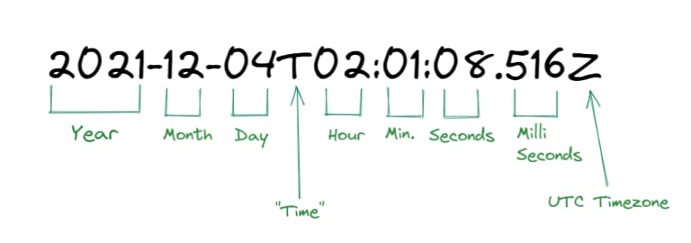
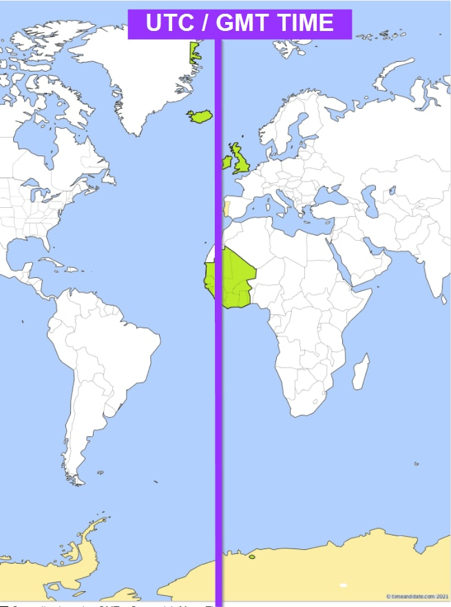
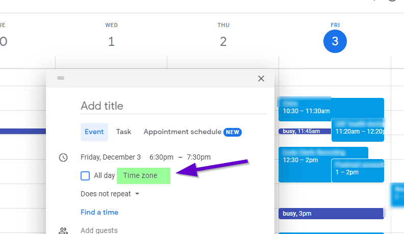
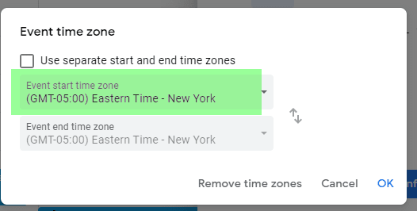
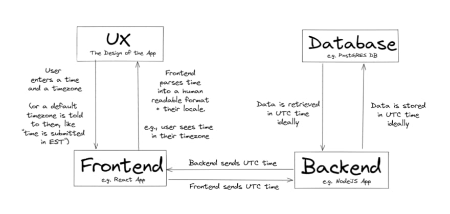

If you build an app that relies on dates, you probably had to consider implementing timezone support.

That is, instead of just storing a date, you also capture what timezone it's in. Whether EST, GMT, PST format etc.

Why is this important?

## Timezone 101

Now say your building an ecommerce site. And you have a special deal going on. First 100 users that go to the site can buy up to (1) PS5 on December 5th


Say we have two users. 

- `UserInAmerica` lives in America
- `UserInChina` lives in China

`UserInChina` logs onto the site on December 5th. He goes to the website, adds the PS5 to his cart, and successfully buys one!

Now `UserInAmerica` logs onto the site on December 5th. **It's sold out.**

Apparently users from China bought them all out before anyone in the USA could.

Why is that?


`UserInChina` is 12 hours ahead in time than `UserInAmerica`. When `UserInChina` time hits 12:01 am, December 5th, `UserInAmerica` is just eating lunch on December 4th.

 
This is why storing information with timezones is important.

## Common data storage format

Most databases will support a specific format, usually called UTC-string, in the database

This data usually looks like this:

```js
2021-12-04T02:01:08.516Z
```

This can be broken down as such:



The "Z" stands for "Zulu", which just means it's in UTC time. UTC time is also the same time as GMT (Greenwich Mean Time), which is located here on the world map:



**It cuts right through the UK. Just think of UTC as the time in London.**

## Developing with Timezones

Now that you understand how timezones are stored, how is this handled?

Most webapps now adays have a distinct UX design, frontend, backend, and database layer

E.g. say we have this stack

- A UX design
- A frontend React App
- A backend NodeJS App
- A PostGRES database

**When you design data systems, you always start outward in**

This means you look at your UX and your data storage. 

### UX

The frontend should always send data in a UTC format whenever possible, since we can get the users locale from the HTTP request. 
This also prevents misinterpretation from the backend on what's being sent in. 

**A good UX should default to the user's timezone, but also let the user know it's set there.** Google Calendar is probably the best example of this:



If you click the timezone, it shows EST (Eastern Standard Time) as the default, since I live in Florida



### Frontend

**The React Frontend should handle parsing back any UTC time it's getting back from the backend to the users time locale if necessary.**

So say you get this string from the backend:

```js
2021-12-04T02:01:08.516Z
```

This represents 

```js
December 4th, 2021 @ 2AM 
```

in London. However, if the user is in USA, we need to convert it to a human-readable format with the 5-hour timezone difference

Like:

```js
December 3rd, 2021 @ 9PM
```

and display that value to the user.

Likewise, before any data is sent out by the frontend to backend, we need to convert this back into a ISO string or similar format
 
### Database
  
**The database should always store information in a ISO string format in it's tables**, such as `'2021-12-04T02:01:08.516Z'`

In a table like this, sometimes you have the option of making a `createdAt` or `updatedAt` timestamp automatically when an entry is created/updated. 

### Backend

**The backend should be stateless**, in that it only helps transform to equivalent formats if necessary. If you have a backend that interfaces with other backend services, you might need to parse back that string into different format. Like `YYYY-MM-DD-HH-MM-SS` for instance. 

In the ideal case, the backend doesn't do anything. It just double checks the frontend request makes sense first before sending a SQL query to the database

The database can have a rule for auto timestamping when a new entry was created as well

### Architectural Summary

Here's a diagram to summarize everything we just talked about



## Unix vs ISO Strings - when to choose each

This format mentioned earlier: 

```js
'2021-12-04T02:01:08.516Z'
```

You can generate a ISO string yourself right on the console in Google Chrome. 

```js
var testDate = new Date();
testDate.toISOString()
```

There is another format called Unix timestamp that's equally as valid

This looks like this:

```js
1638583268516
```

which represents the number of seconds that have elapsed since January 1st, 1970 from London (UTC Time)

We can generate that string using this code:

```js
var testDate = new Date();
Date.parse(testDate) // or Date.parse(testDate.toISOString();
```

There's a few advantages and disadvantages in Unix timestamps. Here's some common case scenarios of when to use it:

- Unix timestamps are way simpler to parse. Having the frontend talk to the backend this way is ideal if you have to do additional processing on the backend level

Here's when you'd want to use UTC Strings

- Unix timestamps don't capture milliseconds. If your building a typing speed app, you need to use UTC String
- Unix timestamps are less human-readable than ISO formats

## Converting Legacy Systems to Timestamp Standards

A really common scenario for startups is data that's currently being stored without a timezone.

**If you have data like this, you'll have to clean up everything in your database to a UTC standard before storing additional data.**

This is one way you can do the migration cleanup:

1. Put app on maintenance mode
2. Check where the majority of your users live, assume that timezone for all values put in unless otherwise
3. Convert every time to UTC based on the above information
4. Enable app

Optionaly, you can ask the user to resubmit vital time-date information when they resign in on the app. A good example is a temporary modal popup

## Summary

Hopefully you find this helpful! The diagram I outlined above just encompasses how to architect most applications for handling time. 

I will note that sometimes the backend is more complex though if you need to integrate other services / 3rd party services. At that point, additional logic for converting to / from UTC time is done on backend