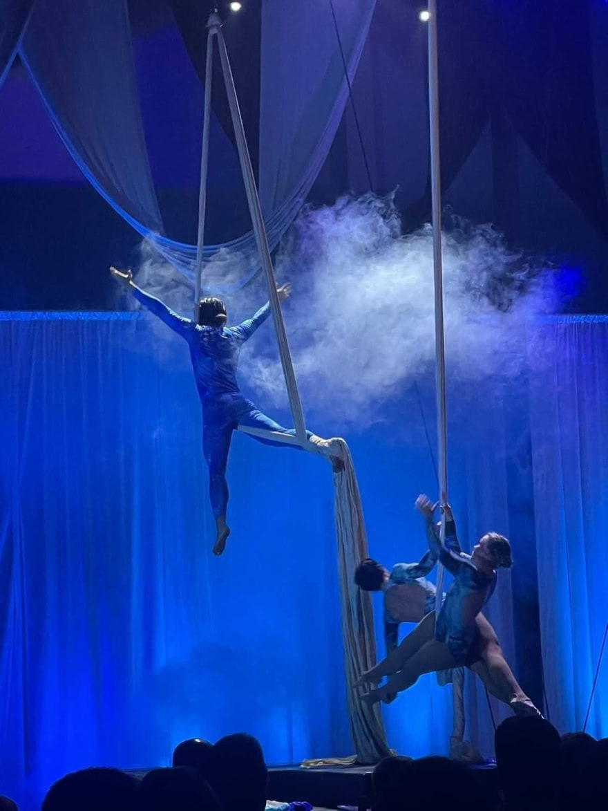
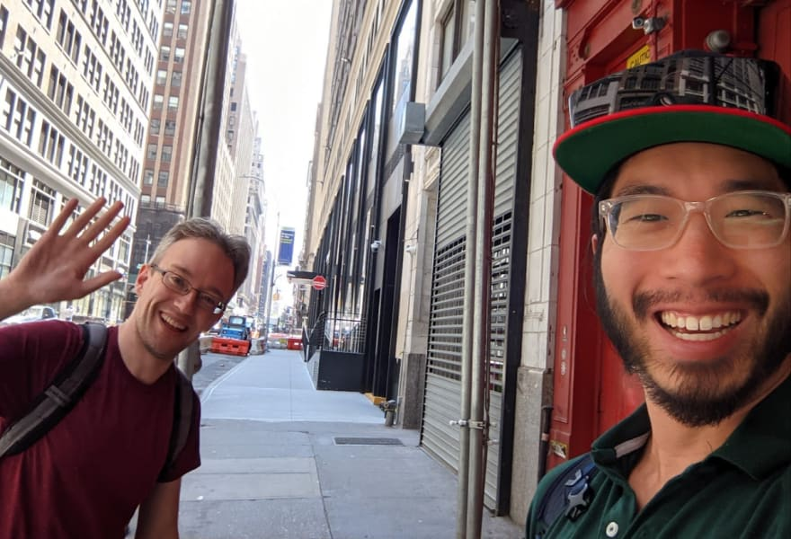

I write this blog post for myself every year. Here's [last years](https://www.vincentntang.com/2021-into-2022/). Every year, I look back and reflect the meaningful events, hardships, and challenges I took to grow as a person

Here's a synoposis

## Relationships

The biggest thing that's changed in my life has been relationships. Not in the romantic sense only but also friendships and business partners. Most of my life has been pretty independent up until that point, it's always been an "I" and never a "we".

I don't really want to cover details of my personal romantic life though. Too much information (tmi). Not in a public post at least. But I met a girl, who opened up a new chapter in my life.

Things were amazing starting out. I started even more hobbies I didn't know existed, on top of already having too many hobbies to begin with. I didn't know life could be so exciting!

I felt like I met the perfect person. Beautiful, smart, and funny. On the outside, it seemed great. This person was everything I liked, had many similar hobbies, could understand my difficult emotional pains growing up.

But that's when it took a downward spiral. Past the honeymoon phase, it turned south. Her very dark past kept resurfacing, and I did my best to support it. I was consumed, and I could no longer think for myself. Eventually I had to cut ties

I felt intense amount of guilt for doing this. Even though logically this was the right decision looking back

I took a vacation in New York to forget about everything. It took me months to get over it. I never felt this way about anyone in my life until that point. We were a "we" and now I wanted to be an "I" again.

Except that we did so many exciting new things together, that everything I did moving forward reminded me of her. I had to remind myself what I used to be like. And to love myself and embrace who I am above all else

And while I started enjoying my single life again, I met someone special. Except this time I learned from my past mistakes. I'm taking things slower this time

I was planning to move out of Tampa next year but I guess things have changed. That's life I suppose

## I debut'd my first Aerial Acrobat Performance!

My theme for this year was Acrobatics. And here's the result of it! I debut'd my first acrobatic performance on aerial silks

I remember the day I signed on to do this show. One of my friends volunteered me in and said "hey you'll like this it'll be fun". The first days coming back into silks were brutal. I couldn't even do the most basic of moves

And we only had 2 months to rehearse this to perfection. Some days I felt like I slipped backwards, but I grinded through anyways.

Going up in the air is this magical fleeting experience. You feel like your no longer bound by any rules anymore, and you can express yourself as much as your body is able too. That's what drew me to do aerial acrobatics - it's expressionalism in the form of logistical creativity

Some of those moves we rehearsed through were painful on my foot and knee. Since you hang all your weight on there. Everyone who performs tells me you have to "tough it out" and you have to be up in the air. Cuts, bruises, etc - you basically look like a domestic victim if you seriously train hard enough

On the day of the performance, there must have been about 200 people in attendance. All watching, eyes on stage. I don't know how I managed it, but my best time doing the routine was actually the day it mattered.

After I finished the performance, I felt a wave of relief. I didn't have to practice anymore! There wasn't the stress of "oh god I have to perform tonight" but at the same time, I feel bittersweet now that it's over

I miss the practice days already. I might come back and perform at a bigger theatre next year. Maybe. Anyways, here's the performance I did

<iframe width="560" height="315" src="https://www.youtube.com/embed/lmc1MpUSEvk" title="2022 aerial dragons art motion 2022 recording" frameborder="0" allow="accelerometer; autoplay; clipboard-write; encrypted-media; gyroscope; picture-in-picture" allowfullscreen></iframe>

## Organizing my first Hackathon

Since I started [Tampa Devs](https://tampadevs.com), it's grown immensely this year. How big? Big enough that I'm scheduled to be speaking on stage at a local conference that Steve Wozniak is also keynoting at.

That aside, we were planning our biggest event of the year. A hackathon!

Ever since I started my programming journey, I wanted to pay it forward. I got really lucky thanks in part to the community who helped start my [career](https://www.vincentntang.com/why-i-started-tampa-devs/).

But more so in the hackathon that actually helped me get my first job. I reached out to my favorite hackathon organizer 6 months prior to the event, and convinced him to move the event from Orlando to Tampa that year. And it worked!

I wrote down the [before](https://www.vincentntang.com/how-to-run-a-hackathon/) and [after](https://www.vincentntang.com/thoughts-after-hackathon/) thought processes for the hackathon

Check out the promo video we made for TADHacks!

<iframe width="560" height="315" src="https://www.youtube.com/embed/fEXdLheZW6k" title="TADHack 2022 Hackathon Highlight Reel" frameborder="0" allow="accelerometer; autoplay; clipboard-write; encrypted-media; gyroscope; picture-in-picture" allowfullscreen></iframe>

Also, check out the promo video we made for Tampa Devs too!

<iframe width="560" height="315" src="https://www.youtube.com/embed/4Su50PRr-xk" title="Tampa Devs Intro" frameborder="0" allow="accelerometer; autoplay; clipboard-write; encrypted-media; gyroscope; picture-in-picture" allowfullscreen></iframe>

## I wrote **30** blog posts about what I learned starting Tampa Devs

Asides from the hackathon, we've been pushing a crazy amount of infrastructure changes to Tampa Devs. It's essentially become a startup at this point, but we've registered as a nonprofit. Pending 501c3 status too!

I wrote about lessons learned about marketing, leadership, and operations. Some have trended on the frontpage of hackernews too.

Here's some of those blog posts

- [Why I started Tampa Devs](https://www.vincentntang.com/why-i-started-tampa-devs/)
- [How we grew Tampa Devs](https://www.vincentntang.com/how-we-grew-tampa-devs/)
- [Ugly Side Event Management](https://www.vincentntang.com/ugly-side-of-event-management/)
- [How to find co-organizers for a NonProfit](https://www.vincentntang.com/how-to-find-coorganizers/)
- [Retain talent by creating ownership](https://www.vincentntang.com/retaining-talent-by-creating-ownership/)
- [Guide to designing a custom 3D PVC Hat](https://www.vincentntang.com/designing-custom-3d-pvc-hat/)
- [Why I love mentoring and community building](https://www.vincentntang.com/why-i-love-mentoring-and-community/)
- [Tenacity and life lessons through the 33% rule](https://www.vincentntang.com/tenacity-and-life-lessons/)
- [Sponsors and Dirty Money](https://www.vincentntang.com/sponsors-and-dirty-money/)
- [Lessons learned building a 100+ member slack community](https://www.vincentntang.com/lessons-building-slack-community/)
- [Event hosting - do not always ask for permission](https://www.vincentntang.com/event-hosting-permission/)
- [Crafting the perfect meetup page](https://www.vincentntang.com/perfect-meetup-page/)
- [Creating an animated speaker ad](https://www.vincentntang.com/animated-speaker-ad/)
- [Should you go nonprofit as a software meetup](https://www.vincentntang.com/nonprofit-software-meetup/)
- [Best marketing strategies for a software meetup](https://www.vincentntang.com/marketing-strategies-software-meetup/)
- [So you want to run a hackathon](https://www.vincentntang.com/how-to-run-a-hackathon/)
- [Calendar Planning for a Software Meetup](https://www.vincentntang.com/calendar-planning-software-meetup/)
- [Let Things Burn](https://www.vincentntang.com/let-things-burn/)
- [Coming up with a Brand Name](https://www.vincentntang.com/coming-up-with-brand-name/)
- [Designing the Tampa Devs Logo](https://www.vincentntang.com/designing-the-tampa-devs-logo/)
- [Creating a Sponsor Pitch Deck for a Tech Community](https://www.vincentntang.com/sponsor-pitch-deck-tech-community/)
- [Thoughts after organizing my first hackathon](https://www.vincentntang.com/thoughts-after-hackathon/)
- [Swagging a Table](https://www.vincentntang.com/swagging-a-table/)
- [Test your brand name over the phone](https://www.vincentntang.com/explain-brand-over-the-phone/)
- [Best free safe fonts for logos](https://www.vincentntang.com/best-free-fonts-for-logos/)
- [Folder structure and permissions for a nonprofit](https://www.vincentntang.com/folder-structure-permissions/)
- [Get a business phone number for \$1/month](https://www.vincentntang.com/business-phone-number-one-dollar/)
- [Sub Branding and Shell Orgs](https://www.vincentntang.com/sub-branding-shell-orgs/)
- [Dealing with Hurricanes as an Event Organizer](https://www.vincentntang.com/dealing-with-hurricanes-event-organizer/)
- [Event Rescheduling is Complicated](https://www.vincentntang.com/event-rescheduling/)

More blog posts coming in the pipeline. I haven't had a lot of time lately to write these

## New Life Experiences

Too many to tell. Here's some of the things I did this year:

- Travels!
  - Met Tom Scott in New York!
  - Went to my first company retreat in Texas!
  - Hiked the Yosemite in California
- Fitness Hobbies
  - Acroyoga
  - Aerial Acrobatics
  - Did my first gymnastics pullover
  - Performed at my first show for aerial silks!
- New experiences
  - Camped for the first time
  - Owned a second cat for a bit
  - Paraded at my first Pride Parade!
  - Attended my first rodeo
  - Explored my first data center
  - Built a Mandalorian Lego Headset
  - Started a new job

Looking back through my photo albums this year, my life is crazy fun and awesome. I'm pretty happy where I am with in life, but I have way more bigger and better plans for the future

Here's a picture of me and Tom Scott for when he recorded [this video - "Flying here is surpisingly legal"](https://www.youtube.com/watch?v=PKs73A-TIWM)

## In closing

These were my thoughts for the year, and things that I did. My theme for this year was "Acrobatics". Next year I think my theme for the year will be "Learning".

I want to focus on 3 seperate subthemes here:

- Learning Spanish
- Career/conferences
- Real Estate
