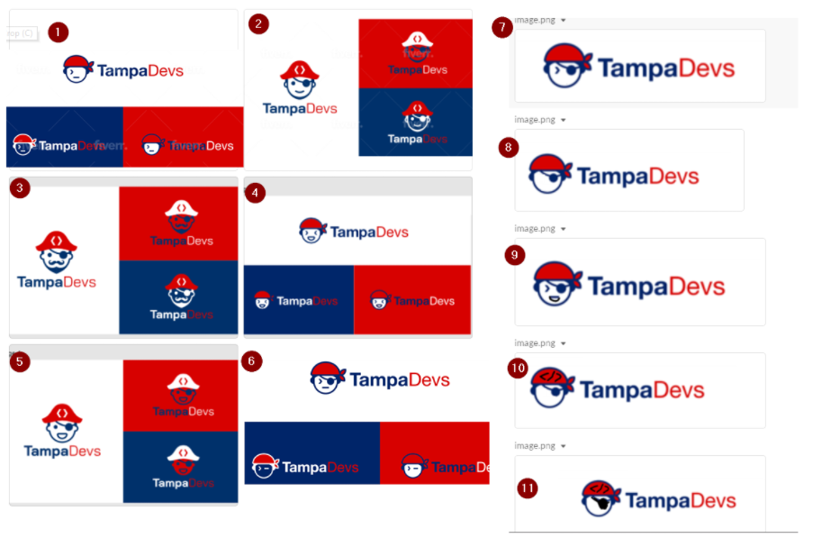

I've worked for a number of a different companies. Fortune 500s, startups, consultancy firms, the government, etc amongst many others.

I've found that the most effective companies that have low turn over rates, retained great talent, did it by creating ownership. My current company does this very well, and this is probably why I enjoy working with them

This is also related to an article I wrote about [how to find co-organizers for nonprofits](https://vincentntang.com/how-to-find-coorganizer), which ties into finding talent, but not how to retain it

Here are some rules of creating ownership

- Build trust by transparency
- Give others authority to operate
- Incorporate ideas from others during planning

## Build trust by transparency

At my last company I got laid off. 

When Covid hit, we lost a lot of funding from our clients, which in turn meant I didn't have enough to money to pay for groceries for the week

At first, our company told us about the situation, so I still believed that things would turn around. At a certain point, we started hiring new developers, new management, but our funding was cut even short.

There wasn't any transparency from upper level management to us (the coding peons) what was going on. Our daily standups went to weekly standups.

When I inevitability got laid off, nobody actually knew that I got laid off. For a whole month! Our team was small at 15 engineers as well. My co-worker asked about me during a weekly standup, and said "I need Vincent's help to look through this code" only to be met with an awkward pause to the conversation.

At another firm I've worked at, I've had the complete opposite experience. Good benefits, salary, and transparency through the org in how they make money, and things I can do to help the company succeed.

**When upper management creates this level of transparency, you in turn can't help but do the same too**. This creates mutual trust on both ends, but it usually starts from the top.

When I formed [TampaDevs](https://tampadevs.com), I did this same principle. I wrote down everything I did. Basically created notes on how to run the organization if I weren't present, or just had to hand off everything to someone else to run.

When people understand the motivations behind an action, or a goal, it can help inspire others to do the same too

## Give others authority to operate

The most frustrating thing is when you want something to succeed, but don't have the means to get there.

Either by red-taped process approvals, waiting for someone to "okay" something, but takes a very long time for them to get back to you.

Sometimes you just have to let go. **To be okay with someone giving their best shot even at something, even if it's not going to be perfect.**

## Incorporate ideas from others during planning

People want to be heard, to be seen when it comes to planning for a big project, goal, etc.

**The end result might be better than you expected.**

Here's an example:

I needed to create a logo for TampaDevs. We created somewhere on the lines of 10-12 design iterations. I didn't know what logo to go with, only that I knew which logos from other organizations I liked.

We ended up with a really neat looking logo that wouldn't have been possible without everyone's input (we went with #7). It made people want to buy our shirts even more!