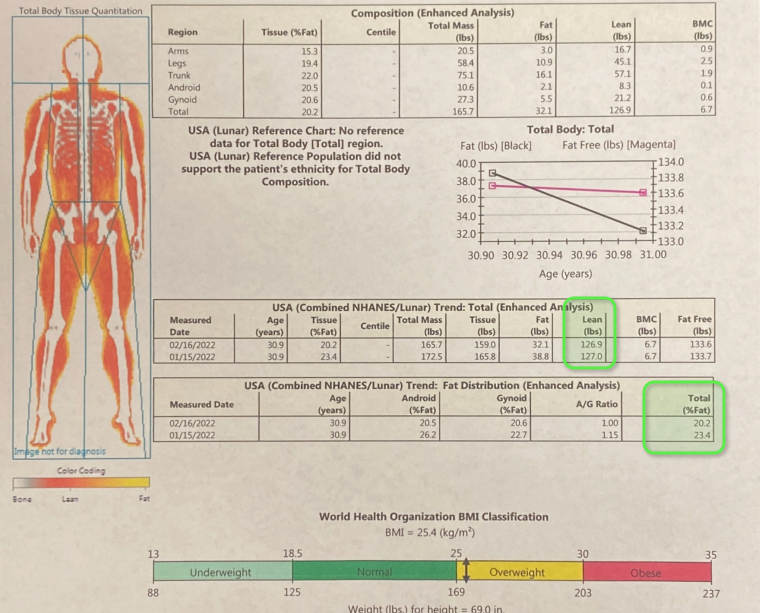
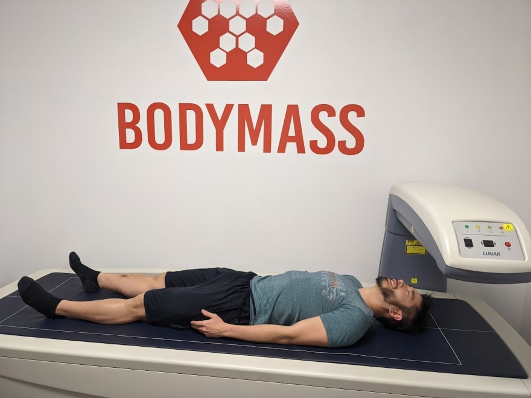
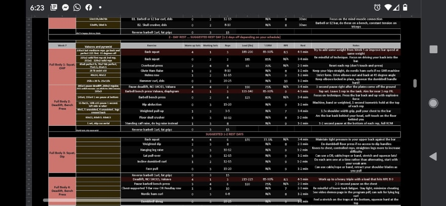
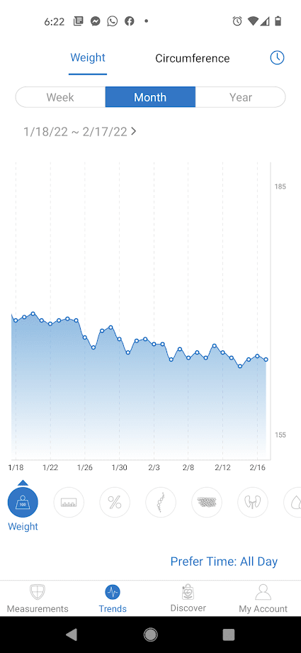
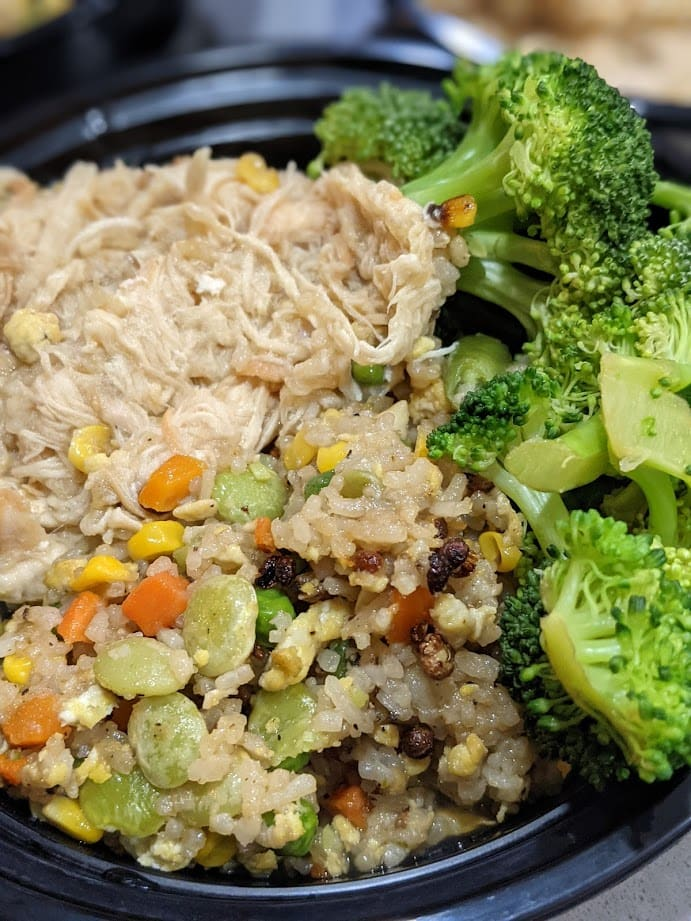

So here's a list of things I did to lose 3% body fat with no muscle loss in a month:

*0.1 lb muscle loss, ~7lb of fat loss*

There's alot of method and techniques I used to get here, mostly around building better habits. Here are what those habits are, and how you can reproduce it for yourself:

## Checking in

*dexa scan*

* Dexa scans once a month to start out and analyze results scientifically on fatloss%
  * do it at the end of a cut and halfway in it
  * before you start a new workout routine
  * Dexa scan is an MRI machine that checks how much fat is in your body in different regions
* Weekly progress pic to check in with self
  * take pictures at same angles everytime
  * do it in the morning
* Weekly measuring of body sizes
  * this gives a bigger picture of whether I'm losing fat or not (e.g. smaller abdomen)

## Working out

*example of notetaking for workouts on sets* 

* Pyramid sets upward during workouts. For  lower power lifts near one rep max, 5-10 lb increments. Upper body at 2.5-5 lb increments
* Allow 3-5 mins recovery on big 3 lifts between sets
* Perfect breathing techniques on eccentric and concentric loading
* Check in with body. If I couldn’t do a warmup set or got overly fatigued from it, skip workout
* Increase total number of warmup sets to reduce injuries
* Checking if new strength numbers were met from previous workouts
* Write down how every set went in a workout.
  * I use shorthand notations like `ls` for lastset, `ms` for midset, `fs` for first set, `bs` for best set etc. 
  * I write a lot of notes here, more than I think I'll need
  * I'll add levels of exertion of effort for each set. 
  * I'll write down if I need to go down a level or up next time.
  * I also add notes on dates of when I worked out (to be implemented)
  * More data is better
  * I add the notes from my phone while working out to a google spreadsheet, based on program I'm on
  * I run a FIND/SEARCH to see what my last sets were for that specific exercise. E.g. "helms row" for instance

## Recovery Habits

* Improve sleep hygiene with better practices and melatonin
* Yoga for strength and meditation
* Stretch regularly before a workout and foam roll it out
* Before a deload period, I went for one max PRs and hit to failure
* Being aware of stress levels and solutions to remedy it
* Get into the habiting of moving a lot and not sitting stand for too long

## Macro dieting

*tracking weight changes over time* 

* 2000-2200 calories daily on workout days
* A little more calories on recovery days
* Deload week, I did maintenance 2500 calories
* Do macro nutrient tracking every so often, and calculate calories per meal everytime I qcook
* Chicken Egg Rice Broccoli just works
* Eat about 500 calories before a workout, should be high in carbs and protein
* Eat 30g protein / meal max, but eat 4-6 times in a day

## Dealing with Hunger Pangs and desire to eat out

*chicken broccoli rice eggs* 

* Only plan ~1500 calories a day, fill the rest however I wanted (junk food, beef jerky, alcohol etc)
* Postworkout, do half casein half whey protein
* Creatine and vitamins
* Nighttime, do all casein protein
* Add starchy vegetables that are filling and low cal, broccoli. Add eggs into diet. 35-45 % protein intake daily at ~200g
* Drink lots of water during before after workout, and also have a habit of drinking a post nighttime smoothie too with more water