Several months ago, I started [Tampa Devs](https://tampadevs.com), a community of software developers in Tampa. Since creating it, I've been exploring creating custom swag. Logos, T-Shirts, stickers, and now a hat.

Being a hat connoisseur, I'm really pick about my hats. So this guide is tailored for people who will wear their own design hats.

I didn't have a lot of knowledge of what goes into designing a hat. But over the last three weeks of learning about the industry, and designing my own, here is my guide on what you should know about designing a hat.

## Hat Types

### Decide if you want a mesh hat

First you want to pick the base of the hat. This is the overall build and quality of the material, before you put any customization and embroidery on.

You can either have a hat with, or without a mesh. Here is one with a mesh: 

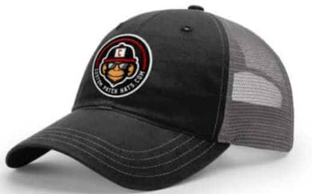

Mesh hats are also called trucker hats, they tend to work well outdoors because of the breathable mesh. They are mostly catered toward people of all ages, and there's various tightening fit types on the backside as well

Mesh hats also imo tend to be lower quality, since the overall structure and rigidity on the panels is looser. It makes it easier to pack and fold, and to incorporate softer material types. 

They also have the disadvantage of having hair poke through, for people with short straight hair (like myself). So if you decide to wear a cap backwards, it doesn't look ideal

TLDR

Pros

- Comfortable
- Softer material options

Cons

- Hair sticks through
- Lesser build quality usually

### Decide the lip angle

Traditionally most ballcaps have a curve associated with it, also known as baseball caps. There is another variation where the lip is flat though, as seen here:

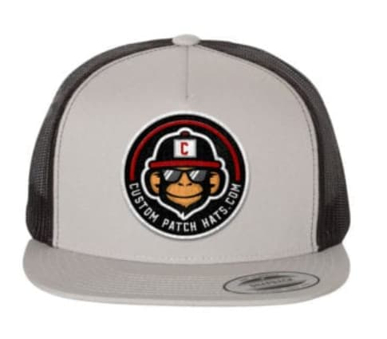

Flat lid hats tend to be less about function, and more about designing aesthetics, towards younger crowds. Some companies will emphasize designing a silver-colored sticker as part of the design as well. Here's an example from my hat collection:

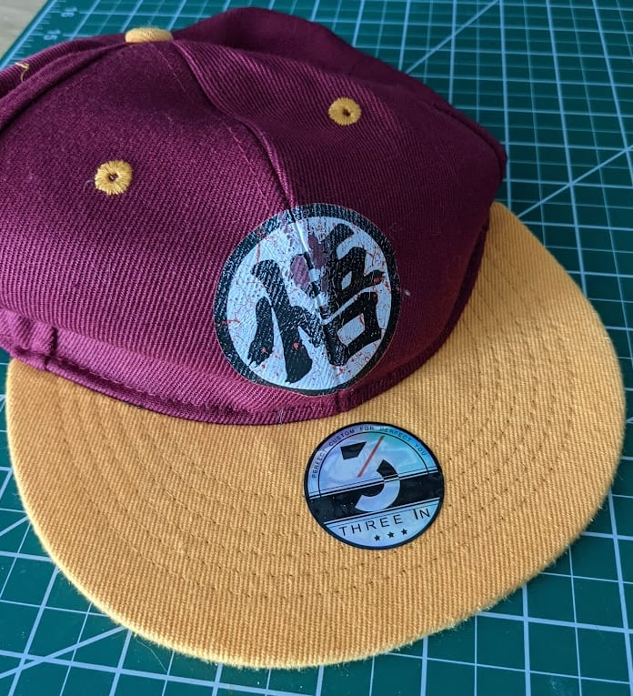

### Decide the number of panels on a hat

Most hats usually have 6 panels. This means if you look at the top of the cap (the center), 6 sewing lines protrude in all directions

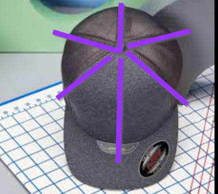

There are hats that have 5, or 7 panels as well. These tend to give it a more "old-fashioned" or even "european" style look, and they tend to be full-paneled (no meshes). Example:

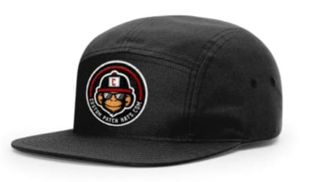

### Deciding on additional customization

Depending on the hat vendor you pick, and whether the hats are made in house or bought in distribution, you can also choose many additional customizations.

Most companies will usually sell standard run of the mill hat brands, like Yupong or Richardson. These hats are great for adding embroidery and customization onto.

For more finer granularity during the manufacturing process, you can choose to use a tool like [PukkaInc](https://hatcustomizer.pukkainc.com/index.html?refer=return)

which lets you choose everything from

- How the hat will fit (adjustable, snapback, etc)
- Whether images will be printed on the hat panels themselves
- Number of panels
- Underside of the hat, and whether additional custom printing is done on the ridges.
- Material for each panel _(mesh hats are just 4 panels with meshes)_

Here's an example of a PukkaInc hat I own:

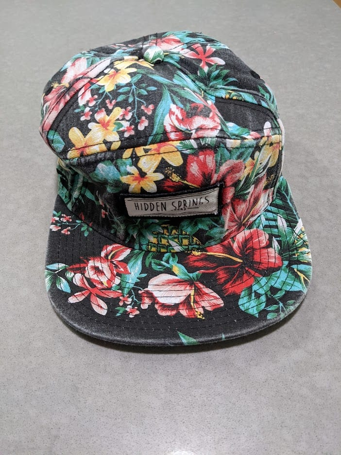
 
Prices are usually higher since additional tooling is needed, with longer lead times and minimum buy order quantities

I've only really scratch the surface here. There are entire catalogs dedicated to this kind of thing, I picked up one from my local hat store:

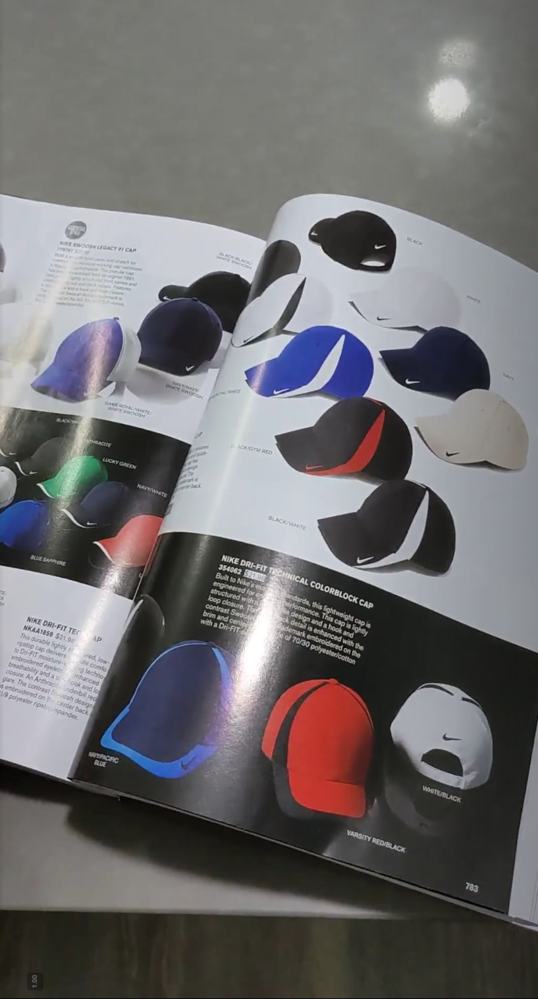

---
 
## Embroidery Options

### Deciding on your base embroidery

Embroidery is the physical thing you stitch onto the hat itself. This is usually the logo, granted you can add on elements like text on the side or backside of the hat.

There are ALOT of options when it comes down to embroidery. However, they can be broken down into two types:

1. The logo is physically stitched into the fabric during manufacturing
2. The logo is created standalone, and then stitched or heated  onto the fabric

(1) has a disadvantages of warping the panel structure, so if you hat doesn't have a lot of rigidity it'll create a bent-in look. This isn't exactly ideal, however it does have the added benefit of potentially creating a 3D "Puff" design. This is done through layering the stitches, one on top of the other. This creates verticality and a nice texturized feel when you rub your hand on the logo. Here's an example

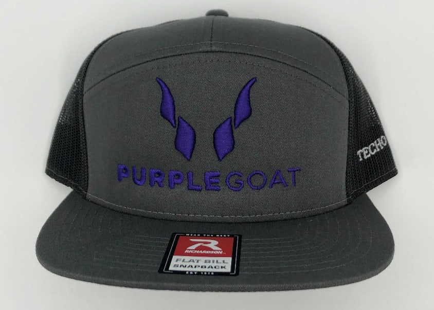

(1) has the largest range of customization stitching options though. You can use just about any shape logo, even ones with tight corners as each thread is sewn into the hat itself

You can check out the full range of options for (2) [here](https://www.custompatchhats.com/patch-hats-101/).

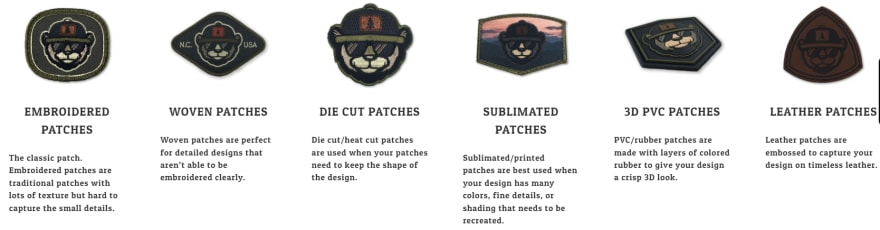

- Embroided patches - Lots of texture, but poor detail
- Woven patches - Detailed designs that aren’t able to be embroidered clearly.
- Sublimated Patches - Sublimated/printed patches are best used when your design has many colors, fine details, or shading that needs to be recreated.
- Die cut patches - Die cut/heat cut patches are used when your patches need to keep the shape of the design.
- 3D PVC Patch - PVC/rubber patches are made with layers of colored rubber to give your design a crisp 3D look.
- Leather Patches - Leather patches are embossed to capture your design on timeless leather.

Sublimated patches work great for raster based image designs as it supports shading, everything else works well with vector formats

### 3D PVC design

I chose to use a 3D PVC Design on my hat, so I will go through this process particularly.

A 3D PVC process is basically what you think of as traditional 3D printing, but instead of using hard plastics like PLA or ABS, soft PVC is used.

A mold is created of the logo, and a filament injector deposits soft PVC onto it, until the curing process is finished. Here is what it looks like during manufacturing:

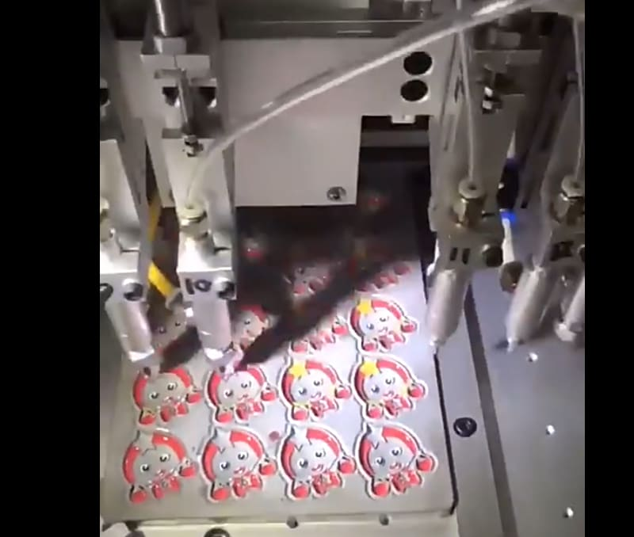

The molds for these cannot have sharp corners on the design, so you may have to create an outline for your logo. I don't know the exact reason for this, but I suspect it's probably hard for the extruder to hit tight corners. Here is an example of outlines that can be used:

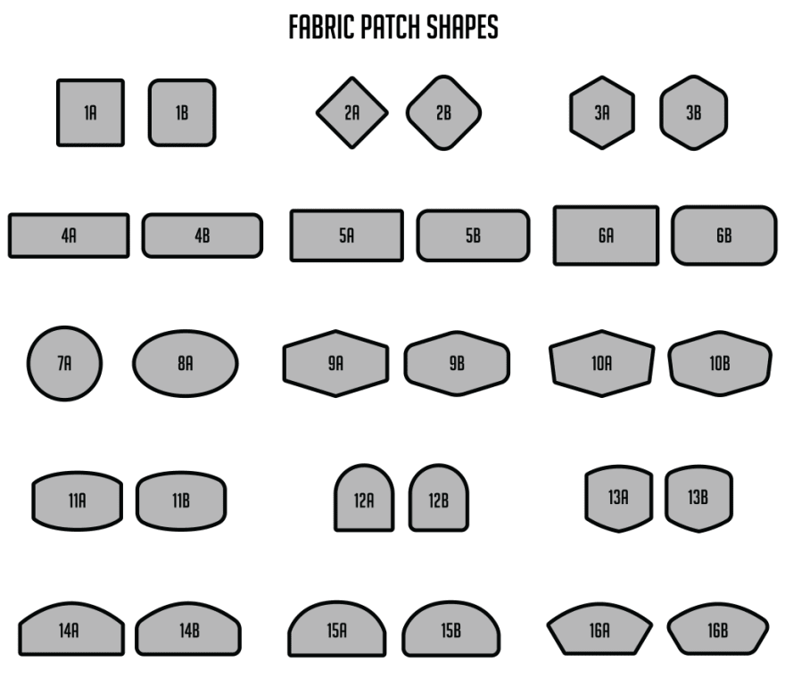

After you create an outline for your logo, you can also select how the layers are printed on the design. So here's an example of the hat logo I created for Tampa Devs:

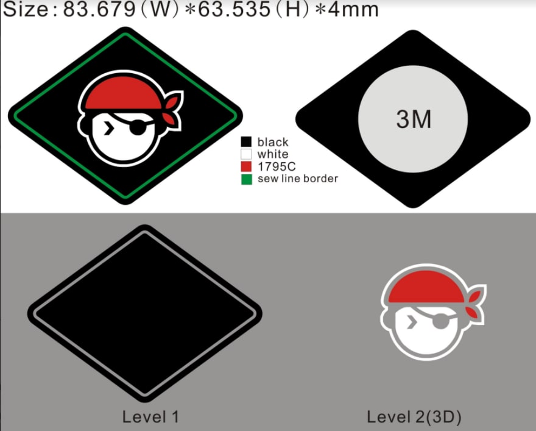

I picked black as our flat level layer, and stuck with as few color choices as possible. For the 3D texture print, I chose to use red and white. 

Just as a side note, the outline of the logo (the diamond here) needs approximately a 10MM stroke to help with the hand-stitching process afterward too

Here is a final mockup of the hat I designed before signing off into production for 8-9 weeks:

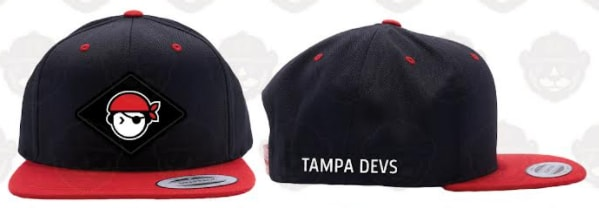

We added some custom embroidery on the side of the hat as well too. Here's the full specifications of the hat I ordered: 

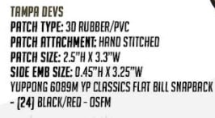

 
## Design process

I want to add additional notations about all the additional things I had to learn while designing the hat. Think of them as lessons learned:

### Color production

Before the hat goes into production, you need to pick the pantone color filament or fabric colors that will be used. Pantone is a specific brand of colors that has a rough equivalent match to an RGB or hex value

Make sure whatever color you pick also matches the design elements of the hat as well. The hat we chose has a red lid to it, and our logo has red colors in it too. So when you pick a red to print off, it should be somewhere in the range between those two depending on what print options are available.

The recommended thing to choose here from the hat vendor is to pick the logos true color.

Here is an example of our color charts and how it maps to pantone colors:

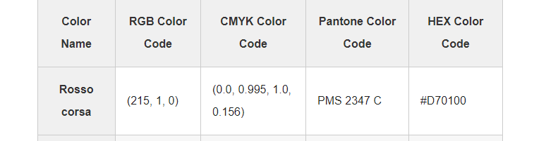

### Vectorization and exported formats

I use [affinity designer](https://affinity.serif.com/en-us/), a competitor to adobe illustrator.

One thing that I struggled with is creating an outline for our logo. This is the outline I originally created, and exaggered in this picture below:

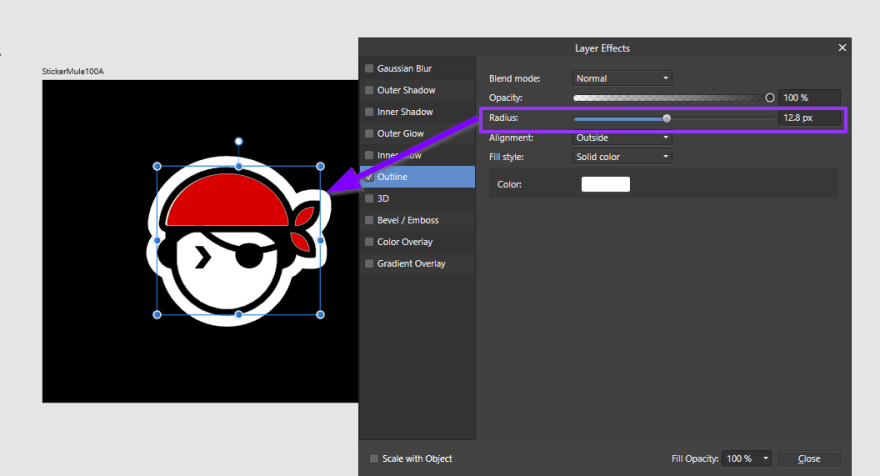

The problem here is during export this is treated as an image rasterization, which is never good for printing. It would've created a blurry stitching and or filament printing during final production. 

If you can whenever possible, always use vector supported format like .EPS or .SVG so any app is compatible
 
### Design iteration

Designing things well takes a lot of time. For this hat, I spent close to 2-3 weeks designing hat, even though I already had a logo made.

The reason you make it take time is you need some time to have a "fresh state of mind" to see whether the design choices you made the day before was good or not.

It also allowed me to create user-studies that I sent out to twitter and all of my friends, to see what their opinions were. 

Since I needed to create an outline for the 3D PVC process, I sent out a survey picture. Then I asked them what their favorite outlines were:

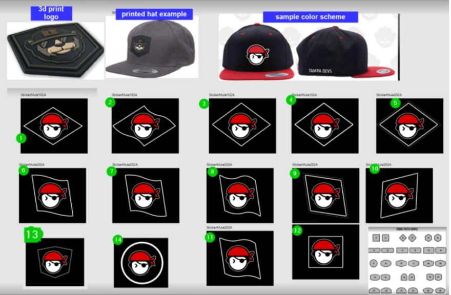
 
Here I got a range of answers from what people thought were good outlines. I intentionally left bad designs here to help narrow expert opinions as well, to see if friends could point them out. 

From here, I was able to solicit opinions from people who understood hats and nuances of logo design. 

When we created our outline for the hat, the question went in this order:

1. Which outlines work best?
2. Of the outline chosen, what color combinations should be used?
3. How big should the logo be on the hat?

These questions were asked back and forth between my design team, and the hat designer. 

For (1) we chose a diamond shape as it resembled both coding brackets `<>` and a flag, and also took an otherwise circular logo into a less obstrusive straight line outline. 

For (2), I asked the hat designer for her expert recommendations and gave her my thoughts first, since I wasn't entirely familiar with the printing process. 

For (3), I did some A/B prototyping by printing off the paper mockup, and slapping it on one of my hats. I could determine from here, if the text on the side would or would not overpower the logo. Here's that prototype iteration:

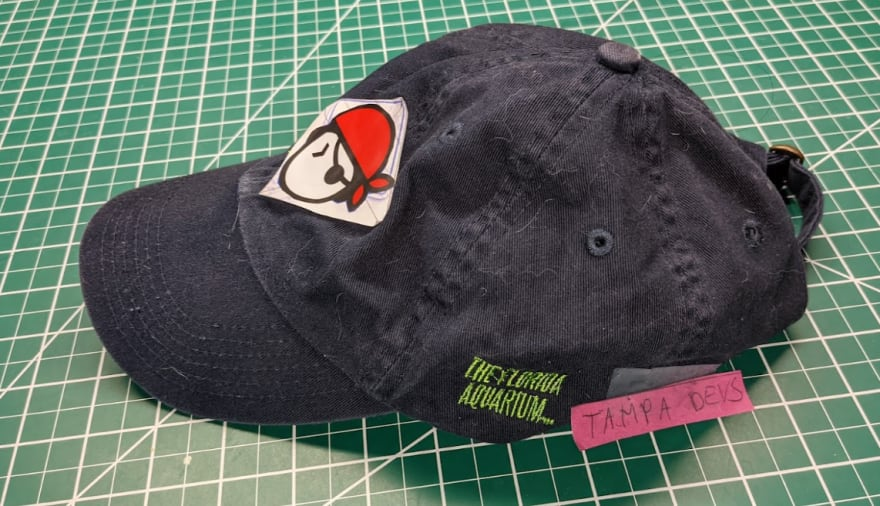

They later also sent a follow up side embroidery patch proof:

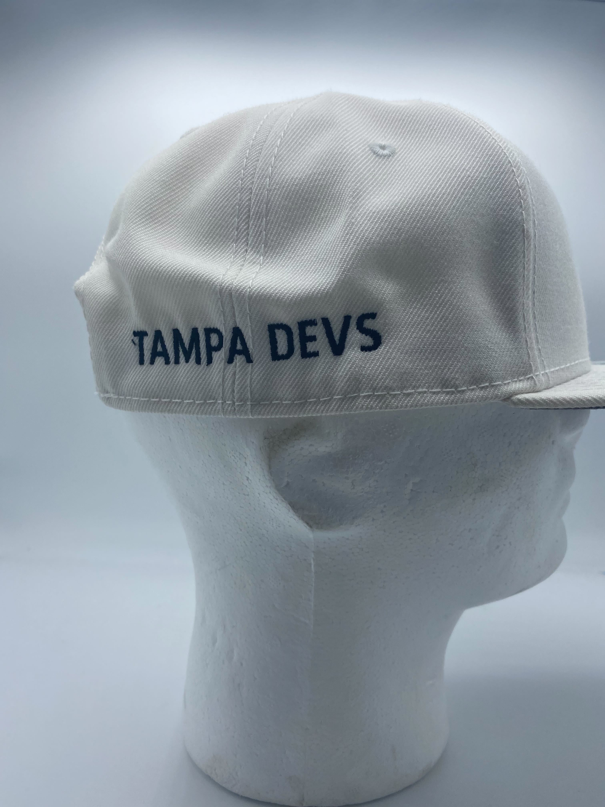

and the 3D PVC Patches as well once they were printed at a 3rd party vendor

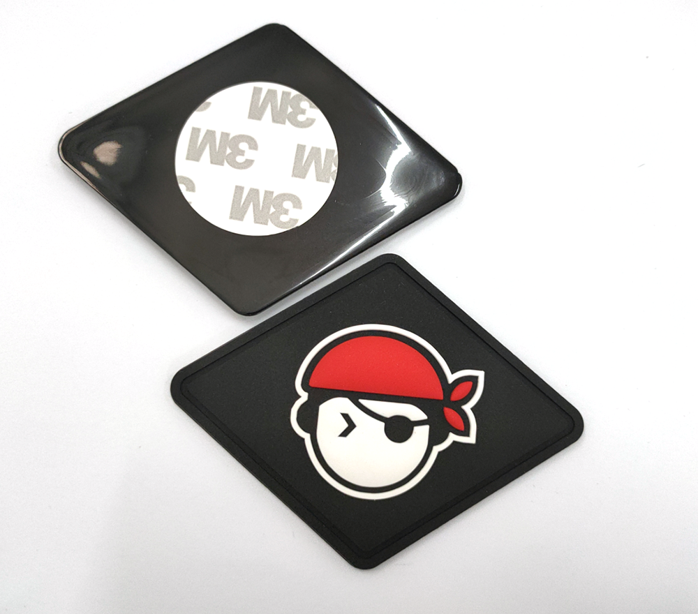

## The final product

Here's the final product. It came out about 2 months after I ordered the cap. I really like how it turned out!
Highly recommend the vendor I got it from, [custom patch hats](https://custompatchhats.com/).

Full on view:

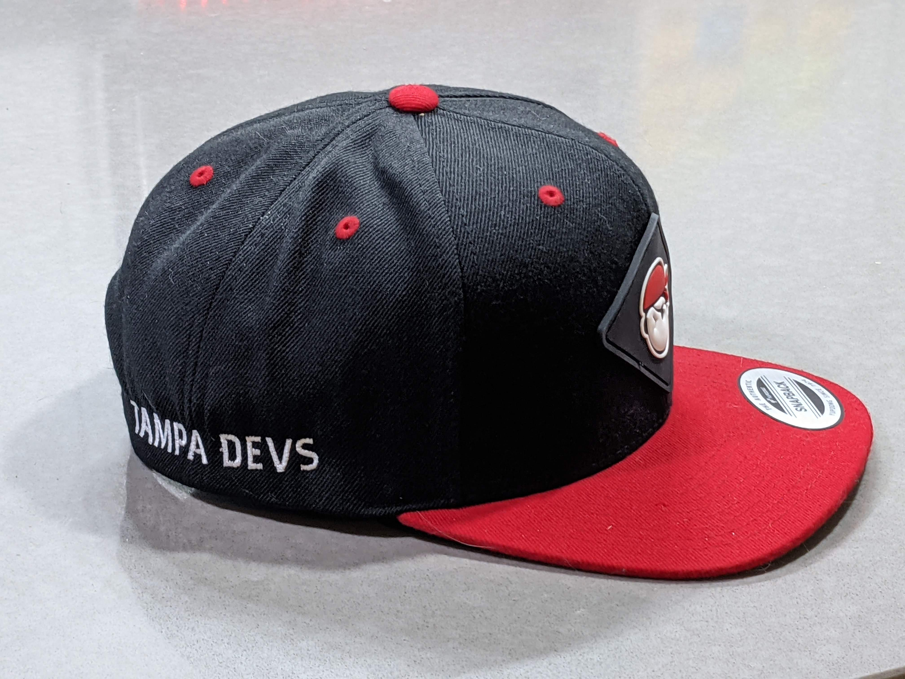

Close up shot of embroidery. You can see the 3D layers here, the thickest part of the 2D level design occurs in the bigger white/red areas. It has a emboss feel to it that feels really nice

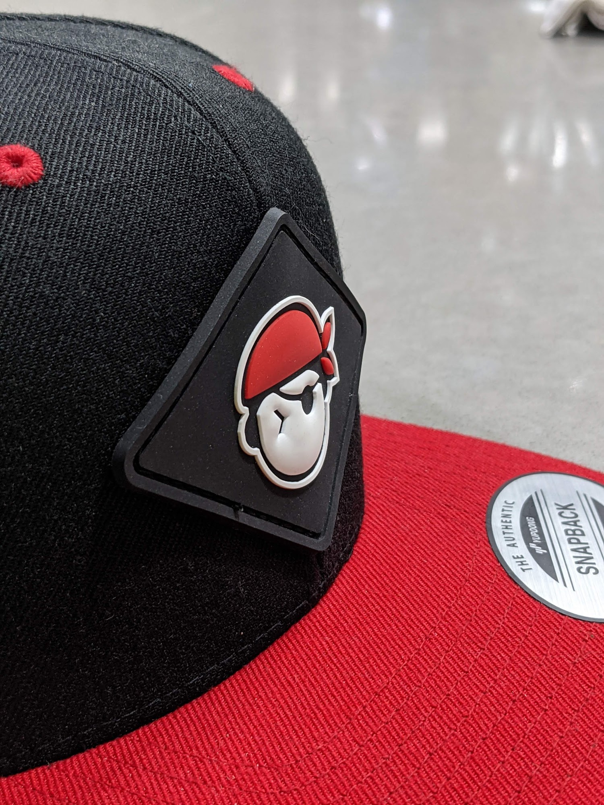

The underside of the hat didn't have anything remarkable. I didn't know the bottom would be green, but I like the christmas color decor style though.

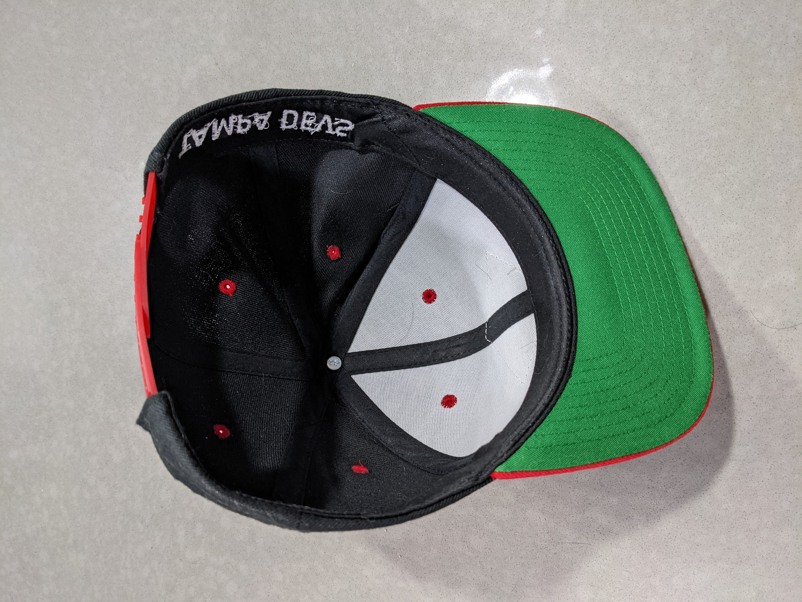

Here's how it looks wearing it normally. I will say the hat is kinda big though, but I have a big head so it's okay

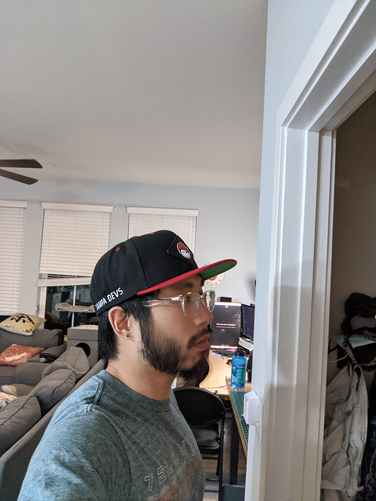

And what it looks like wearing it backwards, should you go for a more urban look. The side embroidery has a crisp look to it at 0.45"H on the text

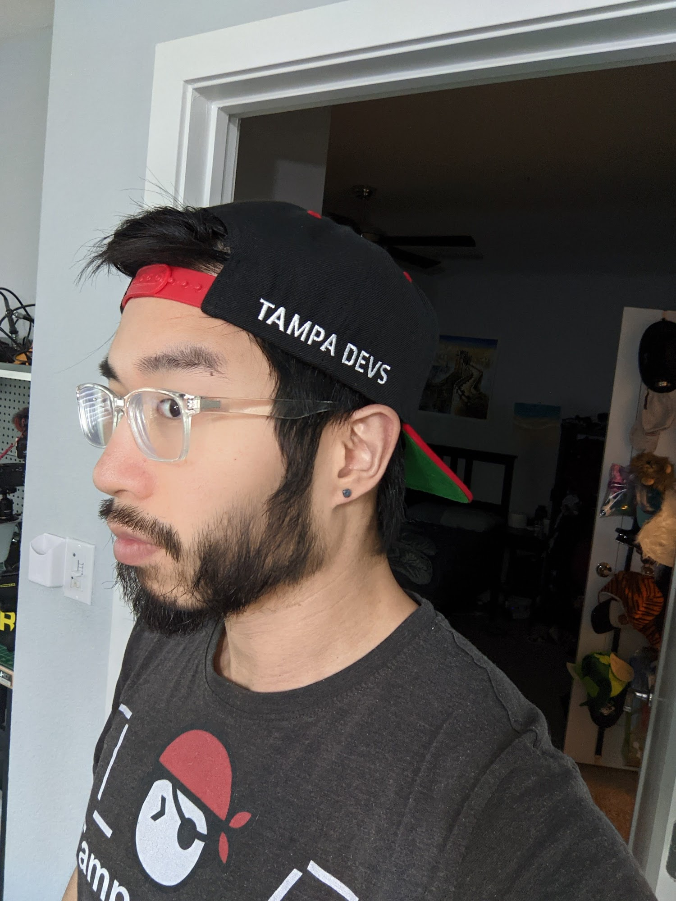

One unexpected thing about the hat is how stiff it is. The bottom of the diamond outline for the logo is stitched against the part where the forehead meets the hat.

That area in particular was uncomfortable for the first few days of wearing the hat. After awhile, it sets in and doesn't feel so bad