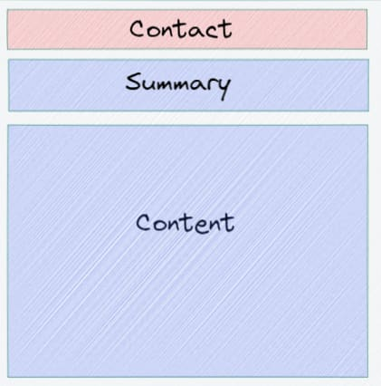
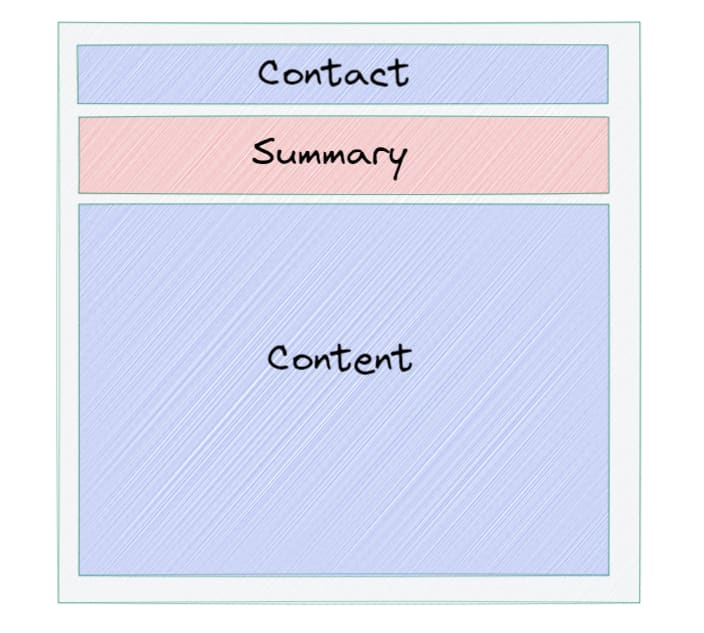
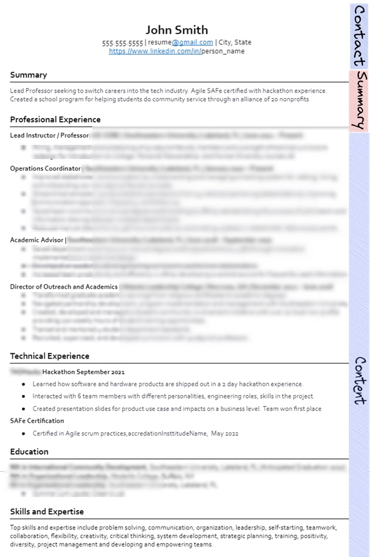
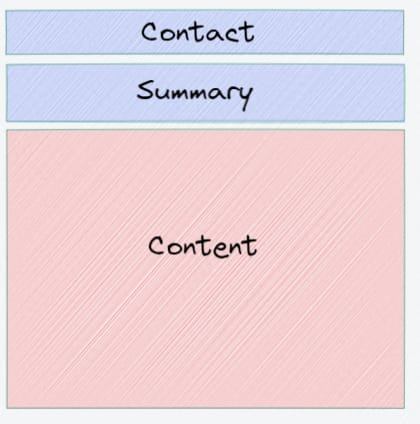
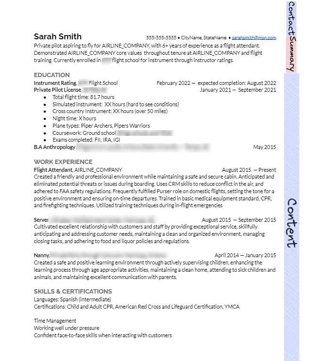
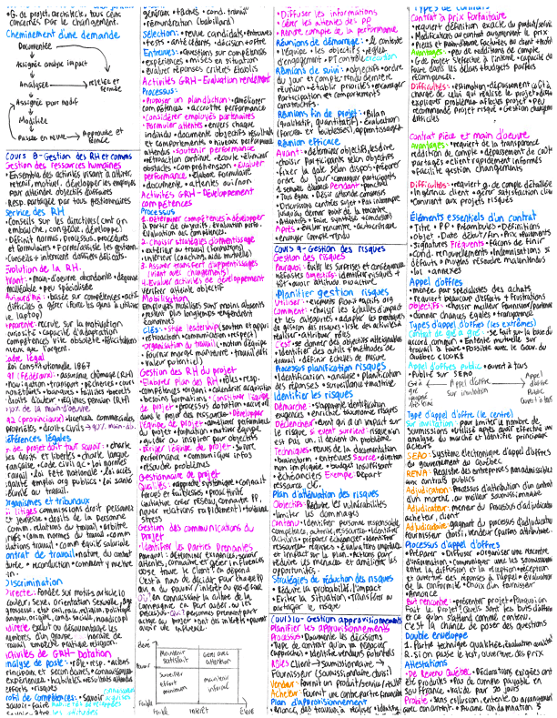

Before I became a software developer, I used to run my family's restaurant equipment business. One of my tasks was hiring employees to do manual intensive labor tasks, like delivery drives, picking goods from the warehouse, and welders for fabricating machinery. Here I've had to read thousands of resumes over the years

I've pivoted since then to a career in software development. I've paid professional resume writers who do resume writing for fortune 500 CTO's for guidance as well, when I made my transition into tech. 

After this process, I've helped mentor about a dozen developers into their first tech jobs, many of whom currently make 6 figures. And aided in a few VC funded startups throughout their tech hiring process as well, such as [ViewStub](https://viewstub.com/)
  
Here's a summation of all the things I've learned when writing a resume:

## Contact information is always up top

Some resume formats might put the information to bottom of the page, the left side, etc. Some might say, "hey I'm going for a unique resume", and while that's fine you don't want to change elements on the page that's considered the norm

There's been a number of studies on how the average person reads a paper. [Neil Patel](https://neilpatel.com/blog/eye-tracking-studies/) writes a great summary here. They hook up eye tracking devices, show the person in question a document, and analyze where their eyes drift too

Everyone always drifts to the top left of the page. It's the anchor, the area that's most predicable. As the content flow goes further to the bottom right, people tend to become less focused and skim more

Another reason you want the contact information at the top is, if a recruiter decides to move forward with you, they know exactly where to find the information to contact you! You want the resume to work for you, not against you.

## Always have a top level summary

This is directly after you write your contact information, address, email, phone number, etc at the top of the page
  
The reason for this is it's hard to control what the content flow looks like below, depending on your current set of experience and where you are trying to go. I'll give an example:

My friend (let's call him John Smith), is a lead professor seeking to transition into tech as a scrum master. His professional experience is almost entirely about leadership and managerial experience, and it occupies close to 50-60% of the page. 

Here's what his resume looks like after we edited it together: 

 
While this is great, he doesn't have any tech domain expertise to show. A scrum master who has tech domain expertise is highly valuable, it means he/she knows how to deliver software products.

John has attended a hackathon before. It might make sense to showcase this at the top of the page, however, this is considered extra curricular activities in tech. He wouldn't put it on the top of the page unless he was a fresh graduate from school. Since a scrum masters main role is communication and organization

So he instead has to put it at the bottom of the page. However, someone reading the resume may not see that tech portion and glaze over it since the leadership content takes up so much space.

By creating a summary section, you give context of what the content of the resume will look like. Here you can highlight the following information, in 2-4 sentences

1. Who am I currently
2. What do I for sure want for a next job, if I wish to indicate
3. My biggest accomplishment to date
4. Specific relevant experience to the job

## There is no one size fits all resume

 
After the contact and summary section, you are in lawless land. But there are a few rules you can follow. The first is this:

1. Are you currently in school or a fresh graduate?

You've probably seen the traditional college graduate resume. Education up top, followed by internships / school projects etc. This is true for computer science students attempting to move into industry

Or maybe the fresh coding bootcamp resume. Where the top of the content is all coding projects, and previous working experience and education is at the bottom of the page

But I'll give you a non traditional example. My friend (let's call her Sarah Smith) is a private pilot seeking to become a commercial pilot. She's currently attending flight school.

Her resume looks like this, after we went through it together:

She worked as a flight attendant at the airline company she's applying for, but this time she's applying to become one of their pilots. 

In this case, her resume takes on 2 seperate formats:

- Fresh college graduate layout
- Professional pilot detail layout

Since her goal is to showcase her potential as a future commercial pilot, she puts her education first. Because the technical requirement of a pilot is being able to fly a plane in different conditions.

She puts her work experience thereafter at the same airline company to showcase her loyalty & drive to apply there. It establishes a motif and story.

Which leads me to the next section...

## A resume should fit the job description

**The whole purpose of a resume is to tell a story and showcase your potential to a company**. I've written an analogy to this with [dating here](https://www.vincentntang.com/applying-to-jobs-is-like-dating/)

My number one rule is to always put yourself in the employers shoes. Why should they hire you, over the hundreds of other candidates out there?

These companies will spend time and effort marketing the job. Crafting the job description and requirements of what they want in a candidate.

Sure sometimes its overly inflated (e.g. wanting 10 years of experience for a software framework that's been around for 5 years). Ignore the quantatitive stats, and look how it's qualitatively written. E.g. what do they want this person to do at the job? 

You want your resume to fit in their story mold. If they mention they're seeking X experience in framework Y, you should do your best to showcase it in side projects or work experience. If you don't have it, don't mention it, or mention transferrable related experience.

At the end of the day, you are trying to answer the company's call of _"can you do this job?"_. Some companies will also provide training as well, but others need someone to deliver on day one. This is something you find out down the road

## A resume is an exam cheatsheet for an interview

When I was in University, we used to have to take exams at the end of the semester. To prove we really understood our stuff before moving onto the next classes above that

Some professors let you write a cheatsheet. It's basically a page of notes you can bring to you on exam day. Here's what a cheatsheet looks like:

A resume won't have _that_ much content on it, but this is an extreme example. 

The analogy I am trying to make is this: **a cheatsheet for an exam is like a resume for an interview.**

It's an agreed upon handshake of what you'll be quizzed on (your history and experiences), and it's your duty to know how to expand upon it.

A good rule of thumb is before you crafted a bulletpoint for that job, you should have written a whole story revolving around it first. This shows you actually know your resume through and through

This is what I usually do when I do resume editing. I will sit down with the person, ask them alot of questions about their past jobs, how they define themselves, their goals, and what their biggest accomplishments are. Then hone their thought processes on paper. 

I will write another post on this another day, e.g. how to do resume editorial writing for resumes and the lessons I learned from professionals in the industry