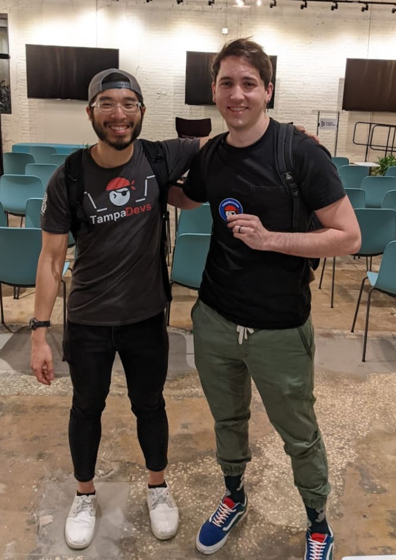
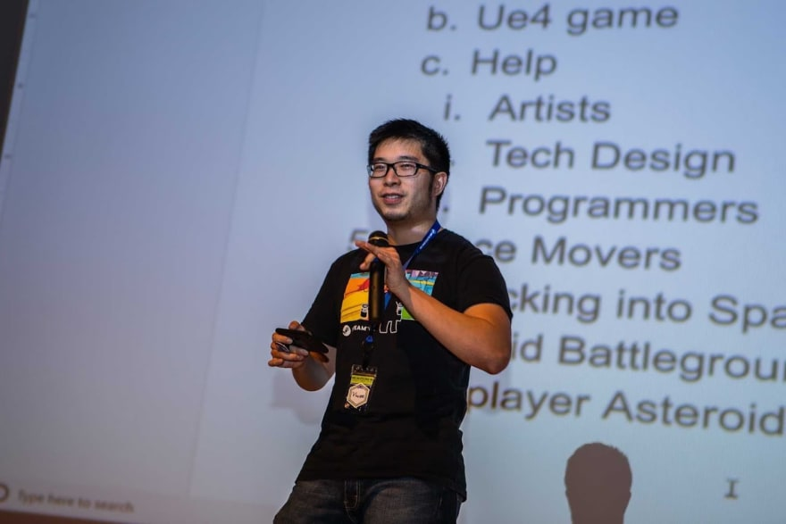
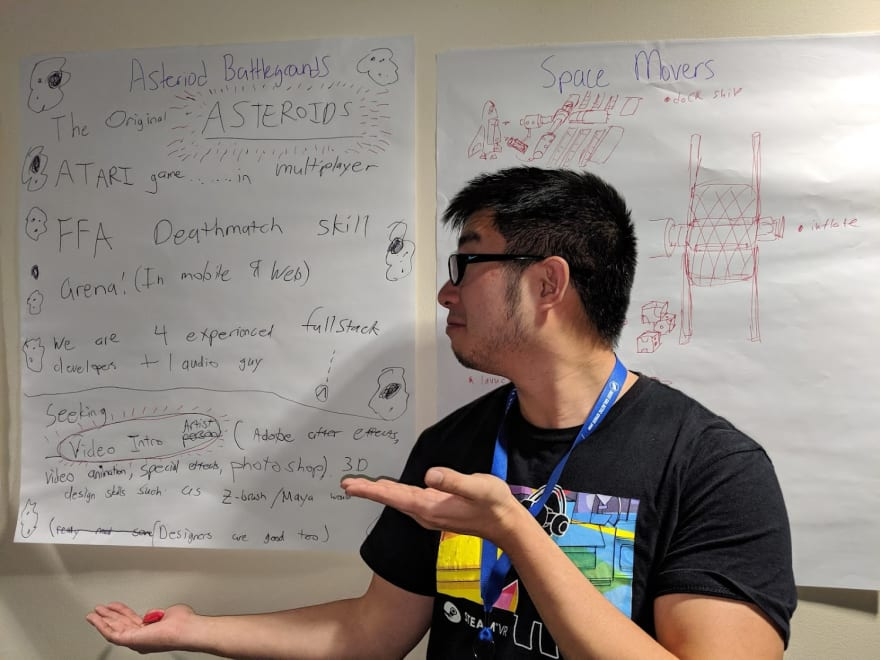
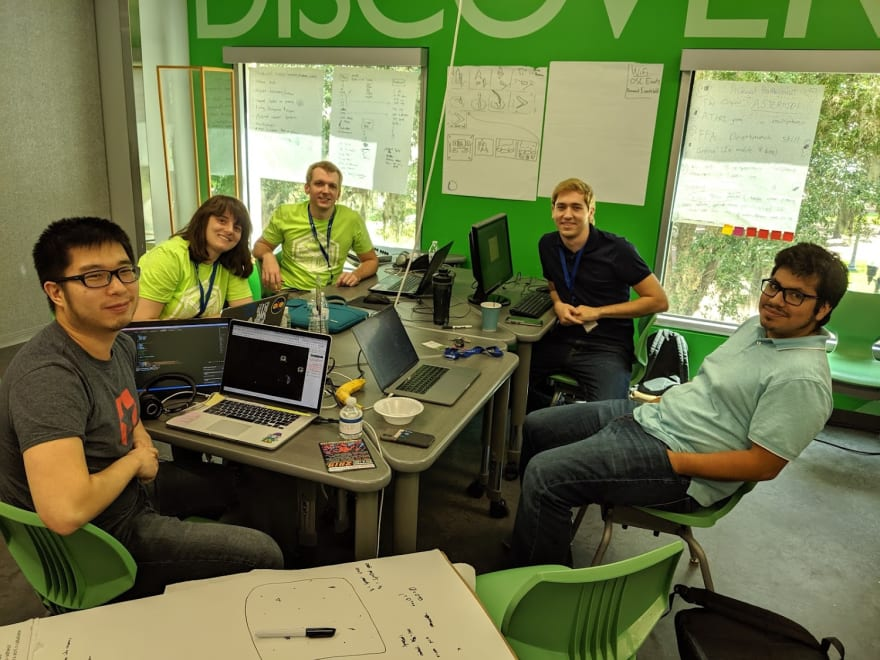
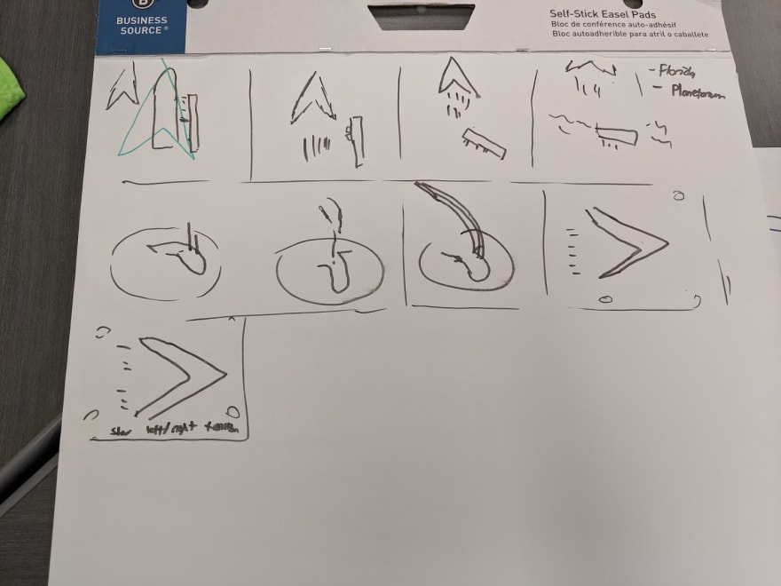
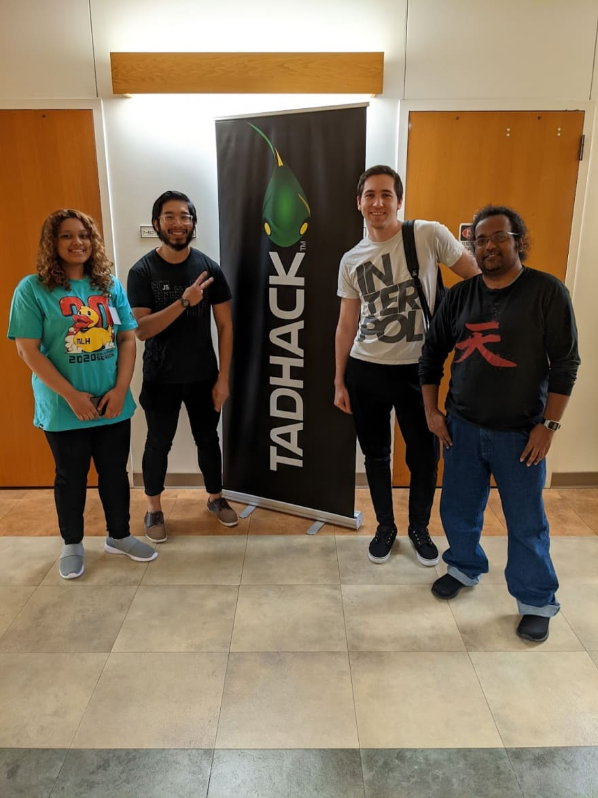
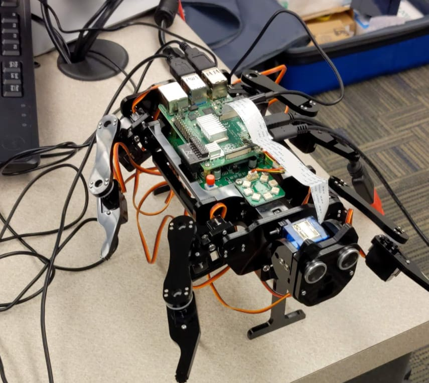
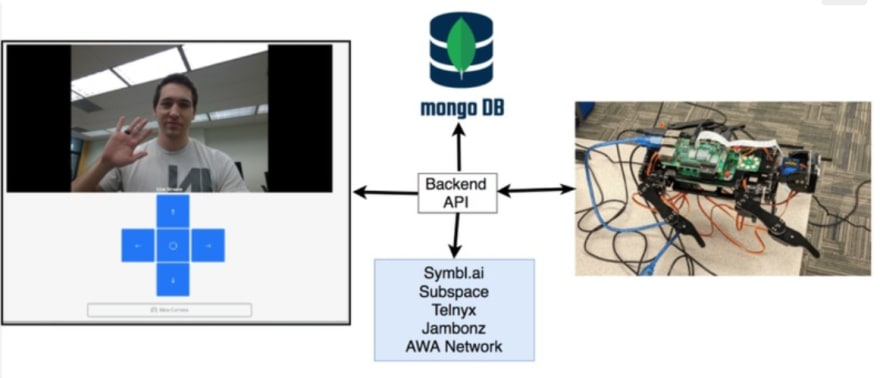
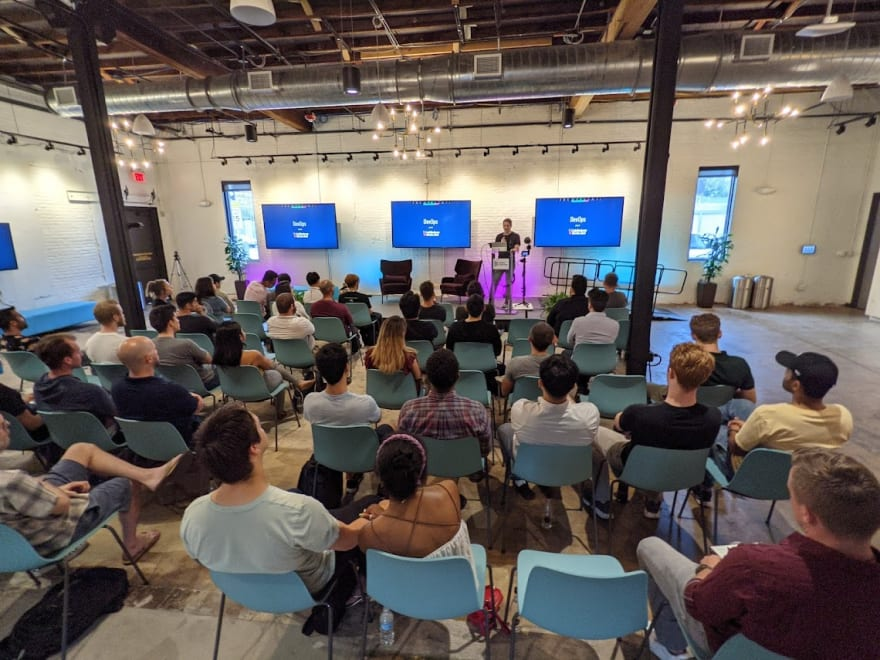

I've had the luxury of watching one of my mentees, go from no coding experience to making his 6 figure job. And presenting his first tech talk at a group I founded, [Tampa Devs](https://tampadevs.com). All in 2 years!

It's made me appreciate how amazing it is to see people grow. I want to sharecase a story of how I've seen my mentee, Doug, progress to where he is today.

Here's how it all happened:

## Prestory

2 years ago, I went to a game dev hackathon called Indie Galactic Space Jam in Orlando. It's a 2 day event where you ship out a video game at the end of it. 

I competed alongside a few of my friends and formed a team to build ASTEROID BATTLEGROUNDS.

What is it you might ask?

Imagine the ATARI classic Asteroids, but with all the fun of battle royale elements from Fornite or PUBG. We had this brilliant concept in mind, and we had the skills capable of building it.

However, we didn't have anyone to design our video game. None of us knew how to use Adobe Photoshop or Adobe Premiere to create the intro to our video game, the spaceships, the ending screen, etc.

We needed to recruit someone with these skills. My teammates made me the designated hype guy, and I pitched the idea center stage in the auditorium

After I pitched and got some hype up, we created an ad-bulletin in the forum area to recruit. We were a small startup video game company looking for a designer

Here's the job ad we used:

We asked about 20-30 people who passed by to join our team. We eventually convinced one person to join, and his name is Doug.

Here's our team pic! (Doug is second to the right)

 
Doug and I went to storyboarding the video game. I've never done video game directing before, but I played enough to have an idea. We decided to use a comic-strip to depict what the intro looked like. Here's what we drafted up:

I didn't know what to expect from Doug. We just met him, but I put him to to the test. He delivered really hard. 

This is the end result turned out for our video game:

<iframe width="700" height="500" src="https://www.youtube.com/embed/9w1LlqoFbNI" title="YouTube video player" frameborder="0" allow="accelerometer; autoplay; clipboard-write; encrypted-media; gyroscope; picture-in-picture" allowfullscreen></iframe>

Doug designed a custom sprite image intro, animations, sprites for our spaceship, and an ending screen all in 2 days

We didn't win the competition, but we ended up producing a really amazing game. Infact it's still deployed here, but only the intro works currently: 

[https://asteroid-battlegrounds.firebaseapp.com/](https://asteroid-battlegrounds.firebaseapp.com/)

You can read more about the project from Doug's blog [here](https://codabool.com/blog/6) and the [devpost](https://devpost.com/software/asteroid-battlegrounds)

## 2 years later

2 years later, Doug and I reconnected again in person. We chatted for a bit here and there about hackathons, and webdevelopment, but he was busy starting his career and I moved to Tampa.

There was a hackathon I wanted to go to and invited Doug to join. [TADHacks Global](https://tadhack.com/) in Orlando.

This was actually our 2nd event for TampaDevs as well! I brought together a group of friends from Tampa to join in this event.

Here's our team: 

Our team created a robot called RescueR. We used an off the shelf raspberry pi robot dog kit and threw in a video camera feed with controls.

<!-- Here's what the robot dog looked like, for reference:

 -->

One thing we needed for this robot was a frontend interface for the camera. I didn't actually know what Doug's frontend experience was like as a React developer, but I gave him the task of building the UI. We needed to build a website that could handle the camera feed and controls sent to the robot.

Here you can see the entire app as a whole

Doug wrote the WebRTC interfaces. I was quite surprised to see how well everything worked, I only provided minimal UI input designs here and there.

We ended up winning top prize for $4.4k at the event! You can read more about it [here](https://devpost.com/software/rescuer-kend9w)

## Company referral

A few months later Doug was in the market for a new job. I asked for his resume, and I was quite surprised that all of his experience was DevOps related. I wrote a referral for our company, and he got hired into his first 6 figure job!

## Presentation

I needed a speaker for one of our Tampa Devs events. Doug commited, and we actually had the highest turnout (81 people!) at [our event](https://www.meetup.com/TampaDevs/events/283612753/). Here's photos of the presentation:

## Summary

It's been really cool to see Doug grow from where he was 2 years ago, to where he is today.

I didn't really provide all that much mentorship really. Doug's a self-starter that needs minimal input, but I am happy to know that I helped accelerate his career to where he is today!

Sometimes I wonder how things would be different had I not met Doug. Maybe he picked a different gaming team to compete in the hackathon, and our paths never crossed. 

He wouldn't have come to do this devops talk, which may have inspired someone else to pursue a career in development years later.

It all boils back to the [Butterfly Effect](https://en.wikipedia.org/wiki/Butterfly_effect). Small changes can result in large differences, at a later point in time.

This is why I love mentoring and community building. You plant a seed, and sometimes it flourishes to a beautiful tree beyond your expectations.

 

 

