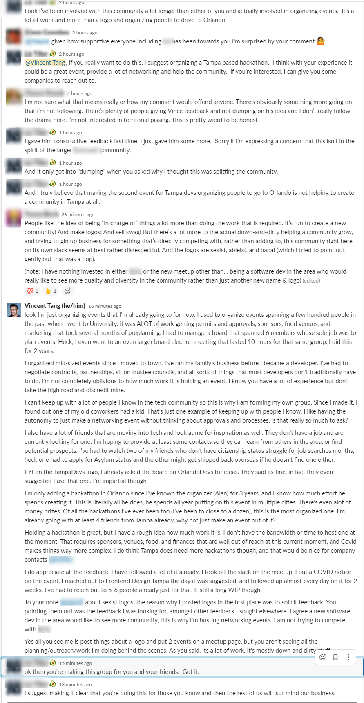
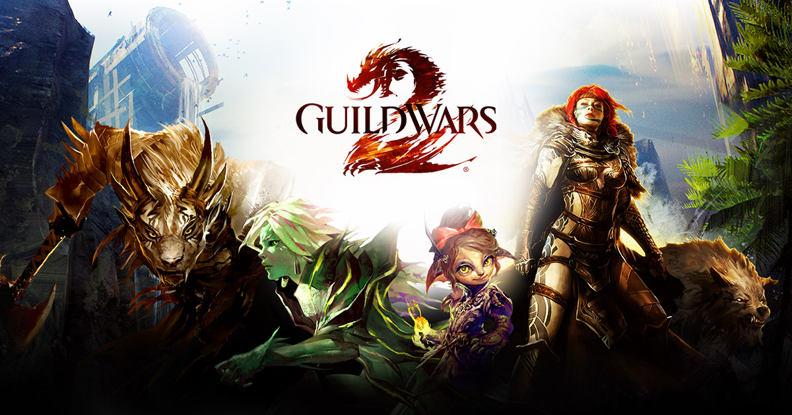
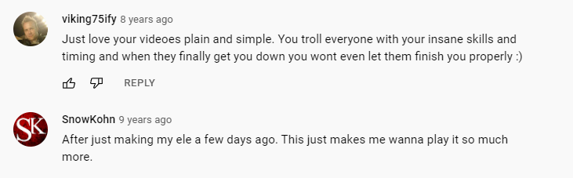
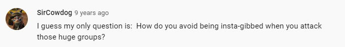
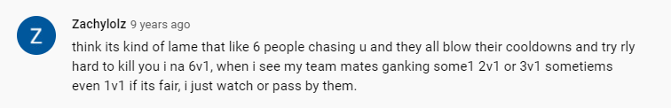
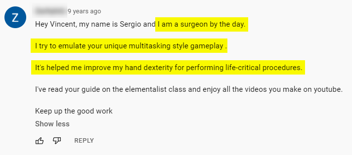

When I first started [Tampa Devs](https://www.vincentntang.com/why-i-started-tampa-devs/), I told friends, family, colleagues about the community I was building.

My closest friends gave support and love all around. Friends that weren't familiar with the idea still expressed support but were indifferent about it. 

And then there were the ones that just wanted me to fail, telling me the idea was dumb and it should just burn to the ground.

Those negative opinions struck me hard. I almost didn't start Tampa Devs because of it. Here is that conversation thread that I lost sleep over:

To give a high level summary of what went on:

- I started Tampa Devs
- I wanted to collaborate with another local software community
- I asked for feedback on logos I made
- They told me I was selfish for trying to split a community, and creating something for self-gain
- I gave my reasons on why I started it, and what it meant to me
- I was constantly belittled by 2 people

It didn't occur to me until later that I wanted to start a community to avoid people like this. I didn't experience anything like this in [Orlando Devs](https://orlandodevs), everyone had been so supportive in my career to help me where I am today

These comments didn't stop me from building Tampa Devs. I learned a hard earned lesson 10 years ago, that I applied here to give me the resolve to move forward. I call it the 33% rule:

**For X number of people that hold an opinion on you, 33% will support you, 33% don't care, and 33% will dislike you. 1% of the opinions may change you**

I will get into the 1% bit later. For the other values, the concept is there will always be people that support you, don't care, or hate you. It doesn't matter who you are. You never can win everyone's opinion. 

You could be the nicest person ever. Some people will dislike you for that reason alone. You can be an asshat, and people love you. What matters is **you stay true to yourself** and weigh on the opinions that you do care most about

## The backstory behind this lesson

This was a hard earned lesson I learned back in University back in 2012

I was in senior year to a degree I didn't care about (Material Science Engineering). That year, I lost an internship due to legal complications, got fired as an resident assistant, and had a horrible case of senioritis. I hated where my career was going, and I pursued passions elsewhere.

I have always had a love for video games. This video game called [Guild Wars 2](https://www.guildwars2.com/en/) came out around then. I have always had this passion for teaching, so I started a youtube channel.

Before I knew it, I became one of the most famous players in the game. I had 5000 subscribers at one point, and random people would recognize me in game. I wrote a video game guide that was translated in multiple languages by fans and read by several hundred thousands of users. If your curious, you can check out the [youtube here](https://www.youtube.com/user/daphoenix555) and the guide [here](https://forum-en.gw2archive.eu/forum/professions/elementalist/Guide-Mastering-the-D-D-ele-7-15-13/page/20)

I took the most underrated class in the game and showcased how powerful it was. If this class had a godfather, I was definitely it. 

I had die hard fans that took everything I said as if it were the gospel. Fame got in my head, and I became a wee bit narcisstic around that time. Sometimes I'd state things as truth when I myself wasn't even sure if it was correct. 

When I posted a video, I would get these lovely comments that made me feel great about myself:

Sometimes I'd get comments that were questions

I would say the vast majority of comments I got were supportive. But sometimes they were constructive criticism too or negative

But again alot of these comments didn't matter in the long run. It was the same comments over and over again. It made me feel good but I also didn't really feel like I deserved the praise

All that mattered I was doing something I enjoyed.

It wasn't until I was about to graduate in 2013 that things changed. Around this time I started to stop playing as frequently, but still uploading content once a week.

I'd still get comments every so often. One comment shaped who I am today. **This is the 1% of opinions I am talking about, if you throw enough feelers out there someone will really connect to you**

Youtube deleted the comment since then, but this is how it went

    
I was confused. Then I broke down crying. I was going to graduate as a failure with no career prospects and have to deal with the social rejection of my parents and classmates. I realized that I was creating videos to escape reality. 

It wasn't until that comment that made me appreciate the small things in life. **Who would've thought video games could be used for surgical training?**

When things in life turned to shit, I remembered that comment. When people didn't understand the value of an idea I presented, I remembered that comment. When my parents didn't support my pursuit in software development, I remembered that comment.

I never stopped remembering it. It's made me see the flip side of things everywhere in my life. 

**[Tampa Devs](https://tampadevs.com) has become more than just a community I created.** I've met some of my closest friends through here, and built some of the most meaningful experiences in my life. 

I've used it as an excuse to become a better leader, design my own clothes, and learn growth-hacking amongst so many other things. Like the surgeon before me, I am the one who is learning now.

Life sometimes gives you unexpected blessings, and you just roll with it.