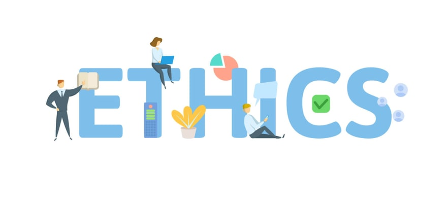
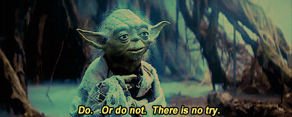

 

Back in University while studying chemical engineering, I took an ethics class. We talked about the moral principles of keeping clients and society at mind first, before money. There was one specific example that came to mind:

Cars are not 100% safe. There is an allowed tolerance of how many deaths can happen per number of vehicles sold. I never really cared about these statistics. That is, until my uncle almost died in a car accident when a gas pedal couldn't be released due to [faulty engineering](https://usautolaw.com/lawsuits/lawsuit-alleges-defective-electronic-throttle-control-and-accelerator-pedal-position-sensors-in-certain-gm-models/).

I had to deal with an ethical issue like this when I started [Tampa Devs](https://tampadevs.com), minus the dying part.

When I first started hosting events, I needed sponsors. Sponsors to help pay for food for networking events, venues for talks, amongst many other things. 

 

## Our first sponsor

One such sponsor rallied to my call. I had given a tech talk to a frontend design group in town, and they had recently taken control over it. That's how we got in touch

Before I knew it, I got invited to the most expensive restaurant in town. We're talking $300 a dinner for a party of 2, and that's the cheap end. I met my sponsor and his co-sponsor in person. Let's call them David and James for anonymity sake

I found out David and James were on the [w3](https://www.w3.org/) board and had massive influence around the world. In fact, David was one of the co-creators of the internet. I was talking to a celebrity!

David asked me to introduce myself. I told him I'm not your standard web developer. I told him I was a business guy first, an engineer second, and a web developer last. And that I rarely call myself a programmer.

David was exactly the same way. So we clicked in that mindset

David then shows me how much money he made daily in his bank account. Some days it was $5,000, other days it was $30,000. He talked about parties akin to the [Great Gatsby](https://en.wikipedia.org/wiki/The_Great_Gatsby), billionaires he's met in his lifetime, and stories you could only imagine.

I mean, this dude hired Tony Hawk and other pro skaters for at least $50,000 each just to make a potential investor happy at his home-grown skate park. Here I am scrouging for free food because I'm cheap.

## The Ethical Dilemma

David starts getting down to business. One lesson I've learned through reading ["The 7 habits of effective people"](https://www.franklincovey.com/the-7-habits/) is to think win-win. David wants to push a new W3 spec on the web, and it's a new proprietary media format that can control how many times a video can be played. 

Think NFT videos/images, but it's owned by megacorps, and the rights to view them are paywalled. Imagine a world in which you can only play 5 youtube videos a day at most before you need to pay an additional $X money to watch 20 more videos.

They had all the legal means to push this w3 spec on the web, the investors and large corporations ready to give the greenlight too. This might one day actually happen a decade or so from now, and it'll be a scary future for the free web.

That's what they propositioned. They needed frontend developers specifically, to help spearhead a community initiative for this. And what they propositioned was this: "Vincent, we'll give you money but in exchange you help promote our product with your community"

## Making a Decision

I was so torn with this interaction. On one end, I needed sponsors to help build a community. On the other end, I was potentially throwing away my moral fiber ethics for a cause I politically didn't support.

I ended up speaking to a few friends about this. We created a pros/cons list. At the end of the day, it didn't hurt to promote their agenda a little bit, since I didn't even have a big community yet with any sustainable impact.

We hosted one event through them. He didn't even look at the $800 bill dinner we spent for 30 some attendees. It was chump change to him. 

I decided to not move forward with this sponsor long term. We didn't share the same alignment of goals. I didn't feel comfortable hosting events at venues he controlled, when I had so many other and free options available.

## Moving to greener pastures

Eventually we found our first solid sponsor, [Relia Quest](https://reliaquest.com). I met through just cold messaging on linkedin, and we met through a zoom call. They've been absolutely phenomenal! We've hosted 3-4 events, and they are sponsoring an all paid for bowling event for up to 100 people next month.

Now I'm learning how to host a hackathon for [TADHacks](https://tadhack.com/2022/) through one of my good hackathon organizing friends. It had a prize pool of $20k, but I still need a venue to support it.

I reached out to Relia Quest but I need to provide an [Event Prospectus](https://www.socialtables.com/blog/event-planning/sponsor-prospectus/), something I've never even heard of.

I am learning so much and have so many more crazy stories to tell