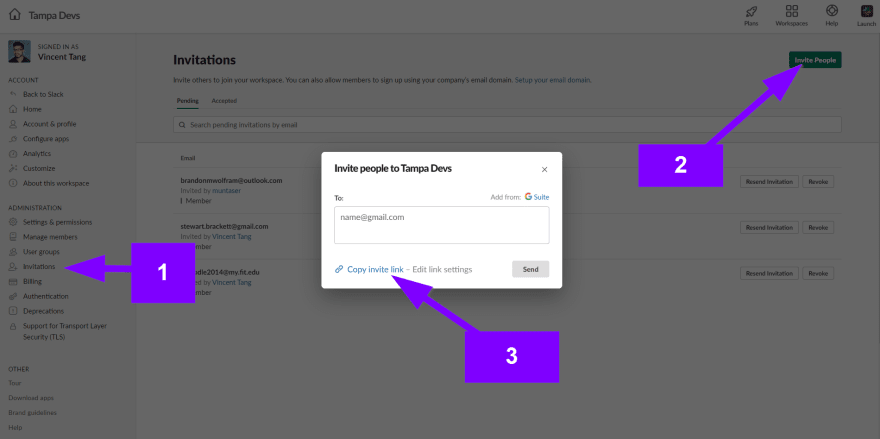
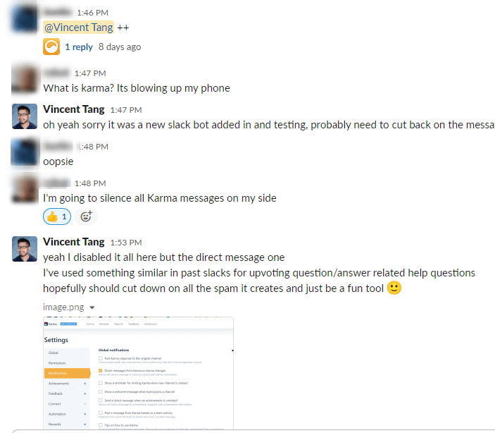
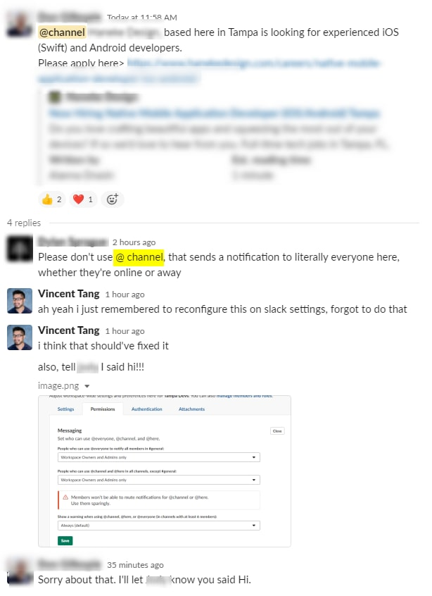
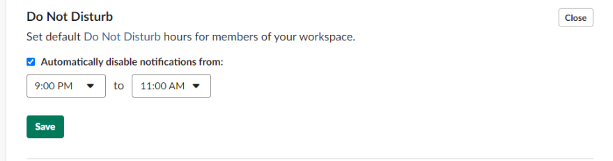
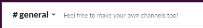
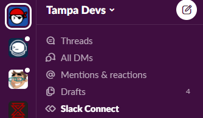
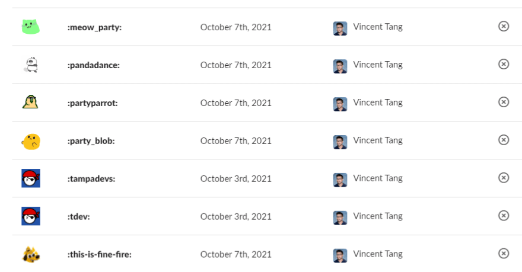
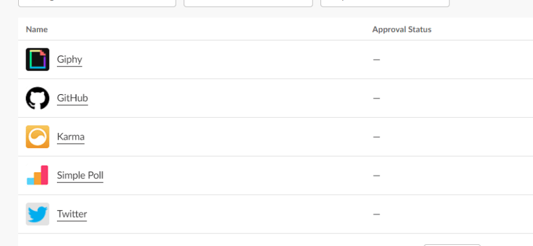

Since starting [Tampa Devs](https://tampadevs.com), I needed to build a slack community. 

I would always get asked questions like "Hey do you know of any companies hiring?". And then I'd get asked questions like "Do you know of anyone looking for a job?"

It feels like a chicken egg problem. I didn't have anywhere to send people, handle internal logistics for tampa devs, or post photos / updates of our current events.

So we made a slack. I've learned some lessons along the way since then:

1. Invite links to the slack and the URL are different
2. Make attempts to reduce spam
3. Make slack fun

## Invite links to the slack and the URL are different

This one was a huge gotcha for me for the longest time. Our slack is located at [tampa-devs.slack.com](https://tampa-devs.slack.com), but this isn't the actual link to join it. This is if you already have an account created through slack here.

Instead, you have to generate a link that anyone can use to join. There are permissions to set to prevent spam users from joining (e.g. an admin needs to approve a request to join), but our slack is not big enough to need this yet.

Here's where to grab that link:

You'll want to add this link to your public website so anyone can quickly find it. Here's the [link](https://join.slack.com/t/tampa-devs/shared_invite/zt-veftezkg-kq~jFtC1FCz4o6suybMl5Q) we use for joining tampa devs slack
 
## Make attempts to reduce spam

### Plugin spam

Nothing turns off a community faster than getting spammed through it. It's usually not intentional; just recently we had a user that was super gung ho about adding new channels, emojis, and integration bots.

We call those power users or net promoters. They are super important for growing a community, but also should be monitored too to help improve community processes.

Here's an event log that caused alot of spam to all of our members

 
A lot of integration bots by default are on "FULL SPAM MODE" just so you can test out it's feature sets. Make sure to reduce and cull back only the feature sets you think are important

### (at) here, (at) channel, (at) everyone spam 

So this happened today. Someone used (at) channel and spammed everyone on our job-listings channel. There is a warning that pops up beforehand, but not everyone is super familiar with general slack etiquette:

**One lesson I've learned over the years is it's generally never the users fault, it's usually the fault of the process**. I made some tweaks and permissions to what a default user can, and cannot do.

In this case, restrict the ability to use the (at)here,channel,everyone command on all channels

### Announcement pings everyone in slack

I was talking to one of my best buddies over the phone, and he suggested I make it known that we have a github repo. I posted in the #announcements chat on this, and next thing I know I hear a loud slack notification sound on his end.

Announcements is a special channel that automatically does a (at) everyone command, so use it sparingly. I reserve it for partnership announcements, long term pipeline plans, etc

### If you need to spam, do it all in one shot during the day

If you absolutely have to spam a bunch of users, just do it all in one shot during the day. The analogy is this - if you have to state bad news to someone, don't do it over an incremental period of time. Just do it, get it over with, and move onto more fun things :)

### Set snooze hours to reduce spam

This isn't a work based slack, so set a reasonable duration of when a user might get a notification.

Not everyone has the same notifications setup through slack. Normally you have to manually set this as a user, to control what notifications you get. IIRC if you download the phone client, it pings you on notifications on every slack channel by default. 

So to combat this, add a snooze hour duration that seems reasonable for all users. This includes weekends too. Our latest events end before 9 pm generally, and people go to sleep as early as 10 pm sometimes. Keep that in mind. Some members wake up late (like me!), so a time of 11 am should be good

## Make slack fun

### Encourage others to make channels

You'll want to encourage others to make channels. There really isn't a hard rule to this, but inside general I created a description to let members know they can do so:

We've created #setups for battlestation pictures, and #dance for dancing events local to the area. These are member based contributions 

### Figure out your default channels

While the above is for encouraging others to create channels, you'll want to set some default channels. Don't go overboard on this. The beauty here is you want community members to create their own channels, so if you do this from the get-go, you're shooting yourself in the foot. This goes back into the [retaining talent by creating ownership](https://www.vincentntang.com/retaining-talent-by-creating-ownership/) post, but more so on the ownership part

What you want to do is just create the bare minimal number of channels. Here's what we planned for chanels:

- **Job-Listings:** Recruiters post job listings, and software devs post resumes
- **Intros:** new members introduce themselves here
- **Announcements:** PSA announcements
- **Gaming:** Gaming related content
- **Meetups:** - Meetup type events
- **Dance:** - We started as a group of dancing friends so this is part of our culture
- **Pets** - Pets channel
- **Javascript** - Coding related questions / help
- **Software-development** - Blogging related content

We kept it pretty simple and straight forward. You'll want to add a few hobby based channels, alongside tech related / logistics channels to make it more fun

A good idea is to also check out other city community slacks around the country (and around the world too!), for inspiration and ideas. Here's a great list for that from [ladyleet](https://github.com/thisdot/tech-community-slacks). My favorite slacks are Denver Devs and Orlando Devs

### Add your logo to the workspace:

You'll want the logo to be easily identifiable in the dekstop, web and mobile clients.

Here's what we have for tampa devs:

### Upload custom emojis

Upload custom emojis. I always port over the :pandadance: at every company I work at, it's my own version of partyparrot of partyblob

You'll also want to incorporate the logo somewhere too as an emoji

 

### Add essential plugins

Essential plugins are things like giphy for memes, twitter for news around the web, etc.

This is what we currently use, and it's bound to expand down the road:

 

## Summary

This just scratches the surface of community moderation on slack.
 
If you'd like to learn what scaling a 3000+ member slack looks like, I did a podcast episode with one of my besties featuring Jacques Fu and Brian Rinaldi, the organizers of [Orlando Devs](https://orlandodevs.com). 

Check it out [here](https://www.codechefs.dev/building-a-software-developer-community) on Code Chefs.