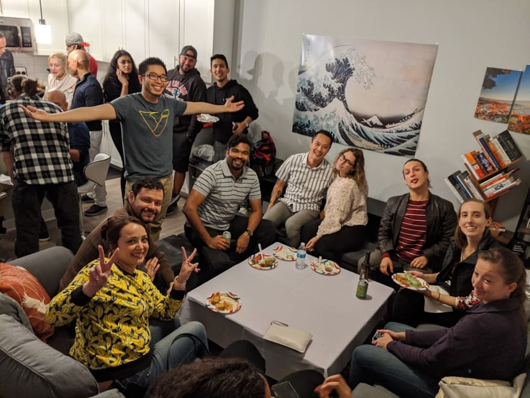
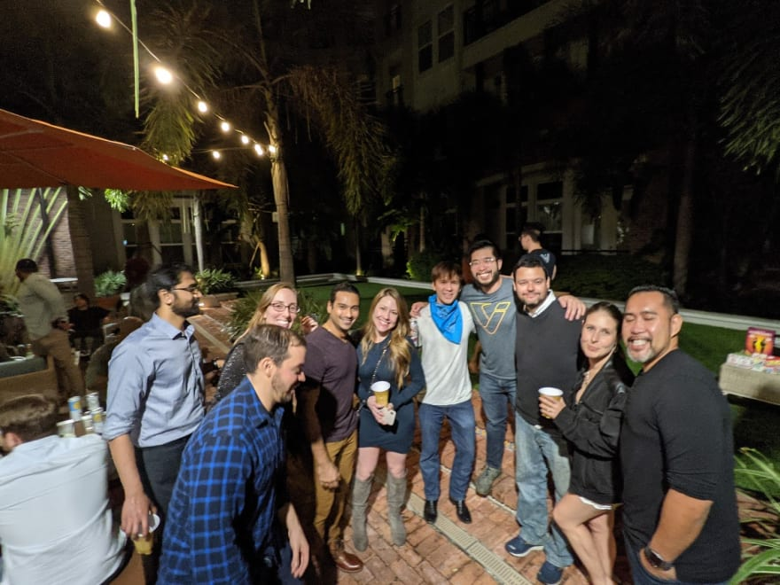
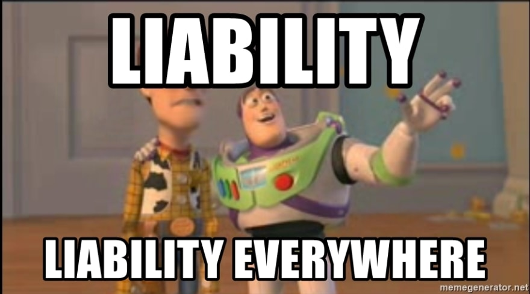
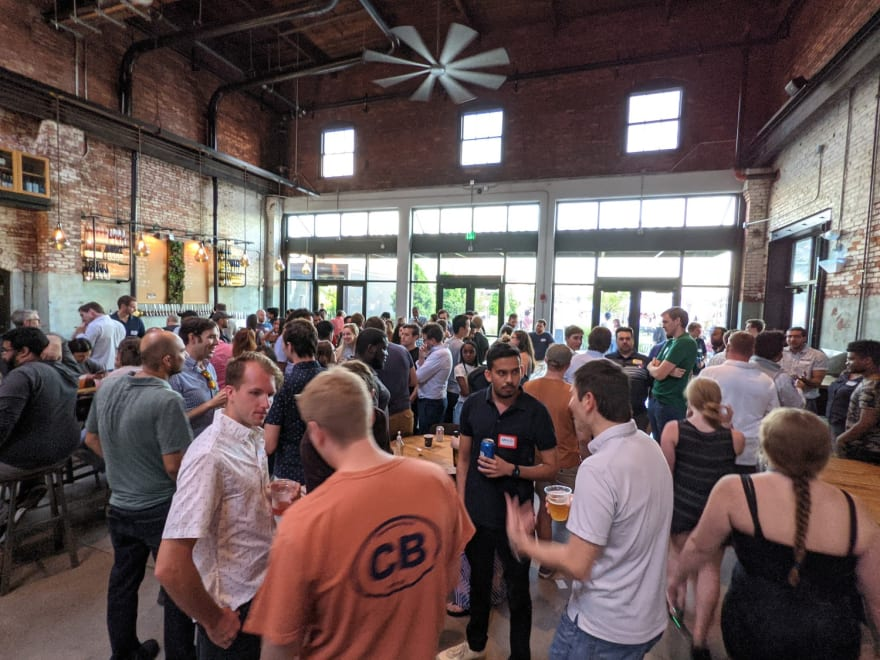

When I moved to Tampa, I threw my first house warming party. We had 30 people in my tiny 550 sq foot apartment, and it was so loud that everyone resorted to yelling at each other to be heard

 
Since then, I've had to host parties at larger venues, sometimes spanning up to a 100 people. This was before [Tampa Devs](https://tampadevs.com) started.

Through these experiences, I've learned a golden rule when it comes to event hosting:

**Do not always ask for permission to host**

Here's the story behind it:

## The backstory behind lesson

Covid in 2020 made event planning complicated. I ended up planning to host a new years party the following year.

I expected somewhere around 50 people to attend. With catering from my favorite restaurant in town, friends to help promote the event, and fun games to help break the ice. 

We were going to host at my apartment's club room. I've spoken to the apt manager a few times about it, and they gave the green light. For parking logistics, the venue itself, how cleanup was going to be handled, social distancing, etc

On the day of the event, I carted over the supplies to the clubroom. I scanned my keyfob on the clubroom, and it didn't unlock.

Our complex locked the clubroom to all residents that day. The weekends before, it was accessible to everyone.

My gut suspicion is they locked it because of the event I was hosting there that day. And I confirmed that they did, days later

We ended up hosting in a nearby courtyard instead, and it still worked out 

 
## Logic behind the venue's decision

I used to do property management before I became a software developer. Ergo, the right hand to the landlord.

Pre-knowledge of an event is dangerous to a property. There is so much liability involved here, in the event something bad happens at the venue.

For instance, what if someone gets injured at the event? Or god forbid, what if someone dies at the event?

When I was a resident assistant at University, one of my co-worker's residents died. When I became a property manager, I've had to deal with 2 seperate death incidents.

For the last event, we rented out our parking lot for the night club across the street. To use as overflow parking for their event. We had agreed upon financial/legal terms with the guidance of a lawyer.

 
The victim ended up leaving our parking lot intoxicated and getting into a fatal car crash several miles away.

You would think this has nothing to do with the property at this point. The accident happened elsewhere.

**However in the legal world, if you are remotely liable for anything, expect to be sued.** So we got sued. They ended up winning

They argued that there should've been more security stop this from happening. We just installed new security cameras and flood lights across the lot that I myself had to help setup.

What I've learned was this: **you can never have enough safe measures in the eyes of a legal case**. If you have 100 security officers on premise, and something bad happens, the argument now becomes you should have had 101 security officers.

**So the less a venue knows, the less liable they are of the event.** They can't be blamed of things they were not aware of. On the flip end, if they know of the event ahead of time, there is more liability on their end for not adding precautions in

## Tampa Devs Events:

Hosting anything has an intrinsic legal risk. We don't host events that carry inherently high risk like hiking, where people have died in a [meetup](https://www.discussmeetup.com/forum/general-questions-how-tos-tips-tricks/death-during-a-meetup/).

_our latest networking event_ 

That being said, we hosted a meet & greet event recently at large public marketplace. We had a turnout of about 100 - 200 people, the largest ever. We didn't inform the venue beforehand, and needless to say security was annoyed. I would be too in their shoes.

Had we asked for the venue for permission first, this is what normally transpires:

1. Hey we want to host an event
2. Great. How many people and what for?
3. 100-200 people
4. We have a designated spot for this that we normally use for weddings, its $X per person though to attend
5. Okay let me offset this costs with my nonexistent budget and pass on this costs to attendees... (who will never pay for it and therefore not attend)

While I do feel terrible for not asking for permission, we're still helping the venue profit from attendees. For beer and food at their restaurant tenants.

That being said, we DO ask for permission to host tech speaking / learning events. This is in partnership with software companies in town, where we foster stronger relationships.

When you host events, consider not always asking for permission. It depends on the situation. Preknowledge carries liability.

