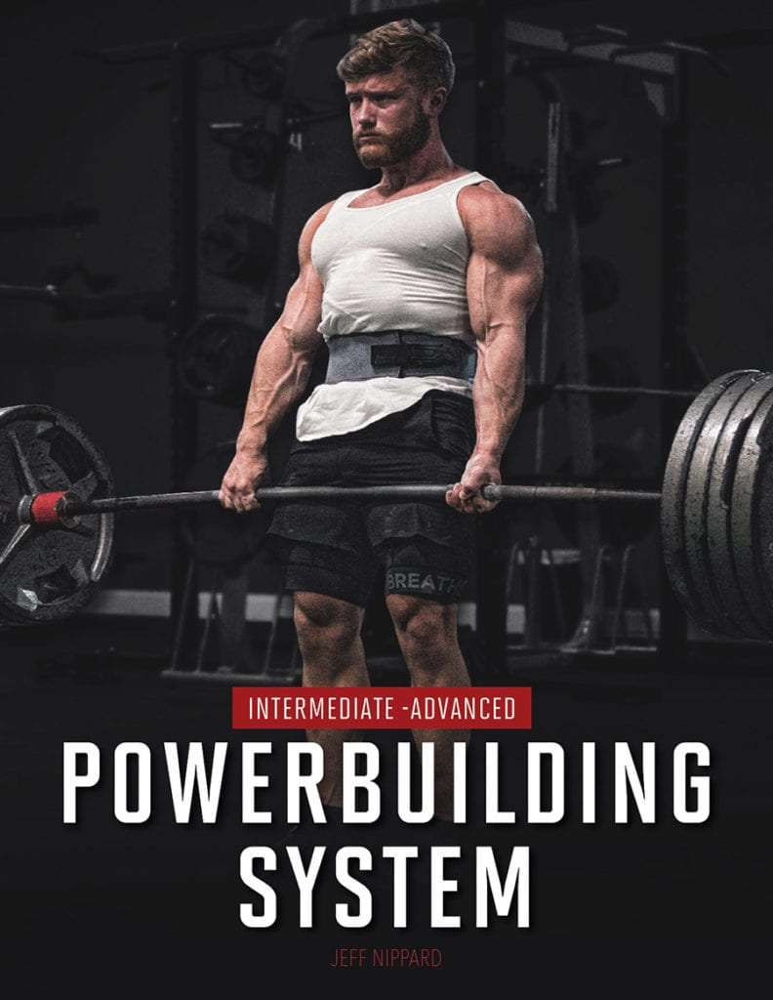
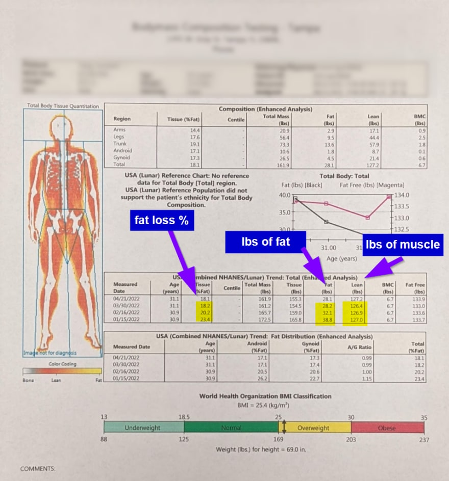
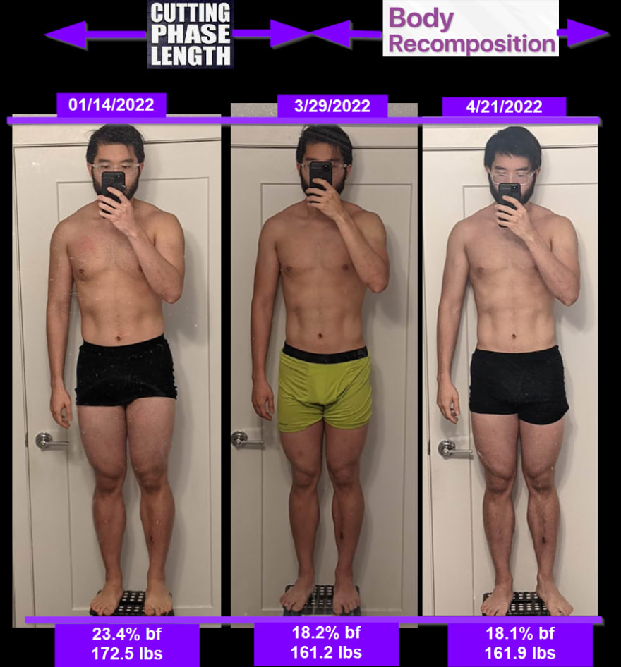
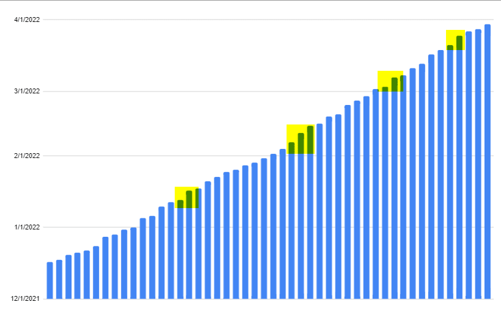
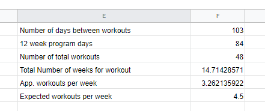
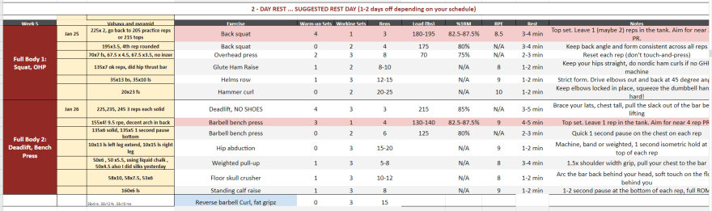
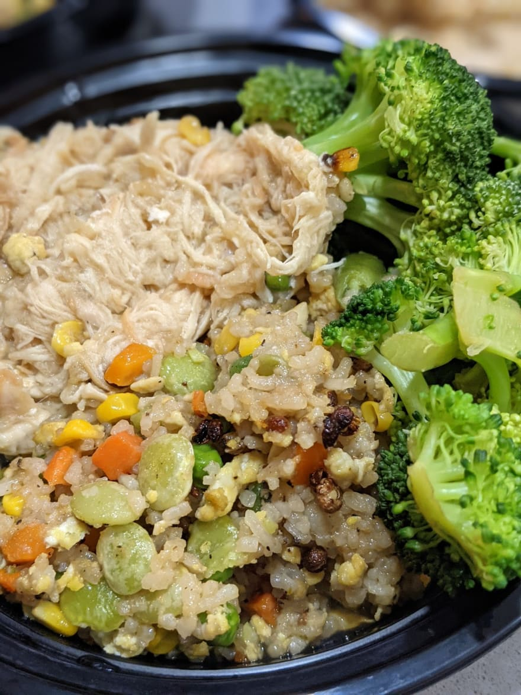

Here's my review on [Jeff Nippards Powerbuilding Phase 1 review](https://shop.jeffnippard.com/product/the-powerbuilding-system/)

I started this program in December of 2021, and ended it at the end of March 2022. I did this entirely on a cut.

Jeff's powerbuilding phase 1 has a 50/50 concentration on hypertrophy and strength training. I did the 4x/week program and saw really good results. Before I was running the reddit's metadallica PPLPPL program, and didn't seem to get to where I wanted

Here's the results I made following this Jeff's program:

Overall stats:
- Lost 5% body fat in 3 months
- Lost 11 lbs, 95% of it being fat

For one max lifts:
- Squat: 220 => 255
- Bench: 158 => 185
- Deadlift: 250 => 295
- OHP: 90 => 95

Here's my dexa scan results:

Before/After pictures of the the entire phase. I ran a 3 week recomposition phase as well after the cut, using parts of phase 2 in the program:

 
I have 5% less body fat, but it's not really that obvious even comparing the pictures.

Days I went to the gym, and periods of longer rest durations highlighted in yellow (4 deload periods)

Additional Stats:

The gym routine I used here said to go 4 or 5 days a week at the gym (~4.5), but I only went 3.2 days at the gym, or about ~1.3 days less per week. Sometimes I had off weeks where I wasn't feeling well, sick, or too exhausted from other physical activities and/or lack of sleep. 

The program was supposed to be 12 weeks long, but it took me closer to 15 weeks to finish.

I'm using this data to calibrate phase 2 which focuses on hypertrophy. Given the data here and the rest periods I have used, an extra 1-1.5 recovery day per week works well for me for phase 2

## Pros of phase 1

I think Jeff Nippards phase 1 is super solid. It focuses alot on lower body work, and overall strength, hence why I did it entirely on a cut with a brief recomposition phase.

Jeff Nippards program includes a spreadsheet to track how every workout goes. 

It's the most indepth spreadsheet I've seen so far. I've looked at [Wendler's 5/3/1 program](https://www.lift.net/workout-routines/wendler-5-3-1/) and many more, and I used to use [Reddit's Metadallic PPLPPL program](https://www.reddit.com/r/Fitness/comments/37ylk5/a_linear_progression_based_ppl_program_for/?utm_source=reddit&utm_medium=usertext&utm_name=Fitness&utm_content=t3_7volnx). What I like about this program is it incorporates 1 week of full body exercises, and the week after is a upper/lower body split. It adds enough variation to keep things interesting.

I had originally used to track down workout plans by something like this:

- Monday is push day
- Wednesday is pull day
- Friday is leg day

or something along those lines, assigning a type of workout to a day of the week. However, there were days I was sick Monday, and everything was thrown off track. Using Jeff's program is a bit more reliable, since I just go to the next workout and ignore what day of the week it is. Which works great if I go on vacation, or get overly fatigued, etc

I've modified the spreadsheet to include the day I worked out, and notes on every set I did. I linked this on gdrive and input the data during the workout. Here's a snapshot of what a week of that data looks like:

What I also really like about this program is this. It tells you

- How many warmup sets to do
- How to warm up for the entire exercise for that day
- RPE's, or the amount of effort to do for the workout
- Notes on each exercise and what to focus on
- When to focus on max lifts. It's only every so often, so periodization is built in
- When to deload
- An accompanying spreadsheet with youtube links on how to do every workout

## Cons of phase 1

This program isn't perfect by any means. Workouts tend to be kind of long at maybe 2 hours at a time too, because of long rest periods are. I usually do all the warmup sets at a given time to save time.

Also there were some lacking exercises in his phase 1 program I noticed

- Very little lower back work / technique
- Not a lot of individual glute work

It concentrates alot of lower body work, which is important for the 3 big lifts. However I wanted to do more upperbody training, which I felt was a little lacking

I'm going through phase 2 right now (6x per week), and here's some of my thoughts so far:

Cons:
- It lacks lower ab work
- More forearm accessory work can be added in
- Lower body hypertrophy tends to be really exhausting

Pros:
- Technique is way more focused and honed in. Pin squats and single glute ham raises, and prisoner back extensions were sorely missed in Phase 1

## Caloric dieting:

I'm adding some notes about caloric dieting in here, even though it's not directly tied to the review of the program.

I went on a cut during phase 1 of the program. I mostly shot for around 2000-2200 calories per day. This was done mostly on 1 protein smoothie (500 cal), 2 meal prep bowls (500 cals each), and a microwave food thing (250cal) every day with a RxBar (200cal). Going on a cut sucked because I had to have a really high protein diet and there wasn't alot of wiggle room.

Around March 29 to April 21, or 3 weeks of duration, I went on a body recomposition phase at the start of phase 2. I changed the caloric to maintenance of about 2500 calories. I still undershot a bit, my caloric burn rate on a normal day is probably closer to 2600 calories if I go to the gym, etc.

I'm currently on a bulk. I'm aiming for 2800-3000 calories a day.

## Summary of what's working

Here's what's working for me, and all the take aways I got from doing these analysis:

Cut
- Eat more veggies. 
- Eat an RxBar right before a workout.
- Eat a 250 calorie meal before about half an hour before a workout
- Workout later in the day
- Fast during the morning
- Take extra rest recovery days. Cut means slower recovery time
- Hit high strength lift values at low reps. This keeps muscle

Recomposition phase:
- It's not super effective
- Do this for about 1 - 3 weeks between a cut and bulk, to slowly transition dietary changes.

Bulking Phase
- It's too early to say. But so far it's just been eating more, and doing higher volume work
- Eat more often, and less satieting foods. Probably need to remove casein protein here. I feel full all the time. 