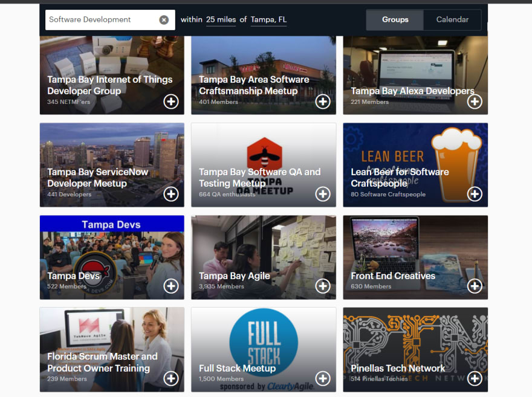
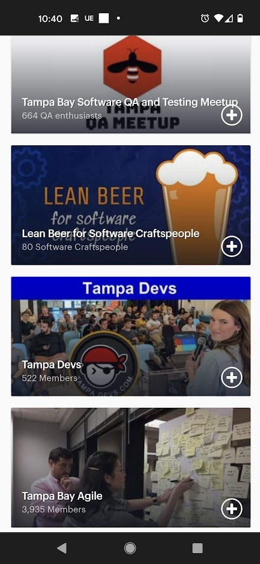
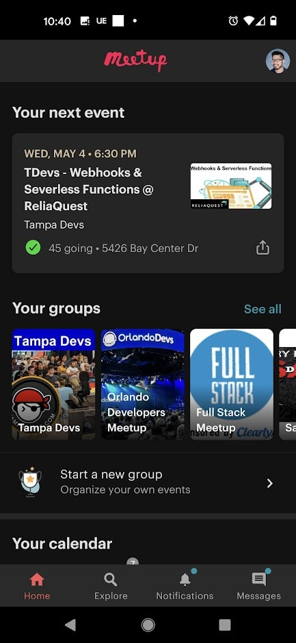
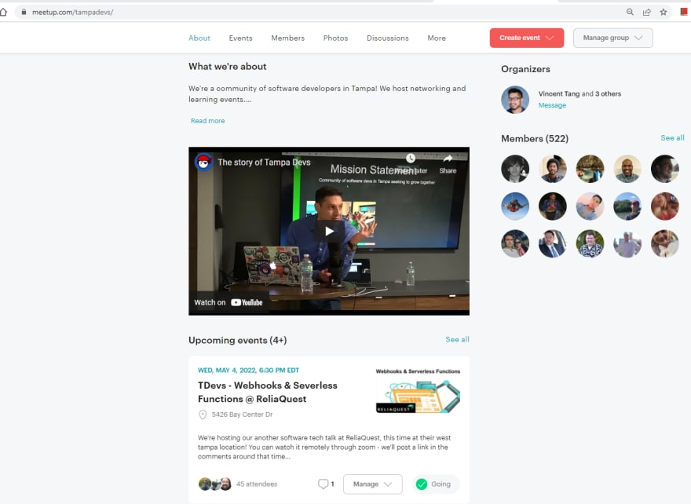
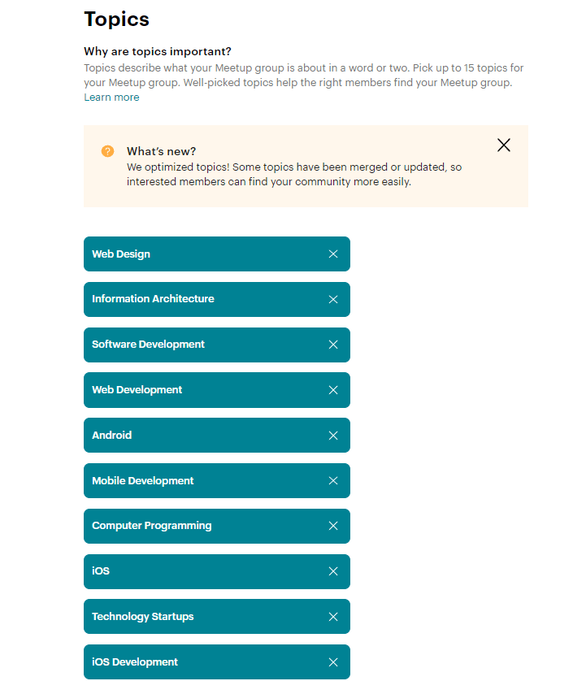
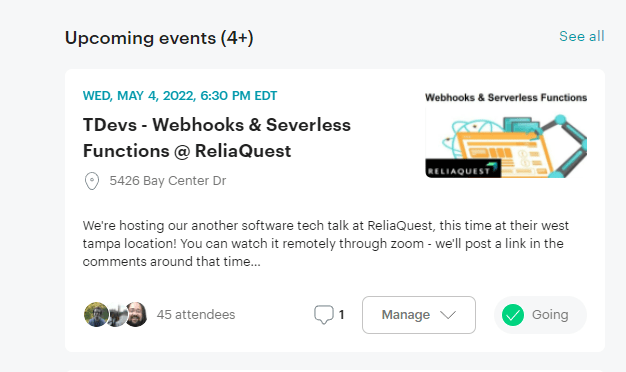
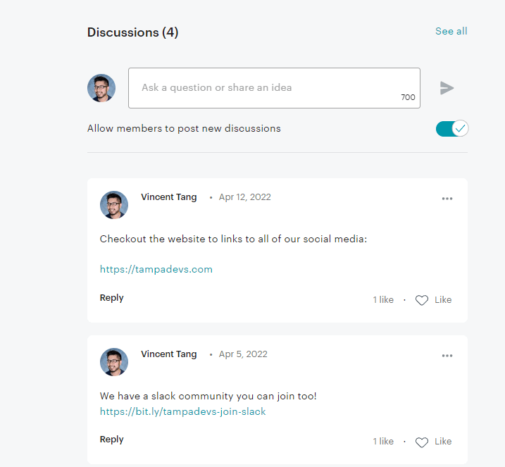
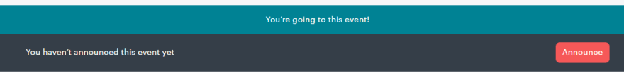
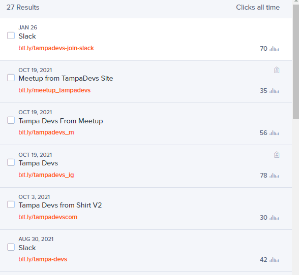

Since starting [Tampa Devs](https://tampadevs.com), I've had to spend a good amount of time making the page look nice on meetup for converting new users to the site. I'm currently running the basic version, so this guide is tailored for people that don't want to spend money on meetup pro

You can check out how our current meetup looks here [meetup](https://www.meetup.com/tampadevs/)

This is how you craft the perfect meetup page:

## Make sure the thumbnail looks good everywhere

Pictures are better than words. Here's what our page currently looks like on desktop website:

And here is the mobile website version. This is on my pixel 5 in portrait mode:

 
Android app: 

In each of the three instances, it's very easy to spot Tampa Devs at a glance. The blue header draws the eye and anchors you to the thumbnail. The image of the presenter, the computer, and the audience is pretty self explainatory. You want to stand out from the other groups, so being easily visible is important.

I added the website and logo here as well, since this helps associate the logo to the meetup page

## Add a video

I believe this is a new feature to the site. A video goes a long way as a differentiator to other pages, here is what a video looks like on desktop view. I added my co-organizer Haritha here, giving a presentation on the origins of Tampa Devs:

## Make sure to tag your meetup with appropiate tags

On the meetup page, you can add tags associated with the meetup. These are found under the settings, this is what we currently set for Tampa Devs:

If someone new to town were to search for "Tampa meetups software development" on google, this would be part of the search results found on meetup. It's important to add this in for users to organically search for your meetup page 

## Ask profile questions

Not entirely necessary, but you might want to opt in and ask survey questions on new users. For instance, we ask how long they've been in industry, what their favorite language is etc. 

We don't make this required to reduce barrier to entry in joining our group, but you might want to consider an opt-in approach for this

## Add thumbnails to images

A good thumbnail goes along way. We use this to brand our sponsors as well in order to get funding. This thumbnail image is what gets previewed whenever a link to the meetup is posted on linkedin, facebook, slack etc

 
## Add links in the comments for the meetup

On the main page of the meetup, the comments have alot of visibility on the site. Adding comments to links, such as our website, makes it easy for users to find it. These hyperlinks work in both the description

## Consider using shorthand notations on event titles

When you "announce an event" on the page, found after you create the event:

This sends a notification straight to your email. We prepend "TDevs" which is short for Tampa Devs in every title for our events. It helps differentiate other events when it's prepended on an email list

## Consider doing link tracking

One marketing strategy to use is to track how many users click a link. I use bit.ly to track this across all of our social media platforms. Here are the current set of results:

## Summary

In summary, these are just some of the ways you can make a meetup page stand out a little bit more.