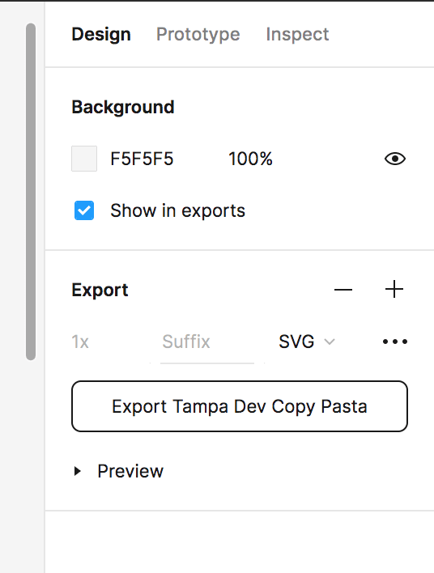
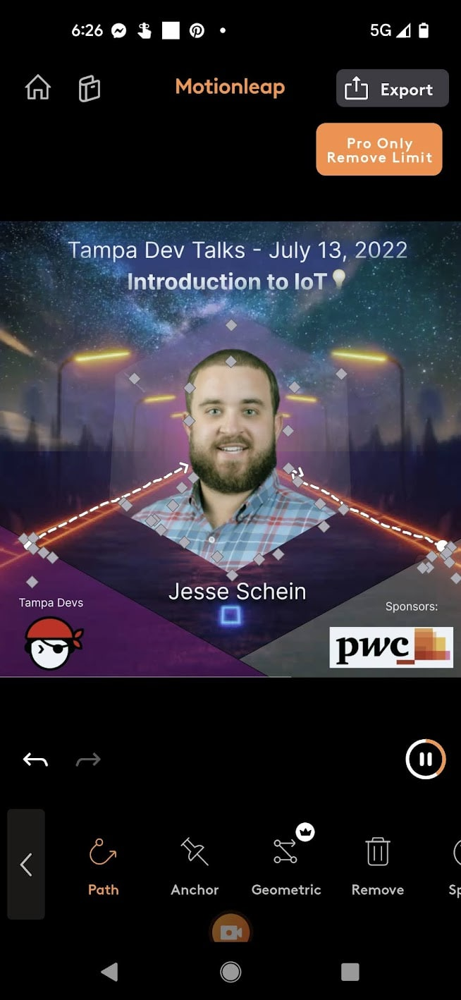
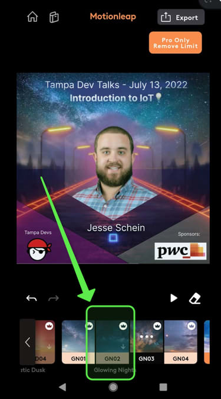
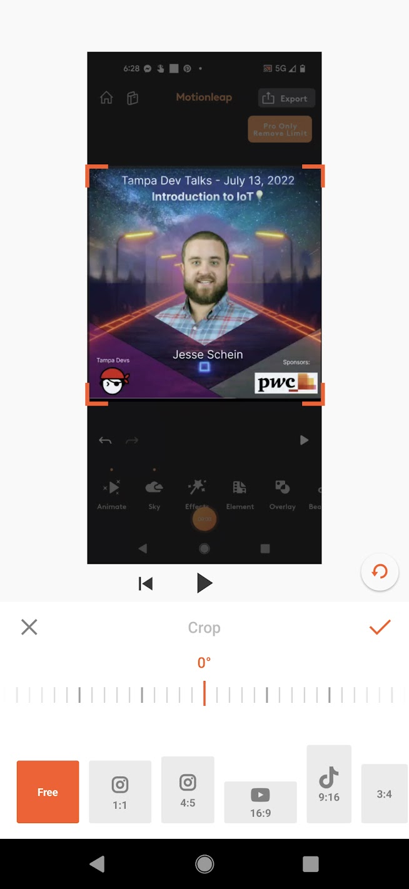

We created this infographic ad here for [Tampa Devs](https://tampadevs.com) for use across Instagram, LinkedIn, and Twitter to advertise our upcoming tech talk.

The sky is animated, as well as the visual road lines leading up to the portrait. It creates a stunning effect that catches your eye as you are endless scrolling through media feeds. 

I didn't exactly plan to make this infographic, but our previous speaker ads were rather lackluster. I met with my friend Andre, and over the course of 2 hours we created this ad

You can use a number of tools such as Adobe AfterEffects to do this, but I don't have the software/hardware to do this.

Instead, we used all simple tools that are readily available online, through MacOS/PC, and through android/iOS phone apps. 

All free as well!

Here's a walkthrough of how this was created:

## Create the static layout in Figma

The first thing that needs to be done is creating the static layout of the gif. It's the foundation for which we add animations after.

To create the layout, I highly suggest using a tool like Sketch, Adobe XD, Illustrator, Affinity Design, etc. Basically any vector tool. I would avoid using tools like Canva, as it doesn't support more advanced features such as masking overlays.

I personally used [Figma](https://figma.com) since it's free, online, and you have full control over the final export

First we'll use a backdrop image. This is the one I used:

 
For instagram export, it'll have to be in a square image format. I won't cover how to use Figma, but I added some transparent triangles, our logo, an image mask, and text. This is what the final static image looks like: 

There's a number of tools to help expedite this process. I used 

- [https://www.remove.bg/](https://www.remove.bg/) - This removes any photo background of the user portrait
- [https://www.flaticon.com/](https://www.flaticon.com) - Flat icon SVG exports, you can import SVG shapes into Figma instead of creating your own. This is how we created the hexagon shape

From here, we'll also export this as an SVG

## Android 

We take this image into Motion Leap. You can find this app on [Android](https://play.google.com/store/apps/details?id=com.lightricks.pixaloop&hl=en_US&gl=US) or iOS

In Motion Leap, you can add anchors which will prevent parts of the image from being animated

From here, I drew some lines towards the road to indicate the lines being animated

You can also add a gif animated video backdrop as well. You can add this line to animate the lines going towards the speaker

From here you can select some of the smart sky backgrounds, I added this effect in here:

 
The feature to export is paywalled for some of the previews, so I used an app called [xrecorder](https://play.google.com/store/apps/details?id=videoeditor.videorecorder.screenrecorder&hl=en_US&gl=US) which also lets you record everything on your screen

Afterward, we cropped this out using [youcut](https://play.google.com/store/apps/details?id=com.camerasideas.trimmer&hl=en_US&gl=US) 

Here's what the crop looks like:

This is then ready to be imported over to an instagram post, etc 