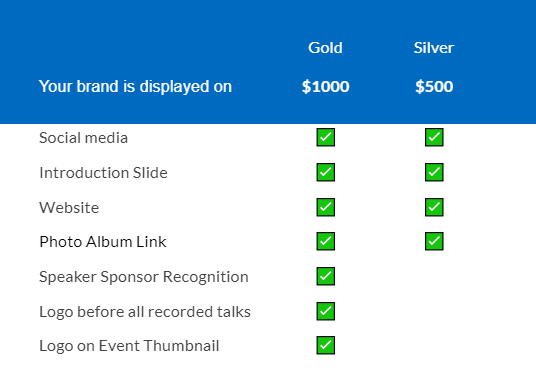
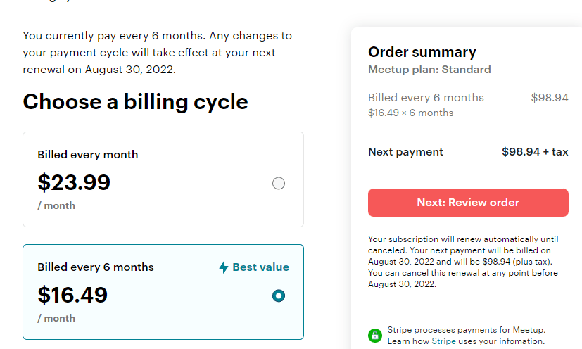

 
Since [Tampa Devs](https://tampadevs.com) started about 10 months ago, we've grown very successfully as a community. Every software firm and/or tech community in town has heard of us. 

The other day I went to the park wearing a Tampa Devs T-shirt and he knew what it was. I went to a tech conference to later find out a recruiter hired a data scientist at one of our events, and I didn't even know either person by name. I still don't

Someone even met his now current girlfriend at one of our events. It's weird knowing that Tampa Devs might be mentioned in a wedding ceremony. We've become mainstream at this point

Moving onto quantitative stats:

- 200+ active members on slack
- 700+ active members on meetup
- 800+ organic followers on linkedin
- 800+ organic followers on instagram
- Up to 200+ attendees for networking events
- Up to 100+ attendees for learning engagements
- 15+ events hosted
- 8+ jobs connected through Tampa Devs
- Multiple sponsors

I had a conversation just recently with one of the venues we worked with, and they were quite surprised we're not established yet as a nonprofit, or a business for that matter. 

Running software meetups like these can be expensive, especially if you go for catered food options, beer, advertisement materials, and venue costs. There are also costs in buying T-Shirts, stickers, meetup costs, zoom fees, and many other small digital services to help manage a community

An average speaking engagement for a meetup costs around $1,000. About $500 for 2-3 hours at a venue, and another $500 for food at ~$10 per person catering, with ~50 people attending as an average.

I've been able to avoid forming a nonprofit / business for the longest time by doing the following:

## Having sponsors pay for food

We have a number of recruiting firms that expressed interest in hosting Tampa Devs events. Usually these groups also have a budget for taking prospective employees out to lunch, and marketing budgets for sponsoring events like these.

To avoid having to deal with finances directly, sponsors usually pay for food.

Here is how the conversation usually plays out:

```
Me: Hey would you like to sponsor one of our tech events?
Sponsor: Sure, how many people will be attending?
```

It actually never works out to be that simple, usually they'll follow up with "What do we get in return, etc?" 

At that point it's a good idea to provide a meetup event prospectus. Think of it as a catalog you give to a sponsor, where you detail what their money goes to. Most sponsors want to get their name out there, so this is how we write our win-win approach:



Where $500 equates to the cost of a venue, and $500 equates to the cost of food.

I got lucky with Tampa Devs that we had amazing sponsors from the get-go, that believed in our mission. This isn't usually the case.

## Host meetups at software companies who provide venue

Many software companies in town are morme than willing to open their offices to host Tampa Dev events.

This is because we bring local talent to their office, and in turn helps brand their company as an awesome place to work at

Although with Covid this makes things a tad more difficult though, so YMMV

## You can re-coup costs on swag

I can't ask any of our sponsors to directly buy T-Shirts or Stickers that we make for Tampa Devs. Since those items are more generic in nature, I would have to put a list of sponsors on a T-shirt instead to offset costs. At that point I would need to form a nonprofit or LLC to take in monetary funds, or run it through a personal account.

So what I do is just print off about 20 shirts at a time from our vendor, [spreadshirt](https://spreadshirt.com). It comes out to about $18/each shirt because we do a side/front print. I offset the cost by selling it for $20 at events

Stickers from stickermule (https://stickermule.com) also vary in cost depending on quantity ordered, but expect them to be about 25 cents to 35 cents each depending on the amount you order:


Stickers are probably the highest cost item I personally have to deal with though, since I can't recoup costs taking in general funds from a sponsor
 
## Small things that end up costing money

Meetup and zoom end up both being items that I can't directly take sponsor money in, since it's such a generic expense that doesn't have a 1 to 1 value to the sponsor. It's a recurring cost on my end

Meetup equates to about $200 a year, billed at $16.50 a month at the time of writing this.



A paid zoom account for hosting up to 100+ attendees without time limit comes out to about $149/year. I use this for work already, so I'm able to expense it there. This is because we do hybrid meetups, which is a hosted meetup + on remote as well at the same time


 
## Total costs of running a software meetup

For every speaking engagement, it costs about $1000. We've had 5 thus far, and those are paid off to our sponsors.

For software logistics on my end, it costs at least $350/year for zoom + the base meetup organizer account

Another $500/year cost comes in the form of stickers and swag that I give away etc. 

In total I probably spend almost $1000/year running and maintaining Tampa Devs. It's not really a sustainable model though in the event I move onto other things, but starting any venture early on is usually a net financial negative.

I could do away with all the swag, and zoom such that it'd cost me $200/a year for just meetup

There are multiple ways to make Tampa Devs profitable (as a for-profit, or non-profit).

These include:

- Running podcast segments with companies in the area, with ads
- Running more sponsor ads at our meetup, and marketing through social media
- Having a patreon for Tampa Devs members

I've looked at a number of different financial models in other tech city communities. Each and every one of them are managed a bit differently, but I like it how it is right now. Relatively low cost, high return on value, low effort required.

The moment I incorporate into an LLC or nonprofit, there's going to be additional cost in registering it, handling the accounting, setting up bank accounts, invoicing, etc that will just blow up on costs, overhead, and work. It'll feel like a second job at that point, and that's something I wish to avoid

We're also hosting a hackathon fairly soon, and while it makes sense to be setup as a nonprofit, or for-profit, I've been able to have sponsors directly pay for food and venue. T-shirts are another issue entirely though