--
date: 2022-07-20
title: 'Best marketing strategies for a software meetup'
template: post
thumbnail: '../../thumbnails/tampadevs.png'
slug: marketing-strategies-software-meetup
categories:
  - Community
tags:
  - TampaDevs
---


Since starting [Tampa Devs](https://tampadevs.com), I've played around with a few marketing strategies. I wrote about the original [post here](https://www.vincentntang.com/how-we-grew-tampa-devs/). Those strategies revolved around things that don't scale, and to acquire your first users to your group. It's based on the same principles of growth hacking for startup

The strategies I'm going to indicate below are when you have a following already (we have about 700 followers/members each amongst all platforms). It's mostly about "how can I advertise this event to as many people as possible, without doing much"

Here's how:

## Mass group invites on LinkedIn

In the previous blog post, I would randomly message people on LinkedIn things like this about our upcoming events:

```
hey, my name is Vincent and I run Tampa Devs. 

We're hosting an event tomorrow at XYZ.

Check out the link here at meetup.com/tampadevs

Free food and drinks too!
```

This is an effective way to build a large following on LinkedIn without much effort. You can copy, paste, and spam this to 200+ people in about an hour. You can even write a script to do this for you too (be warned you might get banned though!)

After you've built a following of say 1000+ people in your area, you can create events to repeatedly invite all of these people again! With little to no effort. Here's how:

First, set up the event and hit invite

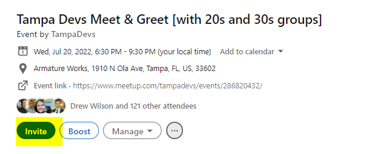

After, filter by who you want to invite in your local area. I live in Tampa, but Clearwater, St Pete, and Brandon are all considered "Tampa Area" though. So I include that in the list. I also put "Florida" just to be safe too, these are all locations that are set by individual users on LinkedIn

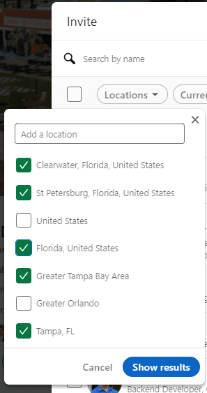

Now you just have to scroll down infinitely, then select all and invite

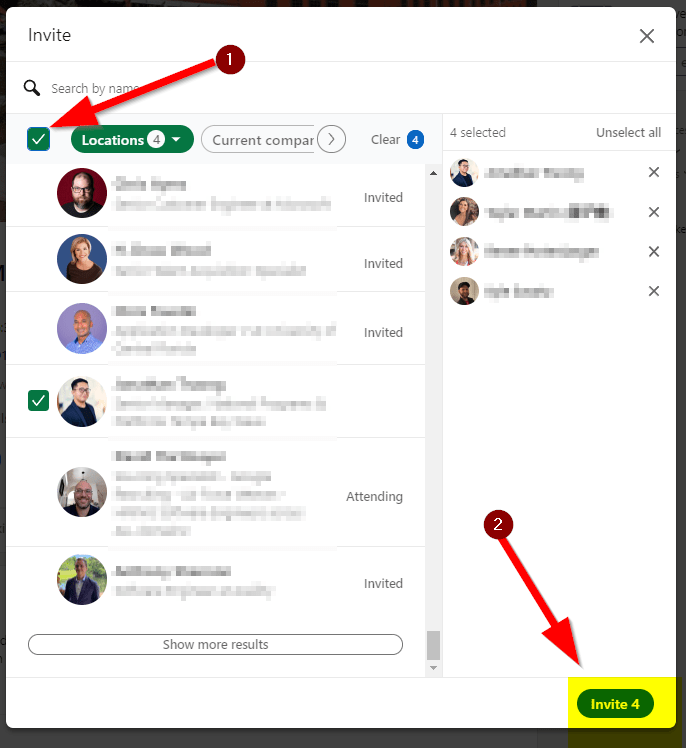

I usually send about 1000 invitations, and of that 200 people  will RSVP. About ~10% of that list will attend, which isn't too bad considering it took 5 minutes to do

Here you can see the results of our last event. We had 200 people RSVP'd, and 34 engaged. I met about 5-10 people that learned about the event through LinkedIn

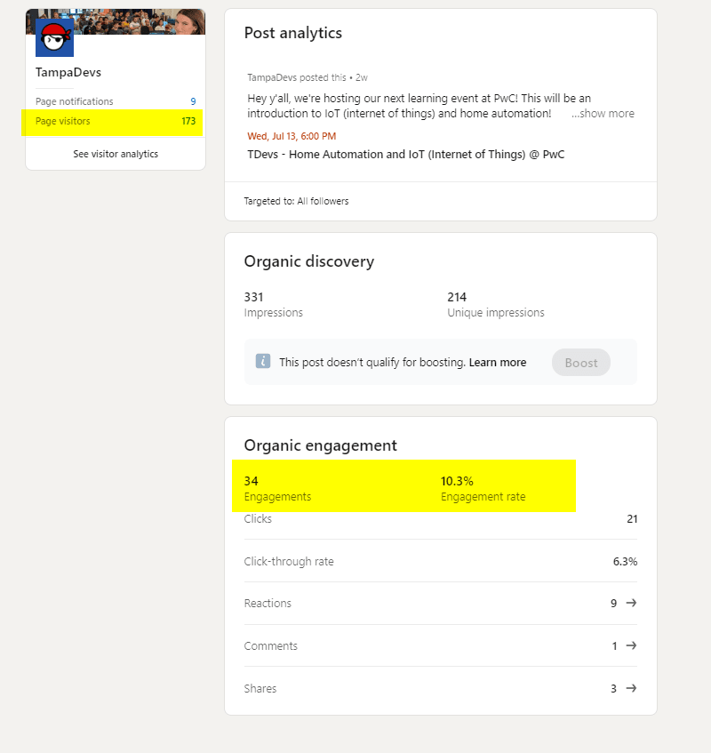
  
## Announcing the event on Meetup

Announcing the event on meetup is essentially a public broadcast letting users know there's an event coming up. If a user has the meetup app installed on their phone, it'll show a notification. 

Usually the best time to do this is on Tuesday, Wednesday, and Thursday. An announcement on a meetup is similar to sending out a [newsletter](https://www.mailerlite.com/blog/best-time-to-send-email)

I usually wait until 2 weeks before the event to do this, this lets people know when it's coming up. 

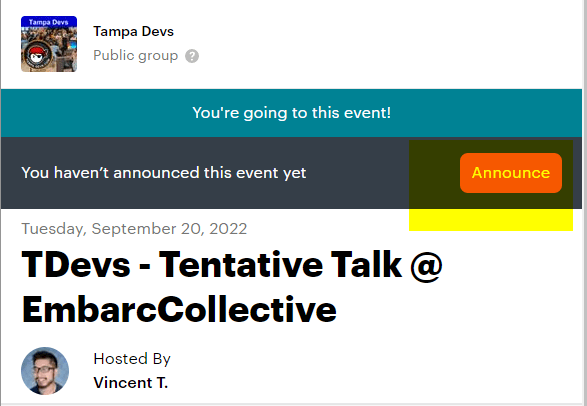

Usually if you announce the event early (like a month or two in advance), you might get 10 people to RSVP early on. But if you do so 2 weeks in advance it's usually double or triple the number
 
## Mass invites on Facebook

Some users (including my co-organizer) may not use meetup but would routinely check facebook for events happening in the area. Here's some stats on the effectiveness of facebook events:

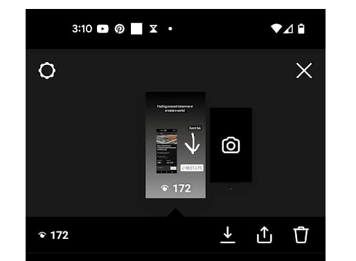

Once you create the event, hit the invite link here

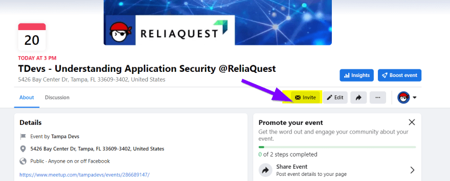

You can then create a pre-selection list of attendees. I just add any facebook friends in the area, and then send all. It's pretty low effort but it is a little bit spammy, so I only do it once a month. Facebook does add some spam features against this, so YMMV. I sometimes will just select a few people from a pre-list of people I make, and send the invite in 2-3 chunks to get past this 

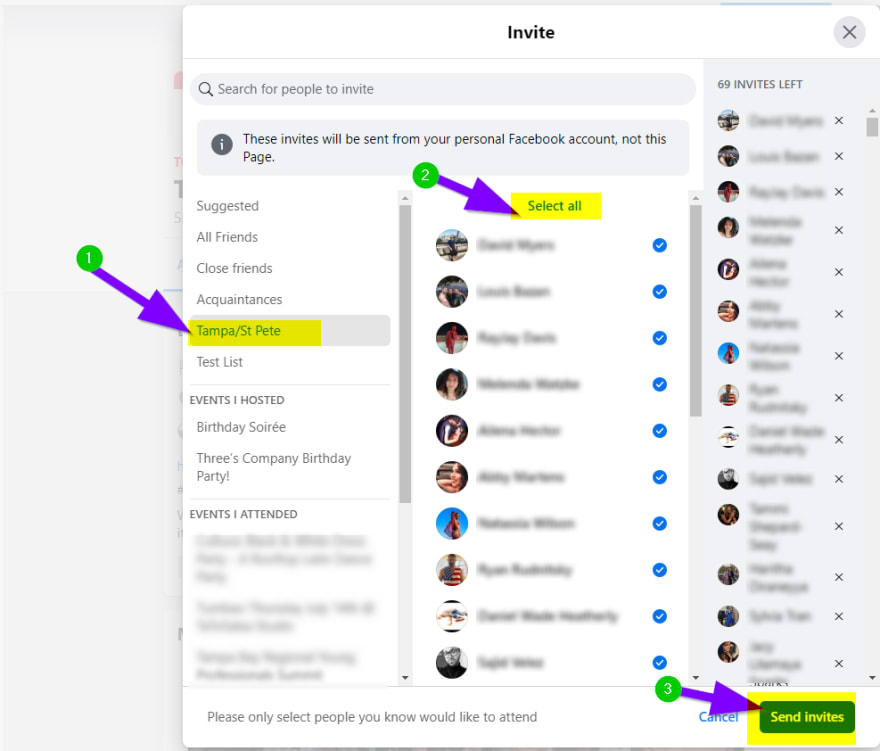

Facebook is effective for people who don't want to check meetup.com and normally attend events after finding about it through facebook.

Related story, one of my co-organizers doesn't even know about our events until we put it on facebook 🤦‍♂️ 

## Instagram Posts / Stories

We do a featured speaker ad before an event for younger demographics. This is mostly tailored to people in their 20s/30s and students at local schools and Universities that we follow

It has about a 10-20% impression rate on followers (we have 800 followers, our last view count was 168 views). We do this approximately a week in advance, so we can also post the event synposis a week later. It's mostly to follow a posting cadence of 1-4 posts a month

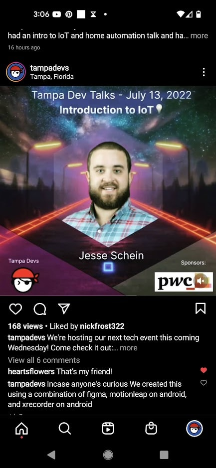

I wrote a guide on how to create an animated speaker ad [here](https://www.vincentntang.com/animated-speaker-ad/), if you'd like to learn how to create the above infographic

About 1-3 days before an event, we'll also post an instagram story. It also has about a 10-20% impression rate for us, although YMMV depending on who follows your account. It's usually a screenshot of the meetup event, with a link to the meetup itself:

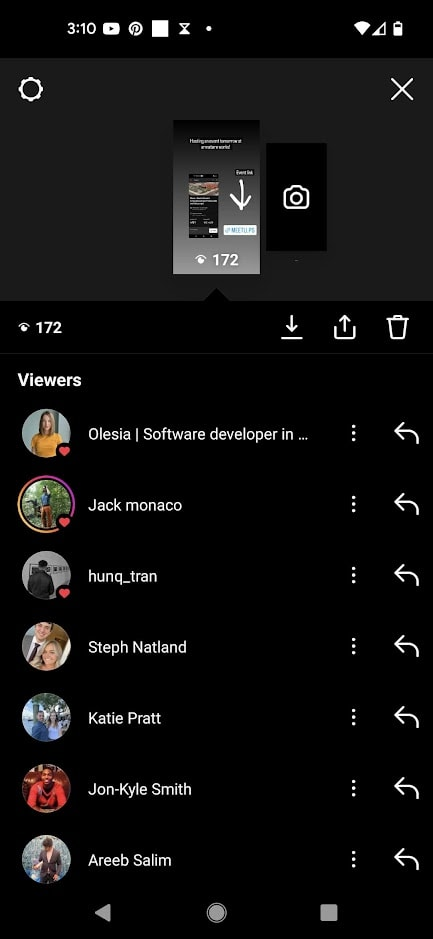
 
## Things that aren't really effective at advertising

Here's a list of things that take far too long, and/or don't create alot of marketing value IMO for a local software meetup

Twitter is surprisingly pretty terrible at marketing local events. The first issue is there's a limit cap of 30 follows in a given day, so building a following takes a lot more work unless you automate this with a bot. Second is that the vast majority of local software developers are not on twitter. It's a small but very vocal minority that go on there, it's great for global reach though

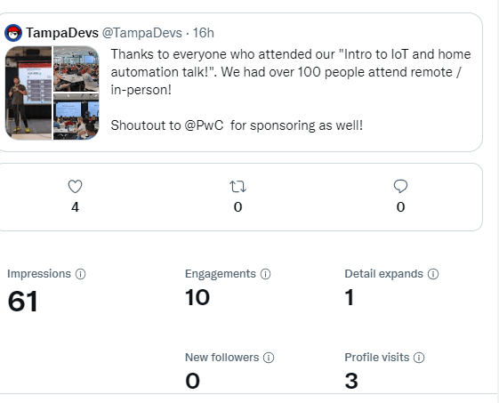

We get about 60 impressions per post with the 160 followers we have. Instagram on the other hand has connected me to multiple people I've never met before
 
The second thing that doesn't produce results is EventBrite. It has one of the worst UI interfaces for publishing events, so publishing takes several minutes. I've worked with other nonprofit software orgs before, EventBrite is usually most successful at general public and ticketed events

We don't charge for our events and it's a niche market, so the reach on EventBrite is rather poor. Here are some stats for a meet /greet event we hosted (5 page views, 1 ticket).

EventBrite would be good however for a yearly ticketed conference that's also advertised outside your local area

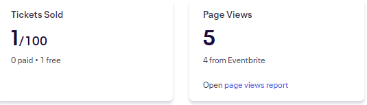
  
## Summary

These are just my opinions on advertising for a local software event. Some of this data may be ancedotal to my area in Tampa, FL. Producing these results in a different country may not be the same, because people may use facebook over meetup more, etc. 

In general though, these are the most effective platforms in marketing a local software org:

- Instagram
- LinkedIn
- Facebook
- Meetup

The ones that do not create a lot of outreach are these:

- Twitter
- EventBrite

I didn't include Snapchat or TikTok which may be effective at younger demographics like college students, but software events are not interesting enough to create a 15 second video for general viewing
We also don't use any tools like Buffer or Instagram Pro for social media automation.