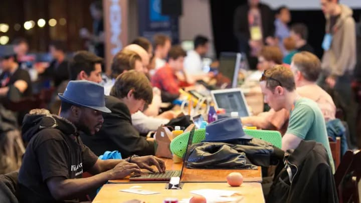
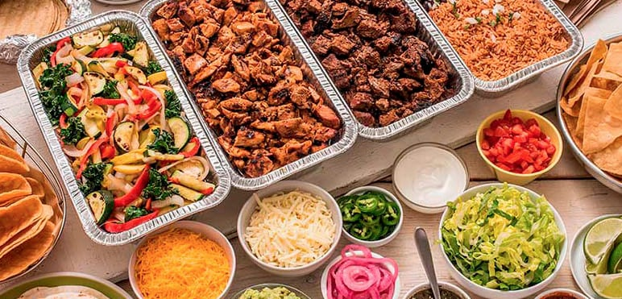

So you want to run a hackathon?

It's not easy to run that's for sure. I've been to about 2 dozen hackathons, either as a participant, mentor, or judge. Some had $50k prize pools on the tables, others none. What I've learned through these is the most organized hackathons generally end up with the highest successful turnouts

I'm currently in the process of setting up a Hackathon for [Tampa Devs](https://tampadevs.com), through my friends over at [TADHacks](https://tadhacks.com). I've had some time to think about the challenges I've run across and things I didn't expect

Here's what you should know before you get started:

## What type of Hackathon will you be hosting?

The first question to ask yourself is why? Why do you want to host a hackathon?

I ask this because running hackathons have a high chance for failure, and are expensive. Even if you advertise the event with a substantial prize pool, I've seen events with very little turnout. 

It happens for a number of reasons - there could be a concert in town that you don't know about that everyone attends. Or a championship game for your local hockey league that all your attendees watch (this happened to us at tampa devs)

Hackathons are like conferences. You have to advertise them far in advance if you want it to succeed. Even then it boils down to luck, weekends are usually when they are hosted and they can be unpredictable. You also need to have a substantial following already, to help do net promotion

There are a few types of hackathons you can host though. Depending on the type you host, YMMV in terms of work needed to run it. I would say there's two core types:

1. Use an existing hackathon brand
2. Create your own hackathon brand

The differences between (1) and (2) is like deciding whether you want to run a McDonalds for yourself, or build your own specialty burger shop. The second one takes more time and effort, but scales better long term if you want it to grow. The first one is a low hanging fruit, you don't have to think about all the logistics involved

I will detail what it's like for (1) and (2). I am currently focusing on (1), but I've spoken to a number of people regarding (2)

## Using an existing hackathon brand

Using an existing hackathon brand saves you a ton of effort. Here are some popular ones that you may have heard of:

- React hackathon
- NASA Space Apps
- Ludum Dare Game Jam

...or anything found on [itch.io](https://itch.io/games/tag-hackathon) for game hackathons, [devpost](https://devpost.com/hackathons) for virtual and global hackathons, and [Major League Hacking](https://mlh.io/) for local student hackathons.

When you run off an existing brand, these are the things it solves:

- Logistics guidelines in running the hackathon
- Posting the winners on a blogpost
- Slack community channel for organizing participants
- Sponsors and monetary funds

The last one is the most important. Getting any traction to a sponsor for a new hackathon requires you to know someone, or just alot of cold email openers to companies interested. Sponsors help pay for the prize pool which excites people to come, and offset costs for food and venue. 

Usually these sponsors need to know a year in advance as well to allocate their fiscal year budget for the event. So planning a hackathon from scratch can take up to a year

Even if you host a local hackathon, you still need to consider these things:

- Where do I host the event?
- Who is paying for food?
- Who is going to run logistics at the hackathon?
- Where will I advertise this event?

I will cover these basics first:

### Where do I host the event?

This one's a bit tricky

A good ideal hackathon has at least 2 rooms with a whiteboard. The ideal space is usually a college campus, however there is one caveat:

If you were to host at a college, or University, you generally cannot have people outside the college or Uni attend. I've learned this the hard way when partnering with [USF](USF.edu/), there is red tape approval processes that need to be approved by the computer science dept chair head.

Likewise, if you have the event at a University, you may not be able to invite members at other competing local universities.

Other good venue spots include any startup incubators in town, however they may also charge a fee to use the rooms. I'm still in conversations to get a quote, but we're talking about $1000 or more generally speaking

Another option is to use a well known software company in town to host. However, our negotations with ReliaQuest have fallen through, becasue it isn't aligned with their marketing interest and they're in the midst of moving offices

There are also public domain spaces available, such as local libraries. But you'll need to run through permits and approvals through them in advance

The best strategy is to just hit up multiple venues and see which ones pan out, because getting a venue for this event could take months for sign off

### Who is paying for the food?

Hackathons are generally a 2-3 day weekend event, with Friday being optional. At bare minimal, you will have at least 3 food sessions

- Saturday lunch
- Saturday dinner
- Sunday lunch

The cost of catering is about ~$10/person, and a good turnout at a hackathon is about 50 people. Expect it to cost about $500 per catering session, multiplied by 3. These stats may vary in your area though (e.g. if you host in Thailand, foods dirt cheap for instance), but these ring true for most US cities. This is if you want good food, but you could opt for cheap pizza too

I've written about strategies of how I've not needed to create an LLC for Tampa Devs [here](https://www.vincentntang.com/nonprofit-software-meetup/) to cover these costs. The TLDR is just get the sponsor to pay for it directly through their budget, so you don't have to act as a financial intermediary

To create an incentive for the sponsor, you can incorporate their name into the branding of the event. But it does get tricky if you use an existing hackathon brand, since you don't fully own the branding control. This is like getting Burger King to sponsor you for a McDonalds you own; it's possible, just not that simple usually

### Who is paying for T-Shirts and Swag?

If you want students to be excited about a hackathon, you need T-Shirts. And you can't get any specific sponsor to cover this either usually, but it is still possible. Because the sponsor may have a food budget but not a swag budget for your event

At this point it's better to act as a financial intermediary to the sponsors and buy it yourself

### Who is going to run logistics at the hackathon?

Running a hackathon is a group effort. You can't really do this on your own. Here are things and people you need for local task action:

- A few judges. They could be industry professionals, or members of your board
- Master of ceremonies - someone to break the ice for the event
- Mentors - to help students who are stuck
- Assistants - someone to keep doors propped open, direct traffic, help do marketing shots, setup tables, close up shop, etc

Because there will be many people involved, you'll also need to have a recurring forum meeting to keep everyone on the same page. You'll need to do managerial tasks in keeping everything in check

### Where will I advertise this event?

This needs to be advertising (alot of it!) done in advance for this event. For us, we advertise it at Tampa Devs on every introduction meetup so everyone has heard of it multiple times. The key here is repetition - if someone's heard about it enough times, they'll remember the event coming up.

You can also target local newsletters at collegs and Universities nearby, to which I cold email all the admissions offices and see who gets back to me. Likewise, the local startup incubators in town are good places too

Other advertisement venues include social media platforms like linkedin, facebook, instagram, etc

## Summary

I didn't cover any specifics on how to run a virtual hackathon, or creating your own brand hackathon. That takes a lot more work, to which will make this blog post really lengthy.

But to summarize, the bare minimal in running a good hackathon and using a pre-existing brand requires the following plans thought out:

- Where do I host the event?
- Who is paying for the food?
- Who is paying for T-Shirts and Swag?
- Where will I advertise this event?