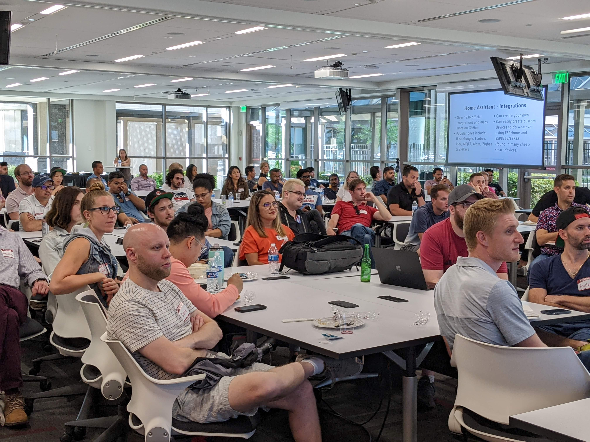

Hosting a software meetup is a lot of work. You have to manage a board, meet with sponsors, plan out event, speaker, and venue logistics far in advance. 

There's also social media content to post to advertise and market future events. And, as an event host you need to also capture marketing material as well to post. You'll also need to manage off days to prevent burn out, amongst other things.

The unfortunately reality is even though I have a member board, I still end up doing 90% of the work since we're run by volunteers. I've talked to a number of event organizers as well, and this tends to be the norm. 

We have members that do want to help, but at the end of the day you're expected to set all the ground rules, management, and expectations. Most members just want to do the "fun work" and not 90% of the grueling everyday work that keeps things afloat

So with this guide I will tell you how I manage all the work I need to do for [Tampa Devs](https://tampadevs.com) on my calendar, without burning myself out. And doing it in the most time-effective way possible

You can employ these same strategies for running a startup, and business as well

First I'll cover how many events you should host a year to maximize attendee counts with the least effort possible, based on marketing principles. Then I'll detail the physical logistics involved in marketing because that's the vast majority of ongoing work for growing a meetup

## Host events once a month, or twice a month cadence

_one of our speaking events_ 

You should ideally aim to host events once or twice a month.

They need to be broken down to two types of events

- Networking
- Learning / speaking engagements

Speaking engagements are necessary to host to get people excited about upcoming events. These are beginner friendly topics like "An intro to React" or "DevOps 101", which draws interest from new and existing members.

Imagine you just met this cool dude and want to tell your best friend about it. If you just mention "Tampa Devs" but don't have any content to back it up, your friend won't be interested enough to spread it by word-of-mouth

The issue with speaking engagements is they require a lot of work. You don't have to host these every month, but you can do it every other month. 

I usually host speaking engagements like so:

- Month 1 - speaking
- Month 2 - speaking
- Month 3 - n/a
- Month 4 - speaking
- Month 5 - speaking
- Month 6 - n/a

You want to incorporate break periods for members because overtime you'll get lower turnouts if you routinely host them all the time  

I would recommend having a speaking engagement at bare minimal, once every other month

So now the other event type is a networking event. These are low-effort events where there is no agenda, and it's just for members to meet each other.

I usually collaborate with other 20s and 30s meetup groups in town to "make things seem bigger than they are" and to do guerilla marketing on other groups in town. 

You just have to pick a date, a time, and a location - ideally at an open venue like a foodcourt or hangout area with many restaurants nearby

Since there's about 4 weeks in a month, we usually offset events by at least 2 weeks. Here's what an ideal event schedule looks like for Tampa Devs

- Month 1 - speaking, networking
- Month 2 - speaking
- Month 3 - networking
- Month 4 - speaking, networking
- Month 5 - speaking
- Month 6 - networking

So you don't want to host too many networking events either, as these do also [cannibalize](https://www.investopedia.com/terms/m/marketcannibilization.asp) the turnouts for speaking engagements. You want to host fewer, but bigger events in general. This routine is what I call "growth mode" for a meetup

If you want a smaller commitment for events, I would suggest alternating networking and speaking events every month

- Month 1 - speaking
- Month 2 - networking
- Month 3 - speaking
- Month 4 - networking
- Month 5 - speaking
- Month 6 - networking

This is the bare minimal to keep a softtware meetup alive and active from a member perspective. I call this "maintenance mode" for a meetup

## Best days to host events

There are certain months in the year that you should be aware of when it comes to hosting:

- December to January - people are on vacation, so attendance counts are lower. Early December and Late January are still good times
- Summer - there's less students around generally, but the ones that are in town have more free time. Turnout rates are generally higher for students here actually from what I've seen

Any large holidays or events need to be generally avoided too. An event the day after July 4th would have a terrible turnout. 

Thursdays and Fridays generally are days where people go out, so don't do tech talks on either day. These are also days where parking is more expensive, and a potential cause for people not to show up. Networking events are okay though

Ideally Tuesdays or Wednesdays are good days to host speaking engagements

## Post social media weekly or bimonthly

Now that we've covered how to host events, I will cover how to handle marketing for a "growth mode" meetup. This is if you want people to know about your group to funnel in more sponsors, attendees, collaborations, etc with other groups in town.

The ideal posting cadence on social media (Instagram, LinkedIn, etc) is usually about a week. Regularly posting content once a week is ideal, if not that then twice a month

So here is how I plan out marketin posts. We have two seperate types:

1. Pre-event posts for telling people about an event
2. Post-event posts to create FOMO (fear of missing out). You can read more about the principle I wrote [here about growing tampa devs](https://www.vincentntang.com/how-we-grew-tampa-devs/)

With (1), I usually post this a week in advance. I wrote a post about how to create an animated speaker ad [here](https://www.vincentntang.com/animated-speaker-ad/). I'll post either the venue, or the profile shot of the speaker. After the event, I'll create an additional post.

So if we follow this cadence of 2 events a month

- Week 1 - speaking event, post photos
- Week 2 - advertise next event
- Week 3 - networking event, post photos
- Week 4 - advertise next event

If you follow a once a month event schedule:

- Week 1 - host event (networking or learning), post photos of it
- Week 2 - skip
- Week 3 - advertise next event
- Week 4 - skip

## Running a member board

  
_one of our zoom meetings for member boards_
 
If you end up going non-profit, one of the requirements is to use publically documented forum meeting minutes. Having routine meetings or "office hours" for people to talk to you is important, this is for sponsors, people you work with, etc.

I suggest doing this in a once every 2 weeks cadence, and having an async way such as a slack channel to communicate

We have a board member chair for handling commmunications with USF and collaborating for our hackathon. I will schedule message reminders in slack around the days of my planning to help handle this

## Putting it all together

Here's what my full planning schedule looks like for Tampa Devs, with everything I mentioned above.

- Week 1 - host event, post photos
- Week 2 - member meeting, do planning, advertise next event
- repeat if two events a month

If you are doing one event a month

- Week 1 - host event, post photos
- Week 2 - planning, member meeting
- Week 3 - advertise next event
- Week 4 - planning, member meeting
- repeat if one event a month

I choose Wednesdays to host and Tuesdays/Thursdays to do most of my event member-meetings/planning/advertisement work. I avoid doing Tampa Devs stuff on any other day of the week

## Summary

The hardest lesson I've learned while running Tampa Devs is how to do it consistently without burning myself out. It's easy to host one event, but hosting over a dozen in a year is gruesome and people often don't realize the burden it takes on you. 

I plan things out about 3-6 months in advance. Getting a venue, a sponsor, a speaker takes time and energy as well to communicate back and forth. I wrote a blog post about [retaining talent by creating ownership](https://www.vincentntang.com/retaining-talent-by-creating-ownership/), and the core principle is transparency.

This is how I keep members of the board in the loop etc. I post updates on slack as notes to myself and anyone else to see.