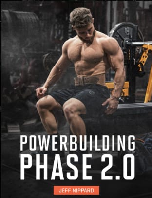
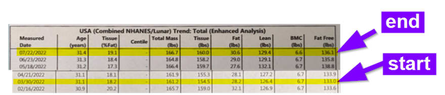
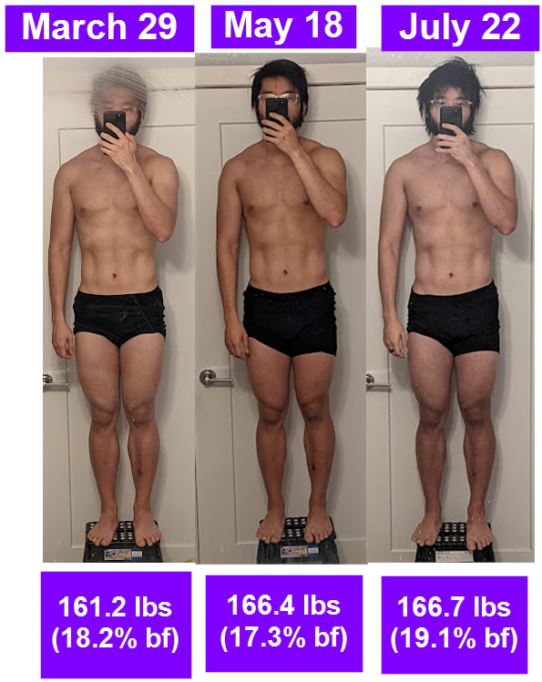

About 6 months ago I started Jeff Nippards powerbuilding phase 1 program. I really enjoyed it, I did it on a cut and saw great results when it came to maintaining muscle mass and losing body fat. Over the course of 3 months, I lost somewhere close to 2-3 lbs of fat a month, with almost no muscle loss. I had been recovering from an injury at that time, so I was detrained which helped in the progression for powerbuilding phase 1. 

For [powerbuilding phase 2](https://shop.jeffnippard.com/product/powerbuilding-phase-2-6x-per-week/), I went with the 6x program. Instead of focusing on half hypertrophy, and half strength, it was a focus predominantly on hypertrophy.

I went for about 200g protein a day, with the first month being a transition from caloric deficit to caloric maintenance. Month 2-4 was a 10-20% surplus in calories. I haven't really done a clean bulk before, so this program was a test to see if I could do it

Here's the results from a dexa scan on body fat %

And here's the physical results aesthetically:

And here are my 4 lift numbers comparatively from the start of the program:

- OHP - 95 to 100 (calculated from 85x7)
- Bench - 180 to 185 (from one rep max)
- Squat - 255 to 275 (from one rep max, at 10deg off from parallel)
- Deadlift - 295 to 310 (calculated from 275x4)

I did improve a little bit, but not as much as I'd like to. I had a few setback, namely a car accident, travel plans, other sports, and AC problems that contributed to less than ideal progress. 

## Things I liked about this program

Compared to phase 1, phase 2 had way more variations of exercises to learn and perform. It felt like every week there was something new, and challenging to master. The first 8 weeks of the program, I saw an incredibly progression, even a phase where I both lost fat and gained muscle at the same time on a bulk.

In these new move sets, such as the pin squat, I started to perform and perfect deeper squats. Movements like the glute-ham raise, helped me strengthen weaker parts of that compound movement. I figured out which exercises I liked the best, which I will take on future workout routines. I like how there are notes on the side, and youtube tutorials accompanying to guide to reference and improve form during working sets

I also started to train under the guidance of a physical therapist, who taught me additional stretches in getting deeper squats.

I saw substantial shoulder and bench gains, I haven't been this strong before. Around this time I also did yoga training so that helped too

## Things I didn't like about the program

Here are where all my issues are with powerbuilding phase 2.

It's really physically intense, demanding, and long. 6xs workout a week is brutal, and each workout if you follow the warmup sets, the rest periods, is close to 2 hours a workout. This is especially true if you do any compound movements that day. Any push hypertrophy days / neck flexion days would definitely take close to 2 hours if you included the warmup sets

I had to add additional rest days between full body days as I was also training in aerial acrobatics too. Planning out which muscles I could use, on which day felt like work. I think I would be better far served using a much simpler full body workout routine

Around week 8, all the exercises were swapped. I was making steady progress, but everything slipped backward around here. This on top of long workouts made it so I couldn't get through the last week. I was burnt out

There's also another thing with RPE, which is rated perceived exertion between sets. Some exercises where cheating is easy through other body movements (pendlay row, dumbbell lateral raises) makes sense with a lower RPE. 

But I find that actually doing things at the suggested RPE to be too much for me. I try to do everything at almost 8-9 RPE regardless of what it is, and I'd rather just do less sets instead if recovery is an issue.

Warmup sets for exercises tended to be a bit much in my opinion. I think if you cut out 1 warmup set per exercise recommended, you'd be fine which is what I ended up doing

## Things I'd change in the workout

These are changes / things I would change in powerbuilding 2, but they are specific to my goals

- Incorporate 1 more rest day / week
- I personally don't like overtraining legs, so I skipped hypertrophy days. YMMV though
- 1 less warmup set per indicated
- Do all the warmup sets in one shot to save time. More supersets to save time
- Ignore the programmed deload period if I'm doing 1 more rest/day week, deload when needed
- Do more caloric surplus, my TEE is 2500 but I should be aiming for 3100-3300 daily

## In summary

Powerbuilding phase 2 was mixed bag for me. I didn't see the results I hoped to see, but that's not really the fault of the program. It just wasn't for me, and I had other acrobatic routines that didn't overlap well. I also was testing a clean bulk too

I disliked how long the program was, and it burnt me out. I liked the new exercises it introduced which helped perfect some form techniques on squats / deadlifts

I think simpler routines is better. Also need to hit a higher caloric surplus daily

## Next Routine

There's a phase 3 of powerbuilding but I will be doing something else. I will be doing a callisthenics / gymnastics routine, mostly following reddit's [recommended bodyweight](https://www.reddit.com/r/bodyweightfitness/wiki/kb/recommended_routine) fitness guidelines at 3x / week

Here I will be able maximize the amount of time doing skillwork, related to handstands, tuck planches, amongst other movements.

I also bought a few books on this topic, namely [overcoming gravity v2](https://stevenlow.org/overcoming-gravity/) and [convict conditioning](https://www.lesswrong.com/posts/vvf53bbgTM4uWFAuW/convict-conditioning-book-review) through a recommendation of a friend.

The first month will be a transitionary period from a bulk, then I'll move onto a cut phase, since bodyweight training is easier when you weigh less. I don't have some basic movements mastered like the chest-to-bar pullup, so I'll have to relearn how to do a pullup.

After about 3 months in, I'll potentially modify the routine on a bulk since the recovery process timeframe will be faster, and incorporate some hypertophy training potentially.

I'll write about the results 3 months later to myself and see where I'm at