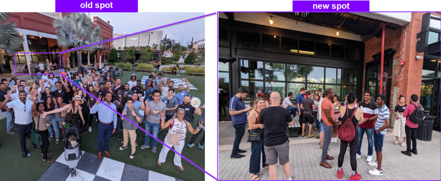

 

Imagine a scenario where you work as a firefighter. A fire starts at the fire department. It's not a big one by any stretch of the means, and can be easily controlled. You are the lead firefighter, but everyone else next to you went through fire drill training too, and the junior firefighter on call is present too

Do you step in and clear it?

The answer is no. 

I will tell you why, with how I learned this, and how I applied it to running [tampa devs](https://tampadevs.com)

## Accountability vs Responsibility

 

At a team I worked at, we built a SaaS product for a client. Every two weeks, we present updates to the client and it's stakeholders

I rose up to the occasion and presented almost every demo to the stakeholder, as I was the lead for that project

Then that project finished. I went to work under a different team. But I still continued that habit of stepping in

Sometimes the junior dev on the team didn't know how to solve a coding issue, so I'd just write it for them. Sometimes management would forget to onboard new team members, so I'd remind them. Sometimes I'd fix things that had nothing to do with my role

Things became more stressful than it had to be. I had a conversation with a friend about it, and he told me this:

**"Are you accountable for the work that you are stepping in to do?"**

The answer was no. I was doing this out of good will. I was also shooting the company's processes in the foot, by being the single point of failure at the same time.

So during retro, I recommended a new set of processes. We should have a designated speaker for our stakeholder demos in writing. 

**It fell on deaf ears. From management's perspective, it was a non issue. Because I always stepped in, and things always worked out.**

There came a time when there was a new junior dev on the team. His name was assigned on that ticket, but I still helped him through that feature.

At our pre-demo the day before, he demo'd the feature. It was verbally agreed he would also do it for our main stakeholder demo

Management forgot to invite him to that meeting. Junior dev also went missing that day too, totally unresponsive

In our entire team of 20 people, that was the only thing we were demo'ing to show for 2 weeks of work. It didn't make sense only our frontend team of 5 people would present updates either.

So my product manager was in a rut. He didn't have anything prepared to show to the stakeholder. However, I was remoting in on the zoom call, ready to demo at any given moments notice

But then I remembered the conversation with my friend, accountability vs responsibility. I was not responsible _(my name is not on the ticket)_ and not accountable _(not the product owner or project lead)_.

So I **let things burn**

It took every fiber in me to not step in and save the day. I like helping people, so it killed me a bit on the inside to do this.

The demo was super embarassing. Morale on our team got shot through the door, management was not happy. 

And then we had designated speakers for future demos, but this time on management's initiative. Just as I suggested a few weeks back

In turn this made all of our future demos even better.

**Sometimes you have to let others fail to teach a hard lesson, don't always step in. I call it tough love**

## On Tampa Devs

I apply this same principle at Tampa Devs. On our last networking event, I intentionally showed up late by 2 hours

I wanted to see if the event would self-organize on it's own. We had hosted at this same venue before, so people knew the drill.

And sure enough the meeting spot changed slightly. It actually went to a more optimal spot, because I didn't direct any traffic that day. Instead of meeting at the outside lawn, everyone met at the bar at the food court venue + directly outside of it

 

This is just a small example that I've applied to Tampa Devs. But there's more to come later. Ultimately I want to groom successors to it, so this is one of many means to get there. I will write about the other methods another time

Sometimes you have to let go and just let things burn. Hardships creating learning opportunities for people to grow