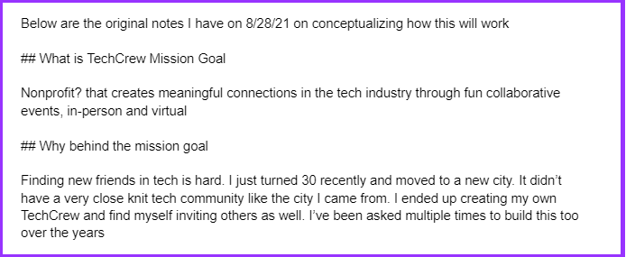

Brand names are what define an organization or entity. 

Getting it right the first time makes it easy for everything else to fall in place, from logo design, getting a domain name, etc

Here is the thought process behind designing the brand name for Tampa Devs

## Determine the brand name

Tampa Devs wasn't actually the first pick for a name. I actually was thinking bigger. My initial brand name was called "Tech Crew". The reason for this is my best friend always says "Let's get the crew together" and we'd end up talking tech shop. 

The name was perfect - it was 2 syllables long, generic enough to work in every city. I even wrote a business plan for it, you can read the full doc [here](https://docs.google.com/document/d/1snVssrKDEHDyhGjEk4RTnipnqBaD-gD-eQ-WjCCfu0E/edit?usp=sharing)

    
For the logo, I took a bunch of random images online that I think could work. I was thinking of a car crew in formula 1 racing, and making an analogy to developers working together in tech. I would then send this off to my designer to conceptualize, and use the business case above to describe the vision

_some images are a bit questionable..._

I gave it a few more days to think about. I didn't need to make a decision right away. To take my mind off of things, I went running near my apartment complex.

Sometimes the best ideas come when you least expect it. And so that's how it happened

I came across a dirt path while running:

I had a realization. There is always a more optimal name, a more optimal path, that people will just create over time. A good logo follows the dirt path, a bad logo follows an unused cement path.

If "Tech Crew" grew in Tampa, it would have been summarized as "That software dev group in Tampa" to someone who didn't know about it. 

It's almost like an elevator pitch of sorts - if someone asked you what LinkedIn is - you'd tell them it's facebook for business users and your "linking into their network". And facebook is a "book of faces" for people to connect with each other.

**Basically the punchline people naturally come up with needs to share the same key words as the logo**

So I went back to the drawing board. This time I thought of what associations people would draw of this group.

The first is location. I wrote a few places that people associate with in general in the area:

- Tampa
- Tampa Bay
- Channelside
- Ybor
- Soho
- St Pete
- Hillsborough

On a few national blog articles, "Tampa" is mentioned as one of the fastest tech growing cities, so it made sense to have "Tampa" in the name.

"Tampa Bay" was an additional syllable longer than it had to be (think of the dirt path analogy), so "Tampa" it is

The next word needed to describe what the group was about. Here's what I came up with:

- Software
- IT
- Tech
- Technology
- Programmers
- Developers
- Devs

I then just said the names aloud. One of the lessons I've learned in working retail is you should be able tell people how to spell something over the phone in as few words as possible.

"Tampa devs" just had a nice ring to it. I was leaning more towards "Tampa Developers" since people might not know what "Devs" means. I found out later that those that aren't in tech don't know what "Devs" is a shorthand for. It's sometimes confused as real estate as well

I did some cross checks with other [local tech communities](https://github.com/thisdot/tech-community-slacks). Other communities had names like Orlando Devs, Denver Devs, Charlotte Devs, etc so the name was proven to work. 

In my article on [why I started Tampa Devs](https://www.vincentntang.com/why-i-started-tampa-devs/), I mentioned Orlando Devs as the inspiration for starting Tampa Devs. 

You might be thinking 

- Orlando Devs
- X Devs
- Tampa Devs

Where X is the city name. And that I should have just instantly used "Tampa Devs" based on this alone

A lesson I've learned working in startups is to never assume any past conventions to be optimal, or even correct. This is why you see so many articles about companies wasting so much money on [google ads](https://venturebeat.com/business/dropbox-drew-houston-adwords/) thinking this is how to scale their marketing efforts

A good brand name goes a really, long way. Just look at Apple