When I first set out to design the [Tampa Devs](https://tampadevs.com) logo, I wanted to build it for the long term

Scaling long term meant getting [branding](https://vincentntang.com/coming-up-with-brand-name) right first. Getting branding right meant having a sexy logo that people remember.

A good logo should describe exactly what the organization is about too. And it should look good everywhere - on printed media, as a favicon on a website, on a T-shirt etc.

There are so many considerations and factors in designing a logo. Big companies like Twitter, Apple, Facebook, etc pay millions of dollars to experts who update what is essentially an image. I could doodle an image in 5 minutes, but the level of quality won't be the same.

Here is the thought process behind designing Tampa Dev's Logo:

## Figure out the core elements

I wanted this logo to be a coding theme specific to Tampa.
But what exactly is Tampa even known for?

I went down a wikipedia and google rabbithole. First, I looked at the origins of the city. It was founded as a thriving cigar production and immigration city. To this day it's mostly known as "Champa Bay" and as a fast growing tech/beach city.

I looked at some Tampa's most well known current elements:

- Tampa Bay Bucaneers (football team)
- Tampa Bay Lightning (hockey team)
- Gasparilla (Pirate festival)
- Ybor City (cigars, location)

2 of the major elements in Tampa are both pirated related. So the shortest and sweet summary of Tampa is `Tampa=Pirates`

This was enough to get started

## Getting Started with Logo Iterations

I sent over my design notes to the designer on fiverr. Here's what was sent:

First, some generic information about the logo. I wanted it to be abstract akin to logos that you see with facebook, twitter, etc since those tend to work best on every medium. Class, modern tend to fit those same logos I liked best

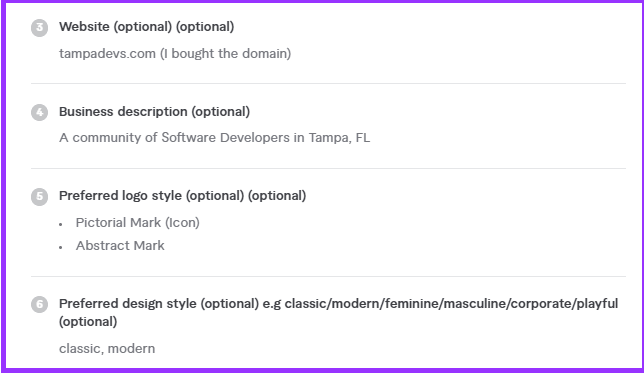

Next, I threw some ideas about the logo, and other logos to take inspiration from.

Some ideas included using the same color schemas as the popular sports team here, using the word "TD" short for Tampa Devs as a play on words for touchdown in football for the Bucs. And how the logo might be used in Slack, and an idea to emulate the [Orlando Devs](https://orlandodevs) logo since it we're like a sister entity to them.

The goal here is to provide some context to the designer, but not too much. I wanted my designer to have creativity freedom and to come up with his own ideas

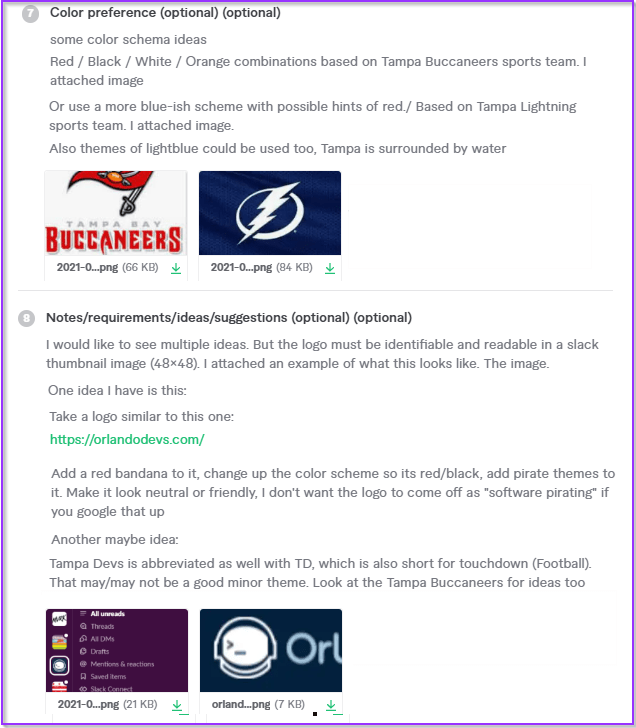

A few days later, I got back the first revisions to the logo. Our designer came up with a few concepts:

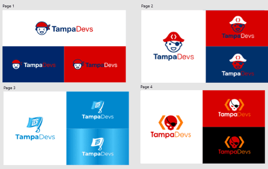

Pages 1 and 2 were based on the face icon of the Orlando Devs logo. They were pretty good starts, page 1 was a bit too happy, page 2 looked too much like a pirate baby though, but I liked the idea of a `<>` coding theme on a hat

Page 3 was too flat, too generic with too many details going on. I liked the idea of a sword and a flag combined to make the pirate theme, but it didn't really sell the coding idea so much.

Page 4 was too aggressive. We were a young 20's and 30's fun coding tech group, not a hacker entity so this logo was out of the question

## Second iteration of logo designs

From there, I took page 1 and 2's logos and started to reconceptialize them

- Page 1 I wanted to be more coding themed
- Page 2 I wanted it to be more mature

This is what I got

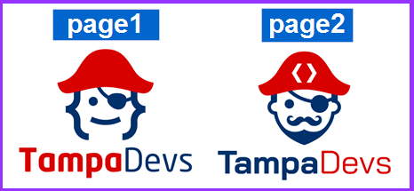

Page 1 was just like a demon looking monster, so that was a no go. Page 2's revision was good, but a bit too manly and sexist I found out later through asking my friends for feedback

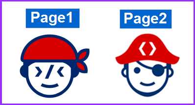

Okay now Page 1 looked more like an old man, definitely not what I envisioned a young fun tech group to be like. At least I could see what the ">/<" looked like on a face. Page 2 the beard was trimmed a little bit so it become more of a stubble, it looked more friendly to female devs too

We ended up reconceptualizing some designs for page 1

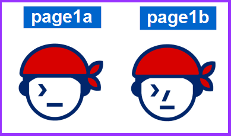

Page 1a was closer to what I was looking for. A face with a recognizable terminal on the image. Page1b was in the wrong direction, the nose was a jarring experience to look at

Our designer made a few more modifications, they were going in the wrong direction so I'll omit them here. I took all the logos I created and sent them to friends for advice

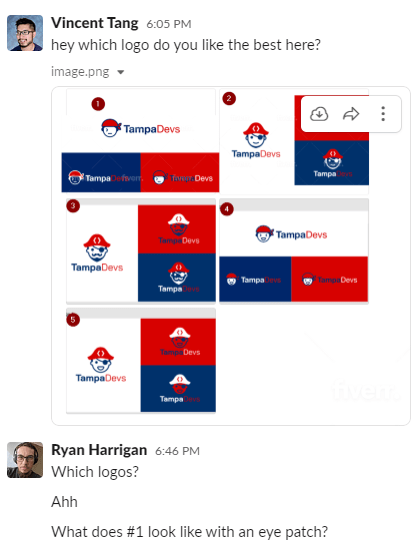

My friend Ryan said "What does #1 look like with an eye patch?". That was a brilliant idea, so I sent it over to the designer. Here's what I got

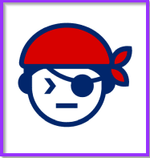

It looked like Solid Snake from [Metal Gear Solid 5](https://en.wikipedia.org/wiki/Metal_Gear_Solid_V:_The_Phantom_Pain), the logo definitely looked badass but maybe a bit too badass? It wasn't aggressive but it wasn't super friendly either. I did really like the idea of an eye patch though on this iteration

For the next iteration, I asked the eyepatch to be "less bold" / make it a bit smaller, so the elements of the terminal/coding were more pronounced. Here's what I got:

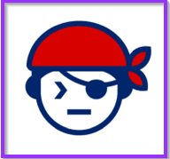

I took this to Jacques Fu (he's the CTO of a unicorn company), my mentor and advisor from Orlando Devs. I got really valuable input here, when he said to use "negative space"

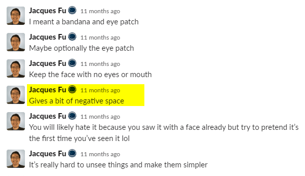

I wanted to conceptualize this while chatting with Jacques, so  
I just drew a crappy doodle of what he said

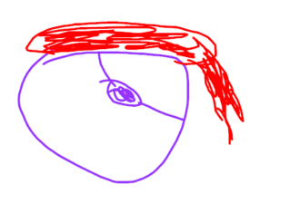

I gave the logo alot more "white space" maybe a bit too much, but having this extreme was eye opening. I still wanted to incorporate a coding theme here, but I got some solid advice afterward after logos in general about how not all logos indicate the industry

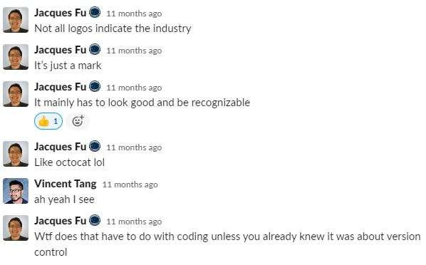

Jacques actually ended up designing the final logo here doing some quick editing magic

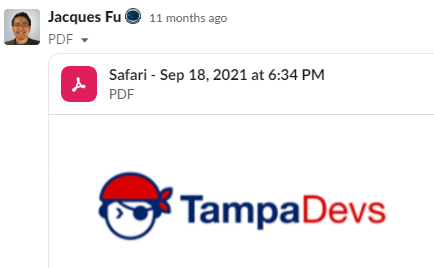

I loved this iteration, but I still had some second thoughts about the logo and that it could _still be improved_. We tossed around some ideas of using a different bandana just to see what it'd look like

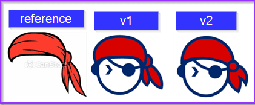

It looked a bit more feminine in nature, whereas the one Jacque created was more unisex. The issue with the bandana was the logo wasn't asymmetrical already. Also adding in the bandana made it less symmetrical meaning it wouldn't look good in favicons or small thumbnail images.

It was still a good thought process though

## Validating the design

I stared at these designs for a month straight. While I did have an idea that Jacques design was almost perfect from a designer's point of view, I still wanted to run A/B tests on meetup attendees. Most of the feedback I had gotten so far were friends from Orlando, but I needed feedback from people in Tampa

We just had thrown together our second networking event at one of the local food truck venues. I decided to do my user-studies here with about 20-30 people in-person. I just tallied what people thought were some of the best logos. I intentionally put some bad ones on here like the manly pirate logo and baby face logo.

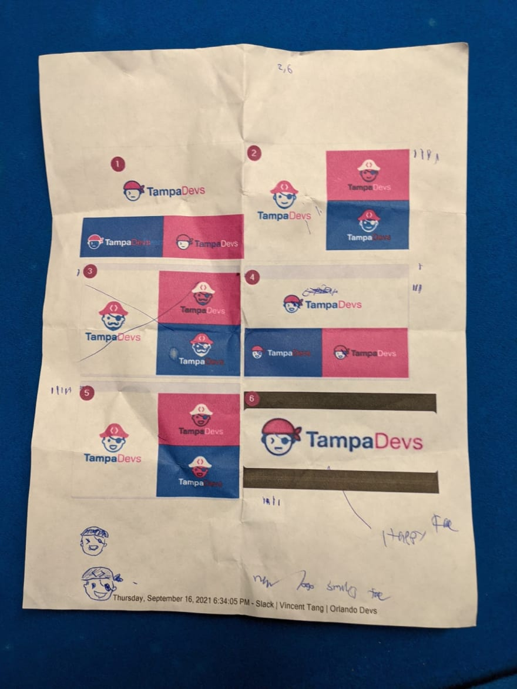

**What I had learned from doing these studies is that most people can't actually tell a good logo from a bad one**. If I were to asked to pick out a $500 wine bottle from a $20 wine bottle, I probably wouldn't know the difference, but my wine connoisseur friend would.

What this did teach me was "how to identify" someone with sharp design skills. Someone with sharp skills could tell me why one logo was better than another, from a printing standpoint, to mathmatical geometry. Ultimately it does all boil down to taste, but some people have better taste than others so-to-speak.

I talked to a former CMO (chief marketing officer) and my friend Andre, who actually picked out the closest design of our final logo. Andre later also helped me design the [Tampa Devs hat](https://www.vincentntang.com/designing-custom-3d-pvc-hat/) too

I wrote a design doc indicating all the feedback I got from each one as well found [here](https://docs.google.com/document/d/1Aw71S6dyZZmnj7mRCdRi2srFjf_Trw_MVEDy5ssIH74/edit?usp=sharing)

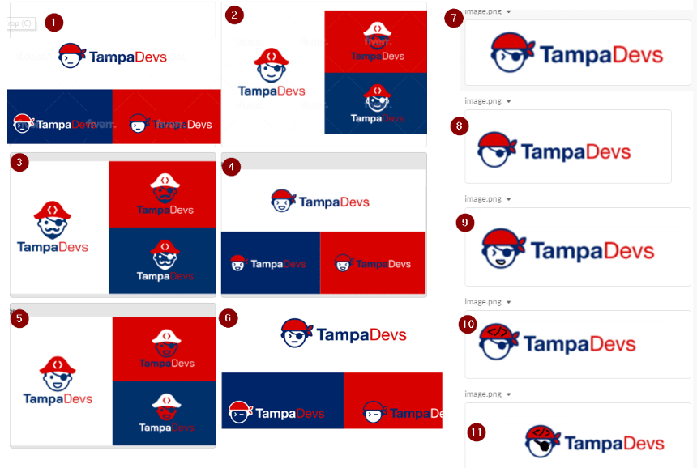

## The Final Design

The final design ultimately was the one Jacques created.

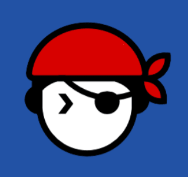

I'm a bit biased but I think this logo is nearly perfect. It contains multiple sub themes that are both relatable and friendly to someone that is young, eager to learn, nerdy, in tech, and likes to have fun. The headphones and bandana also leans more towards the abstract look of a hipster developer. The `>` is representative of a terminal, and an eye-patch adds a little bit of badass-ness that you'd proudly wear on a T-Shirt

It also looks kind of like a pokeball from pokemon

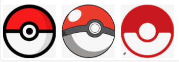

If you slice the logo, it's follows some of the geometric principles of design like in the Twitter logo for instance.

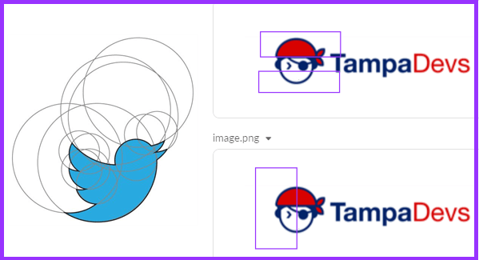

The logo also is a bit similar to a fun-playful vibe that you see in ninja restaurant logos, which fits the vibe of the group

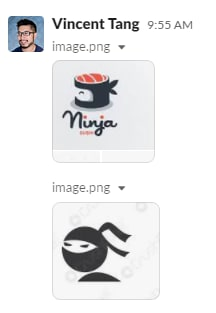

Also looks dope as a `¯\_(ツ)_/¯` on a T-shirt

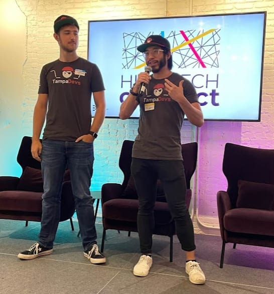

And 3D rendered from Doug's [DevOps presentation](https://www.tampadevs.com/talks/2022/20220406-intro-to-devops/)!

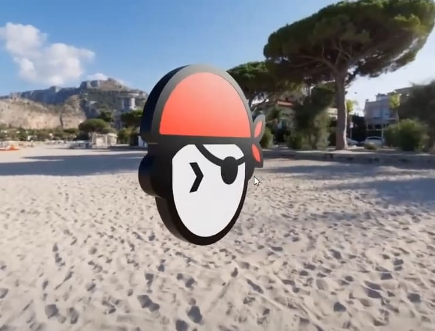

And on stickers/hats:

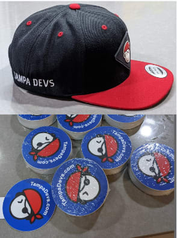

Hopefully this gives you inspiration for designing your own logos! It took close to a month to create the logo, from the design iterations - feedback and everything else involved. A good logo when done right gets lot of compliments too :)

EDIT: Here's a snapshot summary of all the subthemes for the logo

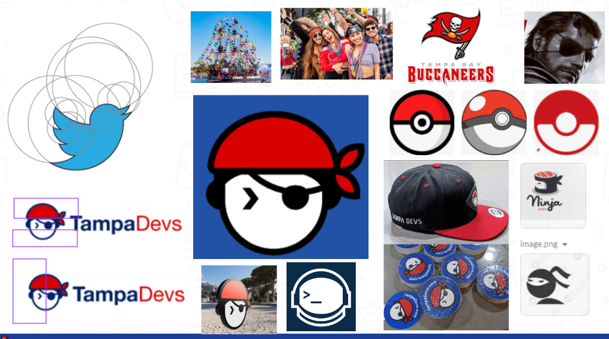
