Since starting [Tampa Devs](https://tampadevs.com), we've grown it to 1000 members in just 1 year!

As we continue to scale, one of the core challenges is getting funds to support our ever growing needs. These include food for attendees, venues to host tech talks, and marketing/legal costs to running a community

One way to get funds is through a sponsor pitch deck. It is a sales deck that we pitch to potential sponsors. We detail what our organization does, and how we can benefit them through recruiting and branding opporutunies in return for money.

Here is how to create the perfect sponsor pitch deck

## Use a google slide deck

A sponsor pitch deck is a sales pitch deck usually done through a zoom call, or in-person meeting. Some sort of presentation medium is necessary or helpful for these.

You can use a number of different tools:

- Microsoft PowerPoint
- A custom PDF designed through Figma or similar tools
- Prezi
- A google slide deck

I recommend going for a google slide deck. While it's limited in terms of what designs you can implement here, there's a number of features that are useful for crafting a sponsor pitch deck

- Templates
- Exporting to PDF
- Ability to share links
- Commenting with teammates for collaboration

Google slides doesn't do anything more than it has to, and is easy to create a final polished product without spending too much time on design

## Create a design template

In sales, first impressions are everything. A potential sponsor should get the impression that your organization has alot of potential, since they are essentially investing in your organization or you as a leader.

A design template helps create that "wow" impression. It helps streamline the creation of different types of slides. There's a few key critical elements to it

- A solid background image that isn't the default on gslides
- The logo present on every slide
- Consistent fonts / text sizing across slides

The background image should be represented of your organization. For us, we wanted something lighthearted and fun, but still serious. We opted for a playful background with developer themed art such as languages, APIs, and other coding items.

Here's an example of our intro

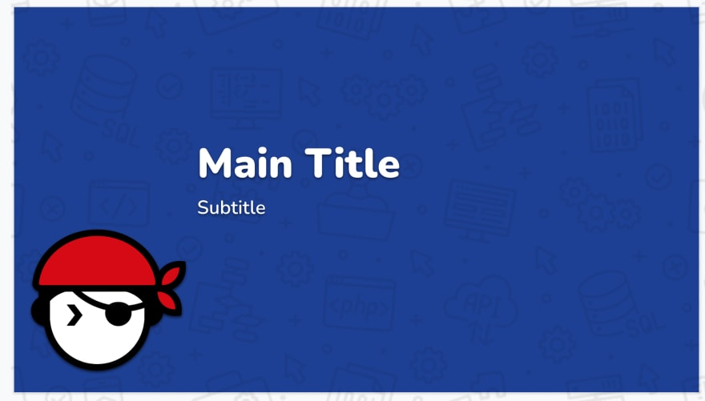

The second type of slides we use is a customizable slide to provide content in any format. This slide is the default slide we use across our deck:

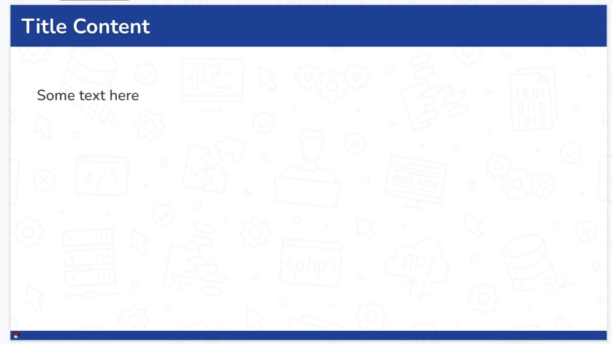

The last slide we use is for slides that are for major talking points. These we split into a left/right side, so the audience will focus more on the text provided. It also add variety in the deck so not every content slide looks the same:

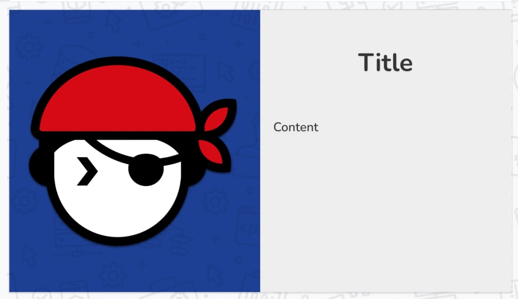

These are the only types of slides you need for your pitch deck. Anything else just adds additional flavor; we chose to keep our template simple 

## Creating a TLDR intro story flow

<!-- 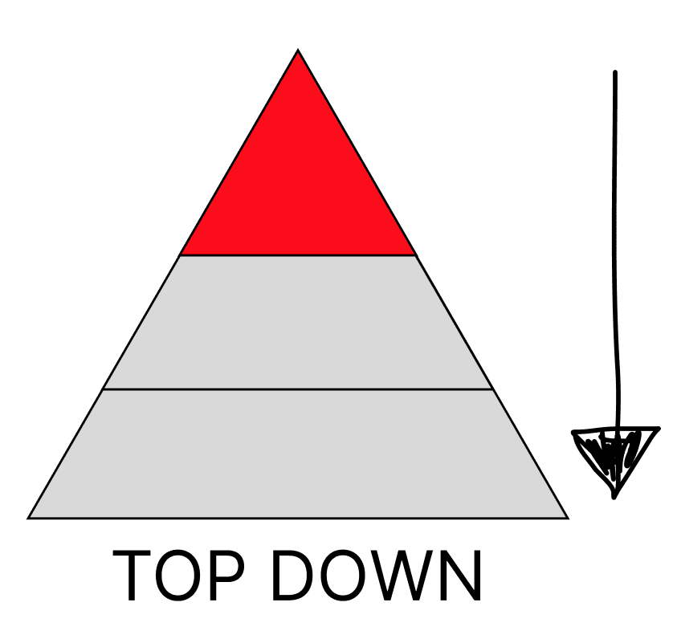 -->

A story flow indicates how a story should move. It's based primarily around the questions that the potential sponsor has. Namely, the first thing a sponsor wants to know is who is presenting, and what is the organization name. You should assume the person you are speaking to is in alot of business meetings, so a refresher is always nice to have

These are our first two slides:

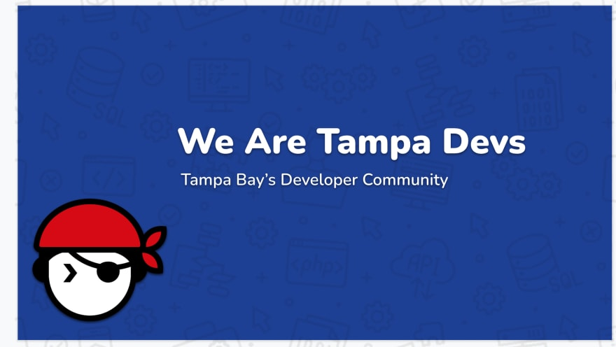

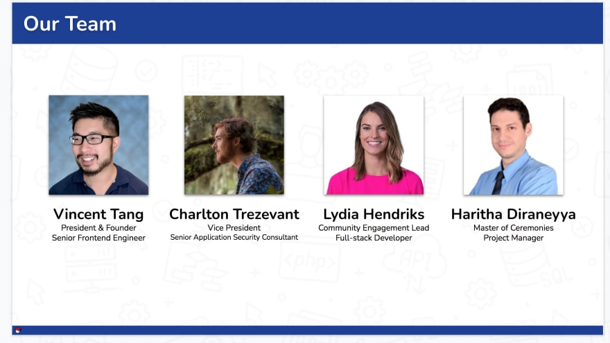

Once the introductions are out of the way, the best thing to do is to use a sizzle reel. It's a TLDR approach to what the organization does in 30seconds to 1 minute

Here is our third slide:

<iframe width="700" height="500" src="https://www.youtube.com/embed/4Su50PRr-xk" title="YouTube video player" frameborder="0" allow="accelerometer; autoplay; clipboard-write; encrypted-media; gyroscope; picture-in-picture" allowfullscreen></iframe>

A picture is worth a thousand words, and a video is so much more. Within the first 2 minutes of our pitch, we have the attention of our sponsor and create a sense of excitement before detailing further our mission and goal statements

Our fourth slide now summarizes our mission statement, in as few words as possible. This is still part of the TLDR introduction segment. It also re-affirms what they might presume in the third slide video

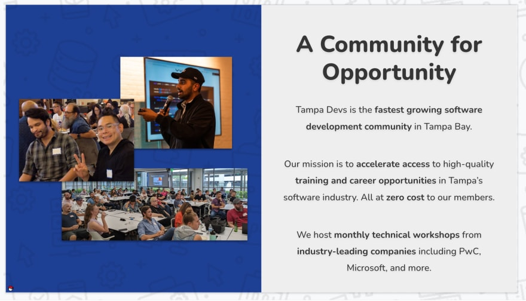

For our fifth slide, we start go into TLDR of quantitative stats as a whole. This provides some level of how strong of a branding or recruitment oppurtunity we can provide to our sponsor, before diving further. It helps establish the big question of "is this group worth investing into?"

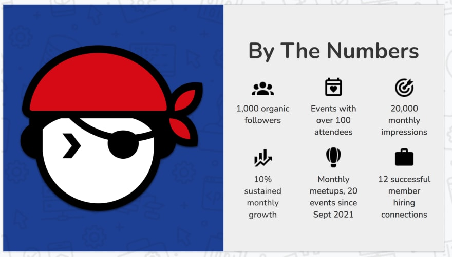

By the 5th slide, our sponsor should be having the thought process of "okay this group seems like it has potential". That's the key point we're trying to sell here so far

We continue going down the quantitative stats trail in slide 6, to show we do quantitative analysis and provide metrics on everything we do:

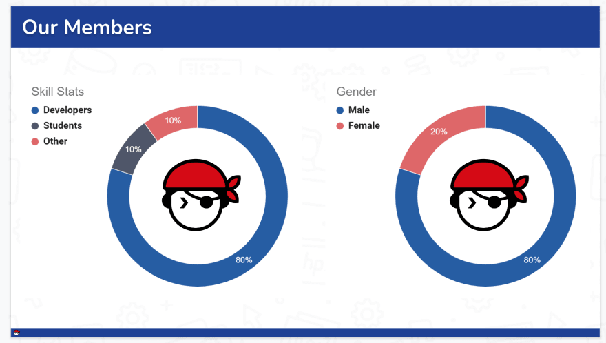

## Create the historical background of the org

<!-- 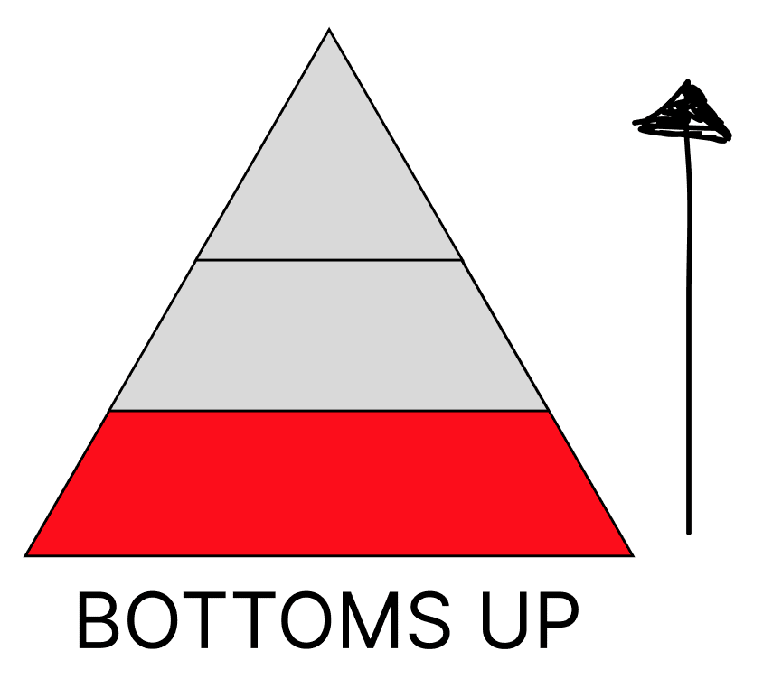 -->

At this point, the potential sponsor should have some idea on what our organization does. They should have some idea already on how we can create a win-win sponsorship package too. They should have some level of confidence moving forward that every slide after is worth listening too.

This is when we tell our story. We started from the top, now we start back at the bottom. A good sales pitch is a story, and this is the main driving point we want them to remember, since this is how they'll talk about our group to their boss/decision-maker or colleague.

So this is slide 7: 

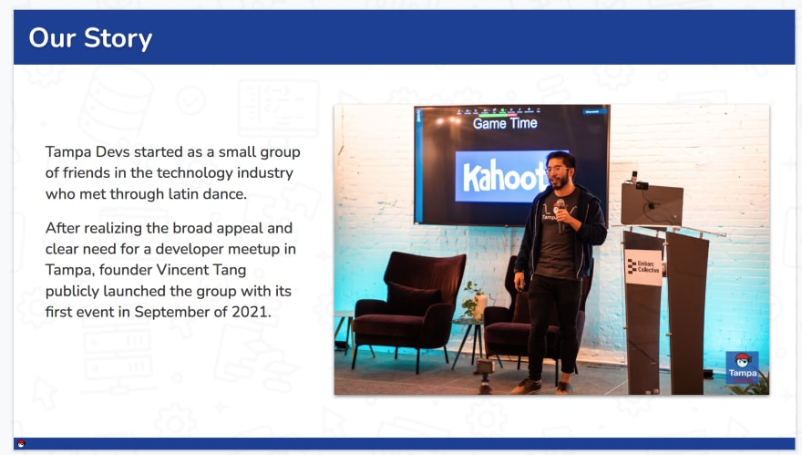

Tampa Devs started originally as a group of tech friends who met through dancing. I tell them this, and it's usually something that makes them go "huh, interesting". It's part of the story and charm that people associate with in Tampa Devs

For our next slides, we start layering the foundation of our org. They provide context on how we cater towards the mission statements in the first few slides of the pitch. We do this by hosting networking events, mixers for startup entreprenuers, developers, and people in their 20s/30s that may have recently transplanted to Tampa and it's surrounding area:

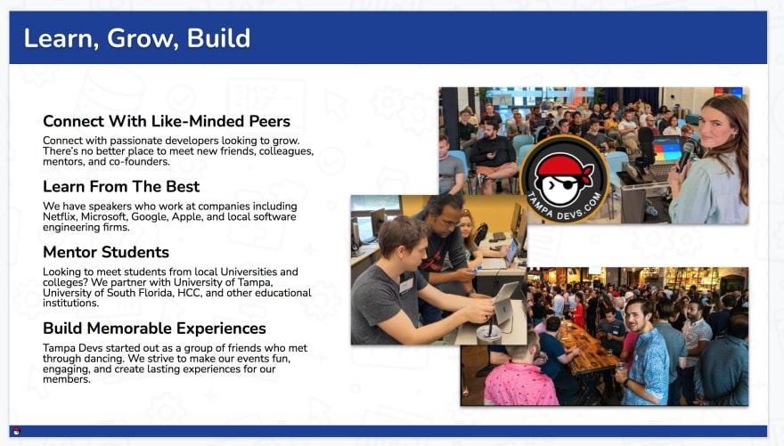

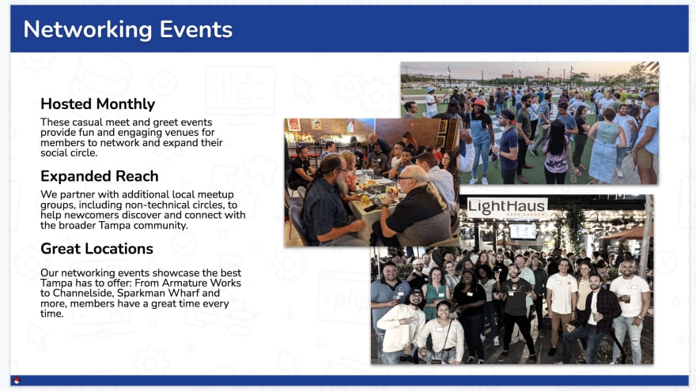

And also by tech talks (+ how they work as well for an event schedule). The event schedule gives them some idea in where we insert sponsors during our tech talks as well. It also provides a frame of reference of what attracts developers to Tampa Devs too

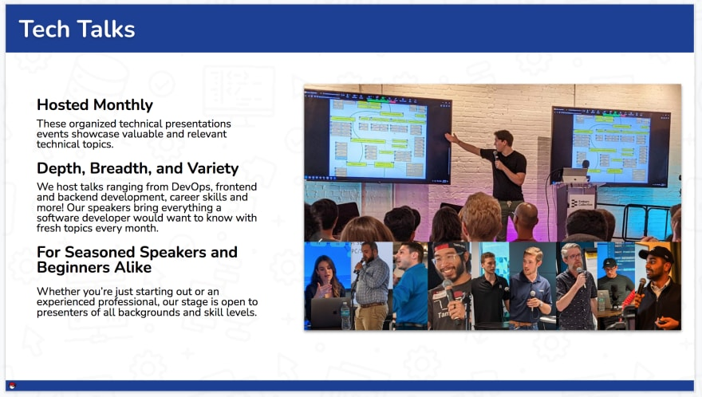

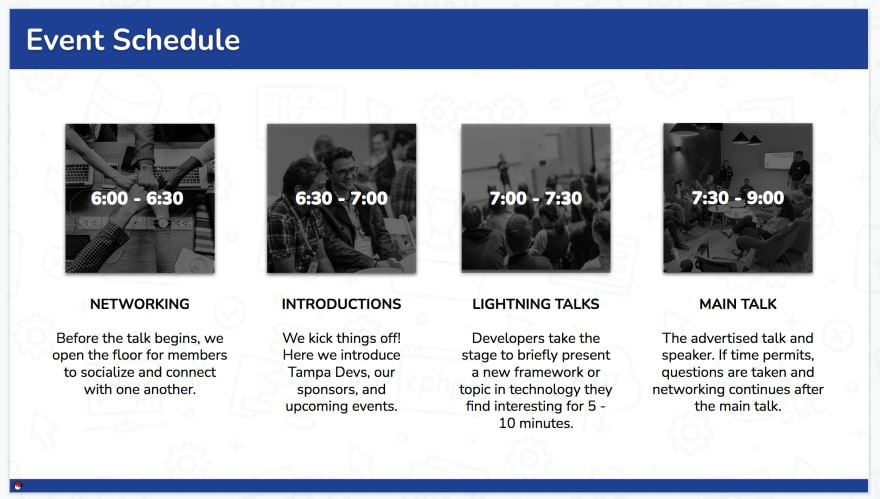

## Softening the hard sales pitch

<!-- 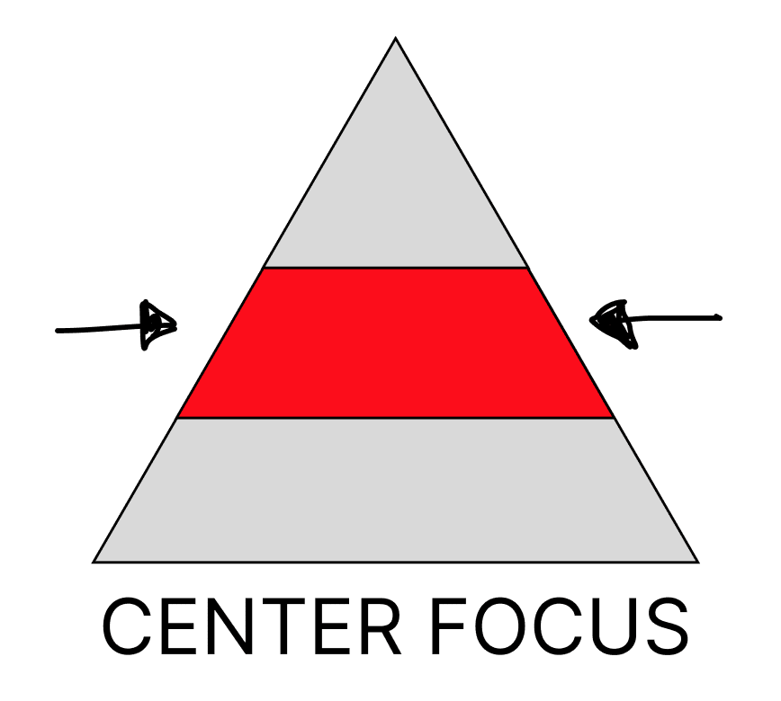 -->

Now that we've covered things from the top, and from the bottom, it's time to soften up the sponsor to the actual pricing pitch

We introduced the history and beginnings to get the sponsor emotionally invested. This is the slide that then reinforces the community aspect from their angle:

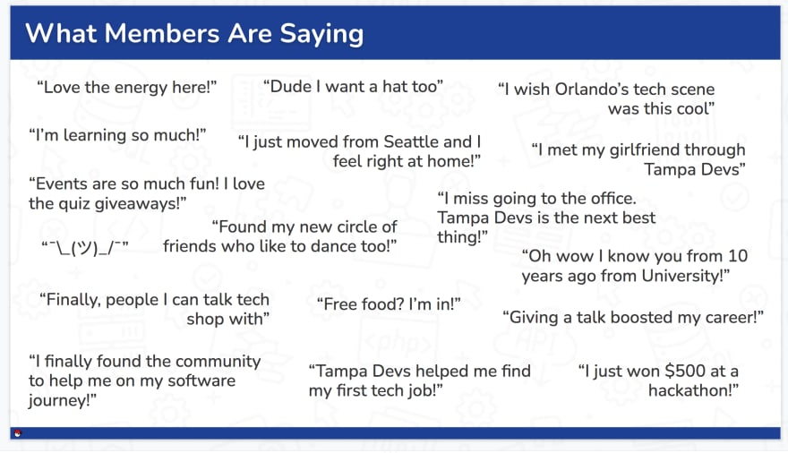

These were all quotes at one point or another that I heard from members. It helps gives our members a voice in the creation of this pitch deck. 

As we're beginning to approach our hard sales pitch pricing guideline, we state that we already have sponsors and partners on board that are current subscribers. We have our sponsor slide now:

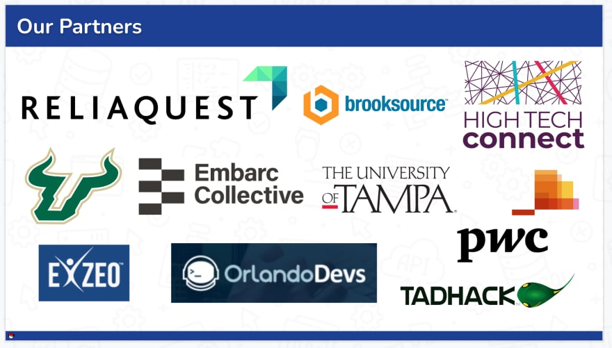

This answers the question "Well if my competitor is sponsoring Tampa Devs, than by that rationale we should too!". This is the approach that we're going for

To nail the point home, we provide real marketing photos of events at our sponsor. It's one thing to state we have a sponsor, it's another to actually show it in action:

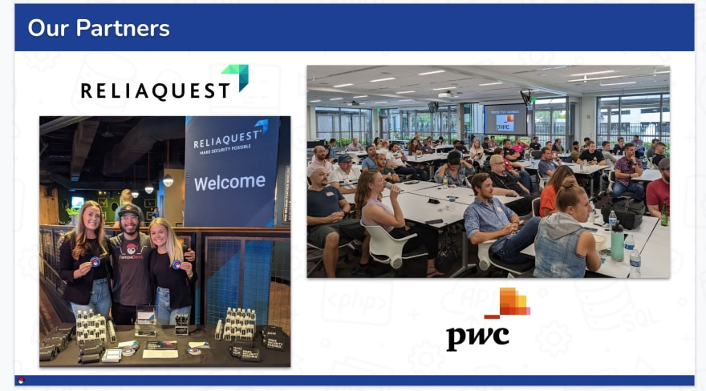

We are portraying ourselves as "not desperate" / "we have lots of options for sponsors" at this point. This gives us a higher level of authority to price things later as we deem is fair for sponsors, based on our market

Before our main sponsor pitch, we still soften up the main pricing point by stating how we use our funds. A sponsor will want to know that we're not just profiting all the funds and providing the minimal amount possible to our members. This is all part of the emotional investment strategy of our sales pitch:

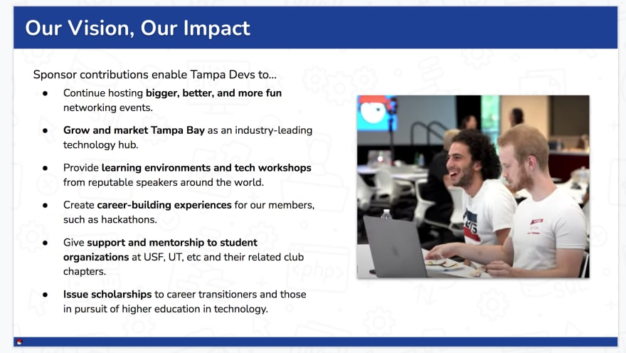

## Presenting the sales pitch

All the slides beforehand were just leading up to this moment. In a good sales pitch, you always present the price after getting the sponsor invested. This puts them in a good/happy state of mind so that you're more likely to close the deal. You can also sprinkle some specific slides to the sponsor you're dealing with to help reinforce their commitment.

Now, here's the pricing deck guideline. This is the catalog so to speak, the win-win strategy for a company to sponsor us:

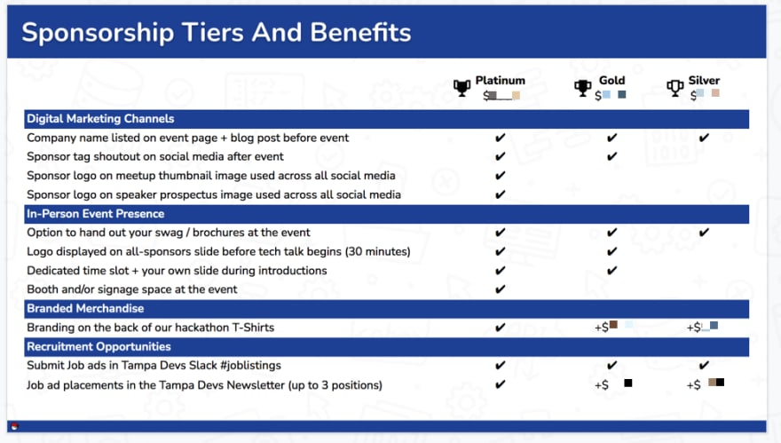

I've omitted prices here, but it should give a general gist of how we price things out.

We offer companies a multi-tier system, based on how they want to invest in our organization. These tiers are mostly tailored towards our customer types

- Silver tier - small companies that want to get their company name out here locally
- Gold tier - HR and software firms who want to hire local talent
- Platinum tier - Large corporations who want to maximize our branding and recruitment oppurtunities

This sponsorship business model is done on a per talk basis. Since they're are not too many business models to emulate, we emulated ours after tech conferences. Except we're hosting multiple "mini conferences" throughout the year so to speak.

Here are what some of the supporting slides look like, for detailing the benefits in each tier:

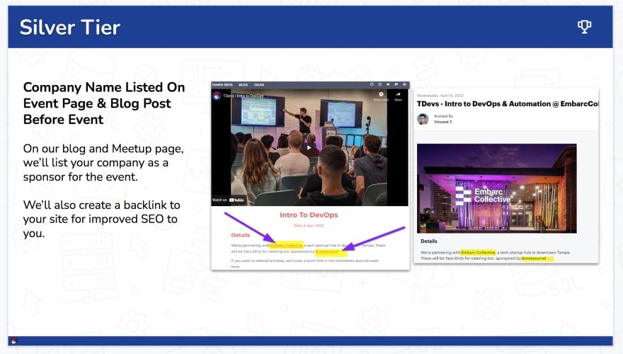

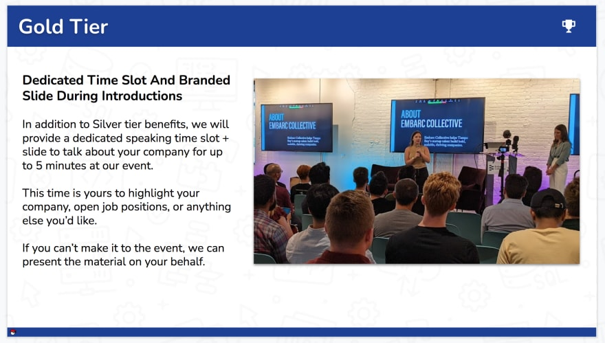

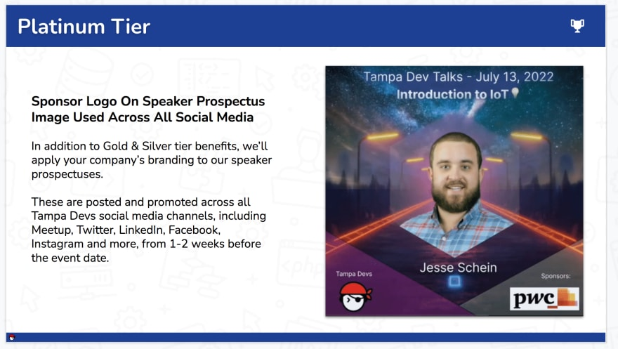

Before closing off the slides, we reinforce the main value proposition that Tampa Devs offers to our sponsors. Namely, branding and marketing oppurtunities:

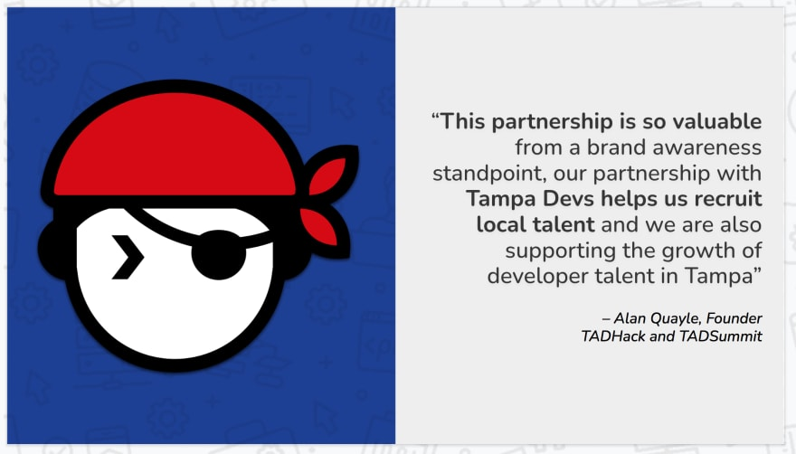

It's important to hit the main points over and over again throughout the slide deck, since there is so much information we just presented

At the very end, we present our closing slide where we allow the sponsor to ask questions:

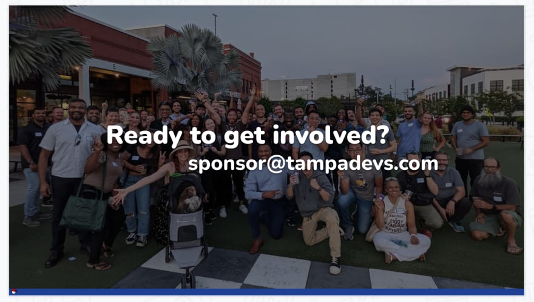

This helps us determine whether our sponsor slide deck needs tweaks, improvements, etc. We get a better gauge as well what the sponsor's marketing budget is for the year, and gauge interest for this entire deck

It might be a good idea to get an idea what their budgets are beforehand so we don't waste time doing this 30 minute proposal speech. But it's short enough that we are okay if we don't convert a sale or potential sponsor

In the end, we want the potential sponsor to take home three different things:

- We are Tampa Devs, a community of software developers
- We offer branding and recruitment oppurtunities in exchange for money
- We are very good at what we do

## Future Updates to the deck

There are a few ways we can improve the deck, namely in that we're going to differentiate our customer type. Namely, we have two main types of sponsors:

- Small local companies and recruiting firms who want short term RoI (e.g. hiring local talent)
- Larger corporations for long term RoI (branding, and hiring local talent)

Ths will be done by providing additional quantative analytics, and a job board we'll be creating in our subdomain later on, as additional tiered features to our pricing table
