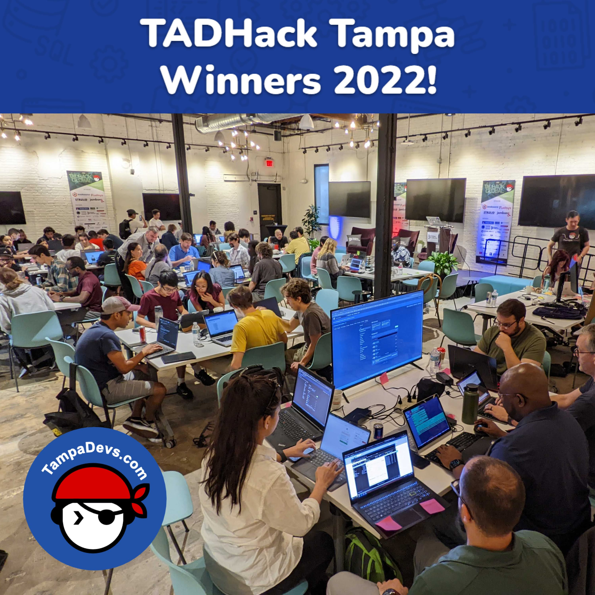

After 6 months of planning we did it!! We hosted our very first hackathon with [TampaDevs](https://tampadevs.com)! Read the summary of the event [here](https://www.tampadevs.com/blog/2022/20221016-tadhacks-tampa-winners/)

I remember what it was like trying to get my first tech job. Recruiters would tell me "Sorry you don't have any work experience, we can't hire you" but I couldn't get job experience without a job 🤔

Most people would give up there but I got creative and shortcutted my way to success. Thus I became a competitive hackathoner! Who needed job experience when you could just have awesome senior mentors teach you how to code over a weekend?

That, and some free youtube tutorials, and 15 hackathons later I got my first job! By the time I got my first tech job, it felt like I worked in alot of startups. And I was $5k richer too from hackathon winnings! Ever since then I became an advocate for hackathons in Tampa, I gave a number of talks at local Universities and schools.

Tampa hasn't had any well organized hackathons in years, even before Covid. I had a dream one day to host my own, and sure enough TampaDevs was born amongst a group of friends I had in tech

As TampaDevs grew, so did the opportunity to host a hackathon! We had all the resources, networks, partners to make it all happen! This was all just a pipe dream many years ago but through all the connections I've made in Orlando and Tampa, I wanted to make it a reality!

I contacted my favorite hackathon organizer Alan Quayle 6 months brand a local division in Tampa! Sure enough he agreed, and throughout the next 6 months we went to planning TADHacks Tampa!

I have never organized a hackathon before. I knew it was going to be alot of work though, but I didn't realize how many setbacks we'd have along the way. Like we had ALOT of them. If I had to name some of them:

- Our 1st venue dropped off last minute 3 months before event
- Our 2nd venue dropped off last minute 2 months before event
- Hurricane Ian
- My computer got destroyed during a lightning surge and I had to rebuild it from scratch
- Sponsors dropped. We had to pay for alot of this out of pocket since we had no time to find new sponsors
- Our photographer got robbed

Amongst all of these setbacks, the sheer amount of work that had to be done was crazy. I couldn't even type on my computer the 5th month in since I had to move dozens of TODO sticky notes piled on my desk. And that was just 1 of our 5 kanban boards, managed just between me and Charlton Trezevant in our free time. And the hackathon was only 1 of several projects we had running simutaneously, we also were working on sponsor pitches, nonprofit legal work, startup administration work, market branding, video directing, event hosting for our next tech talk, etc.

I have been managing almost every hour of my life for the past 6 months. I would tell myself "I need to do X tasks in this hour" and "I need Y hours to decompress after Z number of days working". There was almost no room for error. Now I'm glad that's over with...

I'm going to go celebrate, play lots of video games, and be a hermit

--

## Things I learned

EDIT: Also here are all the things post-mortem that I learned as well hosting a hackathon

PR Learnings

- Getting news coverage is hard. We reached out to 10 different news channel with press media pitches over the span of 6 months. Not one of them republished our hackathon surprisingly, I don't think Tampa is ready yet as a tech city to understand what a hackathon is, at least on the PR side. We're basically facing the same problems as AirBnB when they first started (pioneering an idea)
- You can pay a company like Cision to syndicate your pitch media to news sources
- Be prepared for all your cold emails to be ignored and never opened by any public emails listed on University websites, no matter how catchy the subject title is

Technical Learnings

- Youtube doesn't let you stream a new account 24 hours after you enable it. Good thing we tested 2 days early...
- Youtube bulk video editing is not user friendly
- Capture Cards are amazing for live streaming, it's plug and play with OBS
- Record-ception. My DSLR was locally recording to a laptop that was locally recording that was connected to a live stream recording on another server. Talk about complicated setups...
- Wifi can get seriously congested during presentation time on Sunday
- Bring lots of extra power cord extension packs

Venue Logistics Learnings

- Hackathons are expensive. We paid $1,5000 for the venue, $1,000 for videography work, and at least $500 per meal session, and $1,250 for prizes. So it comes out to about $5,000 to host a legitimate hackathon, it's about the same work as hosting a conference
- Hosting at a well known University is ALOT of red tape. They don't let other students/professionals outside their Uni attend
- Always get things in writing and have backups. Our 3rd venue was the one that pulled through

People Logistics

- Someone shilled their startup at our hackathon pitches. None of us had time to validate or catch it
- Everyone wants you to help them. Go lock yourself in a room and make yourself less available else you won't ever get anything done on time
- Our photographer got robbed. Someone came in with the intent of robbing something, never leave your gear unattended!
- Hackathoners can be hardcore, one dude brought a triple monitor setup for his laptop
- Don't forget about accessibility. We had a deaf attendee and didn't have a way to really help him...

Sponsor Logistics

- 2 of 3 of our telecomm sponsors didn't even provide a way to contact them for the attendees... and this is for a global event. Don't expect them to be prepared....

Volunteer Logistics

- Volunteers are awesome, we had them make little trinkets for everyone at the event (yay free slave labor, jk)
- Judges can be super harsh. People get on power trips really easily. One of our judges wanted to score a project with a score of 0... ouch

Money Logistics

- You can only get $1,000 at a time from an ATM by default on most banks
- Never considered having envelopes as a thing we'd need for a hackathon

Marketing Logistics

- Banners come in alot of flavors and sizes, you can get them with grommets, stands, and so many other things 

Food Logistics

- Panda express is pretty cheap for paying for food for alot of people. Same with publix.
- Don't forget about coffee and energy drinks. Even with Red bull there, it wasn't enough caffeine to go around.
- Krispy Kremes is one of the few places that still serves coffee in boxes

Improvement lists

- Preventing theft, force sign in and async registration checkin. Everyone flooded in at 10 A.M. on the dot
- More energy drinks
- More planned mixers for meeting people/projects and better intro slides