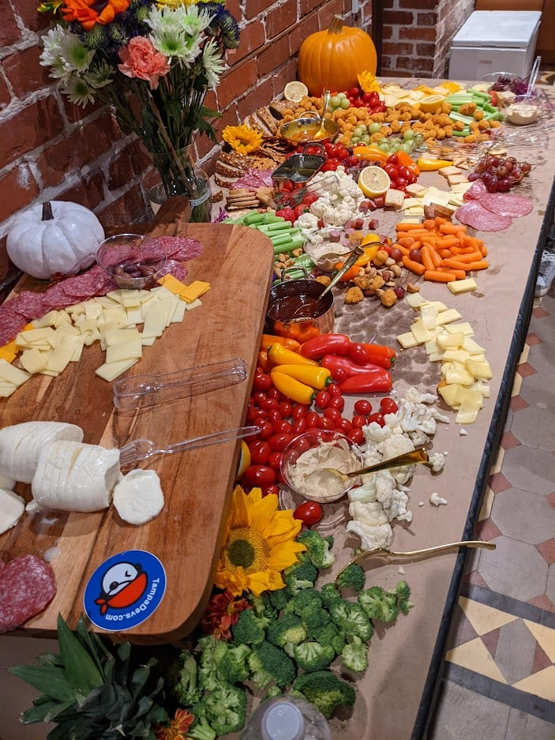
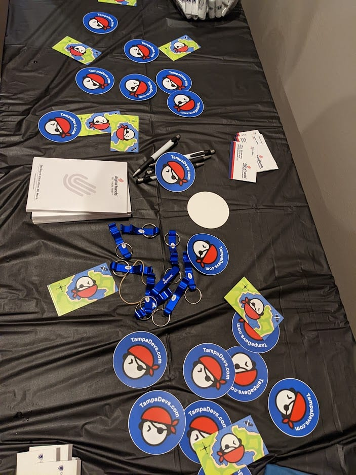

Swagging a table is an art form. It's guerilla marketing at it's finest, you go to an event and toss all your swag on the table. People will curiously pick it up and learn more about your org

There is a right and a wrong way to do it.

Dos 

- Toss it completely randomly on the table
- Spread it out
- Make sure the swag has alot of vibrant color to it
- Get approval from the event host before doing it
- Alternate it with other swag medium (circle stickers works well with rectangular business cards)
- Put a few swag items near food and drink sources

Don'ts

- Don't put it in a neat stack

Examples of how to properly swag at table. It's all about maximizing surface area and piquing people's interest, while using the least amount of material possible:

