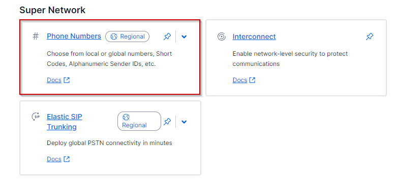
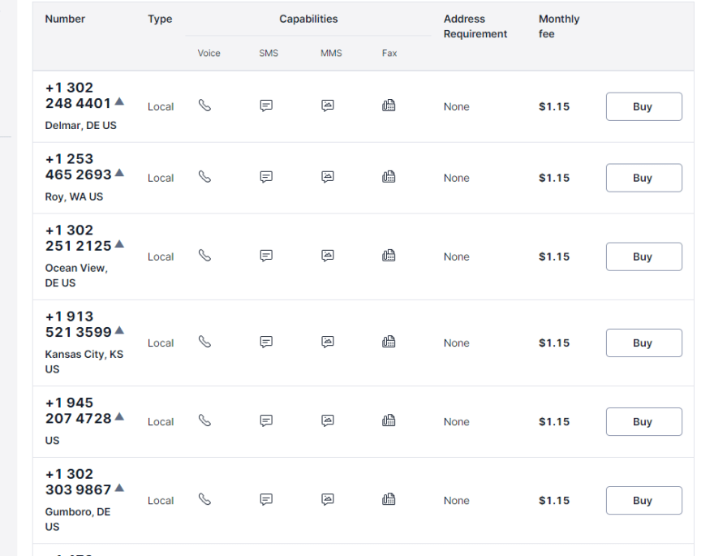
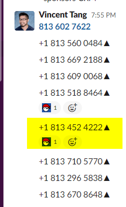
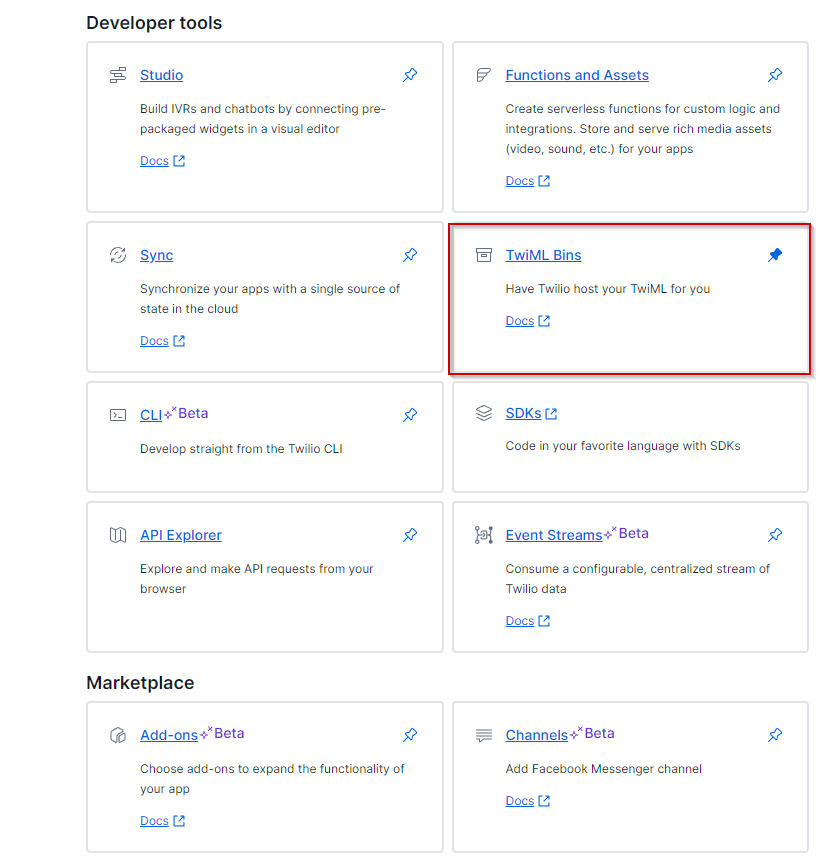
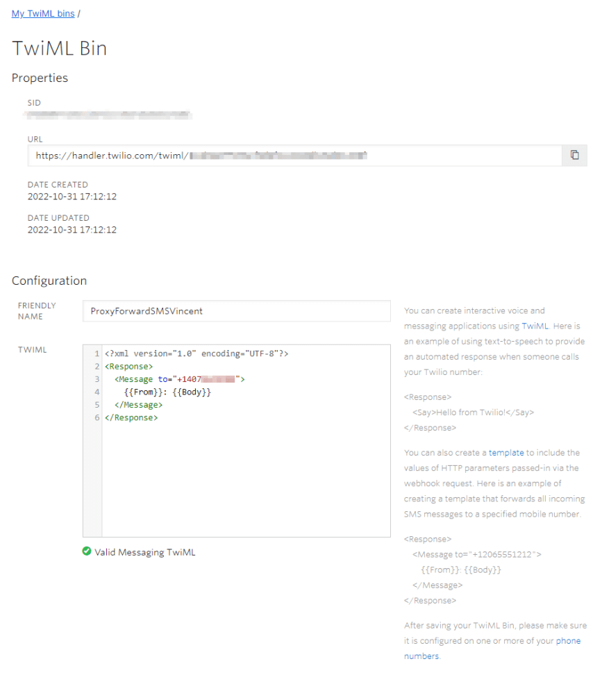
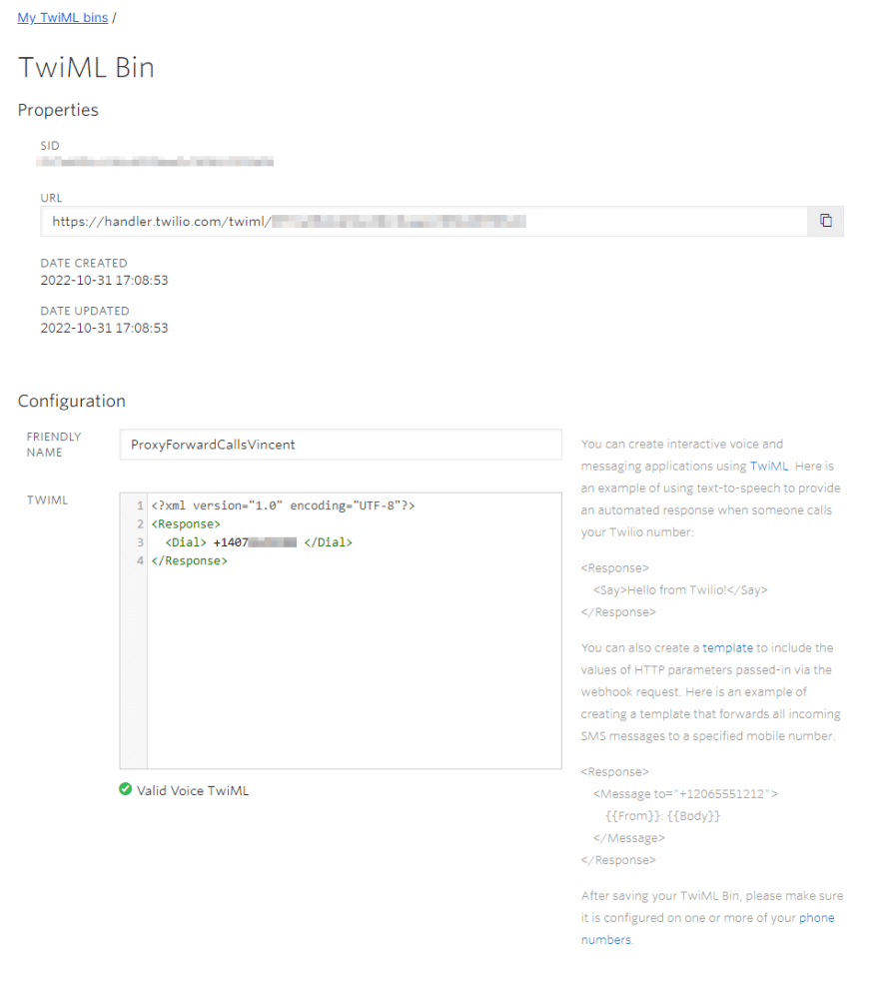
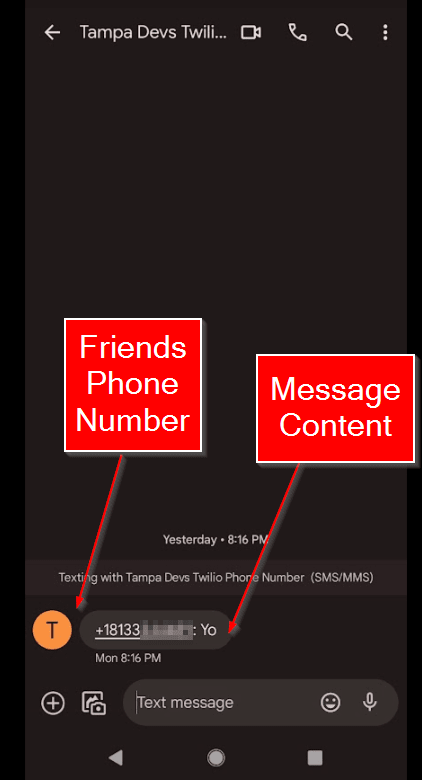

Business phone numbers can be pricy. Just look at google voice, it's $10/user/month. If you run a small business or startup, that's really expensive starting out. Especially if customer service isn't your core business either. Chances are you just need a public phone number to weed out spam calls and list it on google, so people can reach you

So here's a trick on how to get a business phone number for $1/month. Well $1.15/month to be exact at the time of writing this. Here's the secret sauce:

Twilio

What is Twilio you may ask? Twilio is a company that helps you automate phone calls and text messages. Imagine you run a barber shop, and you have a website where clients can book appointments online. You want to send a text message when a clients book an appointment, and another message the day before the haircut

Twilio does all that and more!

But we just need one small feature set it offers. The ability to buy VoIP (voice IP) phone numbers.

> I'm not sponsored by Twilio, I just like their products

## Setting up the $1/month phone number

First, setup a [twilio account](https://twilio.com).

Once you have a login, navigate to the [dashboard](https://console.twilio.com/develop/explore)

Go to "Phone Numbers" under Super Network. This is where we'll go shop around for a new VoIP phone number!



Next hit "Buy a number" at the top right of the screen. Here you'll be presented with a list of available phone numbers to buy. You can pick any phone number you want, at just $1.15 a month. Example:



At the top of the page, you can select from a few set of criteria to buy new phone numbers. They are:

- First part of number
- Anywhere in number
- Last part of number

I suggest playing around with what makes sense for your business. We run [Tampa Devs](https://tampadevs.com), so ideally we wanted a phone number local to the area (813). We picked "First part of number" and 813

You can also buy a phone number based off of letters too, as part of the search criteria.


 We considered buying "TPA-DEVS" but there weren't any phone numbers local to 813, just one that was available in Jamestown, OH


I suggest instead shopping around for "Brandable" easy to remember phone numbers. Good numbers are ones that roll off your tongue so to speak, such as "4222" which is announced as "Forty Two Twenty Two". They are also easily to visually spot a pattern too, after the 3 digit area code

> Side story: my parents are of Asian descent. They were super picky about picking my first phone number (and superstitious of certain numbers). I still use that phone number today they picked out 20 years ago. It's super easy to remember, and it's saved me so many conversations of "what was your phone number again"? A good brandable number goes along way

We ultimately wrote down a list of eye catchy, easy to remember and easy to say phone numbers. From there, my co-organizer and I picked 813-452-4222 for Tampa Devs

<!--  -->

## Setup SMS Text forwarding

Now that we've got this business phone number, we need to have it automatically forward SMS and phone calls to our personal phone

So if someone sees this business phone number listed on google, and calls it, it just gets routed to you

And it doesn't expose your personal phone number either

However, there is a major drawback to this setup. We don't have a configuration to make outbound calls after using that same business number, you'd have to call out from your personal phone.

Okay here's the setup:

Go back to the [dashboard](https://console.twilio.com/develop/explore)

Now, navigate to TwiMl Bins under developer tools



From here we set up two functions. One for forwarding SMS, and another for phone calls.

Here's the SMS forwarding. I redacted my phone number and some sensitive information here:



For the TWIML code, copy this

```
<?xml version="1.0" encoding="UTF-8"?>
<Response>
  <Message to="+14071112222">
    {{From}}: {{Body}}
  </Message>
</Response>
```

where `14071112222` is your personal phone number

## Setup Phone call forwarding

Now, let's do phone call forwarding. I redacted some information again



So you want to use this TWIML code for phone call forwarding

```
<?xml version="1.0" encoding="UTF-8"?>
<Response>
  <Dial> +14071112222</Dial>
</Response>
```

where `14071112222` is your personal phone number again

## Testing it all out

Here's how to test all the features out

Have a friend text the new business phone number you made. You should get a text message, along with their phone number

Should look like this:



Have that same friend call the business phone number. You should get a call stating it's coming from your friend, however on their end they just see the business phone number

Should they leave a voicemail, this leaves a voicemail straight on your personal phone. 

> The only way they can get access to your personal phone number is if you do an outbound call out to their phone number after. This setup we covered does not let you make outbound calls using the business phone number

Congratulations!!! You have a business phone number that cost you only $1.15/month!!!

As some added bonus, you can use this phone number and scale it to any automated workflow you might have in the future