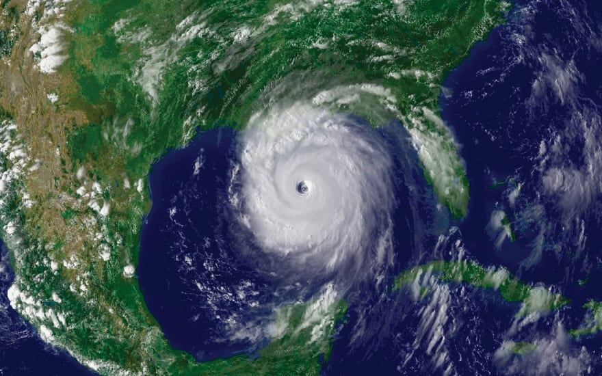

Hosting events is alot of work. But all of it could go down the drain due to an "act of god" incident, such as a hurricane. You can't predict them ahead of time, and they could potentially ruin all your plans

They're are a few things you should know as an event organizer when something like this comes up, and how you should proceed

## What is the net loss if the event is cancelled?

How big of an issue is it if you just cancel the entire event? If the event is free, it's usually not a huge deal if you cancel. 

If you are hosting a conference, this could be extremely costly to cancel. People will want refunds. Hotels may not refund you and leave you to eat the loss. You can pass along the sunk loss to members, but it also will damage your member's trust to your brand

## How long can you postpone a decision?

How long can you possibly postpone a decision? For us, we can delay notes on whether we cancel the event on the day of it.

The reasoning is most people don't get ready to go to an event a few hours beforehand. We also will get a more up to date snapshot of the weather forecast as well

## Post notices that you are "monitoring the situation" on all channels

The worst thing you can do is leave people in the dark. Potential attendees might not that you are even considering cancelling, postponing, or going remote for the situation. Keeping your memberbase well informed that things are being monitored goes along way in building trust.

## Make sure your decision aligns with the venue as well

Since we sometimes host events at Universities - we have to make sure we don't host an event at the University if they decide to shut down. It's negligient on our end and could bite us back legally if something bad happened

## Can you go virtual?

Going virtual eliminates alot of legal liability risk if something were to happen to one of the attendees going to the event. 

If people had originally RSVP'd for this time and date, they'll still be available to join a zoom call instead

## Can you postpone to a future date and time?

Postponing the event for a future date and time should be considered if going virtual "degrades" the event experience by alot. 

A good example of this would be a mud-race for instance. You don't go to these events virtually, they only shine best when it's done in-person

## Write a PR statement with the bare minimal information & only facts

When you issue a statement and notice that decisions are being made, write the bare minimal information possible

This is because you don't want to be stepping on your own toes going back on statements you originally issued. It makes your org seem incompetent when broading contradictory messages

If you state that you are going to go virtual, then decide to going back to in-person, people will wander if you'll second guess yourself again

This rule applies to channels like newsletters too. You'll want someone to proof read it as well before sending the broadcast

## Inform your vendors decisions are being made

You need as much information as possible before deciding on any course of actions. If you buy food for an event, ask if it can be refunded. If you had people get hotel bookings, talk to the hotels about refunds before issuing a PR statement.

Depending on what contracts and terms/agreements you sign, these will impact the net loss if you cancel an event

## Always have a backup plan

During planning of your event, you should have had some plan B infrastructure in place for something like this. For instance, if you decide to go virtual and it makes sense, have you setup any tools for these? Zoom meetings for instance. Virtual conferencing tools. There's lots of other options here, depending on the case scenario