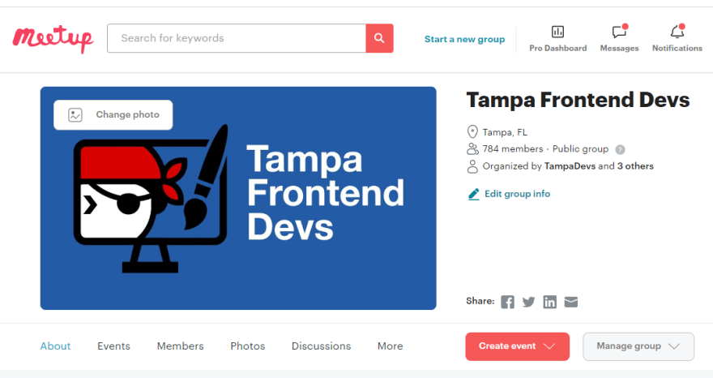
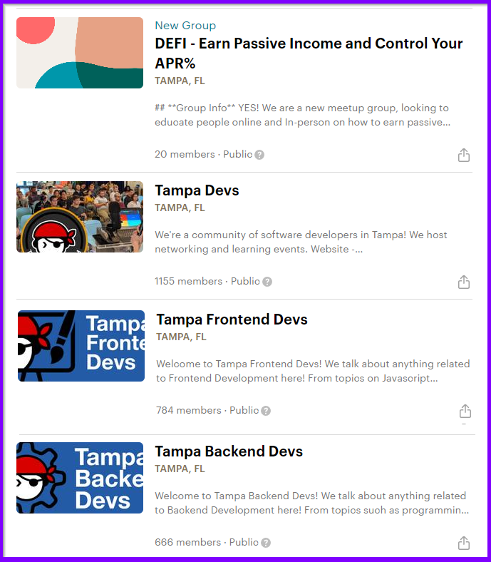
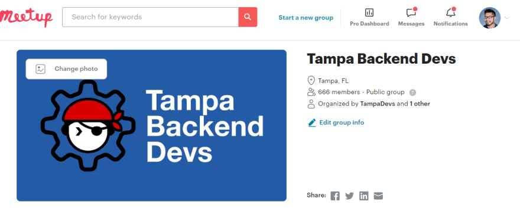
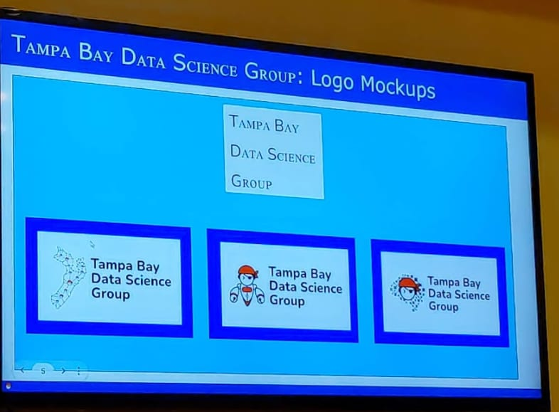
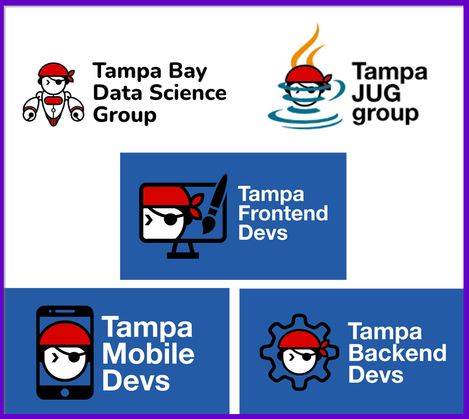

Since I started [Tampa Devs](https://tampadevs.com), we've expanded our community to 1150 members in just a year. We've recently incorporated as a nonprofit, and are looking to set Tampa Devs for the future. With this growth comes new marketing strategies to expand further

One such strategy is called "Sub Branding". The marketing textbook definition is this:

"Sub Brands are related to a parent brand, and both support and benefit from that parent"

So this is what we did. Our members range from all levels of software developers, to all different fields. Examples include:

- Frontend Development
- Backend Development
- DevOps
- Data Science
- Mobile Development

and alot more. Here's an example with [Tampa Frontend Devs](https://www.meetup.com/tampa-frontend-devs/)

As a member base grows, so does the need for fragmenting a group into specialized groups. 

One reason for this is our events are already hitting 150+ members at events. Once you hit past 150-200 members attendance, venue cost exponentially increases. You have to look for conference halls, lecture halls, instead of just meeting rooms. 

Another reason is once a memberbase hits a critical threshold, spinoff groups will naturally happen. You want to capture this intent, before it happens. Some members who are only frontend devs want to only learn about frontend development. Vice versa for backend, design, devops etc

The last reason is it creates more places for someone to find out about Tampa Devs. Here's an example on the meetup page when you search for "Technology" Meetups:

> **When you subbrand, the strength of your parent brand is sum total of your subbrand + parent brand.**

## Creating Shell Orgs as Your First Sub Brand

Sub Brands on their own start off with no brand presence. Their branding strength is based entirely on the parent brand.

You can create or acquire subbrands. Creating a subbrand that stands on it's own is more work though. 

What you first want to do is create that first brand as a "Shell Org". It's a business or legal entity on paper only, it doesn't actually do anything just yet.

Here's an example of a shell org we own as Tampa Devs:

I reached out to "Tampa Beginner Developers" and the original host gave us full access to the org. It has 666 members, which sounds great on paper, but in reality all of the members probably don't live in Tampa anymore. The last event held for this group was 3 years ago, so for all intents and purposes it's a dead meetup group

However, we rebranded it as "Tampa Backend Devs". 

From someone new that's moving to Tampa, they wouldn't know this offhand. They just see Tampa Devs and it's logo on 4 seperate places when searching for meetup groups

## Making an existing brand into a subbrand

One reason you want to create "SubBrands" before acquiring subbrands is because you need examples to demonstrate what a "Sub Brand" is to a group interested in becoming a subbrand

For instance, we're partnering with other tech meetup groups like Tampa Bay Data Science Group and Tampa Java User Group, both of which have active organizers

We created a few spin off logos for them as well. Mike from Tampa Bay Data Science Group needed a logo, and we made some for him

When you acquire a subbrand this way, how strict you are on branding guidelines depends on a few factors. Namely, how strong your parent brand is compared to the group your acquiring as a subbrand. We're pretty lenient, so the only requirement we made was just having the logo. We weren't specific on the text naming, or even the fonts used

> An important thing to note. Someone should intently reach out and decide on their own to become a subbrand of your parent brand. It's your job to make sure you have the branding guidelines here. Having some shell org examples is very useful as examples

## Growing Subbrands on their own

Eventually, as Tampa Devs grows, we're going to fragment different meetup groups

When a potential organizer comes up to us and expresses interest in running one of these shell orgs like [Tampa Frontend Devs](https://meetup.com/tampa-frontend-devs), that group is no longer a shell org. 

It's a fully functioning sub group under a larger parent org. What we do as a parent org to that subgroup is provide the following:

- Food
- Venue logistics
- Marketing

We basically make it easy for that organizer to do the fun parts of event hosting. We do all the boring work that requires it to run properly

If that organizer of Tampa Frontend Devs were to move for instance, and no one takes his/her place - it goes back to becoming a shell org again.

That's the strategy of shell orgs and subbrands

TLDR

- A shell org is a org that looks good on paper, but doesn't do anything **actively**. It's **passively** used as a net positive marketing surface until someone takes over it
- Sub branding is the act of creating a brand under a parent brand
- Sub branding is a long term marketing strategy

Here's our full list of subbrands

As a fun side note, you can create even more media surfaces once you have more subbrands. For example, fun t-shirt spinoffs, vertical banners with all the logos, etc etc