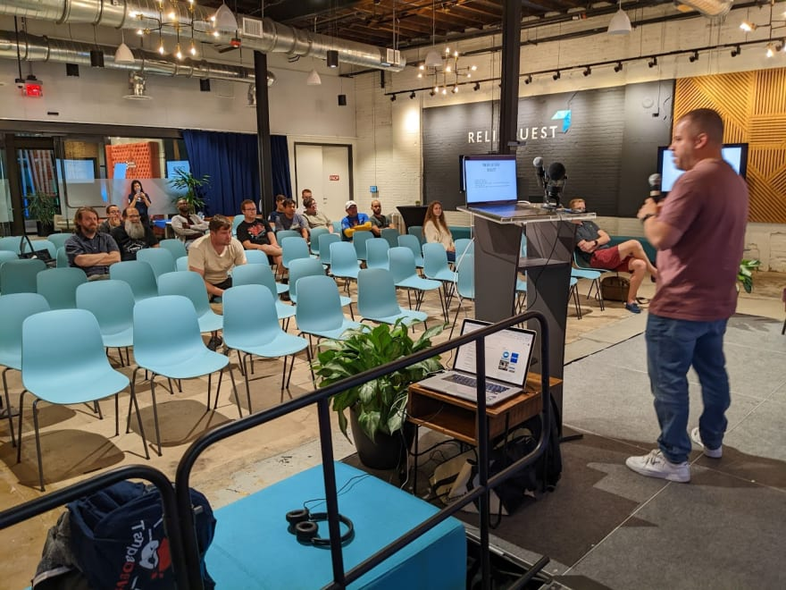
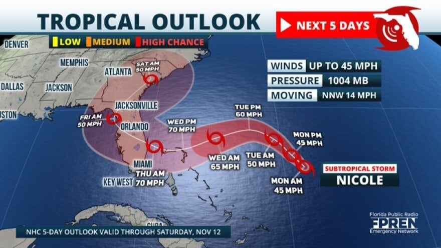
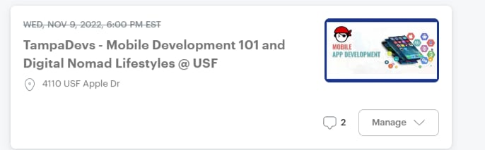
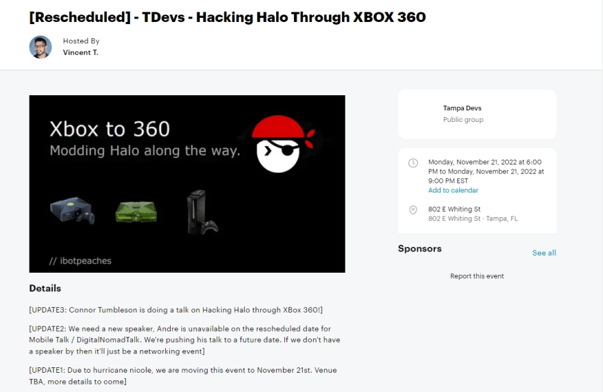

Last night we hosted a Tampa Devs event. We've been having on average about ~100 people attend our events, and our growth has been growing over time. However, The turnout only came out to about 16 people, with 100 people rsvp'd. 

So why did this happen?

Originally we had to reschedule an event due to a [hurricane](https://www.vincentntang.com/dealing-with-hurricanes-event-organizer/). However this hurricane was just barely classified as a hurricane, and for those that have lived in Florida for along time that's the equivalent of a mild rainy day. 

However, since many of our attendees are new to the area, they were freaking out about the news. There were amber alerts and national news warnings about this, mostly for residents on the other coast of Florida. Tampa was on the borderline of the "danger zone". 

We didn't want that level of panic or anxiety to be there for people attending the event. We also didn't want to deal with the liability of anyone getting injured driving to our event

Because of this, we had to take action. 

Here's what our options were:

- Hosting it virtually
- Cancelling the event
- Rescheduling it

We let everyone know we'd make a decision the day of the event. This was we could gather as much information as possible, before making an informed decision. And that would give attendees enough advance notice of whether to drive to the event or not

Our first thought process is we wanted our events to be in-person, since that's what made Tampa Devs popular to begin with. We didn't want to comprimise event quality, and our speaker didn't want it to be hosted remotely either. So that was a no go

We considered cancelling the event. But, that would have meant we had to get everyone Re-RSVP'd to the new event, and we'd lose our old RSVPs. So not good either.

We ended up rescheduling the event instead. I reached out to a dozen venues last minute, one gave me availibility on the week of Thanksgiving.

However, this presented another problem. How do we inform attendees of the reschedule? We also only had a 4 hour window to tell attendees too. So panic mode to do this all last minute

We had to do A/B testing to see what notifications users would get on meetup, if we changed the time on an event. We have a few [shell meetup](https://www.vincentntang.com/sub-branding-shell-orgs/) we were able to test this on first, to see how a user would get notified. This was how a cancelled event looked like

It sent a notification to user's meetup app that it was cancelled. It'd also send a notification to their email too

Now we could have went with that, we decided to just "update the event details themselves on the page". We also changed the speaker too as the original one was not available for the new date at the new venue

For good measure I also updated the title so people knew it was different. I posted these updates across all of social media, on the original events comments, etc. We also sent an email blast to everyone as well for all RSVP's the day of the event before

Even then, barely anyone showed up. It could be the fact that we also picked Monday instead of Wednesday, and we chose Thanksgiving week too.

So many factors of attendees came into play, and we don't know all the answers still.

## What we'll do next time

We intend to next time physically "cancel" the event on meetup instead of silently changing the time behind the scenes on the original date. Regardless if the talk is the same or not on a future date

We're still pretty set on not doing this virtually as it'd comprimise event quality. We'll give the speaker the option here though. But we might do a test run to see what attendees think overall

We also did a bait-and-switch on the original talk as we changed speaker, I don't think the audiences overlapped either

Our only reschedule date available was on thanksgiving week. Alot of attendeees were probably on vacation too, but we don't know for sure

We need to build more pipelines for collecting data. We don't 100% know why attendance counts were low, we're just speculating. Building these data pipelines for collecting data presents more problems, but we'll tackle that another day

I'm learning that rescheduling things is incredibly complicated. It's as much art as it is a science.

Also I'm really tired of dealing with hurricanes