I made some custom bandanas through [hoo-rag](https://www.hoorag.com/). They came out pretty nice!

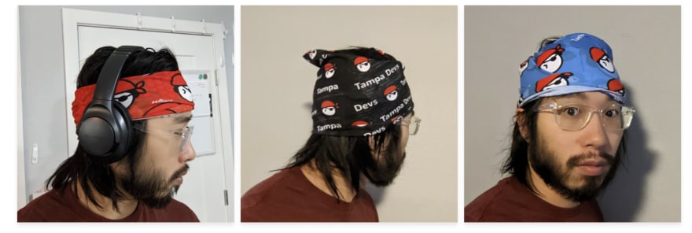

These are some of my thoughts about the design process, and lessons learned:

I designed 3 different bandanas, on three different colorways. Here is what they look like, laid out

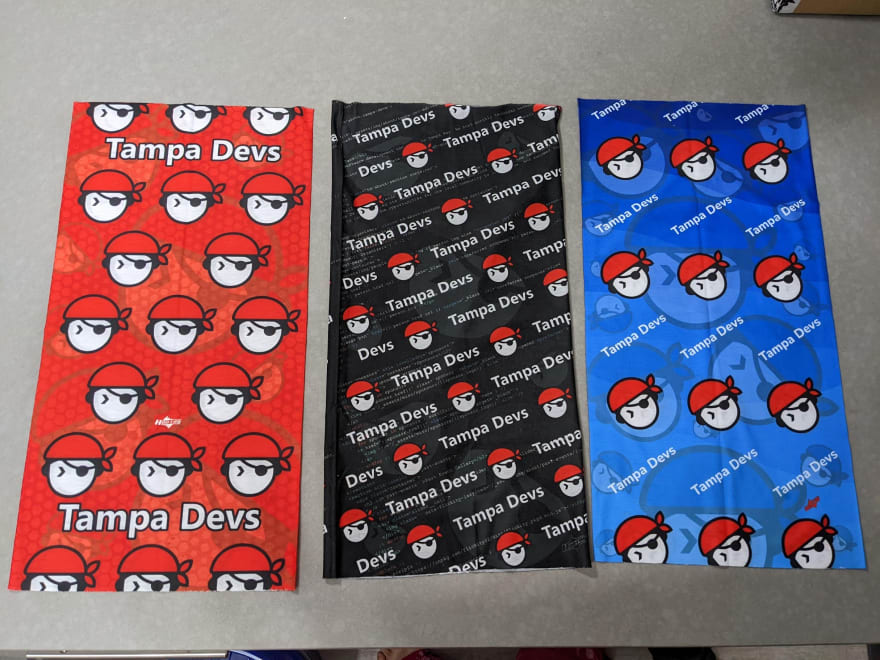

I designed them to be different repeating patterns, logo sizes, etc. The whole design process took about a month, and 10 different design iterations. 

I also got a see a few printed samples by email before they all went into final production too

Here's what I learned after designing and receiving the bandanas:

## Do not do horizontal patterns or use big logos

The blue bandana probably is my least favorite, from a design perspective

I did about 7 revisions with the designer before we decided to put them in production. This was the final signed off concept for the design, using our logo on both the foreground and background layers:

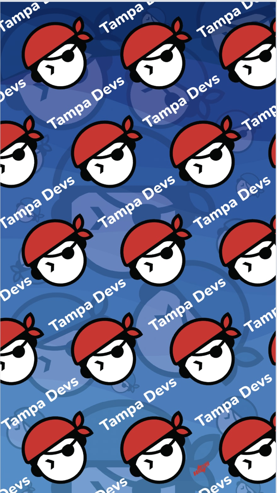

At first glance, it looked like a solid design. However, when we went to go do the printed sample proof, the design had a disjointed look where the seam met:

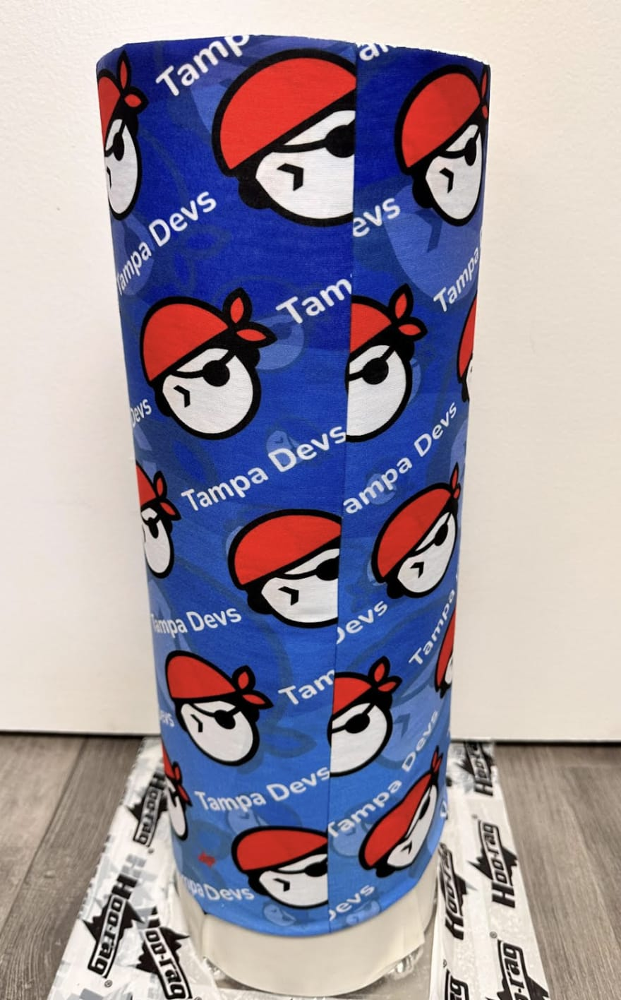

I had to do some modifications to the design. Namely sent him this update to either keep the text complete, or the logo complete by chopping off some words

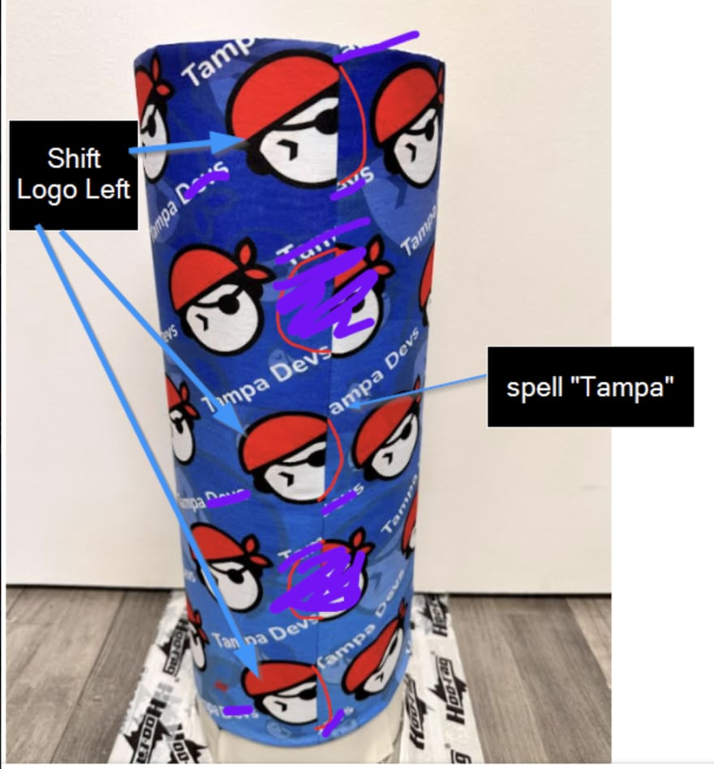

This brought in a completely seperate new set of design that felt rather incomplete, since many of the original logos had to be deleted.

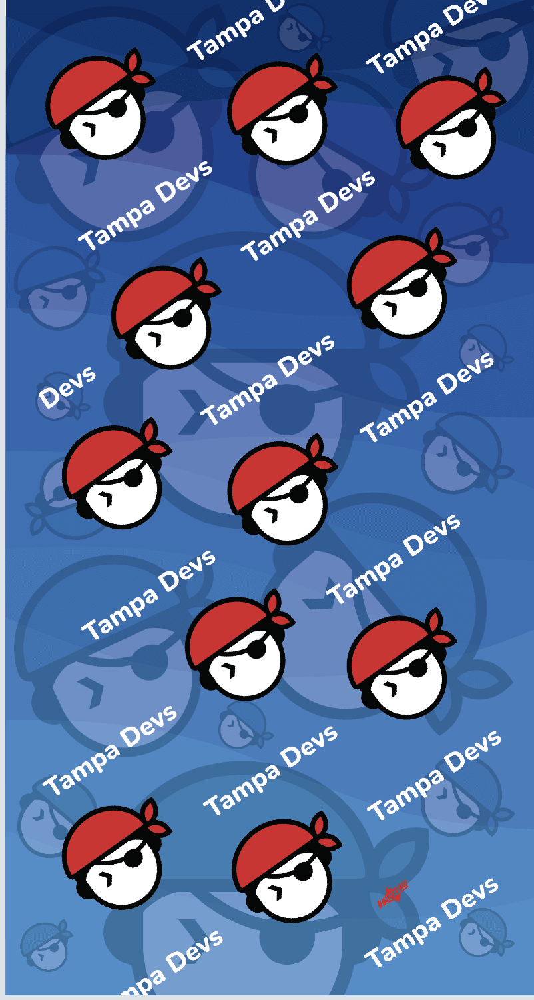

So we ended up doing a complete redesign by making the pattern horizontally, instead of diagnolly repeatable. This made it more predictable at the seam so regardless of where you wore the headband, it'd look good. This is what I sent the designer to patch the issue:

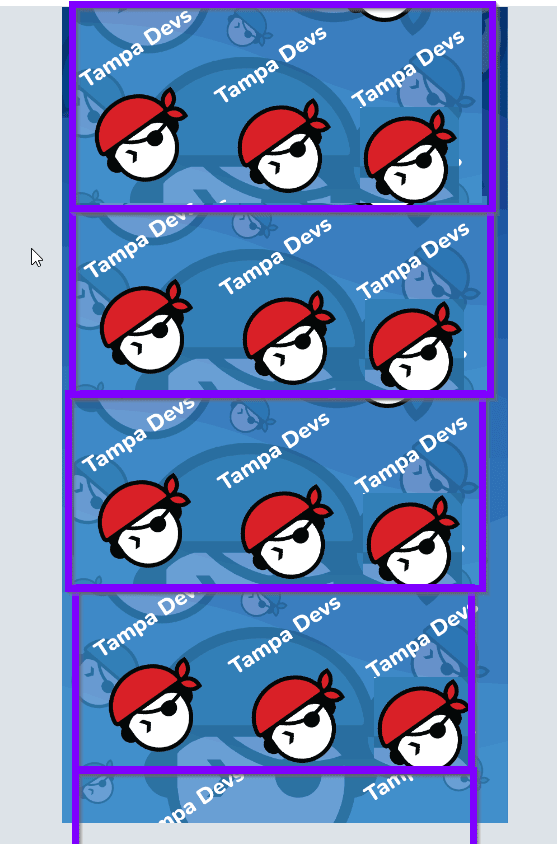

I went ahead and approved the design with the designer, and this is how it was made on a print sample:

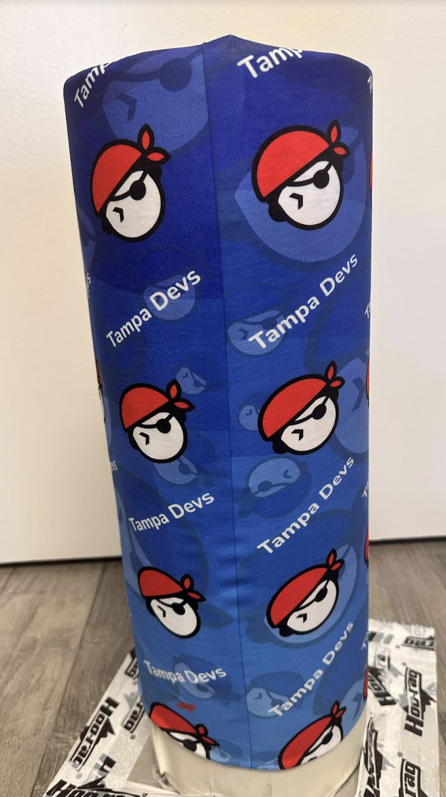

I figured this was good enough to move forward with the design. I got the shipment a few weeks later, and wore it for the first time

Here's what it looks like: 

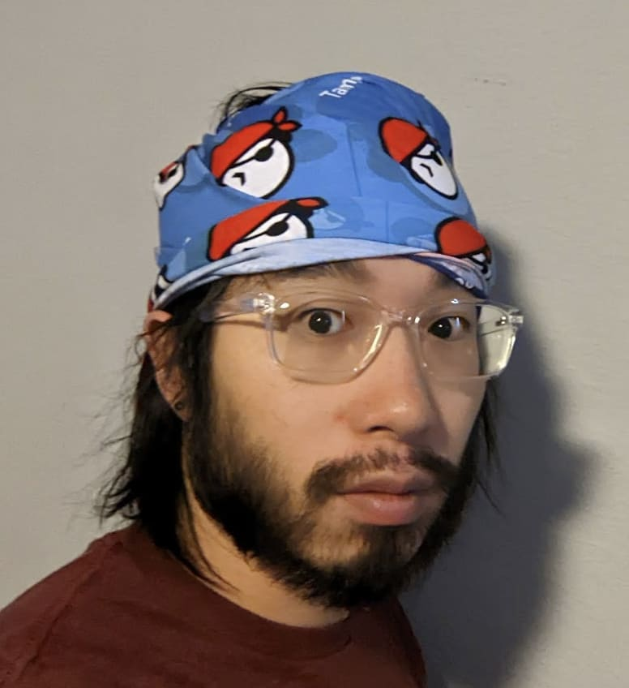

I wasn't 100% sure what this bandana would look like once I got a chance to wear it. It was one thing to see a printed mockup design, another to wear it

I'm not a huge fan of the design choices I made. Here is why I wasn't a fan of them:

Bandanas already are a strong focal point, from a design perspective. They're eye-catchy in nature enough, so you want the design to be a bit more "muted" from a design perspective. This means, the design needs to have less contrast, so having big red logos on a blue foreground wasn't the best idea.

The repeatable patterns made horizontally also lined up with how it's normaly worn, so the design becomes more "predictable" and less "classy" in my opinion. 

If I had to redesign this logo again, I'd still go with a diagnol repeating pattern. Likewise, smaller logos are also better too, as it creates more flexibility to how the bandana is worn

## Use full words and less contrasting colors

We also created a black, and red bandana variant

Here's the black bandana:

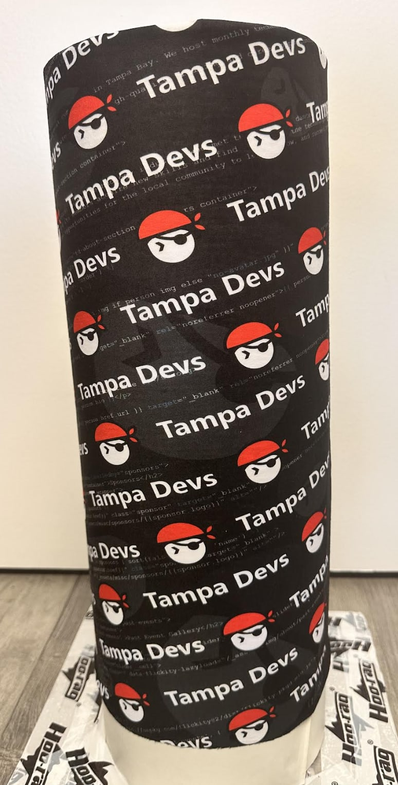

And here is what it looks like when I'm wearing it:

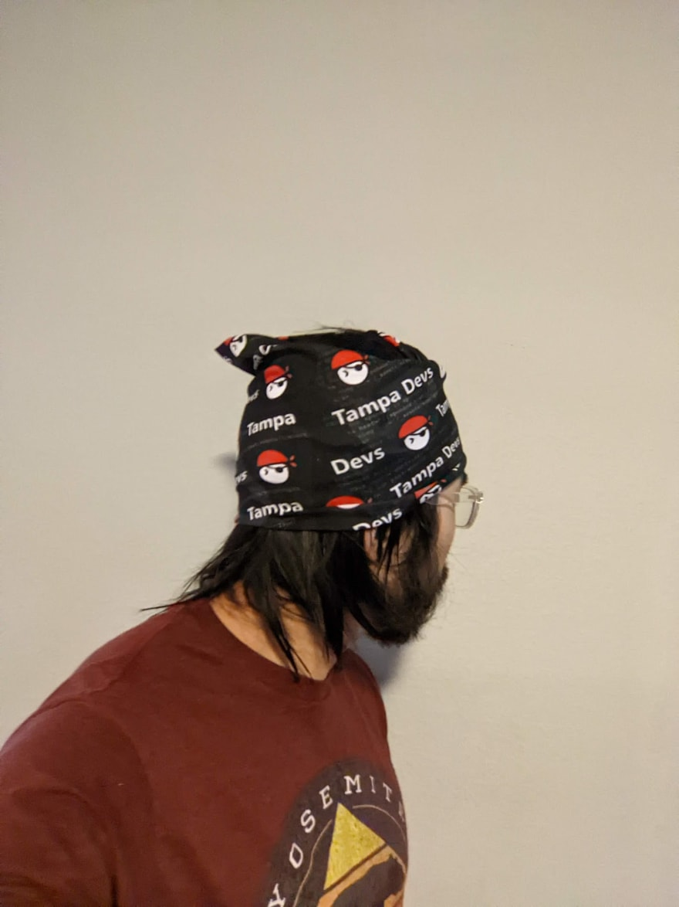

This one came pretty much exactly as I wanted. It's also the bandana I spent the most time designing too

I asked the designer to pull source code from the website as a background layer. The inspiration for this was our logo featured 3 colors - black red and white, all of which look pretty good as a VSCode terminal theme. So we put these colors into play with the design

For the foreground layer, we also made "Tampa Devs" and the logo a little bit smaller in nature so it'd blend in better as the font-sizes would be similar in size. This played pretty well, since you could read see our logo in the many ways to wear this bandana (There's like 10 ways to wear them!)

## Use "fun" elements like hatches

Hatches are a design element that gives an otherwise simple design a more subtle complex "feel" to it. Here are examples of hatches:

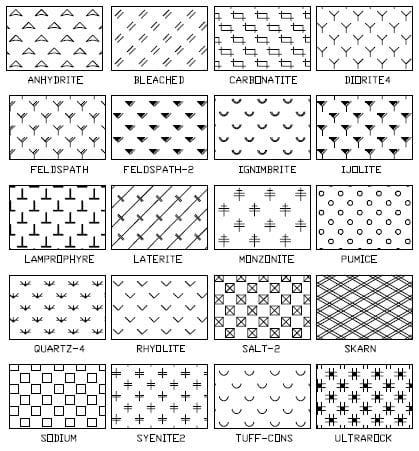

For the red bandana, I didn't use a gradient layer like the blue bandana, or a coding terminal theme like the black one.

Instead, I decided to use a hatch to make the design feel more complete. Here's what the red bandana design looks like on top of my headphones:

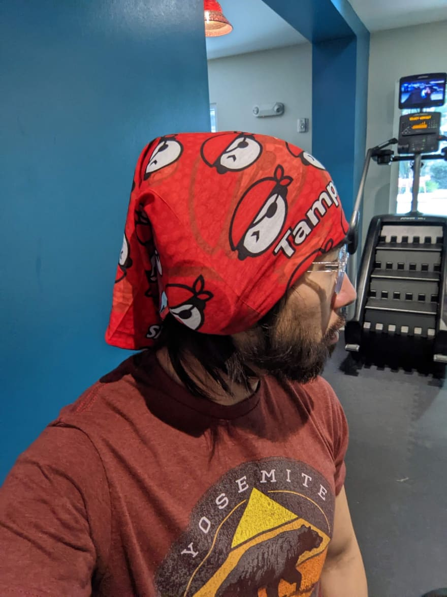

We used a honeycomb design here. The inspiration here comes from the fact that our design is more mathmatical in nature, you can read about the design process [here](https://www.vincentntang.com/designing-the-tampa-devs-logo/). Having honeycombs plays into this subtheme, so we went with that.

Here's some of the other hatch design ideas the designer and I floated around:

This is V1 of the red-design:

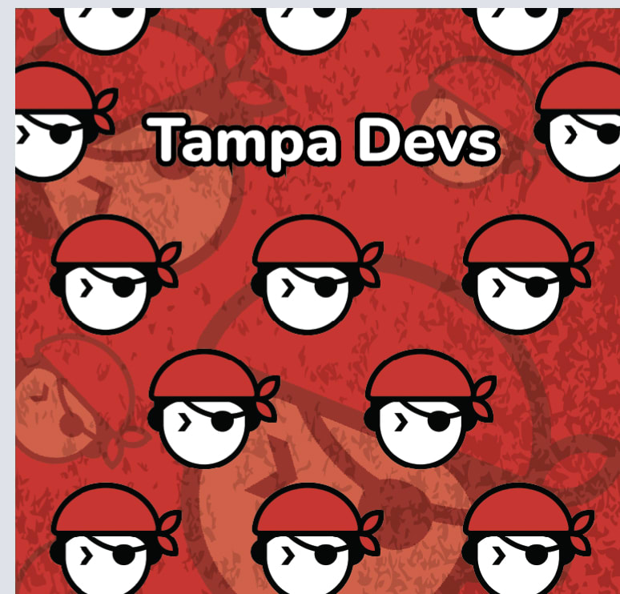

Several iterations later, without a hatch

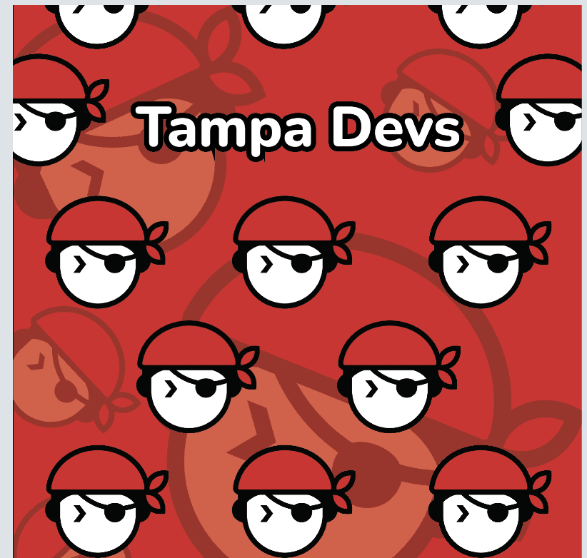

Adding a darker grittier hatch in:

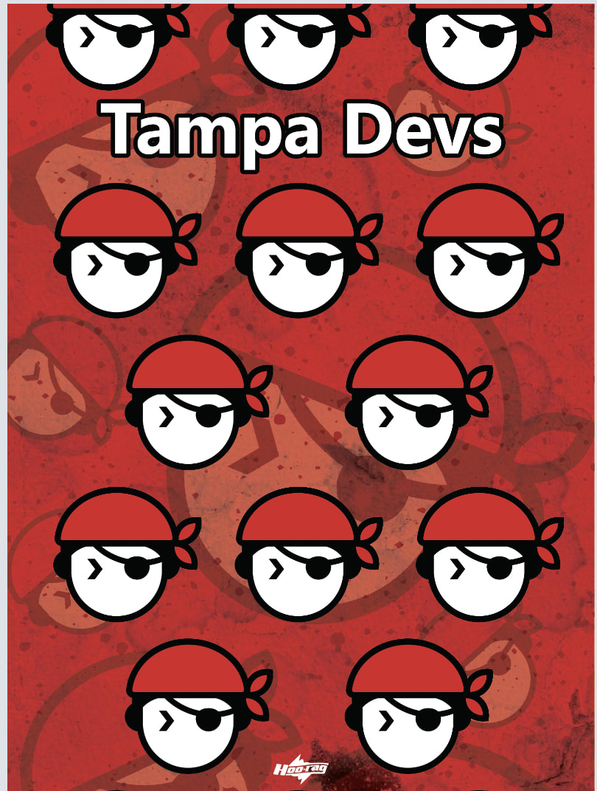

And the final hatch used:

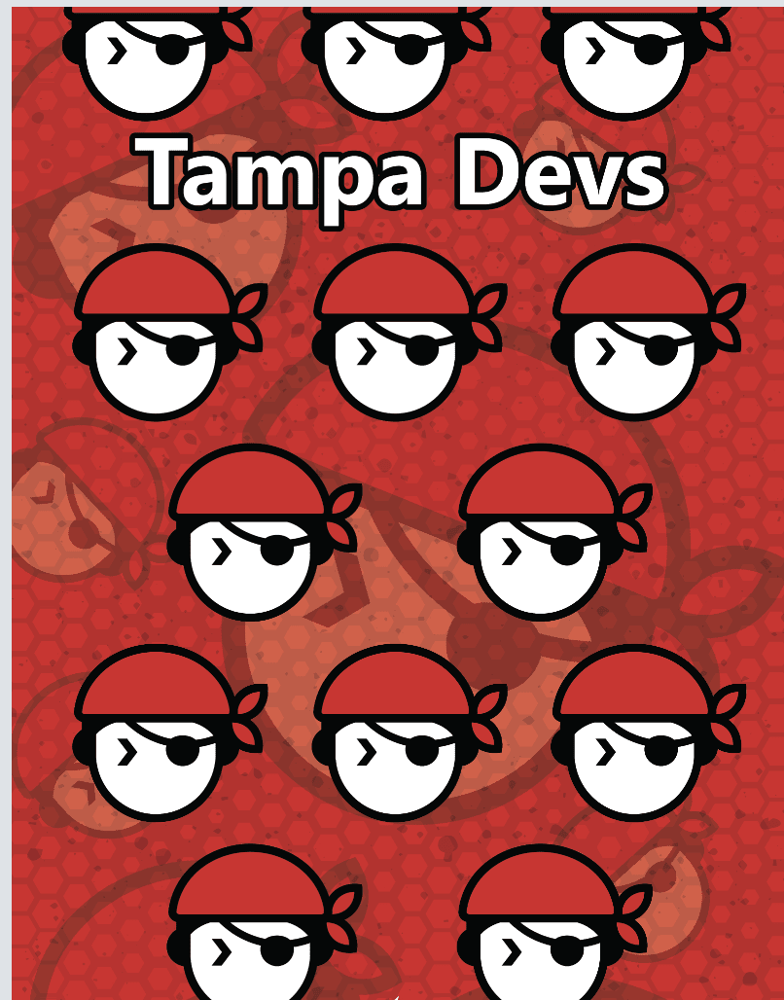

I personally like this design a lot too. Our logo predominanetly is white, and red, so having a red bandana is the closest design to being a singular color. What I like about this design is our mascot is a person wearing a headband, so now it's like bandana-ception wearing this

## In Summary

Designing bandanas was a fun process. The whole process took close to a month, and we ordered 100 units of these to prep for a major pirate parade this coming month. 

I haven't really seen companies, or tech orgs do bandanas before, so I didn't really have anything to base off of when doing these designs. 

They came out pretty nice, the black and red ones are my favorite