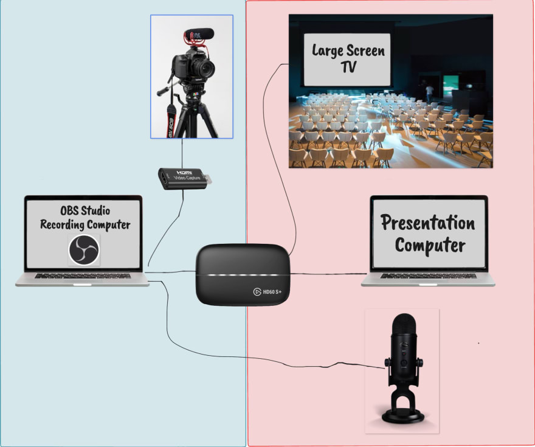
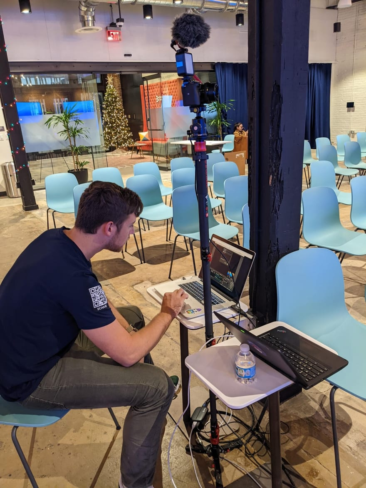
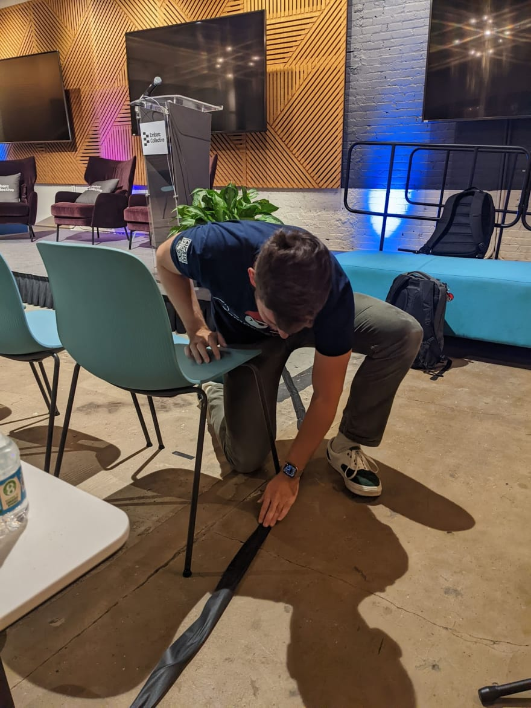
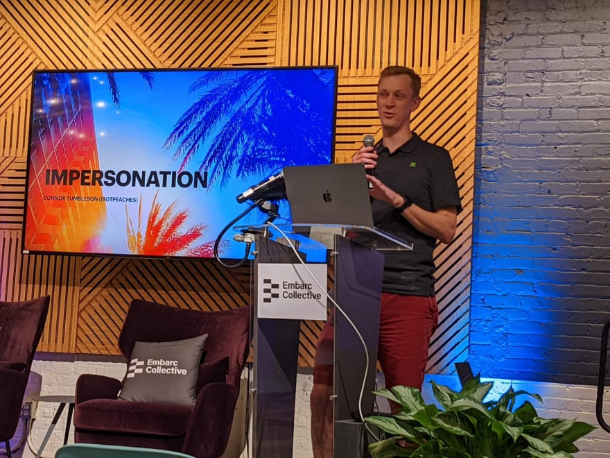
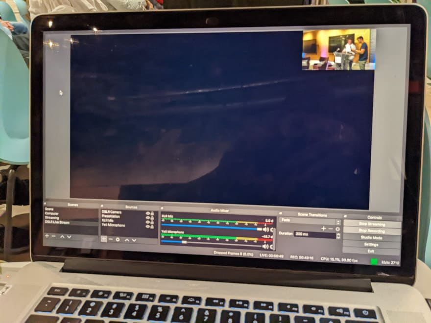
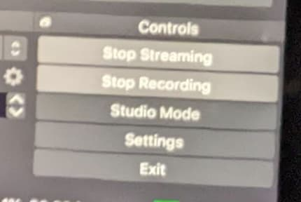

At [Tampa Devs](https://tampadevs.com), we host events catered to software developers. We host tech talks with speakers who talk on a subject related to their expertise. It could be DevOps, frontend, backend related, etc. These speakers are advertised on our meetup, and it's what keeps Tampa Devs a growth-driven learning environment.

We record these talks, as a form of record keeping. It's used for future successors of Tampa Devs to know what the culture is like. It's also used to create "proof" that speakers can use for their resumes as well

Since we started Tampa Devs, we've hosted about a dozen of these talks. And experimented with a lot of different methods for streamling this operation

Our requirements for a long term setup was twofold. First, it needed to be simple, and pain-free to setup. Second, there needed to be as little post-editing as possible in Adobe Premiere Pro, or similar applications

So here is the solution that worked best for us:

So here's how it works:

## The Hardware Setup

The recording computer runs [OBS Studio](https://obsproject.com/). It's the master computer. This needs to be either a MacBook, PC, or Linux computer (cannot be a chromebook). It captures information supplied by both capture cards from it.

One capture card supplies visual (and optionally audio) coming from the DSLR. That DSLR is positioned about usually 15-30 feet away from the main presentation, and focused on just the presenter + potentially a screen. This is all part of the "blue zone", which is equipment grouped close together for handling behind the scenes audio/video

There's the pink designated area, this is audio/video closer to the stage. We run the microphone from the master recording computer close to the presenter, usually on the same podium as their laptop. We opt to have the presenter use whatever laptop they want, since they may have specific requirements for running their code / demo.

In one of our past talks, we had one of our speakers do a full IoT demonstration at PwC. However, because of the red-tape of the networks over there, he had to run everything on his own home built network / mobile hot spot. So having a A/V setup completely independent of what the presenter uses works better for any case scenario

For the main capture card, this is an Elgato S60+. It handles two major functions

- INPUT -> This is supplied Audio/Video information from the "presentation computer"
- OUTPUT -> it takes the input, and sends it over to the "recording computer"
- OUTPUT -> this is sent as another output passthrough, from the "presentation computer" to the "big TV"

For the DSLR camera, you need a special micro HDMI to HDMI connection for the smaller capture card

So here's a list a bill of materials that you need

- Laptop 1 for recording, any computer works here. Plug this into power ideally
- [Elgato Capture Card](https://www.amazon.com/gp/product/B07XB6VNLJ/ref=ppx_yo_dt_b_search_asin_title?ie=UTF8&psc=1)
- [USB to HDMI Capture Card](https://www.amazon.com/gp/product/B09FLN63B3/ref=ppx_yo_dt_b_search_asin_title?ie=UTF8&psc=1)
- [USB Condensor Microphone such as blue yeti](https://www.amazon.com/gp/product/B00N1YPXW2/ref=ppx_yo_dt_b_search_asin_title?ie=UTF8&psc=1)
- [DSLR with a HDMI output](https://www.amazon.com/gp/product/B07MV3P7M8/ref=ppx_yo_dt_b_search_asin_title?ie=UTF8&psc=1) - I use a Sony A6400, but you can get a cheap $200 camcorder that can do the same job

You'll also want these HDMI cables and potentailly a USB hub too

- [Micro HDMI to HDMI for DSLR](https://www.amazon.com/gp/product/B07V724QHC/ref=ppx_yo_dt_b_search_asin_title?ie=UTF8&psc=1) - You can also opt for adapters too such as [this](https://www.amazon.com/gp/product/B07K21HSQX/ref=ppx_yo_dt_b_search_asin_title?ie=UTF8&psc=1)
- Long HDMI Cables, 15-30 feet preferred for connecting to the "Big TV" 
- A USB Hub, incase you need more USB ports on your computer

Here's what our Audio/Video setup looks like for the designated blue area (e.g. behind the stage production)

Here's my co-organizer Charlton also adding gaffer's tape to run the HDMI cable from the capture card + USB cable for the microphone to the presentation podium:

Here is what the designated "Pink Area" looks like from the diagram for the "presentators area"

We usually come to the venue about an hour earlier to setup all of this

## Pre-Setup for Software

For the software, you want to run OBS Studio on the "recording computer".

Here's the settings you want enabled:

Quality is kind of potato, so this is the configuration. You want to supply 3 "sources" of audio/video data, this comes from:

- The Elgato Capture Card. It supplies the screen-sharing information from the "presentation computer"
- The Blue Yeti Microphone. This microphone is setup next to the presenter on the stage
- The Cheap USB to HDMI Capture Card. It supplies visual and audio data from the DSLR camera, but you just need visual only

You can google tutorials on how to set this up. But here's the TLDR pre-setup

- Go to youtube.com creator studio / streaming, and grab a stream-key
- Input this stream key into OBS

Another setting you want enabled is how much of the presentor is shown VS the screen. Check out how we recorded our last talk, we use the top-right of the screen for the presentor

<iframe width="560" height="315" src="https://www.youtube.com/embed/bq6FL8299EU" title="TDevs - Data ETL with Apache Airflow" frameborder="0" allow="accelerometer; autoplay; clipboard-write; encrypted-media; gyroscope; picture-in-picture" allowfullscreen></iframe>

## Going Live

And here's what you want to do after you've set it up at least one time

- Go to youtube.com creator studio again and be on the dashboard
- Hit "Stream" on the OBS studio
- Check your youtube page on another device such as your phone to confirm live stream is working

You'll want to setup Youtube streaming and set it to record locally at the same time here:

You'll want to do Audio/Video quality checks while livestreaming. The best way to do this is just pop open the livestream URL on your phone, add some headphones and listen to it while everything is running live.

This is an easy way to check audio

For video checks, I suggest checking this from the "recording computer". You'll want someone monitoring the livechat too so this can be the same person

The "recording computer" also needs to be connected to WIFI and ideally plugged in somewhere, you need stable WIFI to handle this

In the event WIFI is spotty, this is why you record "locally" as well on OBS so you can upload after the fact too as a backup

## Post production

Since you streamed live, aka uploaded the video as it was being recorded, editing post production is easy

There's a few dashboard tools on youtube you can use for cropping the beginning and ending of the tech talk

It's a lot more pain-free than using something like a full blown video editing tool like Premiere Pro

As a bonus, since you are live streaming, you don't have to resort to using zoom or other software tools for handling remote attendees. You can send your audience on meetup comments or your event page with a link to that livestream ahead of time too