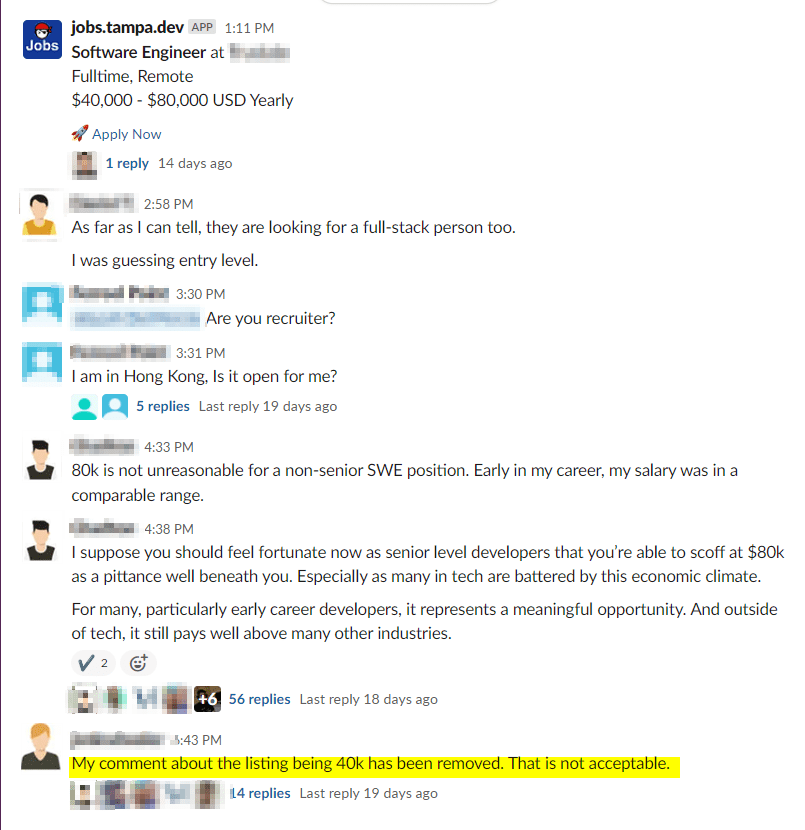
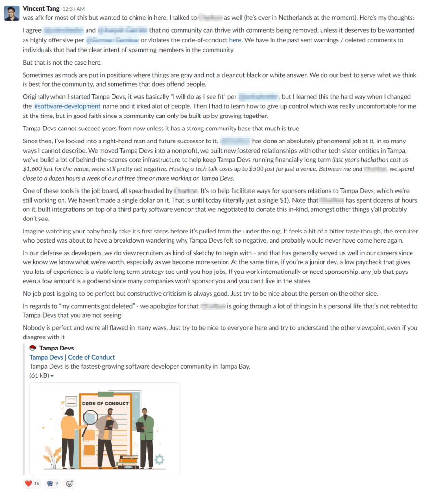
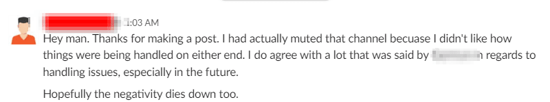
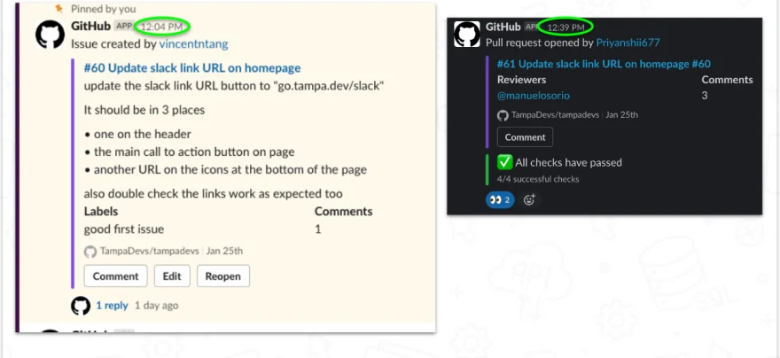
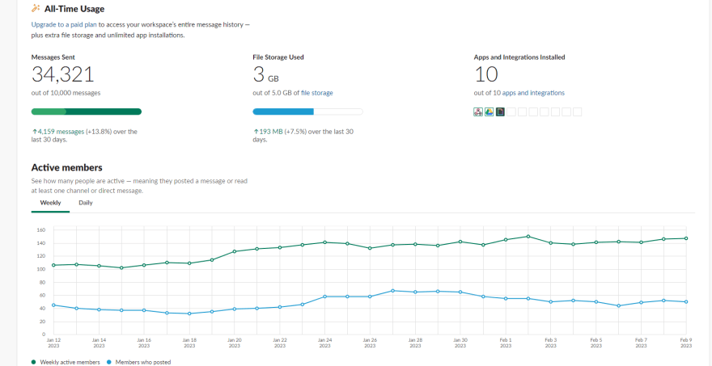
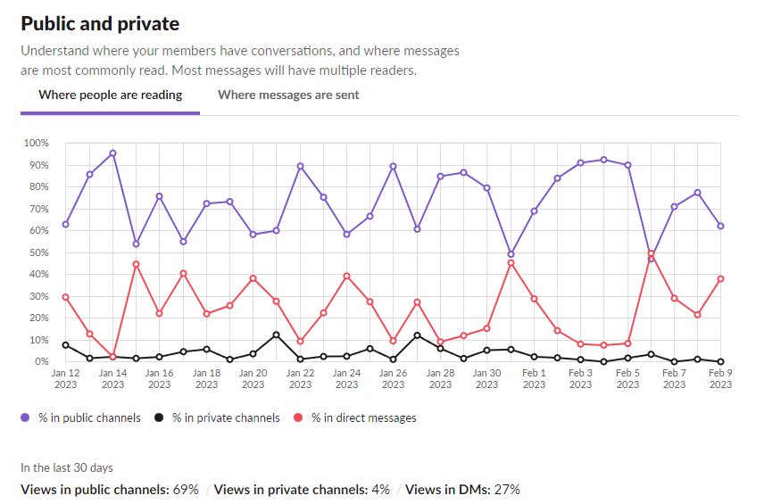
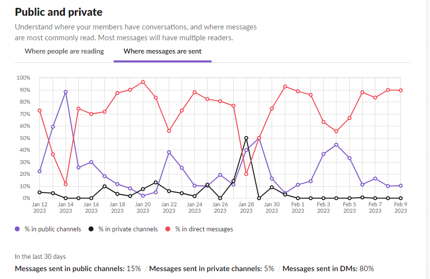
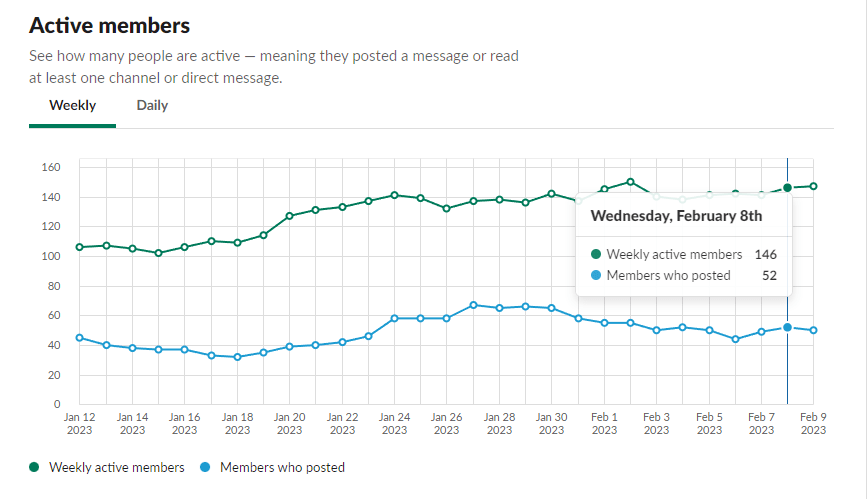

This post adds onto the original lessons I've learned since I wrote the article [Lessons Learned building a 100+ slack community](https://www.vincentntang.com/lessons-building-slack-community/)

The original article goes over more how to manage a growing community. This one is tailored towards how to manage an existing community that has gotten decently big, and has enough traction to sustain on it's own

Here's the lessons:

## Moderation can be very political

You can't appease everyone in a slack. We get recruiters who stop by and post things to #job-listings, but we've enforced rules to also support a growing job board.

Here is one such issue that has happened, and how I had to step in to resolve it



The gist of the argument is such:

- We help onboard a recruiter to post on a job board
- That gets syndicated to #job-listings
- A zealous member feels the job post is low quality
- Said member starts argument with admin
- Admin deletes comments

We agreed early on that while we'd love to lock the #job-listings channel from recruiters to fund Tampa Devs, we couldn't since we were on a free slack tier. As a result moderation was agreed upon

> We don't have time to moderate job post contents either, we just auto approving everything by default

The issue here was the admin deleted comments which had very much offended alot of members of the community. The zealous member may have been extremely rude to the recruiter, but deleting comments is usually a last resort

We can't really be deleting comments unless warranted otherwise the slack will slowly die over time. People will feel that posting conversations is pointless and having healthy discussions will be met with potential deletion of their content

Usually in this instance it's best to place Switzerland and just state

```
Please obey the code of conduct from this point on,
no flame wars, or else we delete comments
```

But once that threshold is crossed, PR damage must be mitigated at that point. I came up with a strategy to spin it around:



What I did was the following:

- Agree the zealous member was correct
- Tell a story about how hard we work and why we built it
- Diffuse the situation by highlighting every side is valid
- Tell people we were broke and we need money
- Invoke the code of conduct and tell people to play nicely

At the end of the day this worked for the time being. It wasn't a perfect solution. Anything any admin does on the channel is under my watch so I'm held negligent for not doing anything.

A strong arm in leadership is essential at this point. Doing nothing in this case would have eroded the trust in Tampa Devs.

We were able to get a financial contributor actually that day from that post

Also I've had someone send me this message as well



Moderation is very tricky in that you need to be very political and offend as few people as possible. No solution will be perfect, you have to choose from the least crappy of the bunch

It's always best to do nothing until a very clear line is crossed

Moving onto the next point of lessons I learned:

## Naming channels and channel management is hard

Naming anything is bloody hard. You have only one shot to do it right, and reverting any changes down the road will lead to members feeling confused, or just annoyed that these things are happening.

People grow attached to channel names overtime. It's their "safe spot" to talk about issues so to speak about various topics like pets, career, software-development, and more

When you rename a channel down the road, you are violating that "safe spot" and people go elsewhere for their community needs

You also need to name a channel correctly the first time. For instance, say we want to create a channel for talking about problems - `#therapy`, `#mental-health`, `#encouragement`, `#wellbeing`, etc

Depending on what it's named, it'll be positioned differently across the page. A letter starting closer to "Z" will be near direct messages, and people will be more likely to directly message each other

You want to make sure the word has a positive-spin to it. A channel like #therapy might just end up as a place for people to put quotes, #wellbeing might be both mental and physical wellbeing, etc. #venting would only encourage people to complain, so probably not the best naming

You want to predict and lump together topics into as many easy to remember, positive channel names as possible

Predicting this all ahead of time is challenging. The reason we had a flamewar in `#job-listings` happened is because people didn't have another channel to vent about career-related topics.

So we created `#career-and-education`

## Community Automation Tools

Some form of automoderation tools are needed to grow a sustaining community

We use a tool to syndicate our job board to `#job-listings`, but we also connect our open source codebases from github straight into 3 seperate channels via github actions:

- One for our main informational website
- One for the job board
- Another for tampa.dev, a homepage for all upcoming tech events

We also set those channels as default across our slack, and have very specific naming for channels that are public.

The power of having a CI/CD pipeline for slack channels to our github is we make it easy for members to contribute to Tampa Devs codebase

We can foster mentorship this way, and provide proving grounds for people that want to support Tampa Devs. Likewise, we can add them into contributor graphs too

We saw the power of this first hand when I opened up an issue on Github to fix some `<a>` tag links on the site. Super easy work, and we had someone fix it in <30 minutes of me posting it

Within another 30 minutes, it was approved by one of our community code managers.

Here's that screenshot in action:



We also have integrations from google admin calendar and meetup syncing directly into `#meetups` channel too. So we can auto send reminders when an event is coming up

## Closing thoughts

Managing a growing slack community is challenging. Since we started a little over a year ago, over 34,000 messages have been sent



A vast majority of our users are lurkers who read public posts



and send private DMs



We have about 150 weekly active members which is about 25% engagement rating with ~650 members



For reference, Orlando Devs has about ~300 weekly active members with 3500 members since I've been on the board over there

What I've learned in managing a slack community is that most people just watch silently and lurk. It's not that dissimilar to reddit.

Slack however is a really powerful place for me to handle logistics on planning Tampa Devs events

We might down the road faciliate discussions more with additional spoofed users, this is a pretty common solution to helping the community feel more active until enough net promoters / content creators are on there
