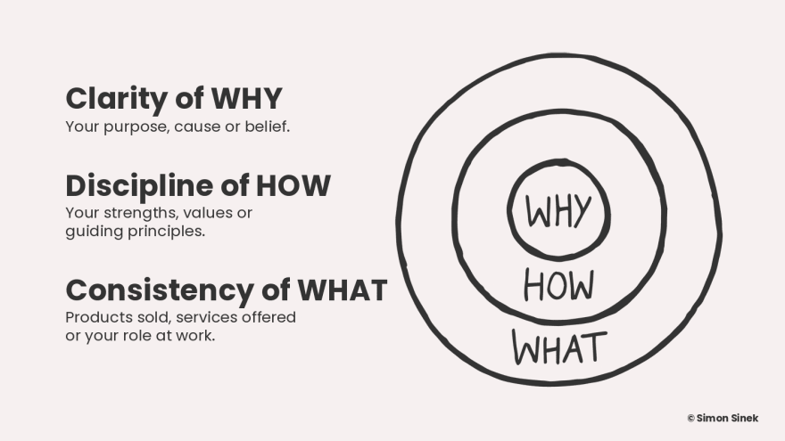
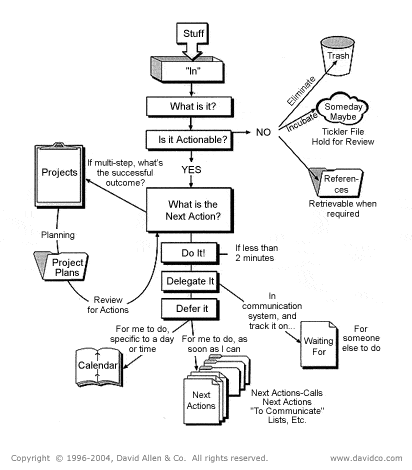
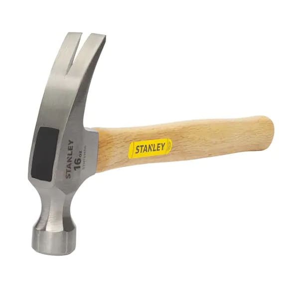

Back in 2013, I had an epiphany. I just graduated college with a degree I didn't care for, and couldn't find any job prospects either

I was pretty much a failure per Asian family standards. My dad would say "you can come back and work for family... but just know we're disappointed in you". Not those exact words but more or less how I felt at the time

Over time I ran my family's company and was overwhelmed by the sheer amount of work I had to do. We ran a kitchen design business, and I was always fighting fires with clients, managing problematic shipments, and dealing with my parents as my boss's.

I remember being lost. Lost in where I wanted to go in life. I felt that there was so much out there - yet I lived in such a tiny bubble. I felt that my dreams were slowly dying - and I slowly was becoming someone that I didn't want to be.

I started going down an endless stream of self-help books. I wanted guidance, so I just found whatever books were popular on Amazon.

I remember reading [choose yourself](https://www.amazon.com/Choose-Yourself-James-Altucher/dp/1490313370) from James Altucher and decided that only I could choose me. I could only get where I want to life if I chose to put in the work to get there

Then I watched a TED talk about ["why how what"](https://www.ted.com/talks/simon_sinek_how_great_leaders_inspire_action?language=en). I've always wondered what my driving inspirations were, and the "why" resonated as someone who wanted to live-life to it's fullest, and to choose my own destiny

Another that time I read Derk Sivers work on the idea of an ["execution multiplier"](https://sive.rs/multiply). The concept is that you can have great ideas, but if you can't execute them then there is no point. Hundreds and thousands of people might have your same idea, but only a few have the skills, discipline, and patience to see it through

If I wanted to chase my dreams in life - I had to do anything, anywhere, anytime whenever the occasion arose. This could be learning how to program, how to build a side hustle, how to make long lasting friendships, and many more

I didn't really know "what" or really how to get to where I wanted. Some deep soul searching later, I decided to conduct my own user research on what even describes an "execution multiplier"

## Thoughts on Productivity

"Productivity" was one of the keywords that came out of it. I decided that if I wanted to be someone that had a high execution multiplier, this was it

I read countless books on this topic. The one that resonated the most was ["Getting Things Done"](https://gettingthingsdone.com/) from David Allen. This book gives a hierarchial approach on how to handle everyday tasks and situations

There wasn't a set set of rules to which technologies or tools you could use to achieve this. It was open to interpretation, but I decided to explore every toolset in this space in the time, from 2013 to 2018

I ran an audit on the almost every productivity software suite in the industry. Each and every item I did a thorough review and benchmark based on my needs. Here's my user profile on [alternativeto.net](https://alternativeto.net/user/kagerjay/)

I became an active user on various subreddits and forums in lieu of this topic. I became an active beta user in many next generation software tooling, such as [dynalist](https://talk.dynalist.io/u/vincent_tang/summary), workflowy, notion, and more.

Being a beta user in this program I'd do self-studies on myself to see what was an effective way of learning or doing things. Sometimes I'd learn about new workflows in tools that such as [space repetition](http://augmentingcognition.com/ltm.html) for enhancing the way I learn new things in expediting my "execution multiplier" skillsets.

I also got trapped in the cycle of what you'd call [productivity porn](https://medium.com/thinking-about-thinking/the-trap-of-productivity-porn-7173d1cc6f95). This is where you spent way too much time honing your toolset instead of just using the tools you need to get stuff done

Joel Hooks writes a good article about [digital gardening](https://joelhooks.com/digital-garden/) where while a toolshed is useful, weeds are going to grow overtime too. You should keep your toolshed lean, and effective

This brings me to my next point:

## Use Single Use Tools

What's a single use tool?

It's a tool that's used only for one specific use case. If you think of a toolshed, you could use a drill to hammer in a nail. It wouldn't be ideal but it'd get the job done... inefficiently

Single use tools in the software space is the same thing. Tools like facebook for connecting to friends. Linkedin for social business networks. Spotify for music. Etc.

These exist predominantly as single use tools. But what then about multiuse-tools?

The biggest example I can think of is [Notion](https://www.notion.so/). It's a collaborative notetaking / workflow management tool that does just about anything you want

The problem with using tools like these is because it does so much, you have to figure out what specific feature sets you need to use it for

This causes you to go down a "productivity porn" mindset that doesn't go away until your happy with a solution at hand. You lose context of the business problem you are solving by artifically solving unimportant issues

You might long term though get a better mileage investment if doing the "productivity porn" mindset is worth it. This is true if you work in teams where the upfront investment in setting up a new set of workflows / tools pays off long term

Or you could just reach for things everyone is familiar with already. Google documents for documents, trello/todoist for basic task management, plain stickynotes on a board, etc.

This follows on par with Japanese [LEAN](https://www.toyotaforklift.com/blog/what-is-toyota-lean-management) methodology as well, where you pick the simplest, established toolset to get the job done

## Closing thoughts

The inspiration for this blog post came from a conversation a [TampaDevs](https://tampadevs.com) member had with me and my co-organizer. He asked

"What are your thoughts on productivity tools? I don't know how the two of you get so much done"

And to which my co-organizer Charlton replied, "Use single use tools"

Subconciously I've always knew this to be true but never was able to verbalize it in words

Another reason why multiuse tools don't pan out early on is everyone has a different definition of what that tool is used for. You need to determine what that definition is which is a time/cost investment. If that investment is worth it, go for it. I do this with my instantpot, mostly for sauting and pressure cooking

Also here's also some fun tidbits of work I've done in the productivity space:

- If you use [Obsidian](https://obsidian.md/), the daily note feature is based on notes I wrote in 2017 on the [author's first note app](https://talk.dynalist.io/t/3-kanban-system-gtd-using-dynalist-io/514)
- My first HTML/CSS/JS project was writing userscript injections on [top of that app](https://www.vincentntang.com/Writing%20a%20custom%20userscript/)
- AirTable did a vlog with me when I first started my career back in [2019](https://builtonair.com/boa-podcast-s02e08-vincent-tang-airtable-super-producer/)

P.S. - it's sometimes good not to be productive. Take a walk, enjoy some fresh air, and have lazy days - everything is only good in moderation
