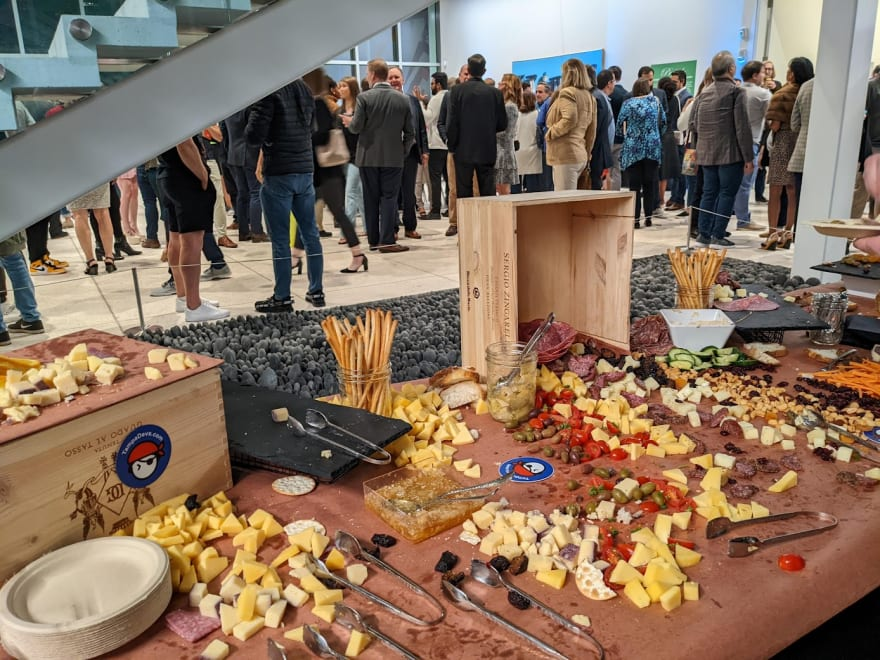
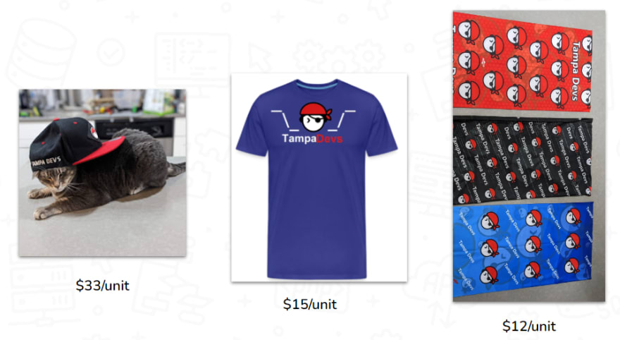
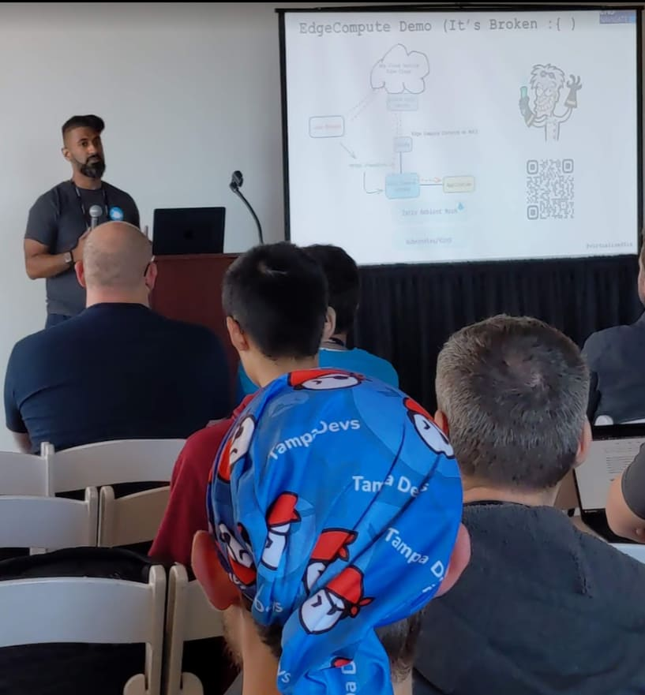
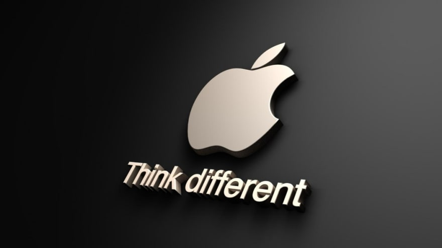
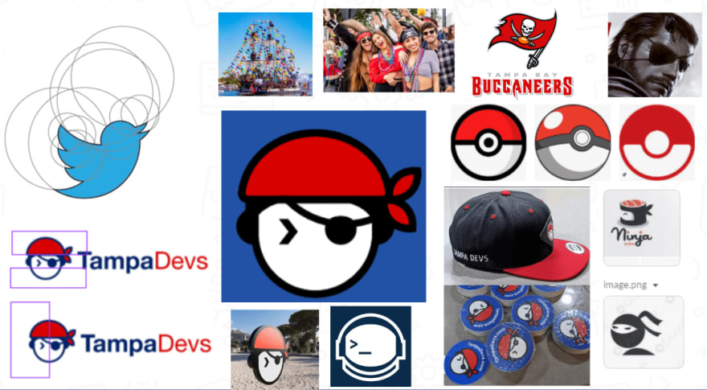
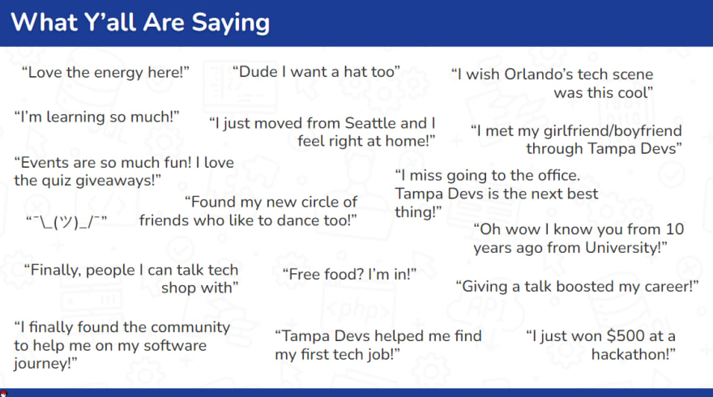
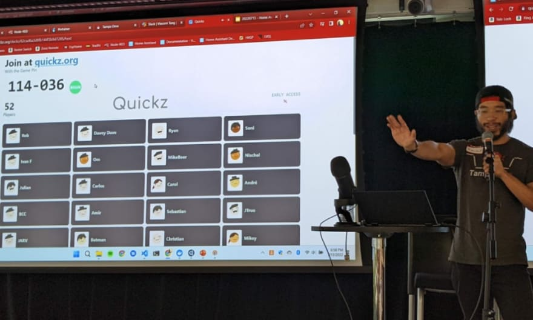
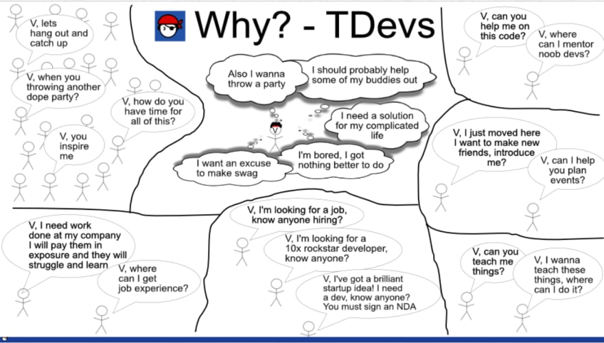

Here's a list of random cheap guerilla marketing strategies that have worked well for [TampaDevs](https://tampadevs.com)

## Be shameless and put stickers everywhere

Stickers are one of the most effective methods of advertising.

Why?

Stickers are

- Business cards
- Tech Mcgvyer tape
- Free wall advertisements

all wrapped in one convenient package. They're portable, useful in many situations, and eye-catchy from a distance if you design your logo correctly.

Related article I wrote about [swagging a table](https://www.vincentntang.com/swagging-a-table/) too

We're pretty shameless about doing this and most people actually respect the grinding effort involved. Since our brand is also pirate themed this actually fits in as well

You can also segway any conversation you want by stating

"Hey want a free sticker?"

**It's all about the giving mentality that sparks interesting conversations to otherwise hard to reach people**

I buy my stickers from [stickermule](https://www.stickermule.com/)

## Give away high quality merchandise

If you are really picky about clothing in general, designing quality merchandise is easier

I have a standard for merchandise in what is appealing as "swaggy" to someone of a younger demographic. My standard is if I can't do a dance performance on stage with it and generate traction, it isn't designed well enough

I usually give away merchandise to a few key people, these are the netpromoters to help grow a brand:

- Influencers
- Big time supporters
- Building relationships outside your network

The rest is usually sold at a marginal markup and we also do swag give-aways at our events too

We also give away swag to anyone curious enough to ask us what Tampa Devs is. Anyone with a curious mindset has growth-driven
values which is also what our core member base is. Usually the people who ask are also the ones to wear swag too.

**If you can create a memorable tie - or pitch to the item - it generally has more sentimental value to the person receiving said good**

That merchandise also sits in their wardrobe at home too so it's doing a lot of marketing offline too

## Flash mobbing popular events and venues

Bandanas have been a highly effective markting strategy tool for us. Compared to hats, it has 360\* of visibility at a higher focal point so people can spot it easier in a large audience

I carry around headbands and usually hand them out to friends and the netpromoters I mentioned earlier

**We have them walk around the conference, everyone is effectively a walking 360\* billboard**

It works, and people ask "Where can I get a bandana?"

At that point I just hand it out to them

These strategies are very effective for us at dev/tech/entreprenuerial conferences

## Be different

We've raised about [\$12,000 annually in donations](https://opencollective.com/tampadevs) as a 501c3 nonprofit serving the tech community in Tampa, FL. We didn't get here today by doing things the standard way

There's a common misconception that we're just another "meetup" and that cheap pizza is all software developers want for sponsorship.

You have to be different. To stand out amongst the crowd requires outside the box thinking. These ideas best come from other industries - so it's imperative to be multifaceted. **Borrow the best ideas from other industries and apply it to your own**

Our idea for headbands originally came from moshpit and music festivals that you'd see at Burning Man or similar venues. There's no need to reinvent the wheel here

Our video production level that we use on youtube comes from audio/video techniques I learned as an [aerial acrobatic performer](https://www.youtube.com/watch?v=lmc1MpUSEvk) and as a backhand stage assistant

Our idea for the logo is bandwagoning off a set of other popular young nerdy themes. Here they are:

We have a pitch deck that we use for engaging with sponsors to help create a co-branding strategy win-win oppurtunity. In our deck, we have a wall of quotes that they love. This inspiration came to me as people would tell me different fun facts about what they love about Tampa Devs

You see these testimonial walls in startups, google reviews, etc to help gain traction on why someone should get interested in your software.

We do the same here:

When it comes to building cultural hooks that helps keep events memorable for attendees, we borrow strategies from K-12 educational programs

One popular tool for keeping people engaged is [Kahoot](https://kahoot), but we use a similar branded tool

These are little quizes that ask questions related to programming that people compete in to win free swag. So that swag now has more sentimental vlaue, people have something excited about before our tech talks begin

Here's a picture of me promoting the event to a live audience:

The original thought process of telling the story about Tampa Devs starts with a comic strip. The idea came from [xkcd](https://xkcd.com/), and a story from the "how why what" [TED talk](https://www.ted.com/talks/simon_sinek_how_great_leaders_inspire_action?language=en)

It's an effective form of communication that isn't really otherwise seen at most tech conferences.

Here's an infographic I created on why I started Tampa Devs

If you want to stand out among the crowd, **be different**. Think outside the box. Don't do what people tell you to do, consider whether there's a better way to go about doing things. **Be an original thinker with strong opinions**. But also be open minded and learn from the best - have curious interests outside your industry as a whole

Don't let other people ruin your [ideas](https://www.vincentntang.com/tenacity-and-life-lessons/) either. To get anywhere you have to go through a lot of failures, and failing quickly is the best way to find successes.

Hopefully this is an inspiration to anyone following the success we've had at [Tampa Devs](https://tampadevs.com)
