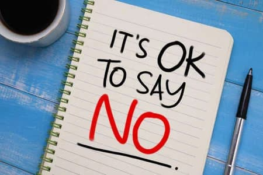
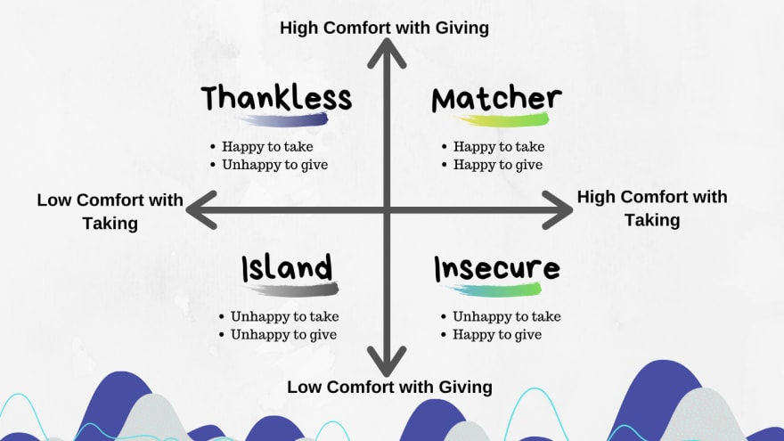

Saying No is hard for someone like me. I like to make friends, be open-minded, and have FOMO when oppurtunities arise. Those are all very much "Yes" level activities

Sometimes I get stuck in this mindset of saying "Yes" at the expense of my own needs like skipping the gym

These could be hanging out with the girlfriend, helping a friend in need, doing nonprofit work for Tampa Devs

These are things I have a hard "no" to

## Takers

There's two types of people in this world, givers and takers. Sometimes the line gets blurred but most people will fall in one category or another, depending on your current situations

Takers are people who only want to take from you, and give nothing in return.

For the community I run, this is people who want to utilize TampaDevs for free. Sponsors who want exclusivity but aren't willing to pay for it, spammers on our slack channel, etc.

Most business based discussions are always "take" based, so I try and find a win-win strategy instead. For me I "take" a lot from our partner orgs - venue assistance, food, etc - and sometime there isn't much room to "give".

I usually try and give back to these organizations. These include giving away swag, thanking the partner orgs for their time, and sending progress updates to them on the impact they made. I also pay friends for helping me do videography, consulting, etc

When it comes to taking in my personal life, this is acquaintances who only ping me when they need something for me. Like "Hey you run Tampa Devs and I need an internship - can you find me one?"

If they rephrase the question of "Hey how can I help Tampa Devs?" -> I'll usually do everything in my power to help that person with my resume, job searches, and pay it back forward multiple times to that them.

In general, I say "No" to situations that don't really align with my visions, goals, or passions in life. I say "No" to people that are mostly takers from my perspective

Someone who I see as a "taker" though can be seen as a "giver" in other contexts

For instance, someone who asks me for job oppurtunities - but for one of their friends. That's very much someone who is "happy to take" and "happy to give", which is similar to me

## Too much of something

I say "No" to too much of anything. This could be too much of Tampa Devs, too much work, too much social interaction

I get burnt out after hosting a really big event or attending a really big conference

I like to stay in with my cat and binge watch a new netflix show the day after

If I've had a crazy month of adventures, I try to keep the next week more reflective and slower in nature. In this instance, I'll say "No" to friend outings, "No" to parties, "No" to travelling

If I haven't done much of anything - I'll say "Yes" to those things

It's all about finding a balance and the context changes daily

## The opposite gender

Saying "No" to the opposite gender has been something I've been learning as of late, now that I'm in a happy stable relationship

I had to say "No" to people I would normally find myself attracted to, and divert that to "Hey you should meet my single friend instead"

## Closing thoughts

Get used to saying "No". Protect your finite time in this world. Cherish the givers in the world and say "Yes" to those people and oppurtunites instead.

The more you say "No", the easier it gets. It's all about setting boundaries for yourself, and priotizing your needs, goals, and visions in life
