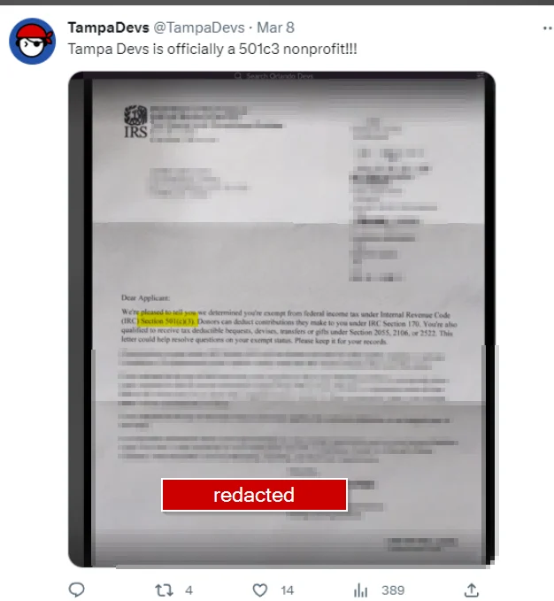
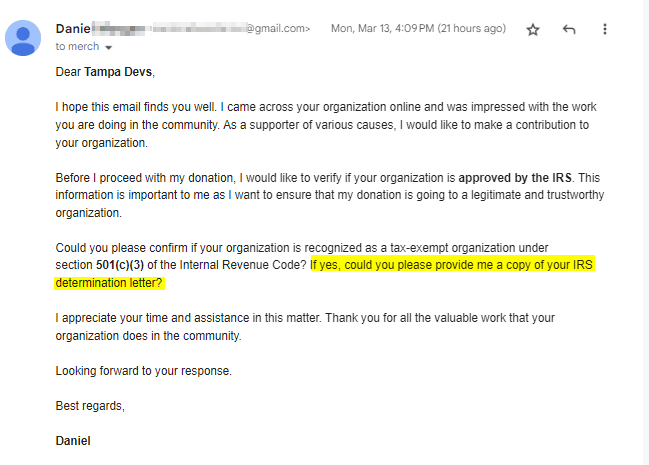
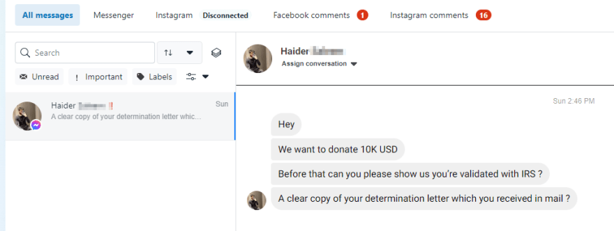
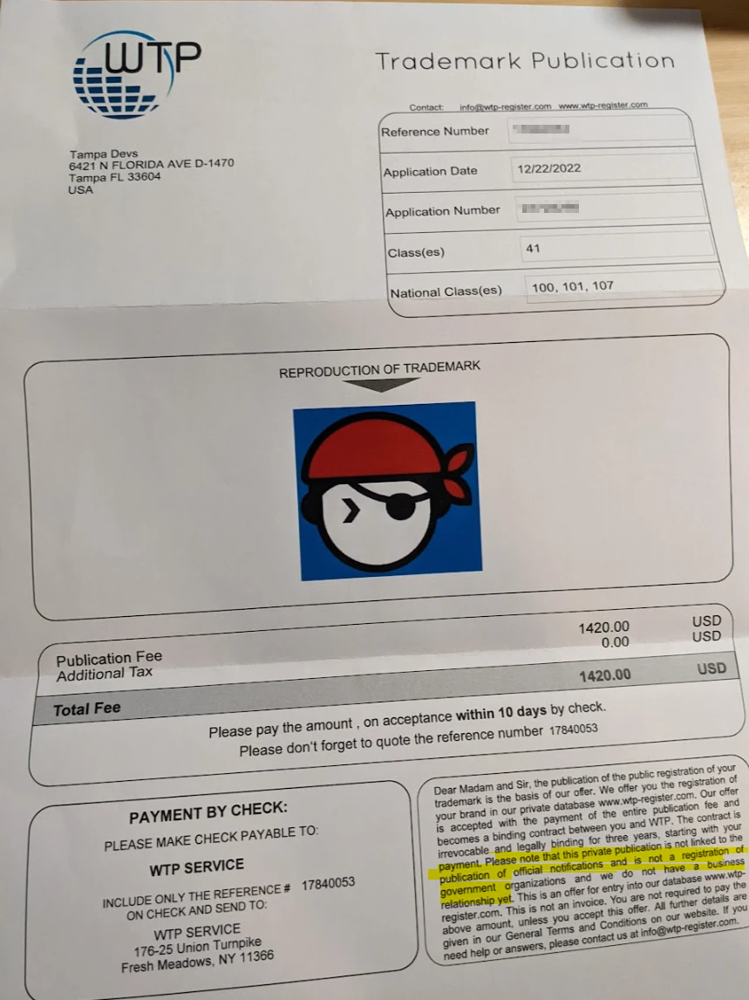

Earlier this month, I got a letter in the mail for our 501c3 Nonprofit designation for [Tampa Devs](https://tampadevs.com). This was a huge step forward in our mission, and to celebrate I posted that IRS designation of letter to social media

Before I posted it, I blurred out important details - basically anything that wasn't already public information

We got a few messages the day after, asking for the full IRS designation letter we partially redacted on social media:



I don't even know who Daniel is or why he even wants to donate, or why he chose to send an email to our most scraped email (merch@tampadevs from shopify). Daniel isn't the only case, we got this from Tampa Devs

We got this email from another person on facebook too the same day, haider



Everything seems so suspect and so similar to both messages, that I'd need to do more digging here. This user in particular has a spam profile setup on facebook, and dubbed entreprenuer

I asked my good friend Jacques, who runs a billion dollar fintech firm & Orlando Devs.

His thoughts on these messages:

```
Generally stealing your orgs identity
Then they could do stuff like open a credit card
```

And in response to the redacted IRS determination letter we posted:

```
Yeah I’d delete that
You don’t want to make yourself a target
```

While I haven't pursued this case further, this speculation lines up with actual incidents I've seen in the past

## Personal related incidents

When I used to run my family's business, we had bad actors spoof and create fake identical checks using our business address, and check them into the bank. Sometimes they'd actually work - usually at smaller banks that didn't have good fraud detection.

When we eventually moved to a National bank, we'd get a call from the bank whenever this happened. Some bystander would get caught - and he'd say the following to the police:

```
someone told me if I submitted this cheque to the bank,
I'd get to keep half the money here
```

This prevented the actual bad actor from ever getting caught, they generally used burner phones or other methods to communicate to the bystander. Contact could have initiated from a number of different points - from ads on a mobile app, ads on a stream site, the origins really could have come from anywhere

I'm merely speculating that the IRS determination letter request is of similar standard. Here's what it could be used for, if they spoofed Tampa Dev's identity:

- They could state we're politically supporting something we are not - in order to gain government grant funds. We've had an email from a sister tech entity requesting this
- Freebies you can get if your a 501c3 nonprofit (e.g. free software)
- The same benefits you get from stealing business identities (example above, spoofing cheques)

I've been a bit naiive at this point, but having seen how this _may_ actually play out, I went ahead and deleted all of our social media posts.

## More unrelated scam incidents

This isn't the only case of scams we've dealt with. The number of scams you get when you first open a business is absurd

Webservices will scrape the public listing off Sunbiz (where you register businesses in Florida) and autogenerate a legitimate looking email with fineprint at the bottom stating they are not associated with the government

Here is one example when we got our Trademark designation for Tampa Devs. This mail was sent to us:



Scams aren't the only things we have to handle as well. We've had our case of bad actors trying to capitalize on our successes.

These have included spammers, soliciters, sponsors trying to create exclusive legal contracts for practically nothing in return, amongst other things. We've seen maybe a dozen or so cases like these in Tampa Devs already, including someone who robbed our photographers camera rigs

What I've come to realize is that I have a lot to lose and not much to gain. Protecting our successes is important. Being constantly exposed around actual potential bad actors makes me wary.

That being said, I am optimistic about the future though. We have a lot of secure and strong infrastructure at Tampa Devs. And we've just onboarded our third primary organizer, and I feel really confident we made the right choice
