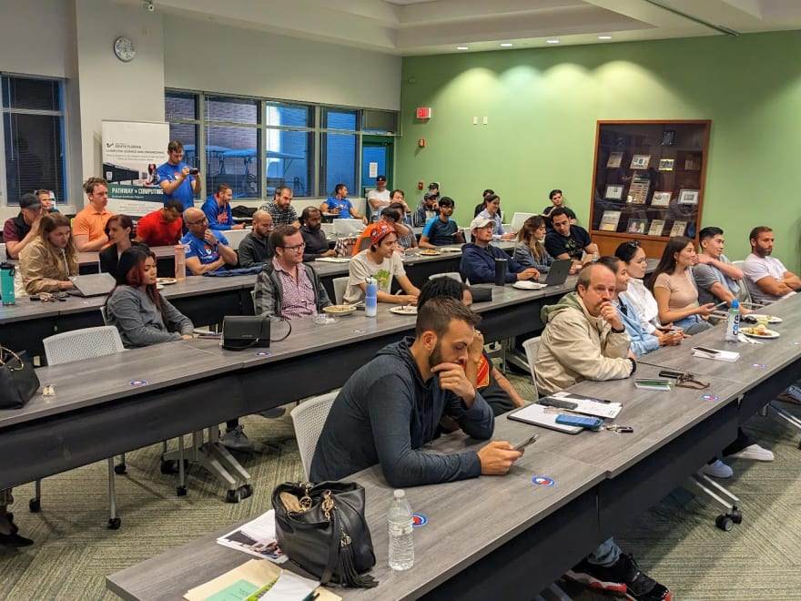
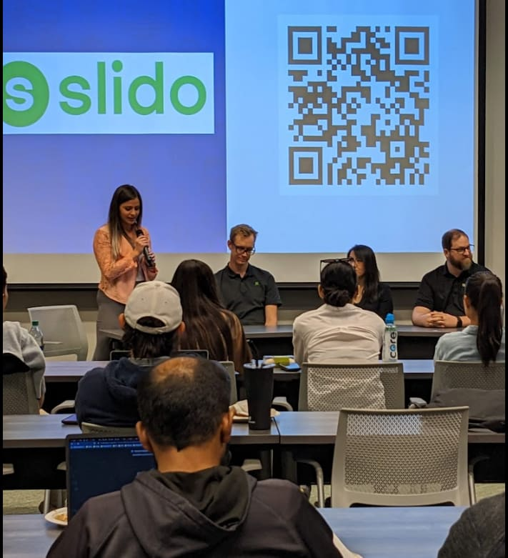
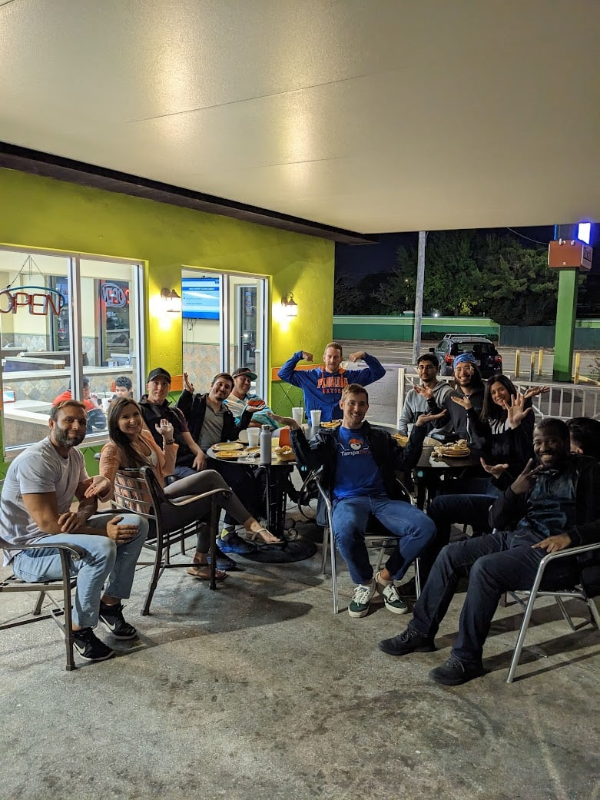

We hosted our first annual career forum for [Tampa Devs](https://tampadevs.com)! We invited a panel of tech leads, head hunters, senior developers, and CTOs to give advice to students and career transitioners on how to get their first job

Of the 20+ events we've hosted so far, this was by far one of the fan favorites. We hosted a hackathon the year before - but that was a full blown weekend event

For the first time, we still adhered to our 2-3 hour time window for tech talks, but change the concept entirely

It provided a huge growth oppurtunity for new co-organizers to take leadership. My co-organizer and I stepped away entirely from the event, and everything ran smoothly

Here are some highlights of the event, and why it was so memorable, to different attendees from a growth perspective.

> This is a continuation of leadership level blog posts that I've written. Namely these [Retaining talent by creating ownership](https://www.vincentntang.com/retaining-talent-by-creating-ownership/) and [How to find co-organizers](https://www.vincentntang.com/how-to-find-coorganizers/)

## Students and career transitioners Growth

We had a [slido](https://www.tampadevs.com/blog/2023/20230316-career-forum-slido/) where attendees could ask questions anonymously to the moderator. Students are generally too shy to ask these questions up front, so having a safe space to ask it makes it so we have more questions

We learned that students usually don't get that much mentorship or guidance while in school. Counsellors and teachers will usually give same old advice, which is

- go find an internship or co-op
- network to find jobs
- make a portfolio

While those are great - there are so many burning new questions that go unanswered. Like "How does chatgpt and the economy affect the job market?". Or "Should I job hop every few years?". Answering these questions really needs to come from a professional in industry, and students were able to see multiple perspectives to their questions all in one shot

Chris Ayers just nailed it. Most of his advice is on par with things found on [hackernews](https://news.ycombinator.com/), which includes advice such as the newly minted "prompt engineer" that only has come recently due recent innovations in AI

We also were able to encourage students to join our slack (9 people joined after the event!)

This encourages a place for students to seek mentorship and guidance from some of their fellow developers, which will help them in their career long term

## Moderator Growth

Nadia our moderator absolutely crushed it. When we first presented the idea of the career forum last month, she was super gung ho in getting involved. One of our friends suggested we pass on the moderator role to her. We knew she'd be a good fit, but my co-organizer and I were surprised just how well everything was handled

She asked so many questions prior to the event. "What should I do here? Should I make the slido public, how do you want me to introduce the speakers, etc?". Asking all these questions up front gave me alot of confidence things were going to be fine. Ultimately I gave told her she has the final say on everything, and I was pleasantly surprised that we even had a ending time (8pm) to the event. Heck I didn't even know we had one, and I organized the event!

Charlton (my co-organizer) and I just caught up with life, walked away and realized "wow we don't actually have to do anything anymore". We use the intro segment of our career forum and talked about our long term vision of Tampa Devs - in which the ultimate goal was automating everything. To the point we could step down and things would be fine

And this was a huge stepping stone for us as organizers. And not only that, this created a massive growth oppurtunity for Nadia, our moderator. This is how you groom leaders to take over after you retire, **by creating memorable events** that people look back upon years later (or once a year)

People now associate her as a public figurehead for TampaDevs. And now she's earned her way via trial by fire. It's a win-win on every end

## Panelist Growth

One of our panelist did not show up, and this was a referral from a third party. I think it's okay, because I wanted my buddy Chris to be the panelist and he volunteered to be a backup. This was probably his hundredth time or so speaking so didn't have to worry much here.

But we had a relatively shy speaker come on stage as a speaker, Leann. I think it was actually important that we had someone that was more shy - and I was able to confirm this when asked a few students what panelist to related to the most

A lot of them picked her. And it makes sense. A lot of us are super socially awkward and having 4 other strong personality figures on stage isn't entirely relatable to students. Not only that, a lot of programmers are of Asian descent - and almost all of our students attending the panel were in fact Asian

We were able to watch her grow her public speaking skills, and it was super rewarding to see, having been there myself

We were also able to establish stronger relationships as well to all the panelist on stage. So now there's a stronger emotional stake at play when it comes to their involvement with TampaDevs (they are all now Tampa Devs speakers!)

## In conclusion

Our event went without any notable problems, except parking (we only had 24 permits and 80 people came. Also I put the wrong address in).

What I've come to learn is having memorable events like these is vital to the growth of Tampa Devs. We still have people talking about the hackathon we hosted last year, and a lot of those people who participated in the same team are now friends in real life

This was very much in the same vein, except in 2-3 hours. We know this to be true, since a lot of attendees also stay around to get a late night dinner

These are the people you want in your inner circle and the ones to take over once our tenure is up.

We're going to be doing this event once a year. Probably around the same time. It does take a massive amount of work, props to Noemi for helping set up everything on USF's side for this event!

We have so many more fun things in the pipeline. We're going to have an ongoing list of **unique memorable events, one time per year**. These are huge driving factors in getting people to volunteer for Tampa Devs, and a huge morale booster overall to an org. Here are ours:

- BayHacks Hackathon
- Career Forum

And for things that are more consistent throughout the year

- Low key networking events
- Tech Talks

Things we have in the pipeline that might also be super memorable:

- Technical Workshops
- Ignite talks / karaoke
