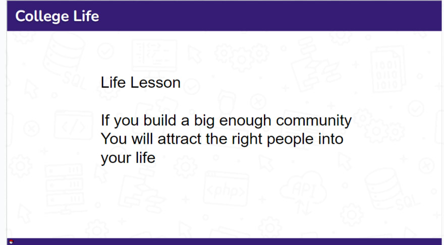
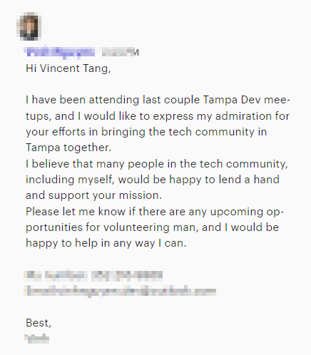
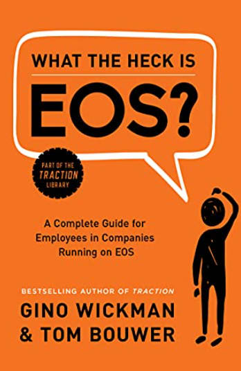

I gave a [presentation](https://docs.google.com/presentation/d/1smH2KomgS8RGBwIay1hNRu5_9j9JIs6RxzZaknqXMvw/edit?usp=sharing) on "Life lessons from a self-taught coder to tech community founder" to a bunch of students at USF, the local University in town

Here I gave insights on my career, and how I became who I am today.

During my presentation, I highlighted the rollercoaster that my life was, and how it made me stronger as a person

One important lesson I was based around the blog on [tenacity and life lessons through the 33% rule](https://www.vincentntang.com/tenacity-and-life-lessons/) that also trended to the frontpage of hackernews

This was something I learned 10 years ago, here is the slide:

**If you build a big enough community, you will attract the right people into your life**

This is a strong principle I live by. I applied it to my leadership organization style with Tampa Devs. And my relationships in life - friend, romance, and business. It's how we vet new leaders in our group as well. And it's worked really well

We provide a proving ground where people can prove themselves to us, a place for people to be a "part of the inner circle" so to speak. These could be "hey we're getting food after the event, you're all welcome to join".

Or it could be me talking a lot about an awesome event we have coming up and having them come to the conclusion of wanting to volunteer. I don't ask for help, I want them to come seeking to volunteer to help. They come unsolicited usually like so:

Or it could be "hey do you want to give a talk, fill out this 4 textrow form on tampadevs.com/speaker" to people interested in giving a talk.

You'd be surprised how few people actually fill this out, given how many speakers we have interested in giving a talk. I would say only 20% go through with it

It could be "Hey there's no need for formalities, I'll get you the script". And then they never do. Or "I'm too shy to give a talk, give me time". And then I never hear back

Those that commit to filling out this 4 textrow form have put 5 minutes in their life into the game. **I know their committed, we kept an open invitation and they responded**

I have other examples as well. We have so many potential third parties who would love to sponsor Tampa Devs. Sometimes the conditions they have are a bit absurd (e.g. wanting contract exclusivity for a mere $200 a month - when we're getting over $1000 in member donations)

When we mention we have asynchronous forms of donations via [opencollective](http://opencollective.com/tampadevs), and a physical sponsor-guide with a clear transacational benefit - they back down. They don't even read anything we wrote - we've had multiple recruiting agencies baffled that we weren't the naiive developers they thought we were.

We do come off strong - but we do it because we're protective of our community and we don't want to be an MLM level marketing ponzi scheme to our memberbase _(okay maybe not that absurd of a level, but you get the point)_

Even though we keep the doors open - we do know when the wrong people show up. It was a hard lesson my co-organizer Charlton and I learned, and we spent a whole year going through so many B2B conversations realizing how much these orgs wanted to take - and how little they wanted to give back. We were not going to use our community base as a sales RoI funnel

We instead openly up ourselves to member donations for the first time this January. And nobody batted an eye - all of our donors have seen our vision, our impact live in person through their own eyes - there were no questions asked. It was here you go, how can I help?

That's why it's important to build a community of culture, a layer of transparency and trust at all levels, and to attract the right people with a strong mission statement

We are a community of software developers seeking to grow together.

Speaking of building community, there's a good [book](https://www.amazon.com/What-Heck-EOS-Employees-Companies/dp/194464881X) on establish culture at one. It could also be for building culture at a company, a community amongst friends etc.

In this book, it states you need to find the right person for the right seat. If we have a role to fill (such as a moderator for a forum), these criteria need to be met:

- Are they a skilled moderator (or can they learn fast)?
- Do they want to be a moderator?
- Are they willing to absolutely own it?

That was pretty much our criteria for our [first career forum](https://www.vincentntang.com/creating-memorable-experiences-career-forum/), and the basis of the blog post I wrote on [How to find co-organizers](https://www.vincentntang.com/how-to-find-coorganizers/)
