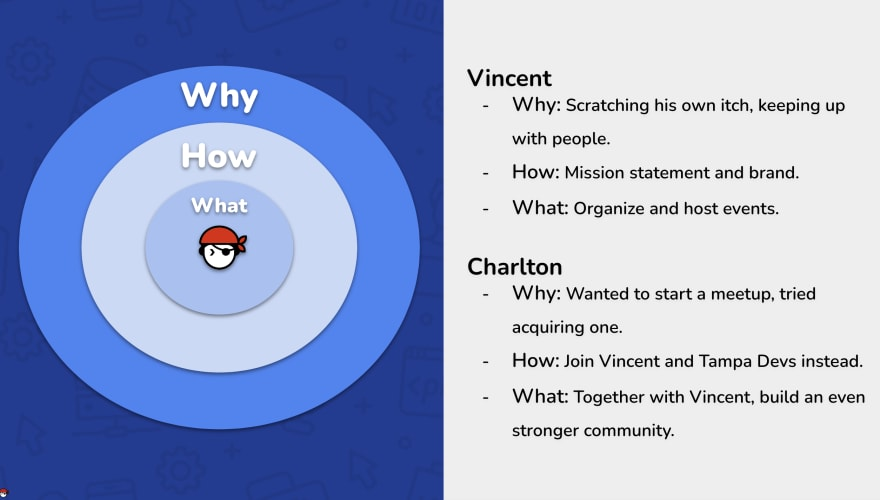
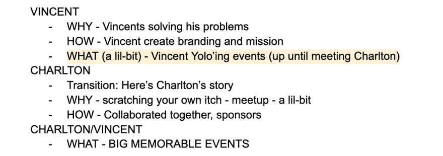
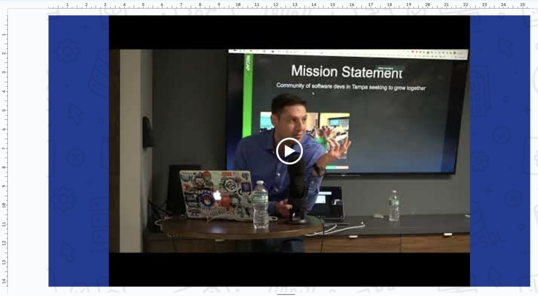

When you give a presentation, you have one shot to get it right. How you present yourself, and the content, can create a lasting first impression that drives your audience to a CTA (call to action).

These pitches are absolutely critical to do in a nonprofit organization. It creates a sense of culture, a sense of drive, for members to help contribute towards a shared mission. An effective leader needs to know how to do this to lead by example; and this will drive for others to grow into leadership roles as an org scales

Soft pitch presentations differ from hard sales pitch presentations in that they are more emotionally and or story driven. Hard pitches are more short-term driven in nature (closing a B2B sales call). Soft pitches are more towards selling a point, or an idea - these are more progressive in progressive in nature, allowing the audience to soak in information over time

> Soft pitches are more "yes" driven in nature - it's about positive reinforcement. Hard pitches are more "no" driven in nature - short time window oppurtunities

When it comes to giving soft pitch presentations, here are some effective tips I learned while running Tampa Devs:

## Your platforms for reaching your audience

Our mission statement at Tampa Devs is "a community of developers seeking to grow together". This is the basis for how we decide what events to host, what sponsors we take on, and what infrastructure we build

Every month, we host a tech talk. It's a platform to help members learn new skills, and events that people will remember months of years down the road. In these talks, we have an intro segment, where we give updates to Tampa Devs as an org. 

Your presentation doesn't stop at just the presentation itself. It's the event prospectuve before the event via meetup, linkedin etc. It's the after prospectus on social media where you highlight key parts. It's also the blog posts, the announcements in our slack community, IG post, and all forms of social media communications before and after an event

Even though you present to an audience in a given one hour time span, you could effectively collect emails, reach out to members of the audience at a later point in time, etc to follow up

The more times you follow up to the presentation and points you are trying to give, the more someone will remember it.

> We will usually present a condensed version of the same bulletpoints in future tampa devs tech talk presentations

Which brings me to my next point, determining your CTA (call to action)

## Write down your CTA first, then outline for the talk

Anytime I present for Tampa Devs, or a story driven format - I usually outline things in google docs

Here I am able to determine who my audience is, and likewise how I want to handle the CTA for this audience

We did a presentation at a devops conference on "How we built Tampa Devs - Tampa's fastest growing developer community".

<iframe width="560" height="315" src="https://www.youtube.com/embed/d9UUw1HQrZg" title="How we Built Tampa Devs - Tampa&#39;s fastest growing software developer community" frameborder="0" allow="accelerometer; autoplay; clipboard-write; encrypted-media; gyroscope; picture-in-picture; web-share" allowfullscreen></iframe>

We had about 20-25 people here from different software developer communities. Our CTA was to bring brand awareness outside of Tampa, and to bring in new sponsors using [Simon Sinek's](https://www.smartinsights.com/digital-marketing-strategy/online-value-proposition/start-with-why-creating-a-value-proposition-with-the-golden-circle-model/) theory of proposition as the outline flow

## Break up the flow with different speakers

If you watch a movie, there isn't just one protagonist leading the entire plot. There's side characters - with their own development arcs, that makes a story interesting

Since we are a community driven org - having multiple speakers plays in our favor as well. I have my co-organizer Charlton usually start off a presentation to make it more professional in nature, if I start a presentation it tends to be more story driven

Figure out how you want to utilize the strengths of speakers to your advantage. A good rule of thumb is not having one speaker speak for way too long - no matter how interesting they may be, an audience will get bored

If you have a lot of information that needs to be presented  - determine what parts need to be cut out. Which parts are the most important. Etc. 

Here's an outline draft of what our presentation pitch looked like

If you are the only speaker for your pitch, take a lesson from standup comedy:

## Take a lesson from Standup Comedy

Sometimes you don't have another speaker to "break the flow" and give the audience time to process things / relax

Standup comedians have things in their toolkit to keep an audience engaged throughout the entirety of a 1 hour presentation

Some examples

- Russell Peters will call out questions to random audience members, and create a unique storyflow based on the audience's ideas
- Trevor Noah will act out different characters on stage, with different voice, body language flows, etc. This helps create "multiple speakers"

You can also throw in jokes every so often to break up the pitch. 

TLDR approach of standup comedy - the more of a rollercoaster you make your audience experience during a pitch - the more they'll remember it years later - and the more your idea will resonate to an audience

You can also use other forms of media during a presentation, to break up the flow into more manageable chunks. Here's how:

## Capitalize on your media assets

In our presentation "How we built Tampa Devs - the fastest software developer communinty in Tampa", we incorporated a video of our third speaker talking inside the presentation deck

You need to consider "how" other forms of media will be used. We had a total of 3 videos, we used 2 at the start as an "attention hook" that you generally see in fiction novel writing. Our last video with our third speaker

You have to find the right examples that your audience can relate to

## Summary

There's a lot of ways to give an effective soft pitch presentation. Take inspiration from other forms of media presentations - whether it's a good movie plot, your favorite standup comedy routine, etc. 

Pitches are all about selling an idea - an idea you want others to run off and build their own thing within your org. This is what creates a strong community sense of culture in a Nonprofit org especially