I made a catbed, or rather my cat doesn't like it so it's a head pillow. Here's the end result:

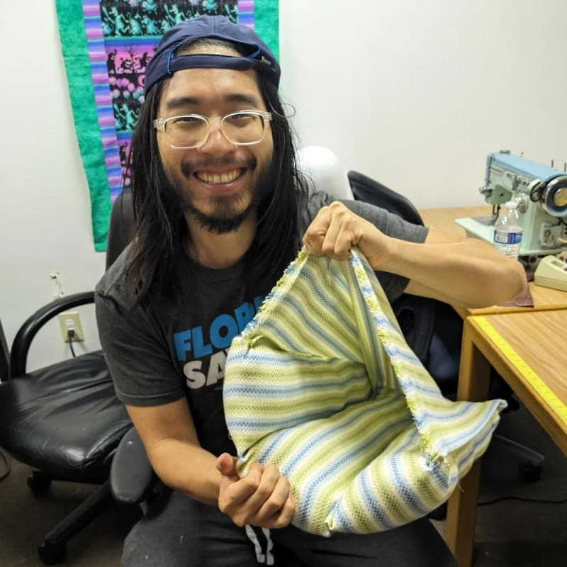

I haven't sewn since grade school. But I have done a bit of [hat design work](https://www.vincentntang.com/designing-custom-3d-pvc-hat/), so I'm not completely new to embroidery / sewing craft

I asked for some suggestions on simple things to make. Most sewing projects tend to start out as a pillow, since all it takes is a rectangle cloth folded in half sewed three times. The other alternative is a smaller plush filled with catnap for cats.

And I happen to have a cat too! That got me thinking. Just recently I was shopping for new things for my cat, and I came across a "cat bed house"

They look like this (minus the cat):

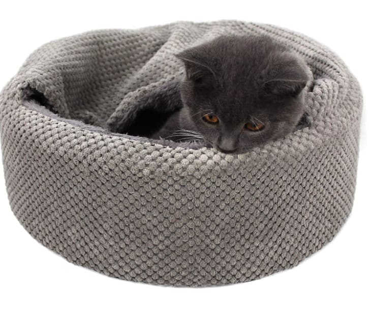

This was the inspiration of what I wanted to build. It wasn't going to look exactly like this. I wanted to simplify the build to it's core components, which is effectively a pillow with a flap

The lady at the hackerspace said there were some donated cloth material I could use. This one looked really nice, as it had more a towel feel that might cat seems to enjoy scratching on

We measured about a 20"x60" size to cut out

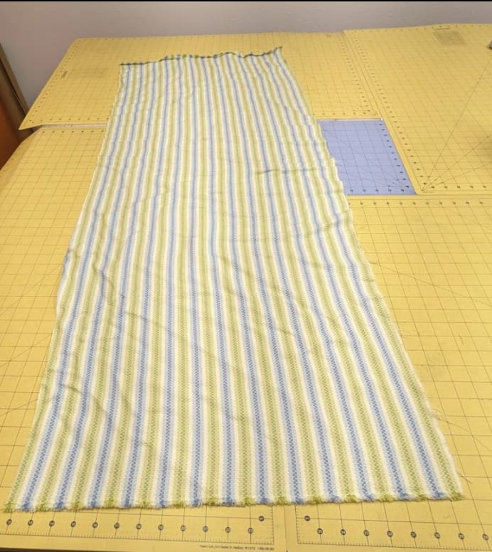

The original idea was to take this and fold it into 3 even halves. This way when the first fold is made and seams are created, this would create the pillow. The last third segment would act as the pillow flap.

Here's a diagram to illustrate the design thought process:

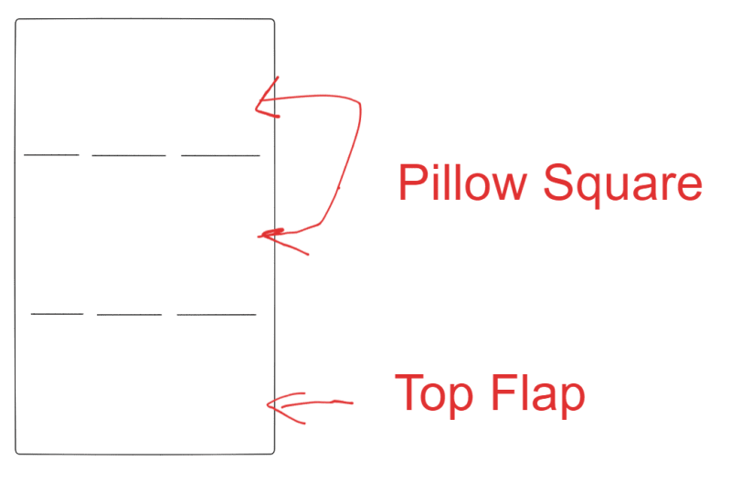

The first step after that I was informed was to iron out the cloth. I went to town for a little bit, until things came out wrinkly free

I got a brief run through on how to use a sewing machine, and how to get the spools setup. 

We first did a dryrun on sample material so I'd get used to the sewing machine first. It took quite some time, and I had to rethread the machine everytime it broke.

I didn't take too many pictures during the whole build process, so I'm going to make some diagrams explaining the build process.

First, I had to fold down one of the three halves into the other, so now that could be sewed together:

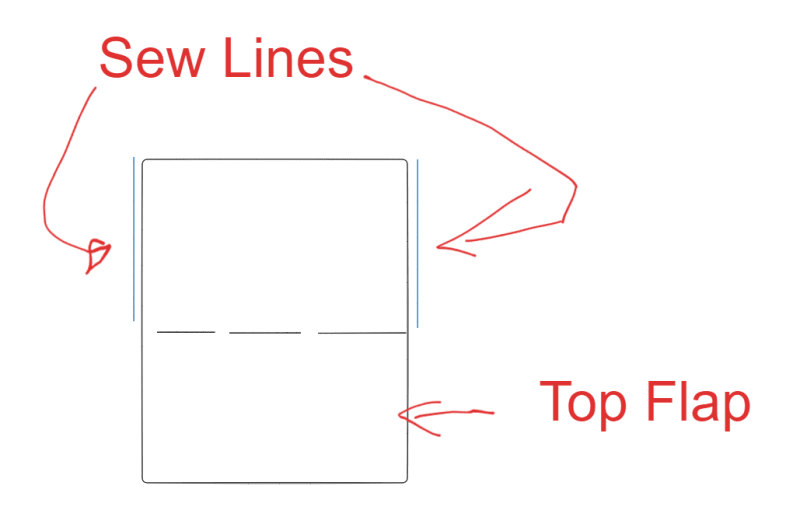

Note that I sewed everything the inside facing outward first. This is because after I finished sewing the first two blue lines, I had to reverse the entire pillow outwards.

Next step was to add stuffing. 

However I opted to do something a little bit different when I finished this stage

Recently I had learned from my obsessive shopping habits that bed manufacturers will use a quilting pattern to help section off layers of cotton so they won't move around.

Here's an example of that:

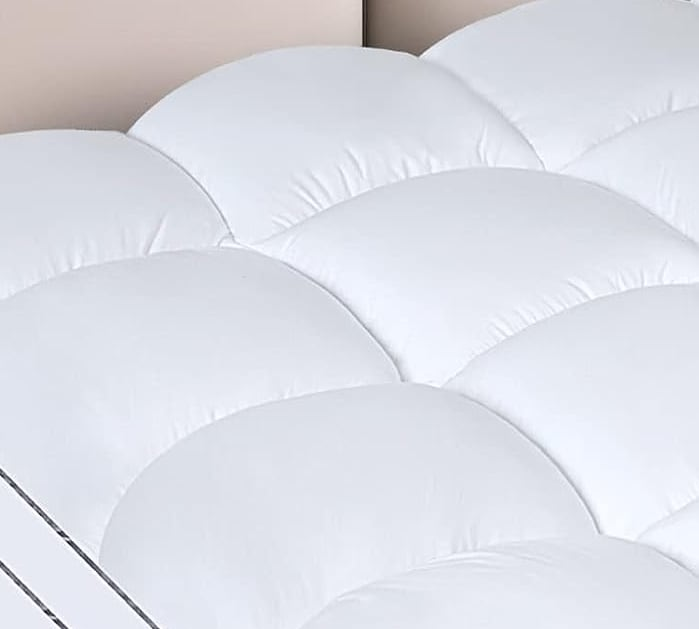

I only had learned about this process after I dumped my comforter into the washer, and the cotton was yanked out. They do say that one of the best ways to learn how things work is by breaking them, but this was unintentional

I decided to integrate a pattern like this into my cat bed. I opted with going with a 3x3 pattern, as the central square acts as a landing zone for the cat itself

Here's that drawing I made:

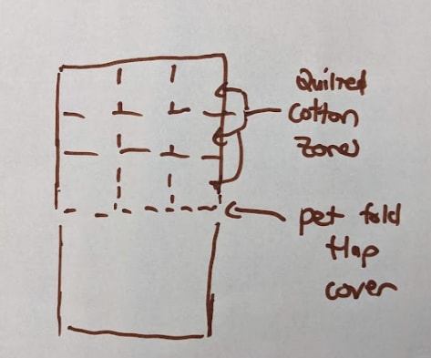

Now the unfortunately reality that while in theory this sounds great, in practice this wasn't actually ideal. The pillow itself was far too small to benefit for zones like this, and from what I learned later I was using general cotton stuffing whereas bed manufacturers will use a flatter variant

I ended up creating 3 vertical zones across the pillow. This would allow me to even stuff each column and distribute the cotton more evenly.

Here's a diagram of the sew lines I made after:

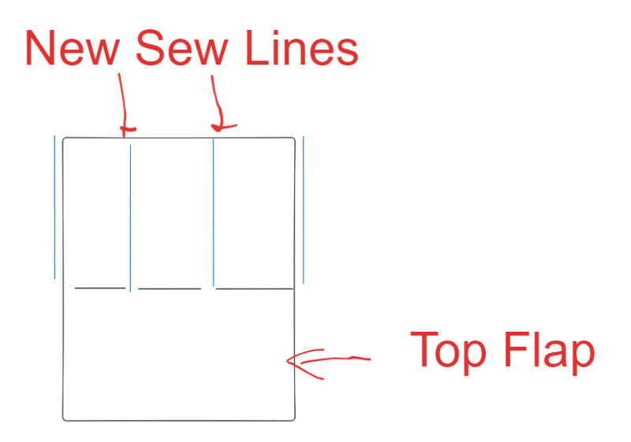

Sewing these weren't too bad, but I had to rethread several times, and lining up two pieces of cloth material was not entirely consistent. Some of my edges were a janky but it still held firm, and I was able to create end stitches on both ends

This was when I opted to start stuffing the first 3 top segments of the pillow, which looks like this when done properly:

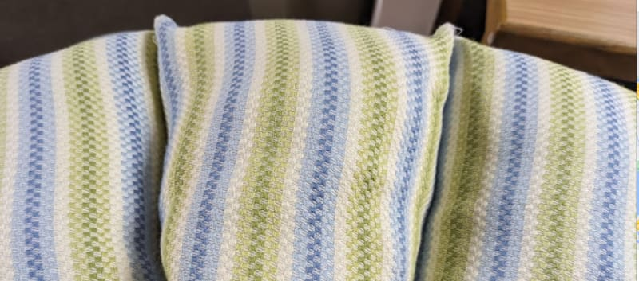

I didn't have that much time to finish the project, so I opted to do the additional 2 sewing lines I would have made to make 9 zones. I didn't realize how hard it'd be to sew once cotton was stuffed in the pillow as the machine kept getting stuck, and each time I had to rethread the needle I thought I wanted to die inside

Once I properly stuffed everything pretty well, and compacted the cotton, I gave myself a bit of leeway to sew the lines that would seal the cotton so it couldn't get out.

This was the last line to make the pillow feel like a pillow:

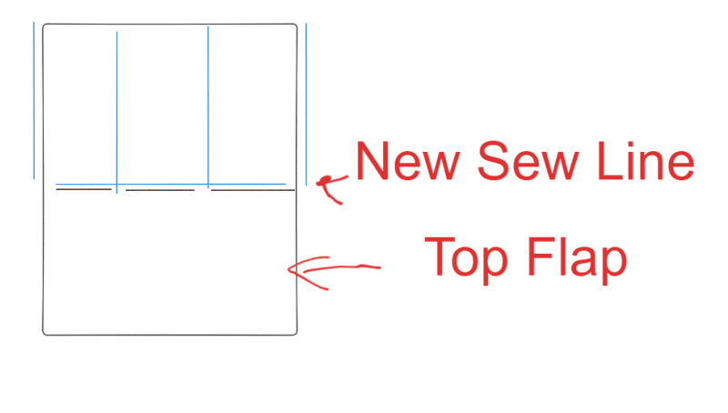

I was told that I should fold the edges on the flap so it wouldn't fray, so I added two additional sew lines here on the flap itself, but these were unnecessary

The last bit was figuring out how to seal the flap down to the pillow. My original thought was doing two full sealed ends, but a better recommendation was made:

Why not have three openings in this flap for my cat?

This would require sewing the 2 corners of the flap to the pillow corners. Here's what one of the corner joins look like:

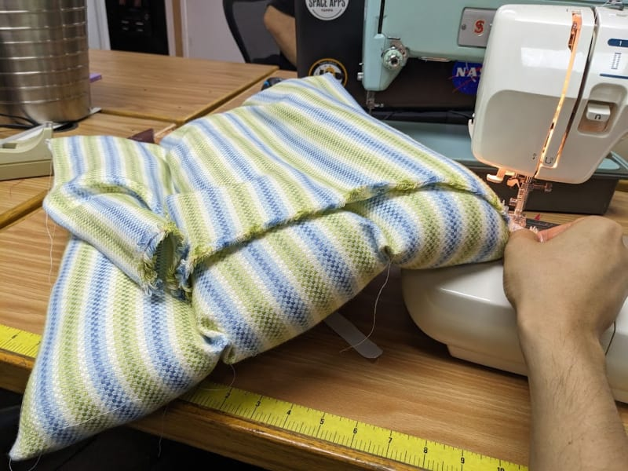

And with that everything was finished!

I cut some additional threads off that were lying loose.

I brought my glorious new catbed home and of course my cat didn't care about it. He still doesn't care about it a day later. Maybe one day he will use it or never maybe he never will

I sort of expected as much, as he is so comfortable on my couch:

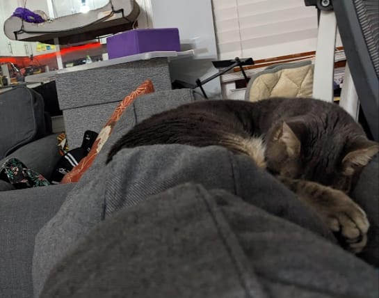

At this point I decided I would enjoy the fruits of my labor. Why not use it as a couch pillow?

And so I did. This picture looks a bit weird and disconcerting, but I really had to do the full pillow test. It felt like a combination of a hard sofa edge combined with a sleeping mask. My cat is probably judging me for doing this

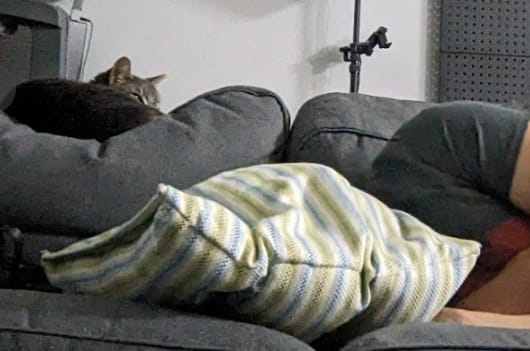

I also tested another variation of sleeping in it. This one feels like I'm wearing pajamas and a hoodie at home, and felt pretty comfortable. I can imagine it being really nice when it's really cold inside and you don't feel like wearing a snuggie

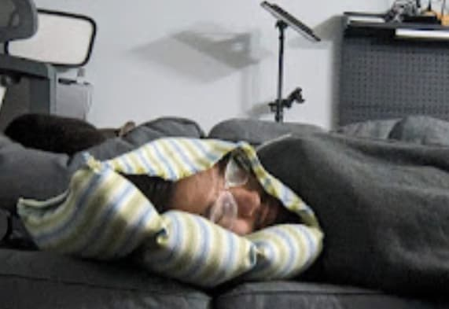

I think if I had to do this again, I'd probably make a bigger pillow so my cat would actually enjoy it. It is far too small. Maybe a And probably go away with the zoning entirely

Still I learned a lot in the process and it was really fun to make! I have forgotten the joys of building things yourself

