Here's the final design

Here it is worn by two of the tampa devs leadership team

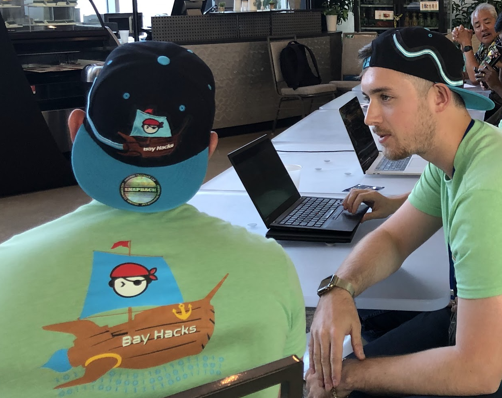

And here's the story of how this hat came to be

> Related blog posts on another hat I created [3d PVC hat](https://www.vincentntang.com/designing-custom-3d-pvc-hat)

## Background

As someone who just loves design and collecting cool hats, I haven't really found too many hats that have "wowed" me as a designer. They all look a bit the same to me, the same design, the same embroidery patterns, and they all seem a bit boring from a manufacturing and design standpoint.

Some part of me wished someone would create a hat that capitalized on the whole curvature of the hat as a story. And one day I found such a hat while shopping for swag from one of my favorite creative youtubers (circletoonshd)

Here's that hat:

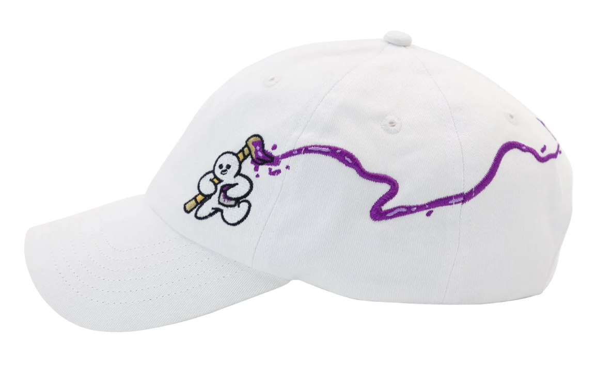

After seeing such a hat, I wanted to figure out how to make my own. I didn't know much about embroidery, but I recently got certified at my hackerspace to use one such machine (the babylock)

Here's that machine:

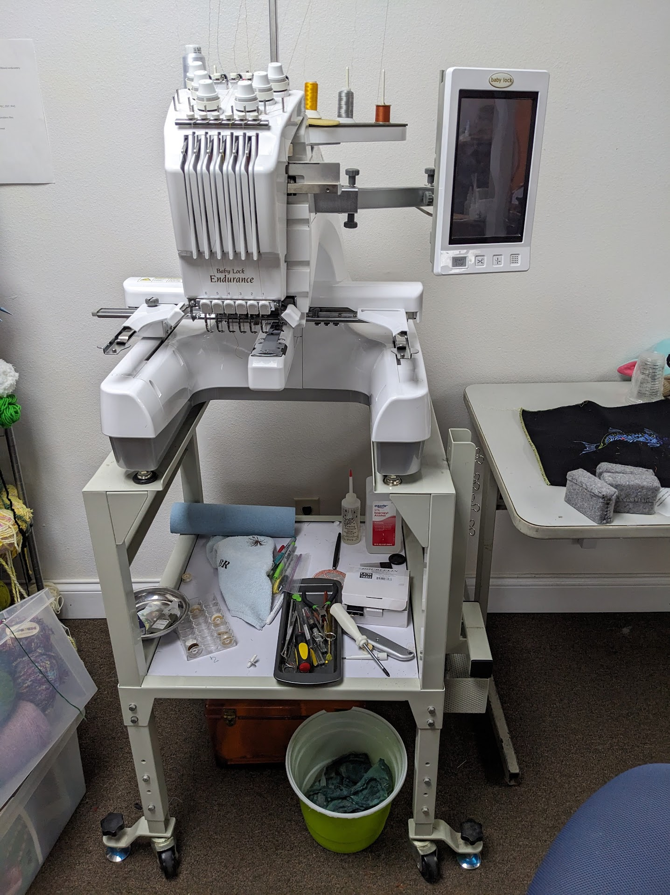

Recently I had just finished designing the bayhacks logo (you can read the design process [here](https://www.vincentntang.com/designing-the-bayhacks-logo/))

I made a few modifications inspired by the hat I found online. After playing around with a few vector edits, this is the final result:

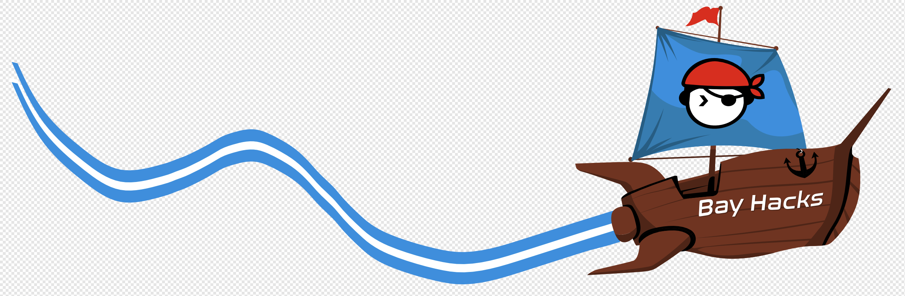

I learned along the way that converting SVGs into an embroider format is really complicated

Namely in that embroider formats contain much more information, such as how thick it will be stitched, which direction the stitches will go, and the order in which stitches are made.

Basically, you had to think of a vector file in 3 dimensions, according to my instructor for the machine

I played around with existing freeware tools for doing this conversion, namely inkstitch/inkscape

There weren't too many resources on how to do this conversion besides one youtube channel. Despite knowing how to work with SVGs and scalable vectors, I could not figure out how to do a proper conversion

The best I got was an export into the correct file which looked like this,

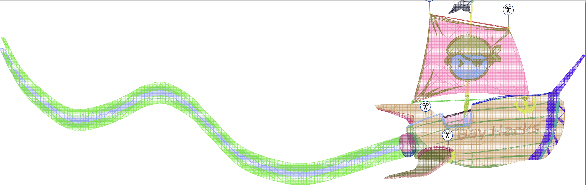

Blowing up the image you can see where some of the initial stitch marks would be woven, some parts like the ship's hull would be "X" shaped

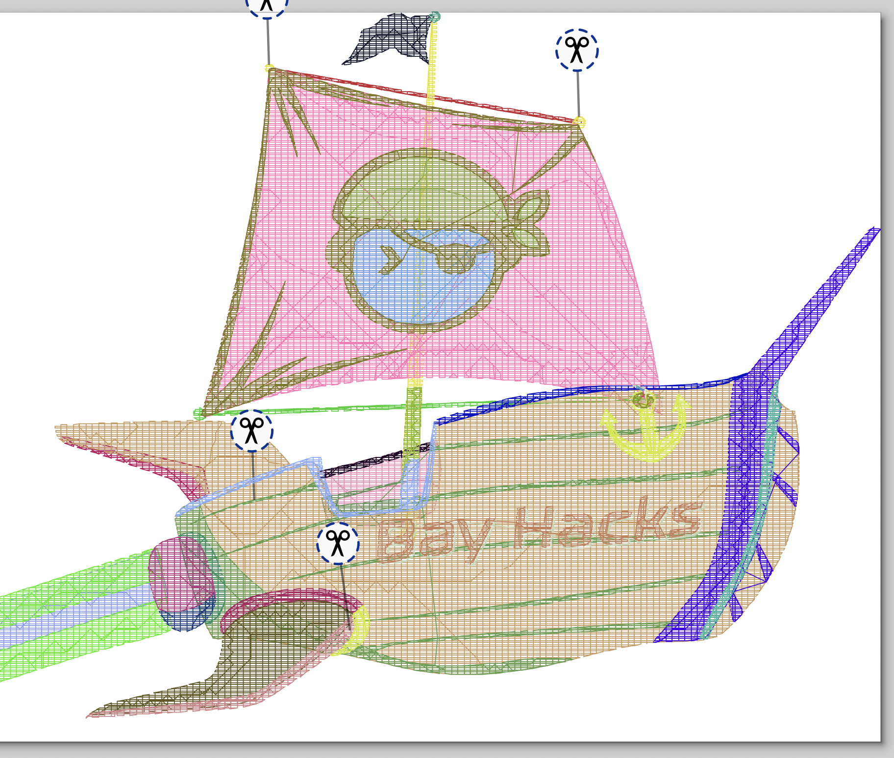

One of the cool features of this program is you can also preview what layers would print out in which order. Here's such a preview:

I ran this file under a test run in the babylock and my first iteration got destroyed along the way during the printing of "0101001" on the logo

I wasn't able to produce any meaningful modifications to this file using available freeware online. I ended up paying 2 different professionals instead to work on the conversion to .DST format

These were what the final versions looked like:

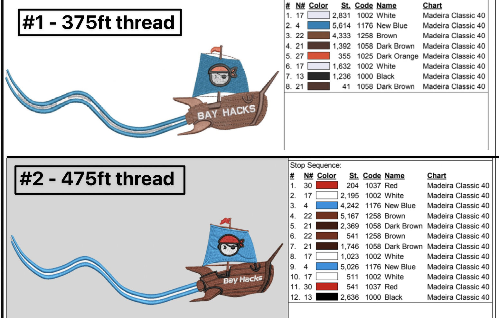

(#1) was the first design that came back first. The colors were a bit off and didn't really look like the original logo. I ran the print off below as a test print using sample thread colors

Once (#2) came in, I knew this was going to be the final production result. The flag still kept some of the original 3D shadow layers in the final design, I had the designer add additional overlays of blue on top of the flag to give it depth, while still keeping things to just 6 colors. There were additional stops as well which meant I'd have to change out threads more often

After setting up and doing some approximate color matching of threads, I ran the machine into production. Here was the preview on the screen, which runs at 49 minutes to embroider

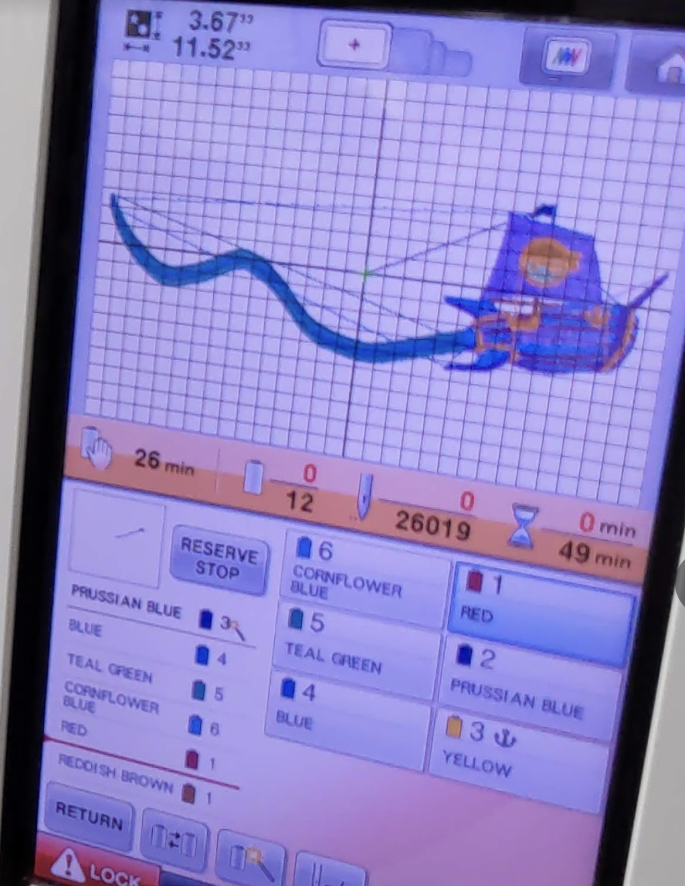

The preview was a bit complicated since the colors I chose on the .DST file were not the same colors on the machine preview itself. I had to create a converter file mapping what the colors on the machine correlated to the .DST files I got from the embroider experts

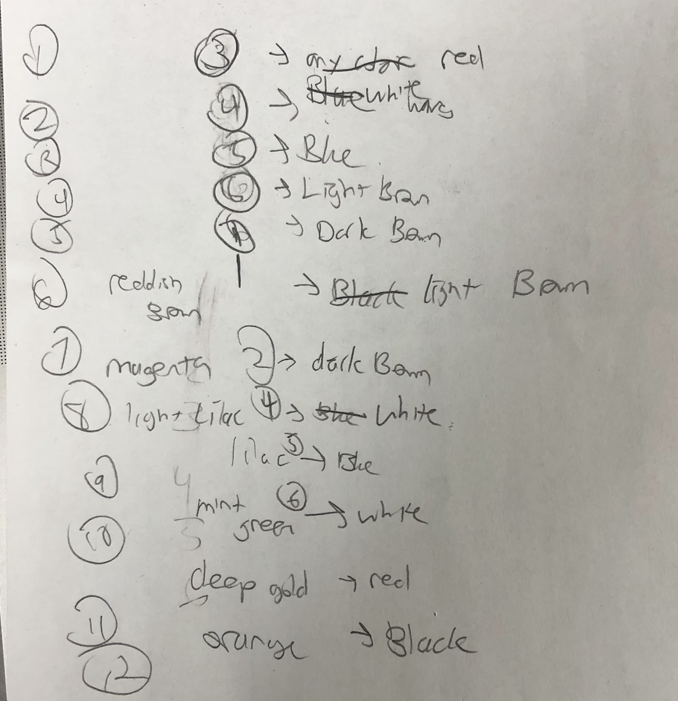

From here now I made sure to thread the correct colors on the machine, in the corresponding pin slots.

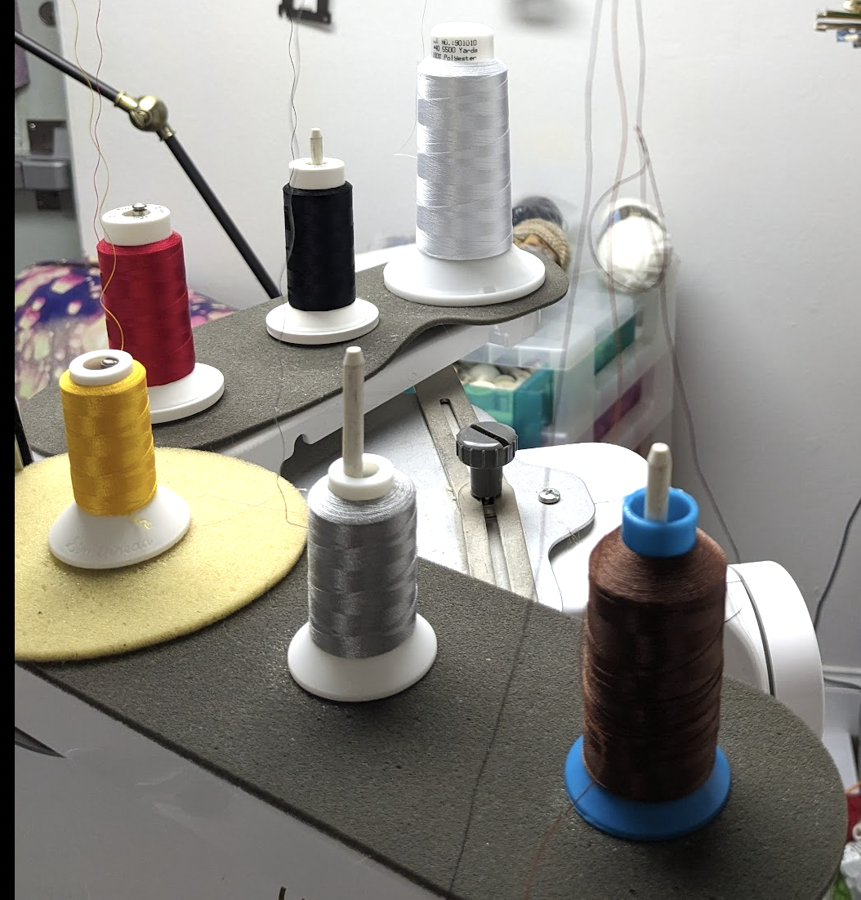

Then I ran the machine into production. But I'd run into a lot of issues along the way, sometimes the thread would get caught underneath where the bobbin was at, which was used to countersew the embroider on the material

Here's what that failed print looks like on the frontside of the machine. The material layer I used got offsetted a bit

I ran into a few other flopped versions, some where the pin on the machine broke itself, the bobbin destroyed from mechanical stress due to layers printed on top of each other, and sometimes the machine wasn't tensioned properly. 

A lot of problems happened. Eventually I got one to work!
My phone died around this time so I just took a screenshot using a webcam

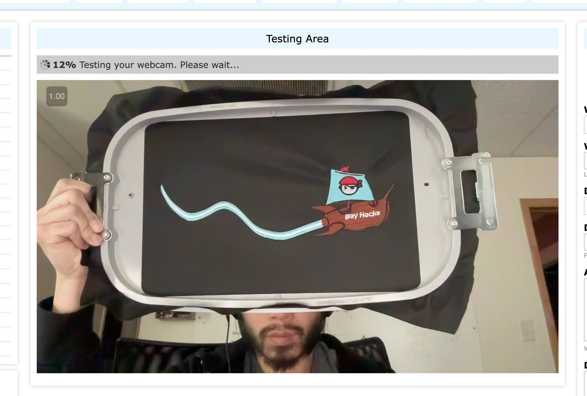

I was given two options to sew this onto the hat, according to my sewing instructor. Either create an edge to sew on, or sew directly. I chose the former option and burned the edges to keep any of the base layer from fraying

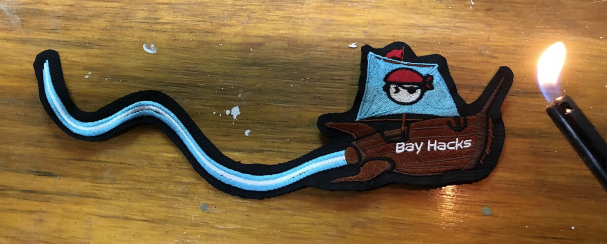

The sewing afterward just required me to lineup and pin down where I thought the logo should lie relative to the hat. Some fiddling around later I came up with this:

Once I got it sewn, I worked on a few more hats. Each hat took me close to 3 hours assuming minimal issues during production. 1 hour to embroider on the machine, another hour to debug and change out threads, and another hour to sew 

Also I took all the designs that didn't work on the machine and sewed it onto a artistic hat, so you could see what was involved in the making of it too! It became an art decoration piece

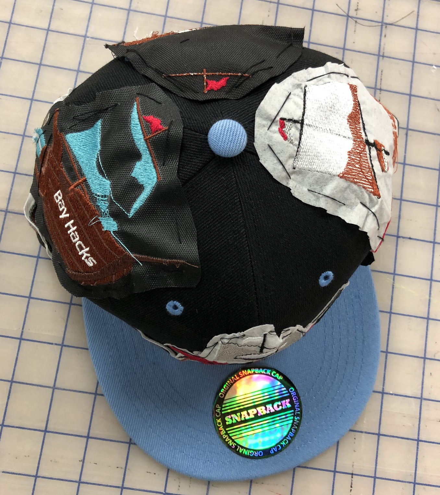

The next day I brought it over as a surprise to the new leadership team at the hackathon, and they were stoked to see it! A couple people asked to buy one too but it takes far too long for me to make one

Here is both the prototype hat and the final hat side by side with my co-founder

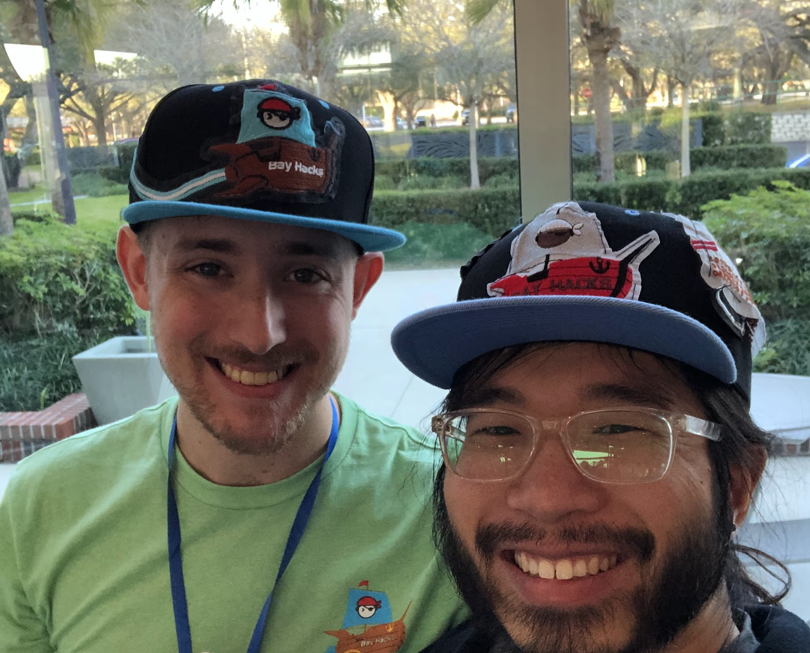

Later I took the design as well to the local embroider shop in the mall. I wanted to know whether I could mass produce these, using the same type of embroidery machine but this time sewing directly on the hat instead of a patch/hand-sewing after

I didn't run this into production, but I had to create two seperate .DST files, one for the flame trail of the ship, another for the ship itself since it'd have to be a 2 part sewing process. 

I also would not be able to get the logo at the same size of 3.7", the ship would have to be downscaled to 2.5" height as well.

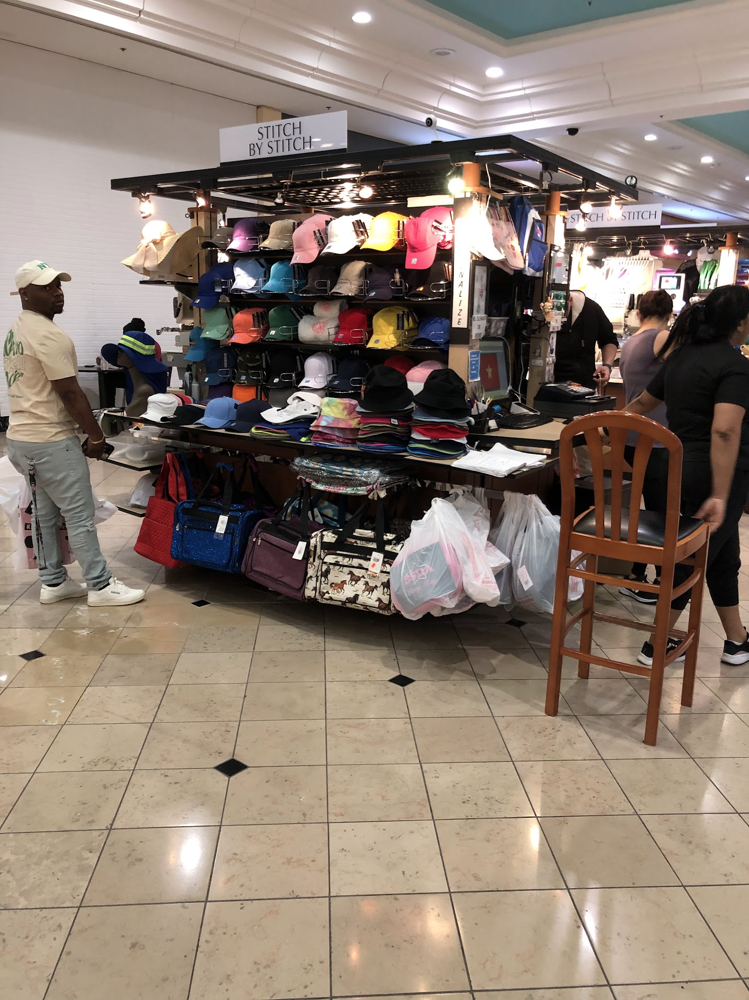
 

