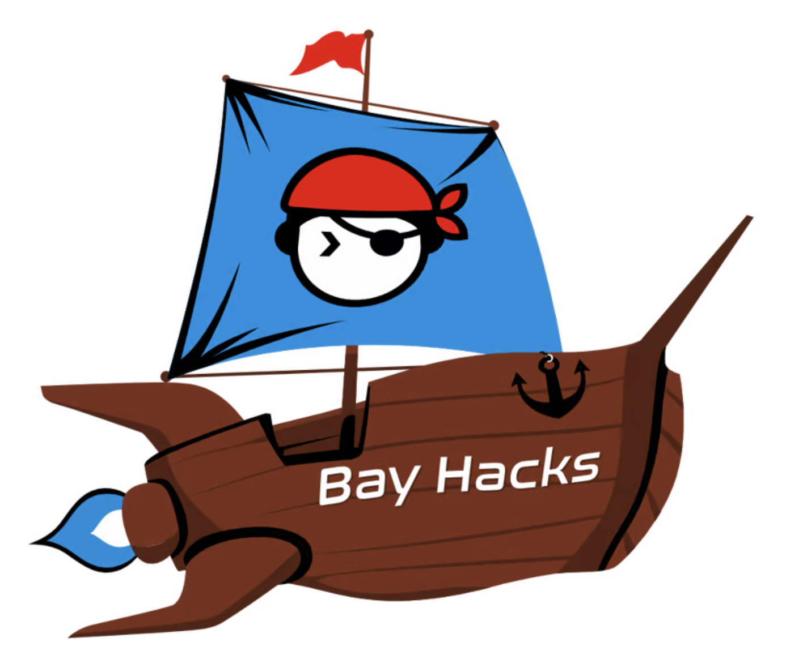
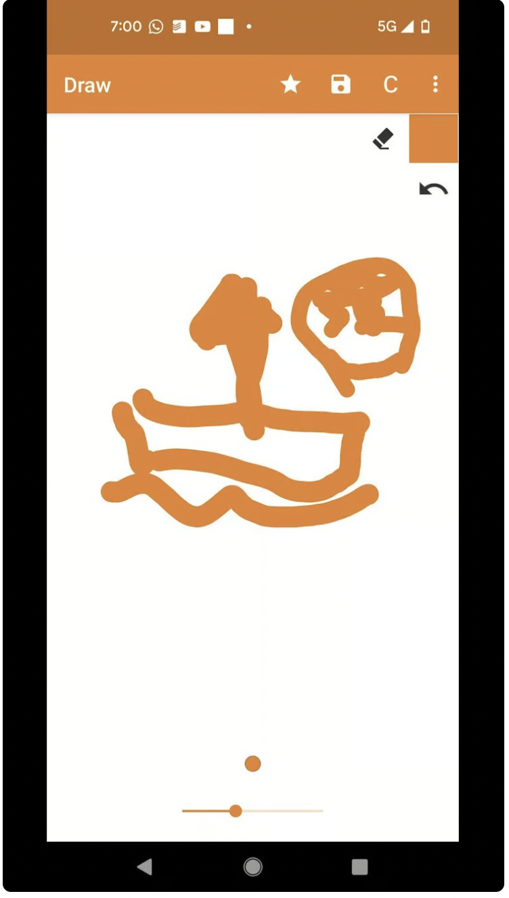
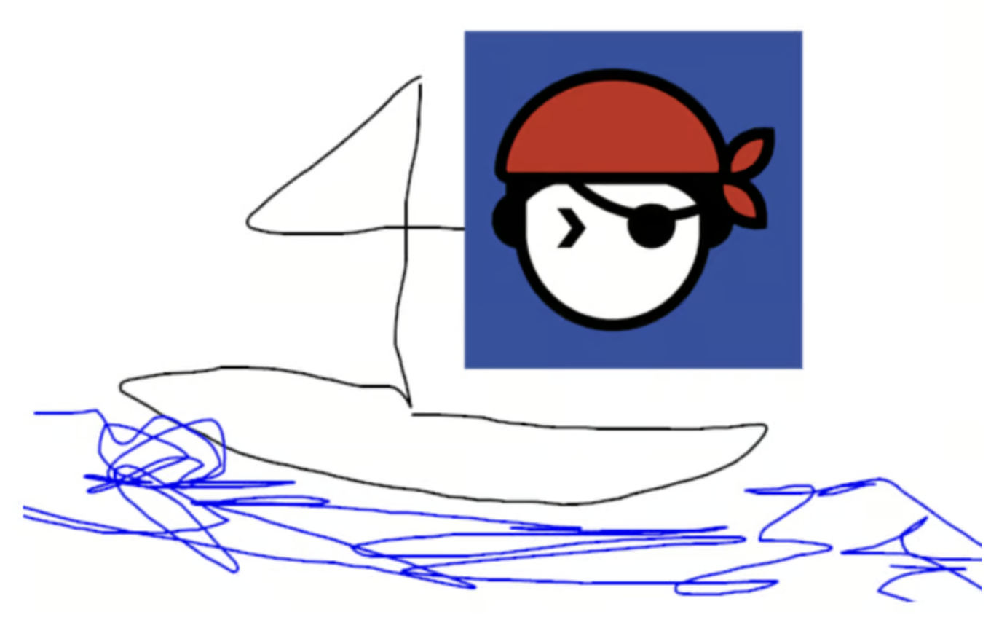
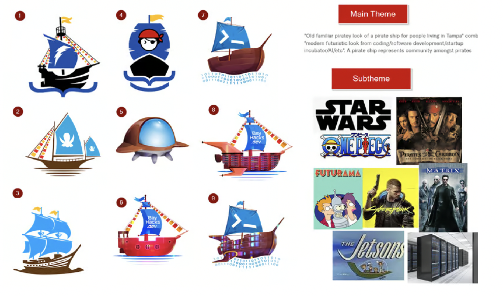
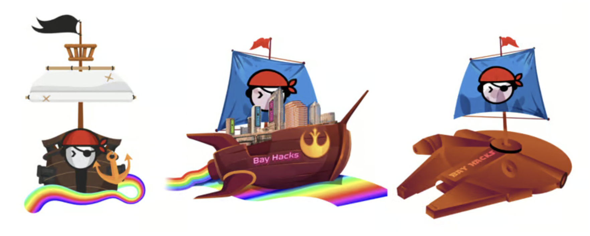
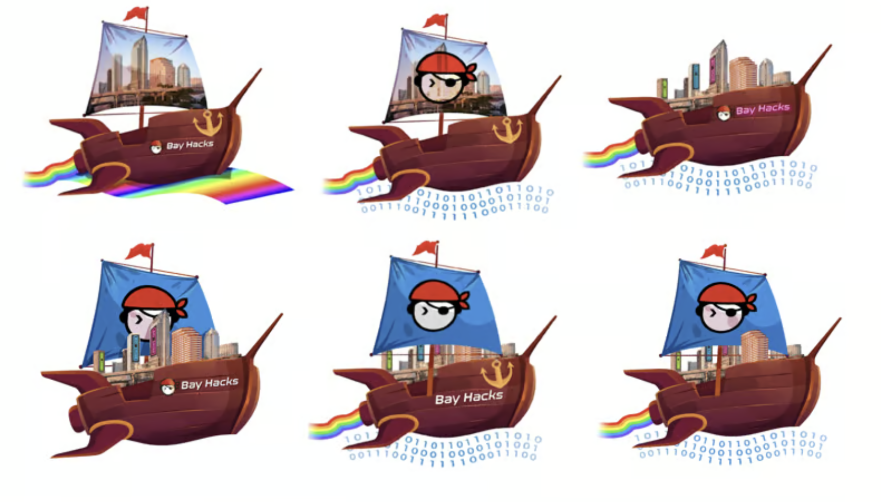
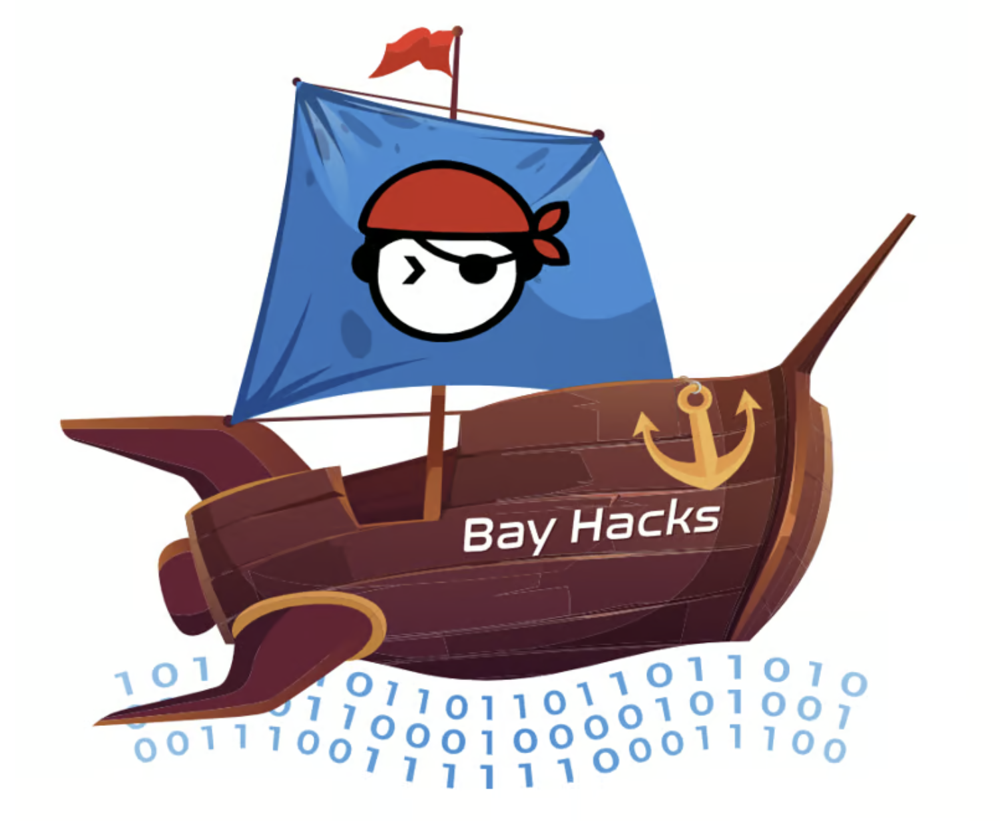
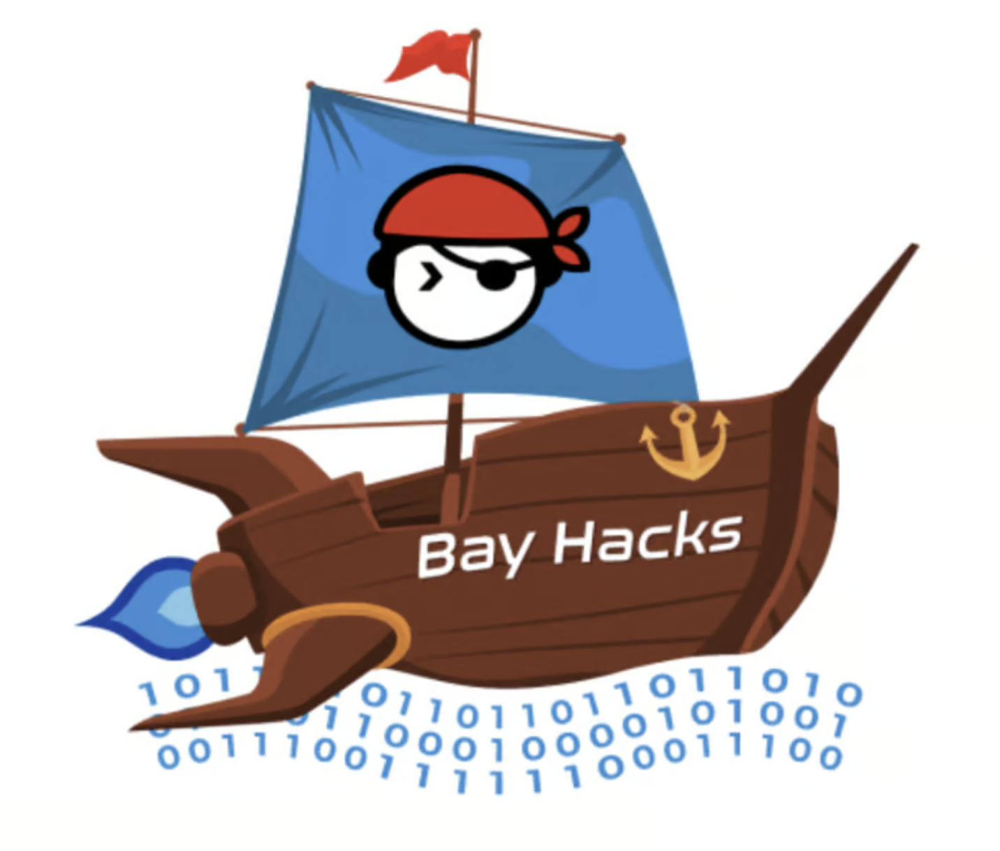
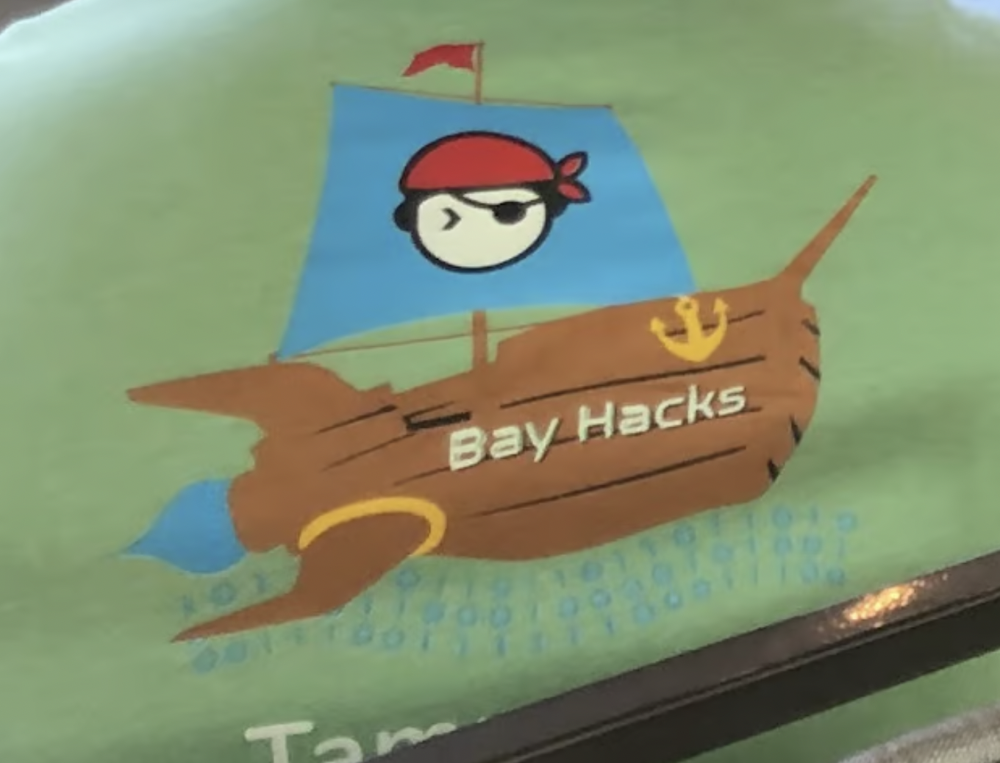
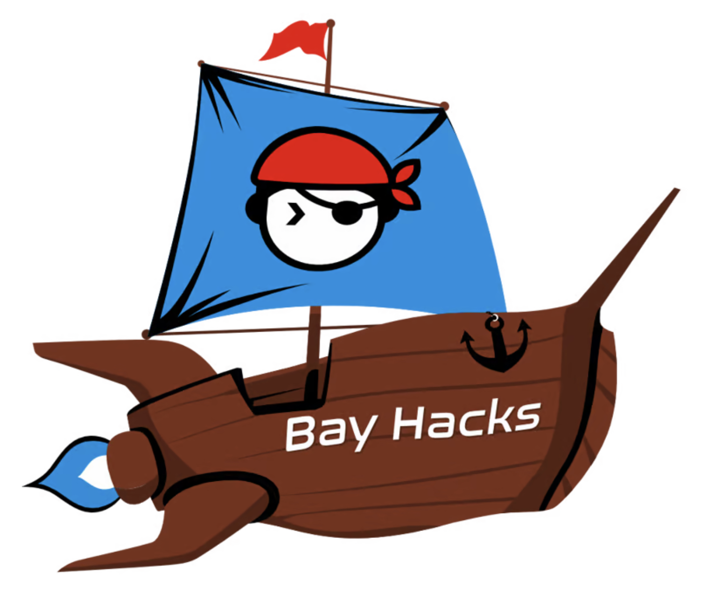

This is the final logo, we used for [BayHacks Hackathon](https://bayhacks.dev) for Tampa Devs.

It didn't start out that way. It had much more humble beginnings.

After our first hackathon, Charlton and I decided on creating our own hackathon. We had the idea of BayHacks because it sounded rad and we live in Tampa Bay

This is what it started out as, basically a napkin on a piece of paper

Some modifications later and doodling on a computer

After working with our designer, these were the themes we were going for as well as some of the first mockups I sent for feedback to friends

Choice (4) and (9) were re-hashed, and we added a millenium falcon edition too for fun

Of those, the middle one made the most sense (the futurama ship). We wanted to make as many versions of this as possible, some of them including the city of Tampa as part of the landscape. This iteration below played with the idea of the how the flag and city would be shown, including minor elements like the flame trail and the water it's on

At the end of it, we realized we had been overdesigning. So the logo was simplified to a lot and this was the initial final result from the first designer

However it wasn't print ready and had too many gradients in the image. It was cool to see what it could become, but it wasn't practical for graphical production so we hired a second person to do a vector trace. We also added a small minor flame trail on the back as well

Even this logo was not entirely ready for production either, since there were still about a dozen colors and their shade variants. This design was taken to a print shop and this is what they were able to do by simplifying it to 6 colors:

So I went back and made some modifications myself to the final design. The binary waves on the bottom of the ship weren't entirely practical for embroidery either, so I removed those. The gradients were simplified, colors such as yellow were removed, and having not look at it for a few months I was able to see what the core elements really were:

The trickiest part on designing this logo was somehow making the logo unique on it's own, while still adhering to the Tampa Devs brand, and making it not overly detailed to be print-friendly.

The original Tampa Devs logo on the flag made the most sense, but having a flat blue as a background on a flag seemed a bit boring. 

I used the color black to add a bit of flair to the logo in places it wouldn't have otherwise been used in, such as the flag creases, the flames, and borders between assembly sections of the futurama-like ship
