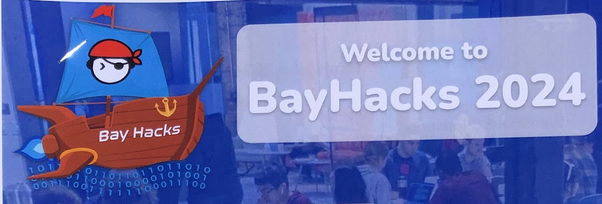
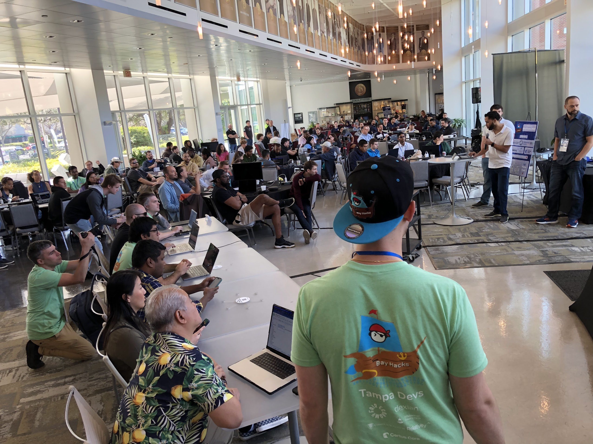

Last year I retired as president from Tampa Devs, and passed the torch off to Charlton Trezevant, Matthew Yorkgitis, and Josef Sieber whom have been absolutely crushing it building the tech scene in Tampa in ways I could not even have imagined

Just yesterday I witnessed in person. Tampa Devs hosted their flagship event, bayhacks hackathon. This was also the first hackathon event that I had little to no involvement in planning either.

Walking to the event felt surreal. The production level was so incredible that I thought I was walking into a hackathon put on by Harvard University, MIT, or any Ivy League school. It's the stuff you see in movies or when you search "Hackathons" on google images. There were over 200 people in attendance, and most of them building AI prototype startups

- I am seeing for the first time swag, posters, marketing that is not made by me anymore - and it is beautifully executed in wayse I wish we had done years prior
- I am seeing for the first time, Tampa Devs Dev's first full theatre A/V production level event, with chill-hop music reverberating through USF Research & Innovation, video games powered by Xbox's in the corner
- I am seeing for the first time, sponsors printed on T-shirts much like you would at a conference, and our first ever collaboration with Hillsborough community county
- I am seeing our first paid event with our own hired security guards, professional videographers and photographers in the mix
- I am seeing our own own provisioned cloud center being used by students for VMs. 
- I am seeing for the first time, a synchronized volunteer board of 8+ people running everything smoothly at the hackathon. I remember the days where Charlton Trezevant and I talked about how we wished we had the bandwidth to do this at the hackathon we hosted previously, but we didn't yet cultivate a strong enough leadership culture yet

Our organizer lead for the hackathon, Matthew Yorkgitis has absolutely crushed it when it came to organizing bayhacks hackathon

I could not have asked for a better leadership team to have taken over what I started Tampa Devs. What they have accomplished, I did not know was even possible, and I am constantly proven wrong. I have had to adjust my beliefs and ideologies as a result of watching how successful the new leadership has been, and I am grateful and lucky to have worked with some of the most talented and amazing people I've ever met

To think this all started because one of my friends said "Hey vincent why don't you host a tech event" and then I threw a friend together at a foodtruck event 2.5 years ago. Then a logo got made. Then sponsors came. Then a nonprofit came along. Then 501c3 status, a bunch of crazy adventures like meeting Steve Wozniack, and now this

Just wow I feel like the TV show Silicon Valley is not that far off from the reality I went through with Tampa Devs. I am so proud of everything Charlton Trezevant, Josef Sieber, and Matthew Yorkgitis has done. 

> These are notes I copied from LinkedIn, celebrating the success of leadership culture I helped foster

